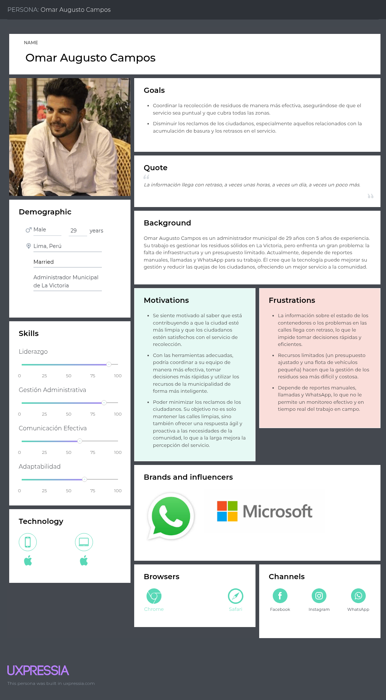
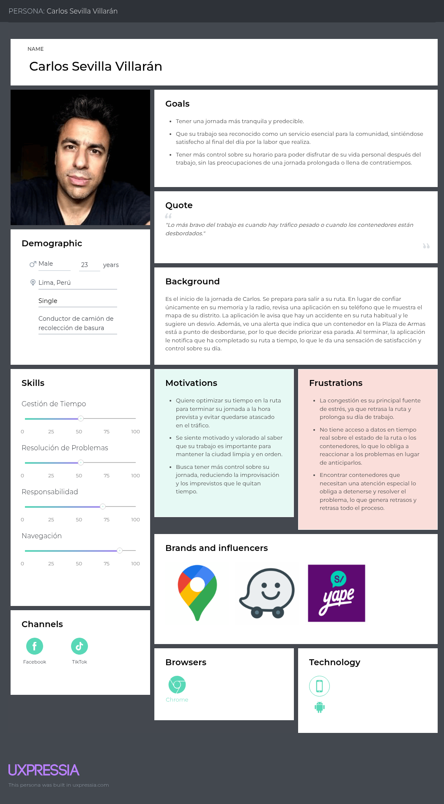
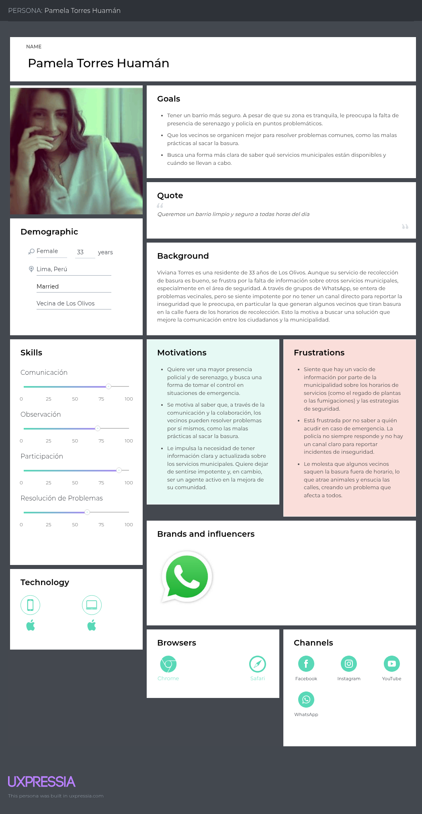

<body>
    

        
Universidad Peruana de Ciencias Aplicadas - Ingeniería de Software - 7 Ciclo

        
        
1ASI0732 - Diseño de Experimentos de Ingeniería de Software

        
Sección - 7491

        
Docente: Ing. Ivan Robles Fernández
   
        
Informe de Trabajo Final

        
Startup: EcoLutions

        
Producto: WasteTrack

    

    

        <h3 style="font-weight: bolder">Integrantes del equipo:</h3>
        <table style="width: fit-content">
            <tr>
                <th style="text-align:start;">Estudiante</th>
                <th style="text-align:center;">Código</th>
            </tr>
            <tr>
                <td style="text-align:start;">Gutiérrez Soto, Jhosepmyr Orlando</td>
                <td>202317638</td>
            </tr>
            <tr>
                <td style="text-align:start;">Hernández Tuiro, Eric Ernesto</td>
                <td>20221C857</td>
            </tr>
            <tr>
                <td style="text-align:start;">Ramirez Mestanza, Salim Ignacio</td>
                <td>20201E843</td>
            </tr>
            <tr>
                <td style="text-align:start;">Riva Rodríguez, Elmer Augusto</td>
                <td>202220829</td>
            <tr>
              <td style="text-align:start;">Sulca Gonzales, Paul Fernando</td>
              <td>20221C486</td>
            </tr>
        </table>
    

    
Septiembre 2025

</body>

# Registro de Versiones del Informe

| Versión | Fecha      | Autor                             | Descripción de modificación |
|---------|------------|-----------------------------------|-----------------------------|

# Project Report Collaboration Insights

En esta sección se documenta la colaboración del equipo en la elaboración del informe, mostrando evidencias gráficas de la actividad en GitHub y su coherencia con el registro de versiones.

* URL del repositorio del Project Report en la organización de GitHub del equipo:
* [https://github.com/EcoLutions/Report-Diseno-de-Experimentos-de-Ingenieria-de-Software](https://github.com/EcoLutions/Report-Diseno-de-Experimentos-de-Ingenieria-de-Software)

# Contenido

<!-- TOC -->
* [Registro de Versiones del Informe](#registro-de-versiones-del-informe)
* [Project Report Collaboration Insights](#project-report-collaboration-insights)
* [Contenido](#contenido)
* [Student Outcome](#student-outcome)
* [Capítulo I: Introducción](#capítulo-i-introducción)
  * [1.1. Startup Profile](#11-startup-profile)
    * [1.1.1. Descripción de la Startup](#111-descripción-de-la-startup)
    * [1.1.2. Perfiles de integrantes del equipo](#112-perfiles-de-integrantes-del-equipo)
  * [1.2. Solution Profile](#12-solution-profile)
    * [1.2.1. Antecedentes y problemática](#121-antecedentes-y-problemática)
    * [1.2.2. Lean UX Process](#122-lean-ux-process)
      * [1.2.2.1. Lean UX Problem Statements](#1221-lean-ux-problem-statements)
      * [1.2.2.2. Lean UX Assumptions](#1222-lean-ux-assumptions)
      * [1.2.2.3. Lean UX Hypothesis Statements](#1223-lean-ux-hypothesis-statements)
      * [1.2.2.4. Lean UX Canvas](#1224-lean-ux-canvas)
  * [1.3. Segmentos objetivos](#13-segmentos-objetivos)
* [Capítulo II: Requirements Elicitation & Analysis](#capítulo-ii-requirements-elicitation--analysis)
  * [2.1. Competidores](#21-competidores)
    * [2.1.1. Análisis competitivo](#211-análisis-competitivo)
    * [2.1.2. Estrategias y tácticas frente a competidores](#212-estrategias-y-tácticas-frente-a-competidores)
  * [2.2. Entrevistas](#22-entrevistas)
    * [2.2.1. Diseño de entrevistas](#221-diseño-de-entrevistas)
    * [2.2.2. Registro de entrevistas](#222-registro-de-entrevistas)
    * [2.2.3. Análisis de entrevistas](#223-análisis-de-entrevistas)
  * [2.3. Need finding](#23-need-finding)
    * [2.3.1. User personas](#231-user-personas)
    * [2.3.2. User Task Matrix](#232-user-task-matrix)
    * [2.3.3. User Journey Mapping](#233-user-journey-mapping)
    * [2.3.4. Empathy Mapping](#234-empathy-mapping)
    * [2.3.5. As-is Scenario Mapping](#235-as-is-scenario-mapping)
  * [2.4. Ubiquitous Language](#24-ubiquitous-language)
* [Capítulo III: Requirements Specification](#capítulo-iii-requirements-specification)
  * [3.1. To-Be Scenario Mapping](#31-to-be-scenario-mapping)
  * [3.2. User Stories](#32-user-stories)
  * [3.3. Product Backlog](#33-product-backlog)
  * [3.4. Impact Mapping](#34-impact-mapping)
* [Capítulo IV: Product Design](#capítulo-iv-product-design)
  * [4.1. Style Guidelines](#41-style-guidelines)
    * [4.1.1. General Style Guidelines](#411-general-style-guidelines)
    * [4.1.2. Web Style Guidelines](#412-web-style-guidelines)
    * [4.1.3. Mobile Style Guidelines](#413-mobile-style-guidelines)
      * [4.1.3.1. iOS Mobile Style Guidelines](#4131-ios-mobile-style-guidelines)
      * [4.1.3.2. Android Mobile Style Guidelines](#4132-android-mobile-style-guidelines)
  * [4.2. Information Architecture](#42-information-architecture)
    * [4.2.1. Organization Systems](#421-organization-systems)
    * [4.2.2. Labeling Systems](#422-labeling-systems)
    * [4.2.3. SEO Tags and Meta Tags](#423-seo-tags-and-meta-tags)
    * [4.2.4. Searching Systems](#424-searching-systems)
    * [4.2.5. Navigation Systems](#425-navigation-systems)
  * [4.3. Landing Page UI Design](#43-landing-page-ui-design)
    * [4.3.1. Landing Page Wireframe](#431-landing-page-wireframe)
    * [4.3.2. Landing Page Mock-up](#432-landing-page-mock-up)
  * [4.4. Mobile Applications UX/UI Design](#44-mobile-applications-uxui-design)
    * [4.4.1. Mobile Applications Wireframes](#441-mobile-applications-wireframes)
    * [4.4.2. Mobile Applications Wire flow Diagrams](#442-mobile-applications-wire-flow-diagrams)
    * [4.4.3. Mobile Applications Mock-ups](#443-mobile-applications-mock-ups)
    * [4.4.4. Mobile Applications User Flow Diagrams](#444-mobile-applications-user-flow-diagrams)
  * [4.5. Mobile Applications Prototyping](#45-mobile-applications-prototyping)
    * [4.5.1. Android Mobile Applications Prototyping](#451-android-mobile-applications-prototyping)
    * [4.5.2. iOS Mobile Applications Prototyping](#452-ios-mobile-applications-prototyping)
  * [4.6. Web Applications UX/UI Design](#46-web-applications-uxui-design)
    * [4.6.1. Web Applications Wireframes](#461-web-applications-wireframes)
    * [4.6.2. Web Applications Wire flow Diagrams](#462-web-applications-wire-flow-diagrams)
    * [4.6.3. Web Applications Mock-ups](#463-web-applications-mock-ups)
    * [4.6.4. Web Applications User Flow Diagrams](#464-web-applications-user-flow-diagrams)
  * [4.7. Web Applications Prototyping](#47-web-applications-prototyping)
  * [4.8. Domain-Driven Software Architecture](#48-domain-driven-software-architecture)
    * [4.8.1. Software Architecture Context Diagram](#481-software-architecture-context-diagram)
    * [4.8.2. Software Architecture Container Diagrams](#482-software-architecture-container-diagrams)
    * [4.8.3. Software Architecture Components Diagrams](#483-software-architecture-components-diagrams)
  * [4.9. Software Object-Oriented Design](#49-software-object-oriented-design)
    * [4.9.1. Class Diagrams](#491-class-diagrams)
    * [4.9.2. Class Dictionary](#492-class-dictionary)
  * [4.10. Database Design](#410-database-design)
    * [4.10.1. Relational/Non-Relational Database Diagram](#4101-relationalnon-relational-database-diagram)
* [Capítulo V: Product Implementation](#capítulo-v-product-implementation)
  * [5.1. Software Configuration Management](#51-software-configuration-management)
    * [5.1.1. Software Development Environment Configuration](#511-software-development-environment-configuration)
    * [5.1.2. Source Code Management](#512-source-code-management)
    * [5.1.3. Source Code Style Guide & Conventions](#513-source-code-style-guide--conventions)
    * [5.1.4. Software Deployment Configuration](#514-software-deployment-configuration)
  * [5.2. Product Implementation & Deployment](#52-product-implementation--deployment)
    * [5.2.1. Sprint Backlogs](#521-sprint-backlogs)
    * [5.2.2. Implemented Landing Page Evidence](#522-implemented-landing-page-evidence)
    * [5.2.3. Implemented Frontend-Web Application Evidence](#523-implemented-frontend-web-application-evidence)
    * [5.2.4. Implemented Native-Mobile Application Evidence](#524-implemented-native-mobile-application-evidence)
    * [5.2.5. Implemented Restful API and/or Serverless Backend Evidence](#525-implemented-restful-api-andor-serverless-backend-evidence)
    * [5.2.6. Restful API documentation](#526-restful-api-documentation)
    * [5.2.7. Team Collaboration Insights](#527-team-collaboration-insights)
  * [5.3. Video About-the-Product](#53-video-about-the-product)
* [Conclusiones](#conclusiones)
* [Bibliografía](#bibliografía)
* [Anexos](#anexos)
<!-- TOC -->

# Student Outcome

El curso contribuye al cumplimiento del Student Outcome ABET:

****ABET - EAC - Student Outcome 4****

**Criterio:** La capacidad de reconocer responsabilidades éticas y profesionales en situaciones de ingeniería y hacer juicios informados, que deben considerar el impacto de las soluciones de ingeniería en contextos globales, económicos, ambientales y sociales.

En el siguiente cuadro se describe las acciones realizadas y enunciados de conclusiones por parte del grupo, que permiten sustentar el haber alcanzado el logro del ABET – EAC - Student Outcome 4.

| **Criterio específico**                                                                                                                                           | **Acciones realizadas** | **Conclusiones** |
|-------------------------------------------------------------------------------------------------------------------------------------------------------------------|-------------------------|------------------|  
| **4.c.1 Reconoce responsabilidad ética y profesional en situaciones de ingeniería de software.**                                                                  |                         |                  |
| **4.c.2 Emite juicios informados considerando el impacto de las soluciones de ingeniería de software en contextos globales, económicos, ambientales y sociales.** |                         |                  |

# Capítulo I: Introducción

## 1.1. Startup Profile

### 1.1.1. Descripción de la Startup

### 1.1.2. Perfiles de integrantes del equipo

## 1.2. Solution Profile

### 1.2.1. Antecedentes y problemática

### 1.2.2. Lean UX Process

#### 1.2.2.1. Lean UX Problem Statements

#### 1.2.2.2. Lean UX Assumptions

#### 1.2.2.3. Lean UX Hypothesis Statements

#### 1.2.2.4. Lean UX Canvas

## 1.3. Segmentos objetivos

# Capítulo II: Requirements Elicitation & Analysis

## 2.1. Competidores

### 2.1.1. Análisis competitivo

### 2.1.2. Estrategias y tácticas frente a competidores

## 2.2. Entrevistas

### 2.2.1. Diseño de entrevistas

### 2.2.2. Registro de entrevistas

### 2.2.3. Análisis de entrevistas

## 2.3. Need finding

### 2.3.1. User personas

### Administrador Municipal

### Conductor de Recoleccion 

### Ciudadano Residente

### 2.3.2. User Task Matrix

### 2.3.3. User Journey Mapping

### 2.3.4. Empathy Mapping

### 2.3.5. As-is Scenario Mapping

## 2.4. Ubiquitous Language

# Capítulo III: Requirements Specification

## 3.1. To-Be Scenario Mapping

## 3.2. User Stories

## 3.3. Product Backlog

## 3.4. Impact Mapping

# Capítulo IV: Product Design

## 4.1. Style Guidelines

### 4.1.1. General Style Guidelines

### 4.1.2. Web Style Guidelines

### 4.1.3. Mobile Style Guidelines

#### 4.1.3.1. iOS Mobile Style Guidelines

#### 4.1.3.2. Android Mobile Style Guidelines

## 4.2. Information Architecture

### 4.2.1. Organization Systems

### 4.2.2. Labeling Systems

### 4.2.3. SEO Tags and Meta Tags

### 4.2.4. Searching Systems

### 4.2.5. Navigation Systems

## 4.3. Landing Page UI Design

### 4.3.1. Landing Page Wireframe

### 4.3.2. Landing Page Mock-up

## 4.4. Mobile Applications UX/UI Design

### 4.4.1. Mobile Applications Wireframes

### 4.4.2. Mobile Applications Wire flow Diagrams

### 4.4.3. Mobile Applications Mock-ups

### 4.4.4. Mobile Applications User Flow Diagrams

## 4.5. Mobile Applications Prototyping

### 4.5.1. Android Mobile Applications Prototyping

### 4.5.2. iOS Mobile Applications Prototyping

## 4.6. Web Applications UX/UI Design

### 4.6.1. Web Applications Wireframes

### 4.6.2. Web Applications Wire flow Diagrams

### 4.6.3. Web Applications Mock-ups

### 4.6.4. Web Applications User Flow Diagrams

## 4.7. Web Applications Prototyping

## 4.8. Domain-Driven Software Architecture

### 4.8.1. Software Architecture Context Diagram

### 4.8.2. Software Architecture Container Diagrams

### 4.8.3. Software Architecture Components Diagrams

## 4.9. Software Object-Oriented Design

### 4.9.1. Class Diagrams

### 4.9.2. Class Dictionary

## 4.10. Database Design

### 4.10.1. Relational/Non-Relational Database Diagram

# Capítulo V: Product Implementation

## 5.1. Software Configuration Management

### 5.1.1. Software Development Environment Configuration

### 5.1.2. Source Code Management

### 5.1.3. Source Code Style Guide & Conventions

### 5.1.4. Software Deployment Configuration

## 5.2. Product Implementation & Deployment

### 5.2.1. Sprint Backlogs

### 5.2.2. Implemented Landing Page Evidence

### 5.2.3. Implemented Frontend-Web Application Evidence

### 5.2.4. Implemented Native-Mobile Application Evidence

### 5.2.5. Implemented Restful API and/or Serverless Backend Evidence

### 5.2.6. Restful API documentation

### 5.2.7. Team Collaboration Insights

## 5.3. Video About-the-Product

# Conclusiones

# Bibliografía

# Anexos
