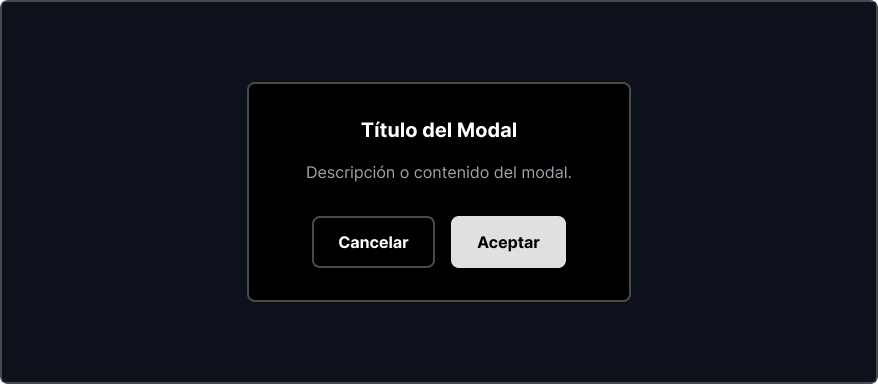
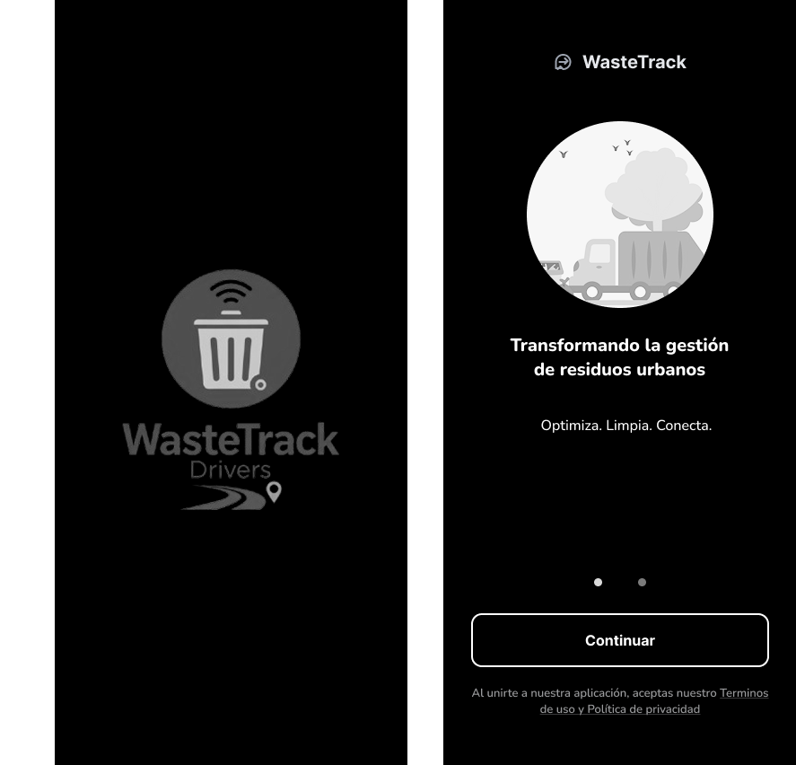
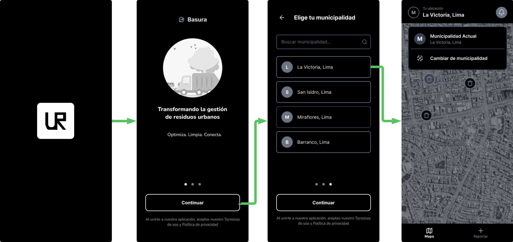
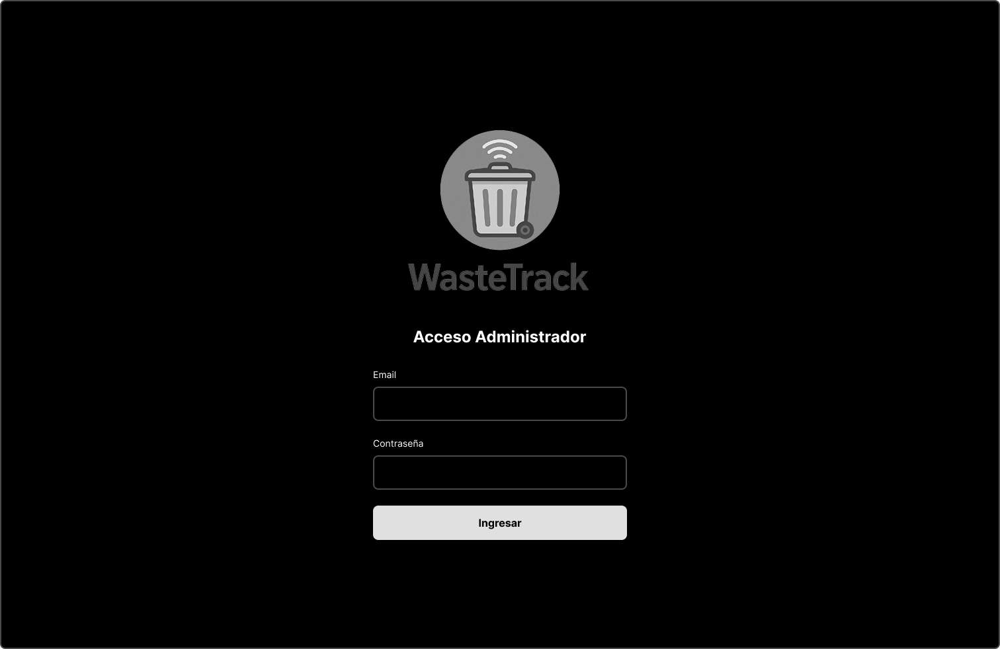
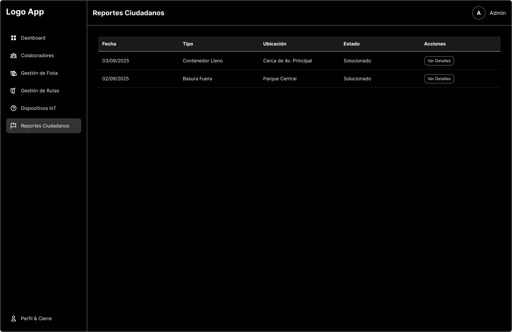
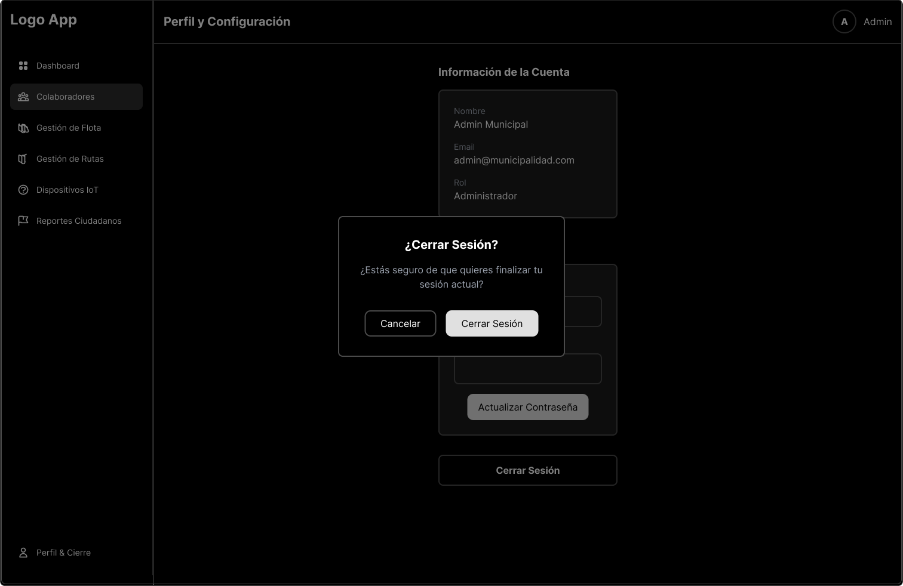
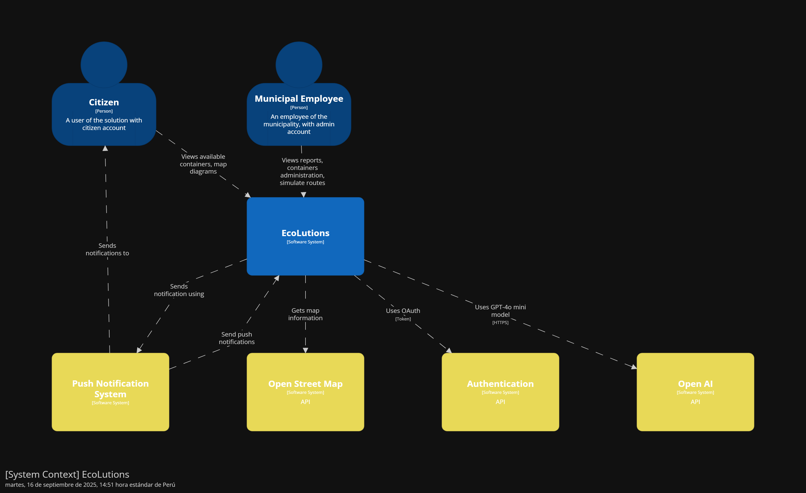

<body>
    

        
Universidad Peruana de Ciencias Aplicadas - Ingeniería de Software - 7 Ciclo

        
        
1ASI0732 - Diseño de Experimentos de Ingeniería de Software

        
Sección - 7491

        
Docente: Ing. Ivan Robles Fernández
   
        
Informe de Trabajo Final

        
Startup: EcoLutions

        
Producto: WasteTrack

    

    

        <h3 style="font-weight: bolder">Integrantes del equipo:</h3>
        <table style="width: fit-content">
            <tr>
                <th style="text-align:start;">Estudiante</th>
                <th style="text-align:center;">Código</th>
            </tr>
            <tr>
                <td style="text-align:start;">Gutiérrez Soto, Jhosepmyr Orlando</td>
                <td>202317638</td>
            </tr>
            <tr>
                <td style="text-align:start;">Hernández Tuiro, Eric Ernesto</td>
                <td>20221C857</td>
            </tr>
            <tr>
                <td style="text-align:start;">Ramirez Mestanza, Salim Ignacio</td>
                <td>20201E843</td>
            </tr>
            <tr>
                <td style="text-align:start;">Riva Rodríguez, Elmer Augusto</td>
                <td>202220829</td>
            <tr>
              <td style="text-align:start;">Sulca Gonzales, Paul Fernando</td>
              <td>20221C486</td>
            </tr>
        </table>
    

    
Septiembre 2025

</body>

# Registro de Versiones del Informe

| Versión | Fecha      | Autor                             | Descripción de modificación |
|---------|------------|-----------------------------------|-----------------------------|

# Project Report Collaboration Insights

En esta sección se documenta la colaboración del equipo en la elaboración del informe, mostrando evidencias gráficas de la actividad en GitHub y su coherencia con el registro de versiones.

* URL del repositorio del Project Report en la organización de GitHub del equipo:
* [https://github.com/EcoLutions/Report-Diseno-de-Experimentos-de-Ingenieria-de-Software](https://github.com/EcoLutions/Report-Diseno-de-Experimentos-de-Ingenieria-de-Software)

# Contenido

<!-- TOC -->
* [Registro de Versiones del Informe](#registro-de-versiones-del-informe)
* [Project Report Collaboration Insights](#project-report-collaboration-insights)
* [Contenido](#contenido)
* [Student Outcome](#student-outcome)
* [Capítulo I: Introducción](#capítulo-i-introducción)
  * [1.1. Startup Profile](#11-startup-profile)
    * [1.1.1. Descripción de la Startup](#111-descripción-de-la-startup)
    * [1.1.2. Perfiles de integrantes del equipo](#112-perfiles-de-integrantes-del-equipo)
  * [1.2. Solution Profile](#12-solution-profile)
    * [1.2.1. Antecedentes y problemática](#121-antecedentes-y-problemática)
    * [1.2.2. Lean UX Process](#122-lean-ux-process)
      * [1.2.2.1. Lean UX Problem Statements](#1221-lean-ux-problem-statements)
      * [1.2.2.2. Lean UX Assumptions](#1222-lean-ux-assumptions)
      * [1.2.2.3. Lean UX Hypothesis Statements](#1223-lean-ux-hypothesis-statements)
      * [1.2.2.4. Lean UX Canvas](#1224-lean-ux-canvas)
  * [1.3. Segmentos objetivos](#13-segmentos-objetivos)
* [Capítulo II: Requirements Elicitation & Analysis](#capítulo-ii-requirements-elicitation--analysis)
  * [2.1. Competidores](#21-competidores)
    * [2.1.1. Análisis competitivo](#211-análisis-competitivo)
    * [2.1.2. Estrategias y tácticas frente a competidores](#212-estrategias-y-tácticas-frente-a-competidores)
  * [2.2. Entrevistas](#22-entrevistas)
    * [2.2.1. Diseño de entrevistas](#221-diseño-de-entrevistas)
    * [2.2.2. Registro de entrevistas](#222-registro-de-entrevistas)
    * [2.2.3. Análisis de entrevistas](#223-análisis-de-entrevistas)
  * [2.3. Need finding](#23-need-finding)
    * [2.3.1. User personas](#231-user-personas)
    * [2.3.2. User Task Matrix](#232-user-task-matrix)
    * [2.3.3. User Journey Mapping](#233-user-journey-mapping)
    * [2.3.4. Empathy Mapping](#234-empathy-mapping)
    * [2.3.5. As-is Scenario Mapping](#235-as-is-scenario-mapping)
  * [2.4. Ubiquitous Language](#24-ubiquitous-language)
* [Capítulo III: Requirements Specification](#capítulo-iii-requirements-specification)
  * [3.1. To-Be Scenario Mapping](#31-to-be-scenario-mapping)
  * [3.2. User Stories](#32-user-stories)
  * [3.3. Product Backlog](#33-product-backlog)
  * [3.4. Impact Mapping](#34-impact-mapping)
* [Capítulo IV: Product Design](#capítulo-iv-product-design)
  * [4.1. Style Guidelines](#41-style-guidelines)
    * [4.1.1. General Style Guidelines](#411-general-style-guidelines)
    * [4.1.2. Web Style Guidelines](#412-web-style-guidelines)
    * [4.1.3. Mobile Style Guidelines](#413-mobile-style-guidelines)
      * [4.1.3.1. iOS Mobile Style Guidelines](#4131-ios-mobile-style-guidelines)
      * [4.1.3.2. Android Mobile Style Guidelines](#4132-android-mobile-style-guidelines)
  * [4.2. Information Architecture](#42-information-architecture)
    * [4.2.1. Organization Systems](#421-organization-systems)
    * [4.2.2. Labeling Systems](#422-labeling-systems)
    * [4.2.3. SEO Tags and Meta Tags](#423-seo-tags-and-meta-tags)
    * [4.2.4. Searching Systems](#424-searching-systems)
    * [4.2.5. Navigation Systems](#425-navigation-systems)
  * [4.3. Landing Page UI Design](#43-landing-page-ui-design)
    * [4.3.1. Landing Page Wireframe](#431-landing-page-wireframe)
    * [4.3.2. Landing Page Mock-up](#432-landing-page-mock-up)
  * [4.4. Mobile Applications UX/UI Design](#44-mobile-applications-uxui-design)
    * [4.4.1. Mobile Applications Wireframes](#441-mobile-applications-wireframes)
    * [4.4.2. Mobile Applications Wire flow Diagrams](#442-mobile-applications-wire-flow-diagrams)
    * [4.4.3. Mobile Applications Mock-ups](#443-mobile-applications-mock-ups)
    * [4.4.4. Mobile Applications User Flow Diagrams](#444-mobile-applications-user-flow-diagrams)
  * [4.5. Mobile Applications Prototyping](#45-mobile-applications-prototyping)
    * [4.5.1. Android Mobile Applications Prototyping](#451-android-mobile-applications-prototyping)
    * [4.5.2. iOS Mobile Applications Prototyping](#452-ios-mobile-applications-prototyping)
  * [4.6. Web Applications UX/UI Design](#46-web-applications-uxui-design)
    * [4.6.1. Web Applications Wireframes](#461-web-applications-wireframes)
    * [4.6.2. Web Applications Wire flow Diagrams](#462-web-applications-wire-flow-diagrams)
    * [4.6.3. Web Applications Mock-ups](#463-web-applications-mock-ups)
    * [4.6.4. Web Applications User Flow Diagrams](#464-web-applications-user-flow-diagrams)
  * [4.7. Web Applications Prototyping](#47-web-applications-prototyping)
  * [4.8. Domain-Driven Software Architecture](#48-domain-driven-software-architecture)
    * [4.8.1. Software Architecture Context Diagram](#481-software-architecture-context-diagram)
    * [4.8.2. Software Architecture Container Diagrams](#482-software-architecture-container-diagrams)
    * [4.8.3. Software Architecture Components Diagrams](#483-software-architecture-components-diagrams)
  * [4.9. Software Object-Oriented Design](#49-software-object-oriented-design)
    * [4.9.1. Class Diagrams](#491-class-diagrams)
    * [4.9.2. Class Dictionary](#492-class-dictionary)
  * [4.10. Database Design](#410-database-design)
    * [4.10.1. Relational/Non-Relational Database Diagram](#4101-relationalnon-relational-database-diagram)
* [Capítulo V: Product Implementation](#capítulo-v-product-implementation)
  * [5.1. Software Configuration Management](#51-software-configuration-management)
    * [5.1.1. Software Development Environment Configuration](#511-software-development-environment-configuration)
    * [5.1.2. Source Code Management](#512-source-code-management)
    * [5.1.3. Source Code Style Guide & Conventions](#513-source-code-style-guide--conventions)
    * [5.1.4. Software Deployment Configuration](#514-software-deployment-configuration)
  * [5.2. Product Implementation & Deployment](#52-product-implementation--deployment)
    * [5.2.1. Sprint Backlogs](#521-sprint-backlogs)
    * [5.2.2. Implemented Landing Page Evidence](#522-implemented-landing-page-evidence)
    * [5.2.3. Implemented Frontend-Web Application Evidence](#523-implemented-frontend-web-application-evidence)
    * [5.2.4. Implemented Native-Mobile Application Evidence](#524-implemented-native-mobile-application-evidence)
    * [5.2.5. Implemented Restful API and/or Serverless Backend Evidence](#525-implemented-restful-api-andor-serverless-backend-evidence)
    * [5.2.6. Restful API documentation](#526-restful-api-documentation)
    * [5.2.7. Team Collaboration Insights](#527-team-collaboration-insights)
  * [5.3. Video About-the-Product](#53-video-about-the-product)
* [Conclusiones](#conclusiones)
* [Bibliografía](#bibliografía)
* [Anexos](#anexos)
<!-- TOC -->

# Student Outcome

El curso contribuye al cumplimiento del Student Outcome ABET:

****ABET - EAC - Student Outcome 4****

**Criterio:** La capacidad de reconocer responsabilidades éticas y profesionales en situaciones de ingeniería y hacer juicios informados, que deben considerar el impacto de las soluciones de ingeniería en contextos globales, económicos, ambientales y sociales.

En el siguiente cuadro se describe las acciones realizadas y enunciados de conclusiones por parte del grupo, que permiten sustentar el haber alcanzado el logro del ABET – EAC - Student Outcome 4.

| **Criterio específico**                                                                                                                                           | **Acciones realizadas** | **Conclusiones** |
|-------------------------------------------------------------------------------------------------------------------------------------------------------------------|-------------------------|------------------|  
| **4.c.1 Reconoce responsabilidad ética y profesional en situaciones de ingeniería de software.**                                                                  |                         |                  |
| **4.c.2 Emite juicios informados considerando el impacto de las soluciones de ingeniería de software en contextos globales, económicos, ambientales y sociales.** |                         |                  |

# Capítulo I: Introducción

## 1.1. Startup Profile

### 1.1.1. Descripción de la Startup

EcoLutions es una startup peruana especializada en el desarrollo de soluciones IoT inteligentes para la optimización de la gestión de residuos sólidos urbanos. Fundada en 2025, nuestro enfoque se centra en revolucionar los sistemas tradicionales de recolección de basura mediante la implementación de tecnología de sensores avanzados, análisis de datos en tiempo real y algoritmos de optimización de rutas.
Nuestra misión es transformar la gestión de residuos sólidos en las ciudades peruanas, comenzando por Lima Metropolitana, a través de soluciones tecnológicas innovadoras que reduzcan costos operativos, mejoren la eficiencia del servicio y contribuyan a ciudades más limpias y sostenibles.

**Propuesta de Valor**

* Optimización inteligente: Algoritmos que combinan nivel de llenado y tiempo de permanencia para priorizar recolecciones
* Arquitectura híbrida: Procesamiento Edge para alertas inmediatas y Cloud para análisis avanzados
* Modelo B2B sostenible: Licencia anual fija que permite presupuestación municipal predecible
* Enfoque local: Soluciones adaptadas específicamente a las necesidades y regulaciones de distritos peruanos

**Visión**

Ser la empresa líder en soluciones IoT para gestión inteligente de residuos en Latinoamérica, contribuyendo al desarrollo de ciudades más eficientes, limpias y sostenibles.
Valores

* Innovación responsable: Tecnología que genera impacto social positivo
* Sostenibilidad: Compromiso con el medio ambiente y la eficiencia de recursos
* Transparencia: Datos abiertos que generen confianza en la gestión pública
* Colaboración: Trabajo conjunto con municipalidades y ciudadanía

### 1.1.2. Perfiles de integrantes del equipo

| Foto del participante                                                                       | Nombres y apellidos              | Código de estudiante | Carrera                | Conocimientos técnicos y habilidades                                                                                                                                                                                                                                                                                                |
|---------------------------------------------------------------------------------------------|----------------------------------|----------------------|------------------------|-------------------------------------------------------------------------------------------------------------------------------------------------------------------------------------------------------------------------------------------------------------------------------------------------------------------------------------|
|          | Eric Ernesto Hernández Tuiro     | 20221C857            | Ingeniería de Software | Especialista en desarrollo backend con Java/Spring Boot y diseño de arquitecturas de sistemas. Enfocado en tecnologías empresariales y soluciones eficientes. Será responsable de los servicios web, procesamiento de datos y desarrollo de APIs para la plataforma WasteTrack.                                                     |
|          | Elmer Augusto Riva Rodríguez     | 202220829            | Ingeniería de Software | Desarrollador con experiencia en Angular/Spring Boot y Vue.js/ASP.NET, enfocado en arquitecturas monolíticas y desarrollo de aplicaciones. Liderará el desarrollo de aplicaciones móviles para conductores y ciudadanos, garantizando interfaces intuitivas y funcionales.                                                          | 
|  | Jhosepmyr Orlando Gutiérrez Soto | 202317638            | Ingeniería de Software | Especialista en desarrollo full-stack con Java/Spring Boot y frameworks frontend como Angular y Vue.js. Experiencia en microservicios y servicios cloud (AWS, Azure, GCP). Aporta habilidades de liderazgo técnico, toma de decisiones y coordinación de equipos de desarrollo para la arquitectura general del sistema WasteTrack. | 

## 1.2. Solution Profile

### 1.2.1. Antecedentes y problemática

Esta sección presenta un análisis de la situación actual de la gestión de residuos sólidos en Lima Metropolitana. Se utiliza la técnica de las 5 W's y 2 H's para desglosar el problema, identificar a los actores involucrados, el contexto y, fundamentalmente, cuantificar su magnitud. El propósito es establecer una base fáctica sólida que justifique la necesidad y el enfoque de WasteTrack, nuestra solución tecnológica diseñada para abordar estas deficiencias.

**Análisis mediante la técnica de las 5 W's y 2 H's:**

* WHO - ¿Quién está afectado?:
  El problema impacta directamente a los habitantes de Lima Metropolitana, quienes generan más de 8,000 toneladas de residuos sólidos diariamente (Actualidad Ambiental, 2018). Involucra también a las 43 municipalidades distritales, responsables de la gestión, y a su personal operativo. De forma secundaria, afecta a recicladores y a las autoridades regulatorias como el Organismo de Evaluación y Fiscalización Ambiental (OEFA) y el Ministerio del Ambiente (MINAM).

* WHAT - ¿Cuál es el problema?:
  El problema central es la gestión ineficiente y reactiva de los residuos sólidos, caracterizada por rutas de recolección no optimizadas, una cobertura deficiente del servicio que deja puntos críticos de acumulación y altos costos operativos para los municipios. Esto deriva en un serio problema de salud pública y contaminación ambiental.

* WHERE - ¿Dónde ocurre?:
  El problema se manifiesta en toda Lima Metropolitana. Las zonas más críticas se concentran en distritos con alta densidad poblacional como Villa El Salvador (368.3 ton/día), San Juan de Lurigancho (1,026.5 ton/día) y Villa María del Triunfo (357.2 ton/día) (Infobae Perú, 2024b).

* WHEN - ¿Cuándo sucede?:
  La generación de residuos es continua (24/7), con picos durante fines de semana y temporadas festivas. La recolección se realiza principalmente en horarios nocturnos para evitar el tráfico, pero la falta de planificación provoca que los problemas de acumulación sean recurrentes y visibles durante el día.

* WHY - ¿Por qué persiste?:
  La persistencia del problema se debe a una combinación de factores:
  _Tecnológicos_: Ausencia de sistemas de monitoreo en tiempo real y planificación de rutas basada en métodos manuales obsoletos.
  _Administrativos_: Presupuestos insuficientes, una deficiente recaudación de arbitrios que afecta la sostenibilidad financiera del servicio (PUCP, 2022) y una limitada coordinación interdistrital.
  _Estructurales_: Crecimiento urbano no planificado y una cultura ciudadana con bajos índices de reciclaje, donde solo el 1% del material disponible se recicla formalmente (Actualidad Ambiental, 2018).

* HOW - ¿Cómo se manifiesta el problema?:
  El problema se evidencia a través de indicadores concretos. Lima Metropolitana genera más de 8,000 toneladas de residuos sólidos cada día (Actualidad Ambiental, 2018), y cerca del 35% de la población considera la acumulación de basura como el segundo problema ambiental que más los afecta (Infobae Perú, 2024b). Operativamente, se manifiesta en rutas de recolección redundantes y la existencia de 35 puntos críticos de acumulación tan solo en el Cercado de Lima (Infobae Perú, 2024a).

* HOW MUCH - ¿Cuál es la magnitud del impacto?:
  El impacto económico es masivo. El costo por tonelada recolectada varía entre S/120 y S/180 (PUCP, 2022). Sin optimización, se pierden recursos significativos; estudios de optimización de rutas sugieren un potencial de ahorro en costos de combustible de entre 20% y 40% (Zeo Route Planner, 2025). Adicionalmente, el 40% de los residuos de la capital terminan en botaderos informales (SNI, 2024), lo que agrava el costo ambiental y de salud pública.

**Diagrama de Ishikawa: Causas Raíz del Problema**

### 1.2.2. Lean UX Process

Esta sección aplica el Proceso Lean UX para estructurar la visión del negocio del proyecto WasteTrack. Se inicia con la formulación del problema, se desglosan las suposiciones fundamentales que sostienen el modelo de negocio y de producto, y finalmente se traducen estas suposiciones en hipótesis comprobables que guiarán el ciclo de desarrollo y validación.

#### 1.2.2.1. Lean UX Problem Statements

El estado actual de la gestión de residuos sólidos en Lima Metropolitana se basa en rutas de recolección fijas y procesos reactivos, los cuales no se adaptan a la dinámica diaria de generación de basura en una urbe de más de 10 millones de habitantes.

Lo que los métodos de gestión existentes no logran abordar es la falta de visibilidad y data en tiempo real sobre el estado de los contenedores. Esta carencia genera rutas ineficientes, desborde de basura en puntos críticos, un uso excesivo de recursos (combustible, personal, tiempo) y una creciente insatisfacción ciudadana.

Nuestro producto, WasteTrack, abordará esta brecha mediante el desarrollo de una plataforma IoT integral que monitorea el nivel de llenado y el tiempo de permanencia de los residuos en los contenedores, permitiendo a las municipalidades optimizar sus rutas de recolección de forma dinámica y proactiva.

El enfoque inicial del equipo serán las municipalidades de Lima Metropolitana, que enfrentan alta presión para mejorar la eficiencia de sus servicios públicos y reducir costos operativos, comenzando con un proyecto piloto en un distrito representativo para validar el modelo.

El equipo sabrá que ha tenido éxito cuando observe una reducción de al menos un 15% en los costos operativos de recolección, un incremento del 20% en la cobertura efectiva del servicio y una disminución del 50% en las quejas ciudadanas relacionadas con contenedores desbordados en las zonas de intervención.

#### 1.2.2.2. Lean UX Assumptions

Esta sección presenta las suposiciones fundamentales del proyecto, estructuradas en resultados de negocio, perfiles de usuario y resultados de usuario. Las suposiciones están ordenadas de manera implícita, priorizando las más críticas y riesgosas.

**Business Outcomes (Resultados de Negocio):**

Los resultados de negocio se establecen utilizando el framework AARRR (Pirate Metrics) para medir el éxito del producto y guiar las decisiones estratégicas. Se asume que se podrán alcanzar las siguientes métricas:
* Acquisition (Adquisición): El 30% de las municipalidades contactadas aceptarán una demostración del producto.
* Activation (Activación): El 50% de las municipalidades que reciban una demo firmarán un contrato para un proyecto piloto de 3 meses.
* Retention (Retención): El 75% de las municipalidades que completen el piloto se convertirán en clientes con un contrato anual.
* Revenue (Ingresos): Se logrará un Ingreso Anual por Contrato (ACV) promedio de S/ 60,000 por distrito.
* Referral (Recomendación): 1 de cada 3 municipalidades satisfechas referirá activamente la solución a otros distritos.

**Users (Usuarios):**

La identificación de usuarios se basa en el análisis del problema. Estas proto-personas representan los segmentos objetivo:

| Usuario               | Perfil                                     | Objetivos                                                                             | Obstáculos                                                                      |
|-----------------------|--------------------------------------------|---------------------------------------------------------------------------------------|---------------------------------------------------------------------------------|
| Jorge (Administrador) | 45 años, Gerente de Servicios a la Ciudad. | Reducir costos, eliminar quejas ciudadanas, modernizar la gestión.                    | Falta de datos, presión política, procesos burocráticos, resistencia al cambio. |
| Carlos (Conductor)    | 38 años, Conductor de camión recolector.   | Completar su ruta de forma eficiente, evitar sobrecargas, terminar su turno a tiempo. | Rutas ineficientes, tráfico impredecible, contenedores desbordados o vacíos.    |
| Maria (Ciudadana)     | 32 años, Vecina y madre de familia.        | Tener calles limpias, saber cuándo sacar la basura, sentirse segura en su comunidad.  | Servicio de recolección impredecible, falta de canales de información.          |

**User Outcomes (Resultados de Usuario)**

Estos son los resultados que los usuarios clave esperan lograr, categorizados en funcional, emocional y aspiracional.
* Administrador: Reducir costos y optimizar recursos (funcional), sentirse en control y proactivo (emocional), ser visto como un gestor público innovador (aspiracional).
* Conductor: Completar la ruta más rápido (funcional), sentirse menos frustrado y más eficiente (emocional), ser reconocido como un servidor público valioso (aspiracional).

#### 1.2.2.3. Lean UX Hypothesis Statements

Las hipótesis transforman las suposiciones más críticas en declaraciones testeables, priorizadas según su impacto y nivel de riesgo.

**Test (Alto valor, alto riesgo)**
* Hipótesis 1 (Riesgo de Valor):
  El equipo cree que implementando sensores en 20 contenedores y un dashboard de optimización para los administradores municipales se logrará una reducción significativa de los costos operativos. Se sabrá que esto es cierto cuando, al finalizar un piloto de 3 meses, se observe una disminución medible del 15% en el tiempo y combustible utilizados para la recolección en esos puntos específicos.

* Hipótesis 2 (Riesgo de Negocio):
  El equipo cree que presentando los resultados positivos del piloto a los decisores municipales se logrará demostrar un ROI claro que justifique la contratación del servicio. Se sabrá que esto es cierto cuando al menos 2 de 5 municipalidades contactadas firmen una carta de intención para un contrato anual post-piloto.

**Ship & Measure (Alto valor, bajo riesgo)**
* Hipótesis 3 (Riesgo de Adopción de Usuario):
  El equipo cree que diseñando una aplicación móvil intuitiva con rutas guiadas para los conductores de recolección se logrará una alta tasa de adopción de la nueva metodología. Se sabrá que esto es cierto cuando en pruebas de usabilidad, el 90% de los conductores completen sus tareas principales sin asistencia y califiquen la herramienta con un 4/5 o superior en facilidad de uso.

* Hipótesis 4 (Riesgo de Valor para el Ciudadano):
  El equipo cree que ofreciendo una aplicación móvil informativa a los ciudadanos se logrará mejorar su percepción sobre el servicio de limpieza. Se sabrá que esto es cierto cuando una encuesta post-lanzamiento muestre un aumento del 25% en el índice de satisfacción ciudadana en las zonas donde opera WasteTrack.

#### 1.2.2.4. Lean UX Canvas

El Lean UX Canvas sintetiza visualmente todos los elementos del proceso Lean UX en una sola página, facilitando la comprensión compartida del equipo y la toma de decisiones ágiles. A continuación se presenta la información condensada para cada sección del canvas:

## 1.3. Segmentos objetivos

Esta sección describe los perfiles de los tres segmentos de usuarios clave identificados en el dominio del problema de la gestión de residuos sólidos en Lima Metropolitana. La caracterización de cada segmento se respalda con datos estadísticos para contextualizar sus necesidades, desafíos y el entorno en el que operan.

**Segmento 1: Administrador de Limpieza Municipal**

**Descripción:**  
Este segmento representa al cliente principal y usuario estratégico de la plataforma WasteTrack. Son funcionarios o gestores públicos de nivel medio a alto, responsables de la planificación, ejecución y supervisión de los servicios de limpieza pública en uno de los 43 distritos de Lima.  
Su principal motivación es cumplir con los objetivos de gestión (eficiencia, cobertura, presupuesto) mientras manejan la presión política y las quejas ciudadanas. Actualmente, su toma de decisiones es mayormente reactiva debido a la falta de datos en tiempo real, lo que les genera frustración y limita su capacidad para innovar.

**Características Demográficas (Perfil Inferido):**

| Aspecto                  | Detalle                                                                |
|--------------------------|------------------------------------------------------------------------|
| Rango de Edad            | 40 - 60 años                                                           |
| Nivel Educativo          | Universitario o superior (Ingeniería, Administración Pública u afines) |
| Entorno Laboral          | Oficinas municipales, ambiente burocrático con procesos establecidos   |
| Familiaridad Tecnológica | Manejo avanzado de ofimática; limitada experiencia con analítica e IoT |

**Datos Estadísticos de Sustento:**
- El 40% de los residuos de la capital terminan en botaderos informales (SNI, 2024).
- Costo por tonelada de basura recolectada: entre S/ 120 y S/ 180 (PUCP, 2022).
- El 35% de los ciudadanos considera la acumulación de basura como el 2º problema ambiental más grave (Infobae Perú, 2024b).

---

**Segmento 2: Conductor de Recolección**

**Descripción:**  
Este segmento corresponde al usuario final operativo, pieza clave en la ejecución del servicio. Son trabajadores de primera línea que operan los vehículos recolectores y siguen las rutas diarias.  
Su principal objetivo es completar la jornada de trabajo de forma eficiente y segura. Se sienten frustrados por rutas ineficientes, tráfico de la ciudad, fallas mecánicas y contenedores desbordados o vacíos.

**Características Demográficas (Perfil Inferido):**

| Aspecto                  | Detalle                                                                                                            |
|--------------------------|--------------------------------------------------------------------------------------------------------------------|
| Rango de Edad            | 25 - 50 años                                                                                                       |
| Nivel Educativo          | Secundaria completa o educación técnica                                                                            |
| Entorno Laboral          | Trabajo de campo, operando vehículos pesados, a menudo en turnos nocturnos                                         |
| Familiaridad Tecnológica | Uso cotidiano de smartphones y apps (WhatsApp, Facebook, Waze). Capacidad de adopción de apps laborales intuitivas |

**Datos Estadísticos de Sustento:**
- Responsables de manejar más de 8,000 toneladas de residuos diarios en Lima (Actualidad Ambiental, 2018).
- Enfrentan puntos críticos de acumulación, como los 35 identificados en el Cercado de Lima (Infobae Perú, 2024a).

---

**Segmento 3: Ciudadano / Vecino Residente**

**Descripción:**  
Este segmento representa al beneficiario final del servicio y la principal fuente de validación social del proyecto.  
Abarca a toda la población residente de Lima Metropolitana, con la necesidad de vivir en un entorno limpio, seguro y saludable.  
Desean un servicio predecible y con canales de información transparentes, pero sienten desconfianza hacia la gestión municipal por la irregularidad del servicio.

**Características Demográficas (Generales de Lima):**

| Aspecto                  | Detalle                                                    |
|--------------------------|------------------------------------------------------------|
| Rango de Edad            | Todos los rangos                                           |
| Nivel Socioeconómico     | Diverso, todos los niveles de la capital                   |
| Entorno                  | Alta densidad poblacional, diversidad de contextos urbanos |
| Familiaridad Tecnológica | Alta penetración de smartphones en todos los segmentos     |

**Datos Estadísticos de Sustento:**
- Generan los miles de toneladas de residuos diarios y son los más afectados por una mala gestión (Actualidad Ambiental, 2018).
- El 35% de los ciudadanos ya considera la basura un problema prioritario en su vida diaria (Infobae Perú, 2024b).

# Capítulo II: Requirements Elicitation & Analysis

## 2.1. Competidores

### 2.1.1. Análisis competitivo

A continuación, se presenta el "Competitive Analysis Landscape" para EcoLutions y sus tres competidores principales.

<table style="border-collapse:collapse; width:100%; text-align:left; font-size:14px; border: 1px solid #e6f0ff;">
  <tr>
    <th colspan="5" style="text-align:center;">Competitive Analysis Landscape</th>
  </tr>
  <tr>
    <td colspan="2"><strong>¿Por qué llevar a cabo este análisis?</strong></td>
    <td colspan="3">
      El objetivo de este análisis es identificar las fortalezas, debilidades y estrategias de los actores clave en el mercado global de gestión inteligente de residuos. 
      Esto permitirá a EcoLutions definir con precisión su propuesta de valor única, anticipar desafíos y diseñar una estrategia de entrada efectiva y diferenciada para el mercado peruano y latinoamericano.
    </td>
  </tr>

  <tr>
    <th></th>
    <th>EcoLutions </th>
    <th>Competidor 1: Bigbelly </th>
    <th>Competidor 2: Sensoneo </th>
    <th>Competidor 3: Ecube Labs </th>
  </tr>

  <!-- Perfil -->
  <tr>
    <td colspan="5"><strong>Perfil</strong></td>
  </tr>
  <tr>
    <td>Overview</td>
    <td>Startup peruana enfocada en una solución SaaS y hardware-agnóstico para optimizar la recolección de residuos en municipios de mercados emergentes.</td>
    <td>Líder mundial con sede en EE.UU. Famoso por sus estaciones de compactación solar que reducen la frecuencia de recolección.</td>
    <td>Empresa europea (Eslovaquia) especializada en sensores inteligentes para modernizar contenedores existentes y un potente software de análisis y optimización de rutas.</td>
    <td>Compañía surcoreana que ofrece una solución de extremo a extremo, incluyendo sensores, contenedores inteligentes y una plataforma de software en la nube.</td>
  </tr>
  <tr>
    <td>Ventaja Competitiva</td>
    <td>Hiperlocalización y flexibilidad: Modelo de negocio y soporte adaptado a la realidad económica y burocrática de los municipios peruanos. Enfoque en software y datos.</td>
    <td>Tecnología de compactación y marca: Su tecnología patentada de compactación solar es única. Tienen una fuerte presencia de marca y reputación global.</td>
    <td>Software avanzado y flexibilidad: Su plataforma de software es una de las más robustas del mercado. Su modelo permite modernizar la infraestructura existente sin reemplazarla.</td>
    <td>Solución integral (One-Stop-Shop): Ofrecen un ecosistema completo de hardware y software de un solo proveedor, simplificando la adquisición para el cliente.</td>
  </tr>
  <tr>
    <td>Valor para Clientes</td>
    <td>Reducción de costos operativos (15-25%) con una inversión inicial baja y un modelo de pago flexible (SaaS anual). Soporte local y rápido.</td>
    <td>Reducción drástica de la frecuencia de recolección (hasta 80%), eliminando desbordamientos en zonas de alto tráfico y mejorando la estética urbana.</td>
    <td>Optimización de rutas basada en datos precisos, resultando en ahorros de hasta un 30% en costos de recolección. Alta visibilidad y control sobre la operación.</td>
    <td>Una solución integrada que cubre todas las necesidades de gestión inteligente de residuos, desde el sensor hasta el análisis de datos, con un único punto de contacto.</td>
  </tr>

  <!-- Marketing -->
  <tr>
    <td colspan="5"><strong>Perfil de Marketing</strong></td>
  </tr>
  <tr>
    <td>Mercado Objetivo</td>
    <td>Municipios de Lima Metropolitana como mercado inicial, con foco en distritos con problemas de gestión críticos y presupuestos limitados.</td>
    <td>Municipios, universidades, parques temáticos y grandes corporaciones en ciudades de alto perfil que buscan soluciones de alta visibilidad y eficiencia.</td>
    <td>Municipios y empresas privadas de gestión de residuos que buscan optimizar sus operaciones existentes y tomar decisiones basadas en datos.</td>
    <td>Ciudades y empresas que buscan implementar un sistema de gestión inteligente desde cero y prefieren un único proveedor para todo.</td>
  </tr>
  <tr>
    <td>Estrategias</td>
    <td>Enfoque B2G (Business-to-Government) con una estrategia de "aterrizaje y expansión" a través de proyectos piloto. Marketing de contenidos enfocado en casos de estudio locales.</td>
    <td>Modelo de venta directa y a través de distribuidores. Fuerte énfasis en el marketing de casos de éxito y presencia en ferias de smart cities.</td>
    <td>Venta directa y a través de socios (resellers, empresas de telecomunicaciones). Marketing digital muy técnico, enfocado en las capacidades de su software.</td>
    <td>Red global de distribuidores y venta directa. Participación activa en eventos de tecnología y sostenibilidad.</td>
  </tr>

  <!-- Producto -->
  <tr>
    <td colspan="5"><strong>Perfil de Producto</strong></td>
  </tr>
  <tr>
    <td>Productos & Servicios</td>
    <td>- Sensores de llenado (adaptables). - Plataforma web SaaS (dashboard, analítica, optimización de rutas). - App móvil para conductores. - App informativa para ciudadanos.</td>
    <td>- Estaciones de compactación solar (hardware). - Estaciones de reciclaje. - Plataforma de software CLEAN para la gestión de los contenedores.</td>
    <td>- Sensores ultrasónicos (para adaptar a cualquier contenedor). - Software de optimización de rutas. - Software de gestión de activos. - App para ciudadanos.</td>
    <td>- Sensores ultrasónicos. - Contenedores de compactación solar. - Papeleras inteligentes. - Plataforma de software (EcubeNet).</td>
  </tr>
  <tr>
    <td>Precios & Costos</td>
    <td>Modelo SaaS con suscripción anual (bajo costo inicial). El hardware se vende o se arrienda por separado para dar flexibilidad.</td>
    <td>Modelo de venta de hardware (CAPEX). Muy alto costo de inversión inicial por unidad, con costos de software recurrentes.</td>
    <td>Modelo SaaS (OPEX) para el software, con un costo único por la compra de los sensores. Flexible y escalable.</td>
    <td>Modelo mixto: venta de hardware (CAPEX) combinado con una licencia de software recurrente (OPEX).</td>
  </tr>
  <tr>
    <td>Canales</td>
    <td>Venta directa y sitio web. El piloto inicial servirá como principal canal de validación y adquisición.</td>
    <td>Red de distribuidores globales y equipo de ventas directas. Página web muy corporativa.</td>
    <td>Sitio web, equipo de ventas directas y red de socios tecnológicos.</td>
    <td>Distribuidores en más de 50 países y equipo de ventas regional.</td>
  </tr>

  <!-- SWOT -->
  <tr>
    <td colspan="5"><strong>Análisis SWOT</strong></td>
  </tr>
  <tr>
    <td>Fortalezas</td>
    <td>F: - Agilidad y bajo costo operativo. - Modelo de negocio adaptado al mercado local (SaaS). - Soporte técnico cercano y en español. - Enfoque en software y datos.</td>
    <td>F: - Marca líder y reconocida mundialmente. - Tecnología de compactación patentada y probada. - Alta calidad y durabilidad del hardware.</td>
    <td>F: - Software de optimización de rutas muy potente y avanzado. - Flexibilidad (moderniza contenedores existentes). - Modelo de negocio escalable (SaaS).</td>
    <td>F: - Portafolio de productos diversificado (solución integral). - Proveedor único simplifica la compra. - Experiencia en despliegues globales.</td>
  </tr>
  <tr>
    <td>Debilidades</td>
    <td>D: - Sin marca ni reputación inicial. - Dependencia de hardware de terceros. - Recursos financieros limitados. - Equipo pequeño.</td>
    <td>D: - Costo inicial extremadamente alto (barrera de entrada). - Poca flexibilidad (solución cerrada de hardware). - No optimiza contenedores existentes.</td>
    <td>D: - Menor reconocimiento de marca que Bigbelly. - Dependencia de la calidad de la infraestructura existente del cliente. - No fabrican su propio hardware de compactación.</td>
    <td>D: - Puede ser "un maestro de nada" al no especializarse en un solo área. - Complejidad logística al ofrecer tantos productos. - Menos flexible que las soluciones solo de software.</td>
  </tr>
  <tr>
    <td>Oportunidades</td>
    <td>O: - Mercado peruano y LATAM poco explotado. - Necesidad de soluciones de bajo costo en municipios. - Posibilidad de alianzas con empresas de telecomunicaciones locales.</td>
    <td>O: - Expansión a mercados emergentes de alto perfil en LATAM. - Proyectos de "Smart City" impulsados por gobiernos.</td>
    <td>O: - Gran mercado de contenedores existentes que pueden ser modernizados. - Creciente demanda de soluciones basadas en datos y eficiencia.</td>
    <td>O: - Contratos gubernamentales a gran escala para ciudades enteras. - Venta cruzada de su amplio portafolio de productos.</td>
  </tr>
  <tr>
    <td>Amenazas</td>
    <td>A: - Entrada de un líder global (como los competidores) con precios agresivos. - Lentos procesos de licitación pública. - Desconfianza en startups locales por parte del gobierno.</td>
    <td>A: - Soluciones de bajo costo basadas en sensores (como WasteTrack) que ofrecen "suficiente valor" por mucho menos dinero. - Crisis económicas que reducen los presupuestos públicos para grandes inversiones.</td>
    <td>A: - Competidores con soluciones de hardware integrado que ofrecen una experiencia más controlada. - Commoditización de los sensores IoT.</td>
    <td>A: - Competidores especializados (Bigbelly en compactación, Sensoneo en software) pueden ofrecer mejores soluciones en sus nichos. - Fluctuaciones en los costos de hardware.</td>
  </tr>
</table>

Tabla 1: Análisis Competitivo. Elaborado a partir de la información pública de los sitios web de Bigbelly (2025), Sensoneo (2025), y Ecube Labs (2025).

### 2.1.2. Estrategias y tácticas frente a competidores

A partir del análisis competitivo y el FODA, se ha diseñado un conjunto de estrategias y tácticas preliminares para posicionar a WasteTrack en el mercado peruano. El enfoque se centra en explotar las debilidades de los competidores globales, neutralizar sus fortalezas y construir una ventaja competitiva sostenible basada en el conocimiento y la agilidad local.

**1. Estrategia de Diferenciación por Modelo de Negocio y Accesibilidad**

Esta estrategia busca contrarrestar la principal fortaleza de los competidores (tecnología robusta y probada) atacando su mayor debilidad: el alto costo y la rigidez de su modelo de negocio, que no se ajusta a la realidad económica de los municipios peruanos.

* Táctica 1.1: Ofrecer un Modelo SaaS (OPEX) de Bajo Riesgo:
  Frente a Bigbelly: Se enfatizará la eliminación de la barrera de entrada que representa su altísimo costo de hardware (CAPEX). WasteTrack se posicionará como una solución que no requiere una inversión inicial millonaria, sino un pago por servicio (OPEX) predecible y alineado con los presupuestos anuales municipales.

* Táctica 1.2: Precios Localizados y Transparentes:
  Frente a Sensoneo y Ecube Labs: Se ofrecerá una estructura de precios en moneda local (Soles) y adaptada a la escala de los distritos de Lima. Esto contrasta con los precios en Euros/Dólares de los competidores, que están sujetos a la volatilidad del tipo de cambio y a estructuras de costos de mercados desarrollados.

* Táctica 1.3: Flexibilidad en el Hardware:
  Se aprovechará la debilidad de Bigbelly (solución cerrada) y la dependencia de Sensoneo de la infraestructura existente. WasteTrack ofrecerá una solución de sensores adaptable a los contenedores que los municipios ya poseen, maximizando la inversión previa del cliente y reduciendo el costo total del proyecto.

**2. Estrategia de Ventaja Competitiva por Hiper-Localización**

Esta estrategia capitaliza la principal fortaleza de EcoLutions: su presencia y profundo entendimiento del mercado peruano, una ventaja que los competidores globales no pueden replicar fácilmente.

* Táctica 2.1: Soporte Técnico Presencial, Rápido y en Español:
  Se establecerá un centro de soporte local que garantice tiempos de respuesta en horas, no días. Esto será un diferenciador clave frente a competidores que ofrecen soporte desde otras zonas horarias y a través de intermediarios, lo cual es crítico para un servicio público que no puede detenerse.

* Táctica 2.2: Adaptación del Producto a la Realidad Peruana:
  A diferencia de las soluciones "enlatadas" de los competidores, WasteTrack adaptará su software y hardware a desafíos locales. Esto incluye desde el diseño de carcasas de sensores más resistentes al vandalismo hasta la personalización de reportes para cumplir con las normativas de la contraloría peruana y sistemas de gestión gubernamentales.

* Táctica 2.3: Construcción de un Ecosistema de Alianzas Locales:
  Se buscarán alianzas estratégicas con empresas de telecomunicaciones peruanas para ofrecer paquetes de conectividad IoT, con universidades locales para proyectos de investigación y desarrollo, y con proveedores locales para el ensamblaje de componentes, fortaleciendo la cadena de valor nacional.

**3. Estrategia de Entrada al Mercado Basada en Confianza y Datos Locales**

Esta estrategia está diseñada para mitigar la principal amenaza para una startup local (la desconfianza del sector público) y capitalizar la oportunidad de un mercado emergente.

* Táctica 3.1: Implementar el "Modelo Piloto de Rápida Demostración de Valor":
  Para superar los largos ciclos de venta y la aversión al riesgo, se ofrecerán proyectos piloto de 3 a 6 meses, de bajo costo o cofinanciados, en un área acotada de un distrito. El objetivo es generar un caso de éxito con datos 100% peruanos y tangibles (ej. "En 3 meses, redujimos los costos en la zona X de Villa El Salvador en un 18%").

* Táctica 3.2: Marketing de Contenidos Basado en Evidencia Local:
  Mientras los competidores muestran casos de éxito en Dublín o Seúl, EcoLutions utilizará los datos de sus pilotos en Lima para crear contenido (informes, webinars, notas de prensa) que resuene directamente con los desafíos de otros alcaldes y gerentes municipales del país.

* Táctica 3.3: Convertirse en el Estándar de Datos del Sector:
  Al ser los primeros en desplegar una red de sensores y recolectar datos a nivel local, EcoLutions puede posicionarse como el líder de opinión y la principal fuente de inteligencia sobre la gestión de residuos en el Perú, creando una barrera de entrada basada en el conocimiento y los datos que es difícil de superar para un competidor que recién llega.

## 2.2. Entrevistas

### 2.2.1. Diseño de entrevistas

Esta sección presenta el diseño estructurado de entrevistas para los tres segmentos objetivo identificados. Las entrevistas están diseñadas con un enfoque exploratorio y abierto, priorizando preguntas que permitan comprender los comportamientos actuales, motivaciones profundas y contexto real de cada usuario. La información recolectada será fundamental para la construcción de User Persona(s), User Journey Maps, Empathy Maps y otros artefactos de UX.

**Objetivos de Investigación**

_Objetivo Principal:_
Comprender necesidades, comportamientos y motivaciones de los actores clave en la gestión de residuos sólidos urbanos para validar la propuesta de valor de WasteTrack.

_Objetivos Específicos:_
Identificar procesos actuales, herramientas utilizadas y puntos de dolor específicos
* Explorar relaciones con tecnología y receptividad a soluciones digitales
* Validar funcionalidades propuestas y recolectar feedback sobre prioridades
* Descubrir motivaciones, frustraciones y barreras para adopción de nuevas tecnologías

**Perfil de Entrevistados**

| Segmento                 | Criterios                                                                                        | Cantidad      |
|--------------------------|--------------------------------------------------------------------------------------------------|---------------|
| Administrador Municipal  | Funcionario con responsabilidades en gestión de servicios urbanos o limpieza pública, 35-60 años | 3 entrevistas |
| Conductor de Recolección | Conductor profesional con experiencia en rutas urbanas o transporte público, 20-50 años          | 3 entrevistas |
| Ciudadano Residente      | Residente de Lima Metropolitana, responsable del hogar, usuario de smartphone, 20-55 años        | 3 entrevistas |

**Guía de Entrevista - Administrador Municipal**

| Sección                                  | Categoría / Área      | Preguntas Principales                                                                                                                                                                           | Follow-up                                             |
|------------------------------------------|-----------------------|-------------------------------------------------------------------------------------------------------------------------------------------------------------------------------------------------|-------------------------------------------------------|
| A. Información Demográfica y de Contexto | Datos Básicos         | • ¿Cuál es su nombre, edad y cargo actual? • ¿En qué área de la municipalidad trabaja? • ¿Cuántos años lleva en gestión pública?                                                          | -                                                     |
|                                          | Contexto Laboral      | • ¿En qué distrito trabaja y en cuál vive? • ¿Cuáles son sus principales responsabilidades? • ¿Maneja presupuestos o equipos de trabajo?                                                  | -                                                     |
|                                          | Perfil Digital        | • ¿Qué dispositivo usa más: Android o iPhone? • ¿Usa Excel, sistemas municipales específicos? • ¿Cómo se mantiene informado sobre el trabajo diario?                                      | -                                                     |
| B. Procesos Actuales y Herramientas      | Rutina Diaria         | ¿Cómo es un día típico en su trabajo? ¿Qué decisiones toma regularmente relacionadas con servicios públicos?                                                                                    | ¿Qué información necesita para tomar esas decisiones? |
|                                          | Planificación         | Cuando debe planificar rutas de recolección o supervisar servicios, ¿qué datos utiliza y cómo los obtiene?                                                                                      | ¿Qué tan actualizados están esos datos?               |
|                                          | Herramientas          | ¿Qué sistemas o herramientas digitales usa en su trabajo diario? ¿Cuáles funcionan bien y cuáles le dan problemas?                                                                              | ¿Cómo se entera de problemas en terreno?              |
| C. Frustraciones y Desafíos              | Problemas Principales | ¿Cuál es su mayor frustración en el trabajo diario? ¿Qué le quita más tiempo o recursos?                                                                                                        | ¿Puede contarme la última vez que esto pasó?          |
|                                          | Presiones Externas    | ¿Recibe quejas de ciudadanos? ¿Cómo las maneja y qué tipo son más frecuentes?                                                                                                                   | ¿Qué le gustaría poder resolver inmediatamente?       |
| D. Objetivos y Métricas                  | Indicadores de Éxito  | ¿Cómo mide el éxito en su gestión? ¿Qué indicadores son más importantes para usted?                                                                                                             | ¿Cuánto del presupuesto se va en estos servicios?     |
|                                          | Mejoras Deseadas      | Si tuviera recursos ilimitados, ¿qué cambiaría primero en la gestión de servicios?                                                                                                              | ¿Qué impacto tendría ese cambio?                      |
| E. Presentación de Solución              | Receptividad          | Si existiera una herramienta que le diera información en tiempo real sobre contenedores de basura - cuáles están llenos, cuáles necesitan mantenimiento - ¿cómo cambiaría su forma de trabajar? | ¿Qué tipo de información sería más valiosa?           |

**Guía de Entrevista - Conductor de Recolección**

| Sección                                  | Categoría / Área         | Preguntas Principales                                                                                                            | Follow-up                                            |
|------------------------------------------|--------------------------|----------------------------------------------------------------------------------------------------------------------------------|------------------------------------------------------|
| A. Información Demográfica y de Contexto | Datos Básicos            | • ¿Cuál es su nombre, edad y a qué se dedica? • ¿En qué distrito vive? • ¿Cuántos años lleva manejando profesionalmente?   | -                                                    |
|                                          | Experiencia Laboral      | • ¿Trabaja en rutas fijas o variables? • ¿Conoce bien Lima o hay zonas complicadas? • ¿Trabaja solo o con ayudantes?       | -                                                    |
|                                          | Perfil Digital           | • ¿Qué dispositivo usa: Android o iPhone? • ¿Usa Waze, Google Maps para manejar? • ¿Qué apps usa más en el día a día?      | -                                                    |
| B. Rutina Diaria y Procesos              | Jornada Laboral          | ¿Cómo es un día normal de trabajo? ¿Cómo comienza su turno?                                                                      | ¿A qué hora empieza y termina normalmente?           |
|                                          | Planificación de Rutas   | ¿Cómo sabe a dónde ir cada día? ¿Quién le dice la ruta o ya la tiene memorizada?                                                 | ¿La ruta cambia o es siempre igual?                  |
|                                          | Herramientas Actuales    | ¿Usa alguna herramienta para orientarse o comunicarse durante el trabajo?                                                        | ¿Cómo reporta si hay problemas?                      |
| C. Frustraciones y Desafíos              | Problemas Diarios        | ¿Qué es lo más complicado de su trabajo? ¿Qué situaciones lo estresan o frustran?                                                | ¿Qué hace cuando encuentra un contenedor desbordado? |
|                                          | Eficiencia               | ¿Ha tenido días donde siente que pierde tiempo innecesariamente?                                                                 | ¿Qué lo ayudaría a ser más eficiente?                |
| D. Motivaciones y Satisfacción           | Motivación Laboral       | ¿Qué lo motiva en su trabajo? ¿Qué hace que se sienta bien al final del día?                                                     | ¿Se siente valorado en su trabajo?                   |
|                                          | Mejoras Deseadas         | Si pudiera cambiar algo para hacer su trabajo más fácil, ¿qué sería?                                                             | ¿Qué herramienta le gustaría tener?                  |
| E. Presentación de Solución              | Receptividad Tecnológica | Si tuviera una app que le mostrara la mejor ruta del día y le avisara sobre contenedores llenos o problemas, ¿le parecería útil? | ¿Qué información sería más importante ver?           |

**Guía de Entrevista - Ciudadano Residente**

| Sección                                  | Categoría / Área         | Preguntas Principales                                                                                                                        | Follow-up                                 |
|------------------------------------------|--------------------------|----------------------------------------------------------------------------------------------------------------------------------------------|-------------------------------------------|
| A. Información Demográfica y de Contexto | Datos Básicos            | • ¿Cuál es su nombre, edad y en qué distrito vive? • ¿Con quién vive? (familia, solo, compañeros) • ¿Cuánto tiempo lleva viviendo ahí? | -                                         |
|                                          | Contexto del Hogar       | • ¿Trabaja o estudia? ¿Tiene hijos? • ¿Cómo describiría su barrio? • ¿Está activo en temas vecinales?                                  | -                                         |
|                                          | Perfil Digital           | • ¿Qué dispositivo usa más: Android o iPhone? • ¿Está en grupos de WhatsApp del barrio? • ¿Qué apps usa más frecuentemente?            | -                                         |
| B. Experiencia con Servicios Públicos    | Manejo de Residuos       | ¿Cómo manejan la basura en su casa? ¿Quién se encarga y cómo se organizan?                                                                   | ¿Saben cuándo pasa el camión recolector?  |
|                                          | Calidad del Servicio     | ¿Cómo es el servicio de recojo de basura en su zona? ¿Pasa regular?                                                                          | ¿Ha notado mejoras o empeoramientos?      |
|                                          | Problemas Comunes        | ¿Ha tenido problemas con basura acumulada, contenedores llenos o malos olores?                                                               | ¿Qué hace cuando hay estos problemas?     |
| C. Comunicación y Quejas                 | Canales de Comunicación  | Cuando hay problemas en el barrio, ¿a quién acude? ¿Cómo reporta quejas?                                                                     | ¿Le responden? ¿Qué tan rápido?           |
|                                          | Información Disponible   | ¿Qué información le gustaría tener sobre los servicios municipales que no tiene ahora?                                                       | ¿Cómo prefiere recibir información?       |
| D. Expectativas y Frustraciones          | Mejoras Deseadas         | ¿Qué es lo que más le molesta de los servicios públicos en su distrito?                                                                      | ¿Qué cambio notaría inmediatamente?       |
|                                          | Participación Ciudadana  | ¿Le gustaría tener más información o mayor participación en temas municipales?                                                               | ¿Qué tipo de información sería útil?      |
| E. Presentación de Solución              | Interés en Transparencia | Si existiera una app donde pudiera ver cuándo pasa el camión de basura, reportar problemas y ver el estado de su distrito, ¿la usaría?       | ¿Qué funcionalidad le parecería más útil? |

### 2.2.2. Registro de entrevistas

### 2.2.3. Análisis de entrevistas

## 2.3. Need finding

### 2.3.1. User personas

### Administrador Municipal

### Conductor de Recoleccion 

### Ciudadano Residente

### 2.3.2. User Task Matrix

<table>
  <tr>
    <th rowspan="2">Tarea</th>
    <th colspan="2">Administrador Municipal</th>
    <th colspan="2">Conductor de Recolección</th>
    <th colspan="2">Ciudadano Residente</th>
  </tr>
  <tr>
    <th>Frecuencia</th>
    <th>Importancia</th>
    <th>Frecuencia</th>
    <th>Importancia</th>
    <th>Frecuencia</th>
    <th>Importancia</th>
  </tr>
  <tr>
    <td>Reportar Contenedores Llenos</td>
    <td>DIARIO</td><td>ALTA</td>
    <td>DIARIO</td><td>ALTA</td>
    <td>OCACIONAL</td><td>BAJA</td>
  </tr>
  <tr>
    <td>Reportar Problemas de Recolección</td>
    <td>DIARIO</td><td>ALTA</td>
    <td>DIARIO</td><td>MEDIA</td>
    <td>OCACIONAL</td><td>ALTA</td>
  </tr>
  <tr>
    <td>Monitorear el Progreso de la Recolección</td>
    <td>DIARIO</td><td>BAJA</td>
    <td>DIARIO</td><td>ALTA</td>
    <td>OCACIONAL</td><td>BAJA</td>
  </tr>
  <tr>
    <td>Acceder a Información de Servicios Municipales</td>
    <td>DIARIO</td><td>BAJA</td>
    <td>DIARIO</td><td>BAJA</td>
    <td>OCACIONAL</td><td>ALTA</td>
  </tr>
  <tr>
    <td>Reportar Problemas de Seguridad</td>
    <td>OCACIONAL</td><td>BAJA</td>
    <td>OCACIONAL</td><td>ALTA</td>
    <td>DIARIO</td><td>ALTA</td>
  </tr>
  <tr>
    <td>Enviar y recibir quejas de la comunidad</td>
    <td>OCACIONAL</td><td>MEDIA</td>
    <td>DIARIO</td><td>ALTA</td>
    <td>DIARIO</td><td>ALTA</td>
  </tr>
  <tr>
    <td>Analizar y Generar Informes</td>
    <td>DIARIO</td><td>BAJA</td>
    <td>DIARIO</td><td>ALTA</td>
    <td>OCACIONAL</td><td>BAJA</td>
  </tr>
  <tr>
    <td>Comunicarse con el equipo o municipalidad</td>
    <td>DIARIO</td><td>ALTA</td>
    <td>DIARIO</td><td>ALTA</td>
    <td>DIARIO</td><td>ALTA</td>
  </tr>
</table>

### 2.3.3. User Journey Mapping

### Administrador Municipal

### Conductor de Recoleccion

### Ciudadano Residente

### 2.3.4. Empathy Mapping

### Administrador Municipal

### Conductor de Recoleccion

### Ciudadano Residente

### 2.3.5. As-is Scenario Mapping

### Administrador Municipal

### Conductor de Recoleccion

### Ciudadano Residente

## 2.4. Ubiquitous Language

Esta sección presenta el glosario de términos y conceptos fundamentales utilizados en el dominio de gestión de residuos sólidos urbanos, estableciendo un vocabulario común y sin ambigüedades para todos los miembros del equipo y stakeholders del proyecto WasteTrack. Los términos han sido identificados durante el proceso de Big Picture Event Storming y representan conceptos clave del negocio.

### Términos del Dominio

**Budget Approval** (Aprobación de Presupuesto)  
Proceso administrativo mediante el cual la municipalidad asigna y autoriza recursos financieros específicos para las operaciones de recolección de residuos sólidos durante un período determinado.

**Collection Point** (Punto de Recolección)  
Ubicación específica donde se encuentran contenedores de residuos sólidos y donde los vehículos recolectores deben detenerse para realizar el vaciado y carga de residuos.

**Collection Route** (Ruta de Recolección)  
Secuencia planificada de puntos de recolección que debe seguir un vehículo recolector durante una jornada de trabajo, optimizada para maximizar la eficiencia operativa.

**Collection Supervisor** (Supervisor de Recolección)  
Funcionario municipal responsable de coordinar y supervisar las operaciones diarias de recolección de residuos, incluyendo asignación de personal, vehículos y rutas.

**Container** (Contenedor)  
Recipiente destinado al almacenamiento temporal de residuos sólidos, ubicado en espacios públicos o privados, con capacidad variable según su tipo y ubicación.

**Container Capacity** (Capacidad del Contenedor)  
Volumen máximo de residuos sólidos que puede almacenar un contenedor específico, medido generalmente en metros cúbicos o litros.

**Container Overflow** (Desbordamiento del Contenedor)  
Situación en la que el volumen de residuos depositados supera la capacidad física del contenedor, causando acumulación de residuos fuera del mismo.

**Container Saturation** (Saturación del Contenedor)  
Estado crítico del contenedor cuando alcanza su capacidad máxima sin desbordarse, requiriendo recolección inmediata para evitar problemas operativos.

**Disposal Fee** (Tasa de Disposición)  
Tarifa cobrada por las instalaciones de disposición final (rellenos sanitarios, plantas de tratamiento) por recibir y procesar residuos sólidos, calculada generalmente por tonelada.

**Emergency Collection** (Recolección de Emergencia)  
Servicio extraordinario de recolección activado fuera de los horarios regulares para atender situaciones críticas como desbordamientos o acumulaciones problemáticas.

**Emergency Dispatcher** (Despachador de Emergencias)  
Funcionario responsable de coordinar y activar servicios de recolección de emergencia en respuesta a reportes ciudadanos o situaciones críticas detectadas.

**Fleet Management** (Gestión de Flota)  
Administración integral de los vehículos recolectores incluyendo mantenimiento, asignación, seguimiento operativo y control de recursos asociados.

**Household Waste** (Residuos Domiciliarios)  
Residuos sólidos generados en viviendas como resultado de actividades domésticas cotidianas, incluyendo restos orgánicos, envases y materiales diversos.

**Commercial Waste** (Residuos Comerciales)  
Residuos sólidos producidos por establecimientos comerciales, oficinas y servicios, caracterizados por mayor volumen y composición específica según el tipo de negocio.

**Hospital Waste** (Residuos Hospitalarios)  
Residuos sólidos generados en establecimientos de salud, que pueden incluir materiales biocontaminados y requieren manejo especializado según normativas sanitarias.

**Industrial Waste** (Residuos Industriales)  
Residuos sólidos producidos por procesos industriales y manufactureros, que pueden requerir tratamiento especializado según su composición y características.

**Informal Recycler** (Reciclador Informal)  
Persona que se dedica a la recolección, separación y comercialización de materiales reciclables de manera independiente, operando fuera del sistema formal de gestión de residuos.

**Landfill** (Relleno Sanitario)  
Instalación de ingeniería diseñada para la disposición final segura de residuos sólidos, con sistemas de control ambiental y cumplimiento de normativas técnicas específicas.

**Maintenance Schedule** (Cronograma de Mantenimiento)  
Planificación sistemática de actividades de mantenimiento preventivo y correctivo para vehículos, contenedores y equipos del sistema de gestión de residuos.

**Municipal Administrator** (Administrador Municipal)  
Funcionario de alto nivel responsable de la planificación estratégica y gestión general del servicio municipal de limpieza pública y gestión de residuos sólidos.

**Organic Waste** (Residuos Orgánicos)  
Fracción de residuos sólidos de origen biológico, principalmente restos de alimentos y materiales vegetales, susceptibles de ser compostados o tratados biológicamente.

**Recyclable Material** (Material Reciclable)  
Componentes de los residuos sólidos que pueden ser reprocesados para la fabricación de nuevos productos, incluyendo papel, cartón, plásticos, metales y vidrio.

**Regulatory Compliance** (Cumplimiento Regulatorio)  
Adherencia a las normativas ambientales y sanitarias establecidas por entidades como MINAM, OEFA y otras autoridades competentes en materia de gestión de residuos.

**Route Optimization** (Optimización de Rutas)  
Proceso de planificación que busca determinar la secuencia más eficiente de puntos de recolección para minimizar tiempo, distancia y consumo de recursos operativos.

**Shift Schedule** (Cronograma de Turnos)  
Organización temporal de las jornadas de trabajo del personal operativo, definiendo horarios, responsabilidades y asignaciones específicas para cada turno.

**Transfer Station** (Estación de Transferencia)  
Instalación intermedia donde los residuos recolectados son consolidados y transferidos a vehículos de mayor capacidad para su transporte hacia la disposición final.

**Truck Driver** (Conductor de Camión)  
Operario especializado responsable de conducir vehículos recolectores y ejecutar las rutas de recolección siguiendo los protocolos establecidos.

**Waste Disposal** (Disposición de Residuos)  
Acto de colocar residuos sólidos en contenedores o ubicaciones designadas por parte de generadores (ciudadanos, comercios, instituciones).

**Waste Generation** (Generación de Residuos)  
Proceso mediante el cual las actividades humanas producen materiales que se descartan como residuos sólidos, variando según el tipo de generador y actividad.

**Waste Generator** (Generador de Residuos)  
Persona natural o jurídica cuyas actividades producen residuos sólidos, incluyendo hogares, comercios, industrias e instituciones públicas.

**Waste Segregation** (Segregación de Residuos)  
Separación de residuos sólidos en diferentes categorías (orgánicos, reciclables, no reciclables) en el punto de generación para facilitar su manejo posterior.

**Waste Transportation** (Transporte de Residuos)  
Traslado de residuos sólidos desde los puntos de recolección hacia estaciones de transferencia, plantas de tratamiento o sitios de disposición final.

**Waste Weighing** (Pesaje de Residuos)  
Proceso de medición del peso de residuos sólidos transportados, realizado en básculas especializadas para control operativo y facturación de servicios.

**Weekly Schedule** (Cronograma Semanal)  
Planificación operativa que define días, horarios y frecuencias de recolección para diferentes sectores del distrito, estableciendo la regularidad del servicio.

# Capítulo III: Requirements Specification

## 3.1. To-Be Scenario Mapping

### Administrador Municipal

### Conductor de Recolección

### Ciudadano Residente

## 3.2. User Stories

Esta sección presenta la especificación completa de requisitos del sistema WasteTrack mediante User Stories organizadas por Epics. Las User Stories han sido desarrolladas basándose en el análisis del Big Picture Event Storming, los segmentos objetivos identificados (Administrador de Limpieza Municipal, Conductor de Recolección y Ciudadano/Vecino Residente), y la arquitectura de productos digitales que incluye Landing Page, Web Application, Mobile Applications, RESTful API, Edge API y Embedded Applications.

Las User Stories incluyen criterios de aceptación siguiendo la estructura Gherkin (Given-When-Then) y abarcan tanto funcionalidades de interacción directa con usuarios como Technical Stories para APIs y Spike Stories para investigación técnica. La priorización está diseñada para un desarrollo en 3 sprints, priorizando las funcionalidades core de Container Monitoring y Route Optimization en los primeros sprints.

| Epic / Story ID | Título                                           | Descripción                                                                                                                                                                                                                                                        | Criterios de Aceptación                                                                                                                                                                                                                                                        | Relacionado con (Epic ID) |
|:----------------|:-------------------------------------------------|:-------------------------------------------------------------------------------------------------------------------------------------------------------------------------------------------------------------------------------------------------------------------|:-------------------------------------------------------------------------------------------------------------------------------------------------------------------------------------------------------------------------------------------------------------------------------|:--------------------------|
| **EP01**        | **User Management & Authentication**             | Gestión completa de usuarios, roles y autenticación para el sistema WasteTrack, incluyendo la creación controlada de distritos municipales, asignación de administradores y gestión de accesos según subscripciones activas.                                       | --                                                                                                                                                                                                                                                                             | --                        |
| US01            | Creación de distrito municipal                   | Como superusuario de EcoLutions, quiero crear un nuevo distrito municipal en el sistema para habilitarlo como cliente de WasteTrack con su respectiva subscripción.                                                                                                | Given el superusuario está autenticado en el sistema When ingresa datos válidos del distrito (nombre, región, contacto administrativo) Then el sistema crea el distrito con subscripción activa And genera credenciales para el primer administrador municipal        | EP01                      |
| US02            | Registro de administrador municipal              | Como administrador municipal designado, quiero acceder al sistema con las credenciales proporcionadas para comenzar a gestionar el servicio de residuos de mi distrito.                                                                                            | Given el administrador recibe credenciales válidas por email When accede por primera vez al sistema Then es redirigido a completar perfil y cambiar contraseña And accede al dashboard administrativo correspondiente                                                 | EP01                      |
| US03            | Autenticación de usuarios                        | Como usuario registrado, quiero iniciar sesión en la plataforma para acceder a mis funcionalidades correspondientes según mi rol.                                                                                                                                  | Given el usuario tiene credenciales válidas When ingresa email y contraseña correctos Then el sistema autentica y redirige al dashboard correspondiente a su rol And establece sesión activa con token JWT                                                            | EP01                      |
| US04            | Gestión de conductores por administrador         | Como administrador municipal, quiero crear y gestionar cuentas de conductores de mi distrito para que puedan acceder a la aplicación móvil de rutas.                                                                                                               | Given el administrador está autenticado When crea cuenta de conductor con datos básicos Then el sistema genera credenciales para el conductor And el conductor puede acceder a la aplicación móvil                                                                    | EP01                      |
| US05            | Registro libre de ciudadanos                     | Como ciudadano, quiero registrarme libremente en la aplicación móvil para acceder a información y reportar problemas de contenedores en mi distrito.                                                                                                               | Given el ciudadano descarga la app móvil When completa registro con email y ubicación Then el sistema crea cuenta de ciudadano And permite acceso a funcionalidades de consulta y reporte                                                                             | EP01                      |
| US06            | Recuperación de contraseña                       | Como usuario registrado, quiero recuperar mi contraseña cuando la olvide para poder acceder nuevamente al sistema.                                                                                                                                                 | Given el usuario ha olvidado su contraseña When solicita recuperación con email válido Then el sistema envía enlace de restablecimiento And permite crear nueva contraseña segura                                                                                     | EP01                      |
| **EP02**        | **Container Monitoring**                         | Sistema integral de monitoreo de contenedores de residuos que incluye visualización en tiempo real, alertas automatizadas, análisis histórico de llenado y gestión de estados críticos para optimizar la recolección de residuos sólidos urbanos.                  | --                                                                                                                                                                                                                                                                             | --                        |
| US07            | Visualización de contenedores en mapa            | Como administrador municipal, quiero ver todos los contenedores de mi distrito en un mapa interactivo para monitorear su ubicación y estado actual.                                                                                                                | Given el administrador está autenticado When accede al dashboard de contenedores Then el sistema muestra mapa con todos los contenedores del distrito And cada contenedor muestra su estado actual (vacío/medio/lleno/crítico)                                        | EP02                      |
| US08            | Alertas de contenedores críticos                 | Como administrador municipal, quiero recibir alertas automáticas cuando un contenedor esté crítico para programar recolección de emergencia.                                                                                                                       | Given un contenedor supera el 90% de capacidad o 5 días sin recolección When el sistema detecta estado crítico Then envía alerta inmediata al administrador And marca el contenedor como prioridad alta en el dashboard                                               | EP02                      |
| US09            | Historial de llenado de contenedores             | Como administrador municipal, quiero consultar el historial de llenado de contenedores para analizar patrones y optimizar frecuencias de recolección.                                                                                                              | Given el administrador selecciona un contenedor específico When solicita ver historial de llenado Then el sistema muestra gráfico de llenado por fechas And incluye estadísticas de tiempo promedio de llenado                                                        | EP02                      |
| US10            | Estado de contenedores para ciudadanos           | Como ciudadano, quiero consultar el estado de llenado del contenedor más cercano a mi ubicación para saber si puedo depositar mi basura.                                                                                                                           | Given el ciudadano abre la app móvil When consulta contenedores cercanos Then la app muestra contenedores en radio de 500m And indica nivel de llenado y disponibilidad para depositar residuos                                                                       | EP02                      |
| US11            | Configuración de parámetros de contenedores      | Como administrador municipal, quiero configurar parámetros específicos de cada contenedor para personalizar alertas según su ubicación y tipo.                                                                                                                     | Given el administrador accede a configuración de contenedor When modifica parámetros (capacidad, umbrales de alerta, tipo de residuo) Then el sistema actualiza configuración And aplica nuevos umbrales para alertas futuras                                         | EP02                      |
| **EP03**        | **Route Optimization**                           | Sistema de optimización inteligente de rutas de recolección que utiliza algoritmos avanzados para minimizar tiempo, distancia y costos operativos, considerando estados de contenedores, restricciones de tráfico y capacidad de vehículos.                        | --                                                                                                                                                                                                                                                                             | --                        |
| US12            | Generación automática de rutas optimizadas       | Como administrador municipal, quiero que el sistema genere automáticamente rutas optimizadas de recolección basadas en el estado actual de contenedores.                                                                                                           | Given existen contenedores con diferentes niveles de llenado When el administrador solicita generar ruta optimizada Then el sistema calcula ruta que minimiza tiempo y distancia And prioriza contenedores con mayor nivel de llenado y tiempo de permanencia         | EP03                      |
| US13            | Visualización de rutas en conductor móvil        | Como conductor de recolección, quiero ver la ruta asignada en mi dispositivo móvil con navegación paso a paso para seguir la secuencia optimizada.                                                                                                                 | Given el conductor está autenticado en app móvil When inicia su turno de trabajo Then la app muestra ruta asignada con navegación GPS And indica orden de contenedores a recolectar con direcciones específicas                                                       | EP03                      |
| US14            | Modificación dinámica de rutas                   | Como supervisor de recolección, quiero modificar rutas en tiempo real cuando surgen emergencias o contenedores críticos para mantener eficiencia operativa.                                                                                                        | Given existe una ruta en ejecución When surge contenedor crítico no incluido Then el sistema recalcula ruta incluyendo nuevo punto And notifica al conductor sobre cambio de ruta                                                                                     | EP03                      |
| US15            | Reporte de eficiencia de rutas                   | Como administrador municipal, quiero consultar reportes de eficiencia de rutas ejecutadas para evaluar mejoras y optimizar futuras planificaciones.                                                                                                                | Given se han ejecutado rutas durante un período When el administrador solicita reporte de eficiencia Then el sistema genera reporte con métricas de tiempo, distancia y combustible And compara con rutas anteriores mostrando mejoras porcentuales                   | EP03                      |
| US16            | Confirmación de recolección por conductor        | Como conductor de recolección, quiero confirmar la recolección de cada contenedor para actualizar el sistema y mantener información precisa del estado.                                                                                                            | Given el conductor llega a un punto de recolección When completa recolección del contenedor Then confirma en la app móvil la recolección exitosa And el sistema actualiza estado del contenedor a "vacío"                                                             | EP03                      |
| **EP04**        | **Citizen Communication**                        | Plataforma de comunicación bidireccional entre ciudadanos y municipalidades que facilita reportes de problemas, seguimiento de incidencias, notificaciones de servicio y educación ambiental para fomentar participación ciudadana activa.                         | --                                                                                                                                                                                                                                                                             | --                        |
| US17            | Reporte de problemas por ciudadanos              | Como ciudadano, quiero reportar problemas con contenedores (desbordamiento, daños, mal olor) para que sean atendidos oportunamente.                                                                                                                                | Given el ciudadano identifica problema en contenedor When envía reporte con descripción y foto Then el sistema registra reporte con ubicación y timestamp And notifica al administrador municipal correspondiente                                                     | EP04                      |
| US18            | Seguimiento de reportes ciudadanos               | Como ciudadano, quiero consultar el estado de mis reportes enviados para conocer si han sido atendidos y las acciones tomadas.                                                                                                                                     | Given el ciudadano ha enviado reportes previos When consulta estado de sus reportes Then la app muestra lista de reportes con estados And indica acciones tomadas y fecha de resolución                                                                               | EP04                      |
| US19            | Notificaciones de recolección programada         | Como ciudadano, quiero recibir notificaciones sobre horarios de recolección en mi zona para sacar la basura en tiempo apropiado.                                                                                                                                   | Given el sistema programa recolección en zona del ciudadano When se acerca horario de recolección (30 min antes) Then envía notificación push al ciudadano And incluye información sobre tipo de residuos a recolectar                                                | EP04                      |
| US20            | Información educativa sobre reciclaje            | Como ciudadano, quiero acceder a información educativa sobre separación de residuos y reciclaje para contribuir mejor con la gestión ambiental.                                                                                                                    | Given el ciudadano accede a sección educativa When consulta información sobre reciclaje Then la app muestra guías de separación por tipo de residuo And incluye tips de reducción de residuos y beneficios ambientales                                                | EP04                      |
| US21            | Sistema de puntos por buen comportamiento        | Como ciudadano, quiero acumular puntos por reportes útiles y buen comportamiento ambiental para canjear por beneficios municipales.                                                                                                                                | Given el ciudadano realiza acciones positivas When envía reporte válido o sigue prácticas recomendadas Then el sistema otorga puntos correspondientes And permite canjear puntos por descuentos en servicios municipales                                              | EP04                      |
| **EP05**        | **Fleet Management**                             | Sistema integral de gestión de flota de vehículos recolectores que incluye monitoreo GPS en tiempo real, programación de mantenimiento predictivo, control de gastos operativos y asignación optimizada de recursos vehiculares.                                   | --                                                                                                                                                                                                                                                                             | --                        |
| US22            | Monitoreo de flota de vehículos                  | Como administrador municipal, quiero monitorear en tiempo real la ubicación y estado de todos los vehículos de recolección para optimizar operaciones.                                                                                                             | Given los vehículos están equipados con GPS When el administrador accede al panel de flota Then el sistema muestra ubicación en tiempo real de cada vehículo And indica estado operativo (en ruta, mantenimiento, disponible)                                         | EP05                      |
| US23            | Programación de mantenimiento preventivo         | Como administrador municipal, quiero programar mantenimiento preventivo de vehículos basado en kilometraje y horas de operación para evitar fallas.                                                                                                                | Given los vehículos registran kilometraje y horas operativas When se acerca fecha de mantenimiento programado Then el sistema genera alerta de mantenimiento And sugiere agenda de mantenimiento sin afectar rutas críticas                                           | EP05                      |
| US24            | Control de combustible y gastos operativos       | Como administrador municipal, quiero controlar consumo de combustible y gastos operativos de cada vehículo para optimizar costos del servicio.                                                                                                                     | Given se registran datos de combustible y gastos When el administrador consulta gastos operativos Then el sistema muestra consumo por vehículo y ruta And compara con promedios históricos identificando anomalías                                                    | EP05                      |
| US25            | Asignación automática de vehículos               | Como supervisor de recolección, quiero que el sistema asigne automáticamente el vehículo más apropiado para cada ruta según capacidad y disponibilidad.                                                                                                            | Given existen rutas planificadas y vehículos disponibles When se requiere asignar vehículos a rutas Then el sistema asigna vehículo óptimo considerando capacidad y ubicación And evita conflictos de programación entre rutas                                        | EP05                      |
| **EP06**        | **Regulatory Compliance**                        | Sistema de cumplimiento regulatorio automatizado que genera reportes oficiales para MINAM, mantiene trazabilidad de residuos peligrosos y proporciona dashboards de indicadores ambientales para asegurar adherencia a normativas peruanas de gestión de residuos. | --                                                                                                                                                                                                                                                                             | --                        |
| US26            | Generación automática de reportes MINAM          | Como administrador municipal, quiero generar automáticamente reportes de gestión de residuos requeridos por MINAM para cumplir obligaciones regulatorias.                                                                                                          | Given el sistema tiene datos completos de recolección When se requiere generar reporte MINAM Then el sistema compila datos según formato oficial And genera reporte descargable en formato requerido                                                                  | EP06                      |
| US27            | Dashboard de cumplimiento regulatorio            | Como administrador municipal, quiero consultar dashboard de cumplimiento con indicadores clave para asegurar que cumplo todas las normativas ambientales.                                                                                                          | Given el sistema monitorea métricas de cumplimiento When el administrador accede al dashboard regulatorio Then muestra indicadores de cumplimiento en tiempo real And alerta sobre métricas que se aproximan a límites regulatorios                                   | EP06                      |
| US28            | Trazabilidad de residuos peligrosos              | Como administrador municipal, quiero mantener trazabilidad completa de residuos hospitalarios y peligrosos para cumplir normativas específicas de manejo.                                                                                                          | Given se recolectan residuos clasificados como peligrosos When se registra recolección de residuos peligrosos Then el sistema mantiene cadena de custodia completa And genera documentación requerida para disposición final                                          | EP06                      |
| **EP07**        | **Advanced Analytics**                           | Sistema de análisis avanzado e inteligencia de negocios que utiliza machine learning para predicción de llenado, análisis de patrones de generación y dashboards ejecutivos con KPIs estratégicos para toma de decisiones basada en datos.                         | --                                                                                                                                                                                                                                                                             | --                        |
| US29            | Predicción de llenado de contenedores            | Como administrador municipal, quiero que el sistema prediga cuándo se llenarán contenedores específicos para optimizar programación preventiva.                                                                                                                    | Given el sistema tiene historial de llenado de contenedores When se solicita predicción de llenado Then el algoritmo calcula tiempo estimado de llenado And considera factores estacionales y eventos especiales                                                      | EP07                      |
| US30            | Análisis de patrones de generación               | Como administrador municipal, quiero analizar patrones de generación de residuos por zonas y temporadas para optimizar recursos y planificación.                                                                                                                   | Given existe historial de datos de recolección When se solicita análisis de patrones Then el sistema muestra tendencias por zona geográfica And identifica picos estacionales y correlaciones con eventos                                                             | EP07                      |
| US31            | Dashboard ejecutivo con KPIs                     | Como alcalde o gerente municipal, quiero consultar dashboard ejecutivo con KPIs clave del servicio de limpieza para tomar decisiones estratégicas.                                                                                                                 | Given el sistema procesa datos operativos continuamente When se accede al dashboard ejecutivo Then muestra KPIs principales (eficiencia, costos, satisfacción ciudadana) And permite comparación con períodos anteriores y metas establecidas                         | EP07                      |
| **EP08**        | **Landing Page Experience**                      | Sitio web estático optimizado para conversión que presenta la propuesta de valor de WasteTrack a diferentes segmentos municipales, incluye casos de estudio, testimonios y funcionalidades específicas para generar leads calificados y demos del producto.        | --                                                                                                                                                                                                                                                                             | --                        |
| US32            | Página principal con propuesta de valor          | Como visitante, quiero entender inmediatamente los beneficios de WasteTrack para evaluarlo como solución para mi municipalidad.                                                                                                                                    | Given el visitante accede a la landing page When visualiza la sección hero Then comprende la propuesta de valor principal And identifica beneficios específicos para gestión de residuos                                                                              | EP08                      |
| US33            | Sección específica para administradores          | Como visitante del segmento administrativo municipal, quiero ver información relevante sobre funcionalidades de gestión para evaluar la herramienta.                                                                                                               | Given el visitante navega a sección administrativa When revisa funcionalidades presentadas Then encuentra información sobre dashboard, reportes y optimización And tiene call-to-action para solicitar demo                                                           | EP08                      |
| US34            | Sección específica para conductores              | Como visitante conductor de recolección, quiero entender cómo la app móvil facilitará mi trabajo diario para estar interesado en usar la herramienta.                                                                                                              | Given el visitante navega a sección de conductores When revisa funcionalidades móviles Then encuentra información sobre navegación GPS y confirmación de recolecciones And ve screenshots de la app móvil                                                             | EP08                      |
| US35            | Sección específica para ciudadanos               | Como visitante ciudadano, quiero conocer cómo puedo participar en mejorar el servicio de limpieza de mi distrito a través de la plataforma.                                                                                                                        | Given el visitante navega a sección ciudadana When revisa opciones de participación Then encuentra información sobre reportes y notificaciones And comprende beneficios de participar activamente                                                                     | EP08                      |
| US36            | Sección de casos de éxito y testimonios          | Como visitante municipal interesado, quiero conocer casos de éxito de otros distritos para evaluar el impacto real de WasteTrack.                                                                                                                                  | Given el visitante busca validación social When navega a sección de casos de éxito Then encuentra testimonios de municipalidades usuarias And ve métricas de mejora cuantificables                                                                                    | EP08                      |
| US37            | Formulario de contacto y solicitud de demo       | Como visitante interesado, quiero solicitar información adicional o demo del producto para evaluar implementación en mi municipalidad.                                                                                                                             | Given el visitante está interesado en conocer más When completa formulario de contacto Then el sistema registra solicitud con datos del municipio And envía confirmación y planifica seguimiento comercial                                                            | EP08                      |
| **EP09**        | **REST ful API Development**                     | Desarrollo de API REST robusta y escalable que proporciona todos los servicios backend necesarios para las aplicaciones web y móviles, incluyendo autenticación, gestión de datos, algoritmos de optimización y integración con servicios externos.                | --                                                                                                                                                                                                                                                                             | --                        |
| TS01            | API de autenticación y autorización              | Como developer, quiero implementar endpoints de autenticación seguros para proteger acceso a funcionalidades del sistema.                                                                                                                                          | Given se recibe request de login con credenciales When las credenciales son válidas Then el endpoint retorna JWT token con rol de usuario And el token permite acceso a endpoints autorizados según rol                                                               | EP09                      |
| TS02            | API de gestión de contenedores                   | Como developer, quiero implementar CRUD completo para contenedores para permitir gestión integral desde aplicaciones cliente.                                                                                                                                      | Given se recibe request de gestión de contenedor When los datos son válidos y usuario autorizado Then el endpoint ejecuta operación correspondiente And retorna respuesta estructurada con estado de operación                                                        | EP09                      |
| TS03            | API de optimización de rutas                     | Como developer, quiero implementar endpoint de cálculo de rutas optimizadas para proporcionar algoritmos de optimización a las aplicaciones.                                                                                                                       | Given se recibe request con parámetros de optimización When existen contenedores válidos para optimizar Then el algoritmo calcula ruta óptima considerando restricciones And retorna secuencia ordenada de puntos de recolección                                      | EP09                      |
| TS04            | API de datos de sensores IoT                     | Como developer, quiero implementar endpoints para recibir y procesar datos de sensores IoT para mantener información actualizada de contenedores.                                                                                                                  | Given se reciben datos de sensores IoT When los datos tienen formato válido y autenticación correcta Then el endpoint procesa y almacena datos de telemetría And actualiza estado de contenedores en tiempo real                                                      | EP09                      |
| TS05            | API de reportes y analytics                      | Como developer, quiero implementar endpoints de generación de reportes para proporcionar datos analíticos a las aplicaciones administrativas.                                                                                                                      | Given se solicita reporte específico con parámetros When el usuario tiene permisos para el tipo de reporte Then el endpoint procesa datos según filtros solicitados And retorna reporte en formato JSON o PDF según requerido                                         | EP09                      |
| **EP10**        | **Edge API Development**                         | Desarrollo de API Edge para procesamiento local en dispositivos IoT que permite respuesta inmediata a eventos críticos, sincronización eficiente con servicios cloud y operación offline para asegurar continuidad del servicio de monitoreo.                      | --                                                                                                                                                                                                                                                                             | --                        |
| TS08            | Edge API para procesamiento local                | Como developer, quiero implementar API edge para procesamiento local inmediato de datos críticos de sensores sin depender de conectividad cloud.                                                                                                                   | Given sensor IoT envía datos críticos a Edge API When los datos indican situación de emergencia Then la Edge API procesa localmente y genera alerta inmediata And sincroniza con Cloud API cuando hay conectividad                                                    | EP10                      |
| TS09            | Sincronización Edge-Cloud                        | Como developer, quiero implementar mecanismo de sincronización bidireccional entre Edge y Cloud APIs para mantener coherencia de datos.                                                                                                                            | Given Edge API tiene datos pendientes de sincronización When se establece conectividad con Cloud API Then ejecuta sincronización de datos locales al cloud And recibe actualizaciones de configuración desde cloud                                                    | EP10                      |
| **EP11**        | **Technical Research**                           | Investigaciones técnicas y spikes necesarios para validar viabilidad de componentes críticos, evaluar tecnologías IoT, algoritmos de optimización y arquitecturas de sistema antes de la implementación de funcionalidades core del producto.                      | --                                                                                                                                                                                                                                                                             | --                        |
| SP01            | Investigar bibliotecas de optimización de rutas  | Como developer, quiero investigar algoritmos y bibliotecas disponibles para optimización de rutas para seleccionar la más adecuada para WasteTrack.                                                                                                                | Given se requiere implementar optimización de rutas When se evalúan criterios de compatibilidad, rendimiento y licenciamiento Then se selecciona biblioteca con documentación de evaluación And se crea prototipo funcional mínimo de prueba                          | EP11                      |
| SP02            | Investigar protocolos de comunicación IoT        | Como developer, quiero investigar protocolos IoT disponibles en Lima (LoRaWAN, NB-IoT, WiFi) para seleccionar el más apropiado según cobertura y costos.                                                                                                           | Given se requiere comunicación confiable con sensores IoT When se evalúan opciones de conectividad disponibles en Lima Then se documenta análisis comparativo de protocolos And se recomienda protocolo óptimo con justificación técnica                              | EP11                      |
| SP03            | Investigar integración con servicios municipales | Como developer, quiero investigar APIs y sistemas existentes en municipalidades limeñas para evaluar posibilidades de integración directa.                                                                                                                         | Given se requiere integración con sistemas municipales When se contactan municipalidades para evaluar APIs disponibles Then se documenta estado de sistemas municipales existentes And se define estrategia de integración factible                                   | EP11                      |
| SP04            | Investigar estrategias de gestión de energía IoT | Como developer, quiero investigar opciones de alimentación y gestión de energía para sensores IoT para maximizar autonomía operativa.                                                                                                                              | Given los sensores IoT requieren operación continua When se evalúan opciones de baterías, paneles solares y optimización energética Then se documenta estrategia de alimentación recomendada And se estima autonomía operativa esperada                               | EP11                      |
| SP05            | Investigar cumplimiento de privacidad de datos   | Como developer, quiero investigar regulaciones de privacidad y protección de datos ciudadanos aplicables en Perú para asegurar cumplimiento legal.                                                                                                                 | Given el sistema procesará datos de ubicación y comportamiento ciudadano When se analizan regulaciones locales e internacionales aplicables Then se documenta marco regulatorio y requisitos de cumplimiento And se definen políticas de privacidad y manejo de datos | EP11                      |

## 3.3. Product Backlog

Esta sección presenta el Product Backlog completo de WasteTrack, donde las User Stories han sido priorizadas según su valor para el negocio y organizadas considerando dependencias técnicas. La priorización sigue la estrategia de entregar valor inmediato a través del Landing Page para captación de leads, seguido por las funcionalidades core de Container Monitoring, Route Optimization y Citizen Communication que constituyen la propuesta de valor diferenciada del producto.

El Product Backlog ha sido gestionado en Jira Software y está disponible públicamente para seguimiento del progreso del proyecto. Las estimaciones utilizan la escala de Fibonacci modificada (1, 2, 3, 5) donde cada story point representa la complejidad relativa de implementación, considerando factores técnicos, de integración y de incertidumbre.

| Orden | User Story ID | Título                                           | Descripción                                                                                                                                                             | Story Points |
|-------|---------------|--------------------------------------------------|-------------------------------------------------------------------------------------------------------------------------------------------------------------------------|--------------|
| 1     | US32          | Página principal con propuesta de valor          | Como visitante, quiero entender inmediatamente los beneficios de WasteTrack para evaluarlo como solución para mi municipalidad.                                         | 2            |
| 2     | US33          | Sección específica para administradores          | Como visitante del segmento administrativo municipal, quiero ver información relevante sobre funcionalidades de gestión para evaluar la herramienta.                    | 3            |
| 3     | US34          | Sección específica para conductores              | Como visitante conductor de recolección, quiero entender cómo la app móvil facilitará mi trabajo diario para estar interesado en usar la herramienta.                   | 3            |
| 4     | US35          | Sección específica para ciudadanos               | Como visitante ciudadano, quiero conocer cómo puedo participar en mejorar el servicio de limpieza de mi distrito a través de la plataforma.                             | 3            |
| 5     | US36          | Sección de casos de éxito y testimonios          | Como visitante municipal interesado, quiero conocer casos de éxito de otros distritos para evaluar el impacto real de WasteTrack.                                       | 2            |
| 6     | US37          | Formulario de contacto y solicitud de demo       | Como visitante interesado, quiero solicitar información adicional o demo del producto para evaluar implementación en mi municipalidad.                                  | 3            |
| 7     | SP02          | Investigar protocolos de comunicación IoT        | Como developer, quiero investigar protocolos IoT disponibles en Lima (LoRaWAN, NB-IoT, WiFi) para seleccionar el más apropiado según cobertura y costos.                | 3            |
| 8     | SP04          | Investigar estrategias de gestión de energía IoT | Como developer, quiero investigar opciones de alimentación y gestión de energía para sensores IoT para maximizar autonomía operativa.                                   | 3            |
| 9     | US07          | Visualización de contenedores en mapa            | Como administrador municipal, quiero ver todos los contenedores de mi distrito en un mapa interactivo para monitorear su ubicación y estado actual.                     | 5            |
| 10    | US08          | Alertas de contenedores críticos                 | Como administrador municipal, quiero recibir alertas automáticas cuando un contenedor esté crítico para programar recolección de emergencia.                            | 3            |
| 11    | US09          | Historial de llenado de contenedores             | Como administrador municipal, quiero consultar el historial de llenado de contenedores para analizar patrones y optimizar frecuencias de recolección.                   | 3            |
| 12    | US10          | Estado de contenedores para ciudadanos           | Como ciudadano, quiero consultar el estado de llenado del contenedor más cercano a mi ubicación para saber si puedo depositar mi basura.                                | 3            |
| 13    | US11          | Configuración de parámetros de contenedores      | Como administrador municipal, quiero configurar parámetros específicos de cada contenedor para personalizar alertas según su ubicación y tipo.                          | 3            |
| 14    | SP01          | Investigar bibliotecas de optimización de rutas  | Como developer, quiero investigar algoritmos y bibliotecas disponibles para optimización de rutas para seleccionar la más adecuada para WasteTrack.                     | 3            |
| 15    | US12          | Generación automática de rutas optimizadas       | Como administrador municipal, quiero que el sistema genere automáticamente rutas optimizadas de recolección basadas en el estado actual de contenedores.                | 5            |
| 16    | US13          | Visualización de rutas en conductor móvil        | Como conductor de recolección, quiero ver la ruta asignada en mi dispositivo móvil con navegación paso a paso para seguir la secuencia optimizada.                      | 5            |
| 17    | US14          | Modificación dinámica de rutas                   | Como supervisor de recolección, quiero modificar rutas en tiempo real cuando surgen emergencias o contenedores críticos para mantener eficiencia operativa.             | 5            |
| 18    | US15          | Reporte de eficiencia de rutas                   | Como administrador municipal, quiero consultar reportes de eficiencia de rutas ejecutadas para evaluar mejoras y optimizar futuras planificaciones.                     | 3            |
| 19    | US16          | Confirmación de recolección por conductor        | Como conductor de recolección, quiero confirmar la recolección de cada contenedor para actualizar el sistema y mantener información precisa del estado.                 | 2            |
| 20    | US17          | Reporte de problemas por ciudadanos              | Como ciudadano, quiero reportar problemas con contenedores (desbordamiento, daños, mal olor) para que sean atendidos oportunamente.                                     | 3            |
| 21    | US18          | Seguimiento de reportes ciudadanos               | Como ciudadano, quiero consultar el estado de mis reportes enviados para conocer si han sido atendidos y las acciones tomadas.                                          | 3            |
| 22    | US19          | Notificaciones de recolección programada         | Como ciudadano, quiero recibir notificaciones sobre horarios de recolección en mi zona para sacar la basura en tiempo apropiado.                                        | 3            |
| 23    | US20          | Información educativa sobre reciclaje            | Como ciudadano, quiero acceder a información educativa sobre separación de residuos y reciclaje para contribuir mejor con la gestión ambiental.                         | 2            |
| 24    | US21          | Sistema de puntos por buen comportamiento        | Como ciudadano, quiero acumular puntos por reportes útiles y buen comportamiento ambiental para canjear por beneficios municipales.                                     | 3            |
| 25    | US22          | Monitoreo de flota de vehículos                  | Como administrador municipal, quiero monitorear en tiempo real la ubicación y estado de todos los vehículos de recolección para optimizar operaciones.                  | 5            |
| 26    | US23          | Programación de mantenimiento preventivo         | Como administrador municipal, quiero programar mantenimiento preventivo de vehículos basado en kilometraje y horas de operación para evitar fallas.                     | 3            |
| 27    | US24          | Control de combustible y gastos operativos       | Como administrador municipal, quiero controlar consumo de combustible y gastos operativos de cada vehículo para optimizar costos del servicio.                          | 3            |
| 28    | US25          | Asignación automática de vehículos               | Como supervisor de recolección, quiero que el sistema asigne automáticamente el vehículo más apropiado para cada ruta según capacidad y disponibilidad.                 | 3            |
| 29    | US26          | Generación automática de reportes MINAM          | Como administrador municipal, quiero generar automáticamente reportes de gestión de residuos requeridos por MINAM para cumplir obligaciones regulatorias.               | 3            |
| 30    | US27          | Dashboard de cumplimiento regulatorio            | Como administrador municipal, quiero consultar dashboard de cumplimiento con indicadores clave para asegurar que cumplo todas las normativas ambientales.               | 3            |
| 31    | US28          | Trazabilidad de residuos peligrosos              | Como administrador municipal, quiero mantener trazabilidad completa de residuos hospitalarios y peligrosos para cumplir normativas específicas de manejo.               | 5            |
| 32    | US29          | Predicción de llenado de contenedores            | Como administrador municipal, quiero que el sistema prediga cuándo se llenarán contenedores específicos para optimizar programación preventiva.                         | 5            |
| 33    | US30          | Análisis de patrones de generación               | Como administrador municipal, quiero analizar patrones de generación de residuos por zonas y temporadas para optimizar recursos y planificación.                        | 3            |
| 34    | US31          | Dashboard ejecutivo con KPIs                     | Como alcalde o gerente municipal, quiero consultar dashboard ejecutivo con KPIs clave del servicio de limpieza para tomar decisiones estratégicas.                      | 3            |
| 35    | SP03          | Investigar integración con servicios municipales | Como developer, quiero investigar APIs y sistemas existentes en municipalidades limeñas para evaluar posibilidades de integración directa.                              | 2            |
| 36    | TS02          | API de gestión de contenedores                   | Como developer, quiero implementar CRUD completo para contenedores para permitir gestión integral desde aplicaciones cliente.                                           | 3            |
| 37    | TS03          | API de optimización de rutas                     | Como developer, quiero implementar endpoint de cálculo de rutas optimizadas para proporcionar algoritmos de optimización a las aplicaciones.                            | 5            |
| 38    | TS04          | API de datos de sensores IoT                     | Como developer, quiero implementar endpoints para recibir y procesar datos de sensores IoT para mantener información actualizada de contenedores.                       | 5            |
| 39    | TS05          | API de reportes y analytics                      | Como developer, quiero implementar endpoints de generación de reportes para proporcionar datos analíticos a las aplicaciones administrativas.                           | 3            |
| 40    | TS08          | Edge API para procesamiento local                | Como developer, quiero implementar API edge para procesamiento local inmediato de datos críticos de sensores sin depender de conectividad cloud.                        | 5            |
| 41    | TS09          | Sincronización Edge-Cloud                        | Como developer, quiero implementar mecanismo de sincronización bidireccional entre Edge y Cloud APIs para mantener coherencia de datos.                                 | 3            |
| 42    | SP05          | Investigar cumplimiento de privacidad de datos   | Como developer, quiero investigar regulaciones de privacidad y protección de datos ciudadanos aplicables en Perú para asegurar cumplimiento legal.                      | 3            |
| 43    | US01          | Creación de distrito municipal                   | Como superusuario de EcoLutions, quiero crear un nuevo distrito municipal en el sistema para habilitarlo como cliente de WasteTrack con su respectiva subscripción.     | 5            |
| 44    | US02          | Registro de administrador municipal              | Como administrador municipal designado, quiero acceder al sistema con las credenciales proporcionadas para comenzar a gestionar el servicio de residuos de mi distrito. | 3            |
| 45    | US03          | Autenticación de usuarios                        | Como usuario registrado, quiero iniciar sesión en la plataforma para acceder a mis funcionalidades correspondidades según mi rol.                                       | 3            |
| 46    | US04          | Gestión de conductores por administrador         | Como administrador municipal, quiero crear y gestionar cuentas de conductores de mi distrito para que puedan acceder a la aplicación móvil de rutas.                    | 3            |
| 47    | US05          | Registro libre de ciudadanos                     | Como ciudadano, quiero registrarme libremente en la aplicación móvil para acceder a información y reportar problemas de contenedores en mi distrito.                    | 2            |
| 48    | US06          | Recuperación de contraseña                       | Como usuario registrado, quiero recuperar mi contraseña cuando la olvide para poder acceder nuevamente al sistema.                                                      | 2            |
| 49    | TS01          | API de autenticación y autorización              | Como developer, quiero implementar endpoints de autenticación seguros para proteger acceso a funcionalidades del sistema.                                               | 5            |

**Product Backlog - Jira Dashboard**

[//]: <> (TODO: Insertar imagen del dashboard de Jira aquí)

URL público del proyecto:

El Product Backlog está configurado en Jira con estimaciones en story points, labels por Epic, y seguimiento de progreso por Sprint. La herramienta permite visibilidad completa del avance del proyecto y facilita la colaboración del equipo durante el desarrollo ágil.

## 3.4. Impact Mapping

# Capítulo IV: Product Design
En esta sección, presentaremos el diseño del producto como parte integral del sistema. El diseño de producto abarcará los componentes físicos como el software. Además, se va a detallar como los componentes influyen en la interacción humano-computadora

## 4.1. Style Guidelines
Esta sección sentará las bases para contar con un repositorio para el formato visual de nuestros productos. Dicho proceso es necesario para tener una consistencia visual en los productos tanto landing, web como mobile.

### 4.1.1. General Style Guidelines
### Branding
#### Descripción general de la marca
<b>WasteTrack</b> es una startup tecnológica que optimiza la recolección de basura urbana mediante sensores IoT en los contenedores. La plataforma monitorea en tiempo real los niveles de llenado para crear rutas de recolección eficientes, permitiendo a los municipios gestionar cada contenedor y a los ciudadanos seguir el recorrido de los camiones. Su objetivo es reducir costos, evitar desbordes y promover ciudades más sostenibles.
#### Misión:
Facilitar la gestión inteligente de los residuos urbanos mediante tecnología avanzada, optimizando las rutas de recolección y promoviendo la participación activa de los ciudadanos en el proceso de limpieza urbana. Buscamos empoderar a los municipios con herramientas eficaces para tomar decisiones basadas en datos, mientras incentivamos a los ciudadanos a participar activamente en el mantenimiento de una ciudad más limpia. 
#### Visión:
Convertirnos en la plataforma líder de gestión de residuos urbanos, utilizando tecnología de vanguardia para mejorar la sostenibilidad y la eficiencia en las ciudades. Aspiramos a crear una red global de comunidades colaborativas que utilicen WasteTrack para optimizar sus servicios de recolección de basura, contribuyendo a un modelo de ciudad más limpia, eficiente y transparente.
#### Producto
Nuestro primer producto es una plataforma web y móvil que integra sensores IoT en los contenedores de basura para monitorear en tiempo real sus niveles de llenado. La plataforma utiliza estos datos para optimizar las rutas de recolección, permitiendo a los municipios gestionar eficientemente cada contenedor y a los ciudadanos seguir el recorrido de los camiones de basura. Además, ofrece funcionalidades para reportar incidencias y recibir notificaciones, fomentando la participación ciudadana en la gestión de residuos.
#### Nombre del producto
El nombre de nuestro producto es "WasteTrack", que refleja su enfoque en la gestión eficiente de residuos ("Waste") y el seguimiento en tiempo real de los contenedores y rutas de recolección ("Track"). 
#### Logo del producto
  

El logo de WasteTrack representa la fusión de la gestión de residuos y la tecnología inteligente a través de su isotipo: un contenedor de basura estilizado con ondas de señal, enmarcado en un círculo verde. Debajo, el nombre de la marca utiliza una tipografía sans-serif moderna y legible en un tono verde oscuro. La paleta de colores, dominada por verdes, evoca sostenibilidad y ecología, mientras que el diseño general comunica de manera clara los valores de eficiencia, innovación y responsabilidad ambiental de la marca.
#### Color
La gama de colores principal corresponde a tonalidades de blanco, que se relacionan principalmente a limpieza y pulcritud, ambos términos alineados a nuestra visión y misión. La gama abarca también a tonos grises claros, donde la tonalidad más clara se asocia a la sofisticación, mientras que la más oscura va alineada con la formalidad y el profesionalismo. Esta gama nos permite mostrar un diseño limpio, pero procurando siempre formalidad, claridad y transparencia. Los colores seleccionados son: #FCFFF7 (Blanco hueso), #F2F5ED (Gris muy claro), #C9CCC4 (Gris claro), #2C2C2C (Gris oscuro) y #000000 (Negro). 

Por otro lado, los tonos de verde seleccionados para la aplicación se asocian a nuestro objetivo principal tanto como startup como aplicación: Asegurar un futuro mas limpio a través del cuidado del medio ambiente. El color verde siempre esta asociado a la vida y a la naturaleza, por lo que es una elección ideal para combinarlo con el color blanco y realizar un contraste entre ambos, mostrando así un balance entre el cuidado de la naturaleza manteniendo siempre formalidad y profesionalismo. Los colores seleccionados son: #C5FFD8 (Verde claro), #60B577 (Verde medio), #2E854B (Verde oscuro), #6AB04C (Verde vibrante) y #005300 (Verde profundo).

#### Tipografía
Se ha seleccionado un estilo roboto para la tipografía utilizada en la aplicación la cual comprende una serie de tamaños seleccionados cuidadosamente para que el usuario pueda ver la información y apartados de mayor relevancia de la aplicación. En caso el texto este mostrado en secciones con un fondo con tonalidad oscura, el color de texto pasará a ser blanco, siguiendo la misma fuente, tamaño y peso según lo establecido.

#### Tono de comunicación
El tono de comunicación adoptará un enfoque serio, formal, respetuoso y sereno. Este tono refuerza la percepción de profesionalismo, que es esencial en un sistema que gestiona servicios públicos. Al mantener un tono formal, se transmite credibilidad a los usuarios, asegurándoles que están interactuando con una plataforma confiable y bien estructurada. Además, el respeto en la comunicación es fundamental para fomentar una relación positiva con los usuarios, promoviendo la colaboración y el compromiso con la gestión eficiente de residuos. La serenidad en el tono ayuda a crear una experiencia de usuario agradable, lo que es crucial para mantener la atención y satisfacción del usuario en un entorno digital.

### 4.1.2. Web Style Guidelines
#### Componentes
#### Tipografía
El sistema de tipografía define la jerarquía visual de la aplicación. Utiliza la fuente 'Inter' para garantizar legibilidad y una apariencia moderna. Se establecen estilos claros para encabezados (H1 a H4), párrafos, texto secundario y enlaces, asegurando consistencia en toda la interfaz. En una implementación con Vue, estas clases de Tailwind CSS se aplicarían directamente en las plantillas para mantener un estilo coherente y escalable.

#### Botones
Este componente define un conjunto de botones de acción con tres variantes: primario, secundario y de acción en tabla. Será implementado como un único componente reutilizable en Vue que acepta propiedades (props) para modificar su estilo y tamaño. El botón primario se usará para llamadas a la acción principales, el secundario para acciones alternativas, y la variante de tabla para operaciones contextuales dentro de filas de datos.

#### Campos de formulario
Este componente agrupa varios tipos de campos de entrada, como texto, email, contraseña, select, textarea y un estado deshabilitado. Se implementará como un componente base en Vue, personalizable a través de props para cambiar su tipo (type), placeholder, label y estado. Su diseño minimalista y funcional asegura una experiencia de usuario clara al capturar información en formularios.

#### Barra lateral (Administrador)
Este componente es un menú de navegación vertical diseñado para el panel de administración. Incluye un espacio para el logo, enlaces de navegación con íconos, y una sección de perfil y cierre de sesión en la parte inferior. Implementado en Vue, utilizará vue-router para gestionar las rutas de la aplicación, con un estado activo que resalta la sección actual, ofreciendo una navegación intuitiva y organizada.

#### Encabezado de página
El componente de encabezado de página muestra el título de la vista actual y la información del usuario que ha iniciado sesión. Implementado en Vue, este componente recibirá el título de la página como una prop para hacerlo dinámico y mostrará un avatar y el nombre del usuario, sirviendo como un punto de referencia constante en la parte superior de la interfaz.

#### Tabla de datos
Este componente se utilizará para mostrar información de manera estructurada en filas y columnas. Incluye una cabecera (thead) para los títulos y un cuerpo (tbody) para los datos, además de una columna dedicada para botones de acción. Se puede implementar utilizando una librería como PrimeVue con su componente <DataTable> para añadir fácilmente funcionalidades avanzadas como ordenación, paginación y filtros.

#### Ventana modal
Este componente es una ventana emergente (modal) que se superpone al contenido principal para solicitar una confirmación del usuario. Incluye un título, un mensaje descriptivo y botones de acción como "Cancelar" y "Aceptar". En Vue, se puede implementar utilizando el componente <Dialog> de PrimeVue o crearlo desde cero, gestionando su visibilidad con una variable de estado para controlar cuándo debe mostrarse.

#### Notificación toast
El componente de notificación toast se utiliza para mostrar mensajes cortos y no intrusivos sobre el resultado de una acción (por ejemplo, "Éxito al guardar"). Aparece en una esquina de la pantalla y desaparece automáticamente. En Vue, se puede gestionar eficientemente con librerías como vue-toastification para manejar colas de notificaciones y diferentes estados (éxito, error, advertencia).

#### Tarjeta de métrica
Este componente es una tarjeta simple diseñada para mostrar un dato o indicador clave (KPI) de forma destacada en un dashboard. Su diseño minimalista se centra en un valor numérico grande y una etiqueta descriptiva. Como componente de Vue, recibirá el dato y la etiqueta como props para ser reutilizado fácilmente en cualquier panel de control.

#### Tarjeta de gráfico
Es un contenedor diseñado específicamente para albergar visualizaciones de datos, como gráficos de barras o líneas. Define un área con un título claro donde se puede renderizar un gráfico. En una aplicación Vue, este componente actuaría como un wrapper, integrando librerías de gráficos como Chart.js o ApexCharts a través de sus respectivos adaptadores para Vue.

#### Tarjeta de estado vacío
Este componente se muestra cuando no hay datos disponibles en una sección. Proporciona un mensaje claro al usuario explicando la situación e incluye un botón de llamada a la acción para guiarlo sobre cómo proceder (por ejemplo, "Crear nuevo colaborador"). Es fundamental para una buena experiencia de usuario, evitando pantallas en blanco y confusas.

### 4.1.3. Mobile Style Guidelines
Estos componentes son la base visual de la aplicación móvil y se han diseñado para ser consistentes en ambas plataformas (iOS y Android). Su implementación se realizará como un conjunto de componentes reutilizables en un framework multiplataforma como Flutter, garantizando una experiencia de marca unificada.

Define la jerarquía de texto para las pantallas móviles, estableciendo tamaños y pesos para títulos de pantalla, títulos de sección, cuerpo de texto y textos de ayuda. Utiliza la fuente 'Inter' para una legibilidad óptima en pantallas pequeñas.

El sistema de botones incluye una variante primaria para acciones principales, una secundaria para opciones alternativas, y un botón de selección (tipo chip o segmented control) para alternar entre estados activo e inactivo.

Es un componente de entrada de texto con un diseño limpio que incluye un label y un placeholder. Contempla un estado de error, resaltando el borde para notificar al usuario sobre datos incorrectos, garantizando una validación clara en los formularios.

Se definen dos tipos de tarjetas. La Tarjeta de Selección combina un ícono, título y subtítulo, ideal para menús o listas de opciones. La Tarjeta de Información es más simple y se usa para mostrar datos clave de manera concisa, como el estado de un contenedor.

Este grupo incluye la Notificación en Lista, diseñada para mostrar actualizaciones o mensajes dentro de una lista con su título, descripción y marca de tiempo. También define los Indicadores de Página (puntos), utilizados comúnmente en carruseles o flujos de onboarding para mostrar el progreso.

Este componente se utiliza para comunicar estados importantes que ocupan toda la pantalla, como pantallas de carga, error, o estados vacíos (empty states). Incluye un ícono, un título y un mensaje descriptivo para guiar al usuario.

#### 4.1.3.1. iOS Mobile Style Guidelines
Para ofrecer una experiencia nativa y familiar a los usuarios de iOS, los siguientes componentes se deben implementar siguiendo las "Human Interface Guidelines" de Apple. Se recomienda el uso de componentes nativos de SwiftUI.
- Barra de Navegación Superior: Este componente presenta un título centrado y un botón de "Atrás" a la izquierda, que combina un ícono de chevron con texto. Esta estructura es un patrón estándar en iOS y se implementa nativamente con NavigationView en SwiftUI. 
- Barra de Pestañas (Tab Bar): Es la barra de navegación principal en la parte inferior de la pantalla. Se caracteriza por su fondo translúcido con efecto blur. Los íconos de las pestañas inactivas no llevan texto, mientras que la pestaña activa se resalta con un color y muestra su etiqueta correspondiente. Se implementa con el componente TabView.

- 

#### 4.1.3.2. Android Mobile Style Guidelines
Estos componentes se basan en los principios de Material Design para asegurar una integración perfecta con el ecosistema Android. Su implementación se recomienda utilizando los componentes de Jetpack Compose.
- Barra de Aplicación Superior (Top App Bar): A diferencia de iOS, la barra de navegación superior de Android alinea el título a la izquierda, justo después del ícono de navegación (flecha para retroceder o ícono de "hamburguesa"). Este componente se implementa con TopAppBar en Jetpack Compose.
- Barra de Navegación Inferior: Este componente de navegación inferior se caracteriza por tener un fondo sólido y mostrar siempre las etiquetas de texto para todos los íconos, tanto para la pestaña activa como para las inactivas, facilitando el reconocimiento de cada sección. Se implementa con el componente NavigationBar.

#### 4.1.3.3. IoT Style Guidelines

Estas directrices definen las características físicas y visuales del hardware (dispositivo IoT) para asegurar su durabilidad, funcionalidad y coherencia con la identidad del sistema.

#### Diseño físico y carcasa

El diseño del dispositivo prioriza la robustez y la discreción para su instalación en contenedores de basura en entornos urbanos.

* **Material:** La carcasa está construida con plástico **ABS de alto impacto**, resistente a condiciones climáticas adversas (sol, lluvia, temperaturas extremas) y a posibles actos de vandalismo.
* **Color:** Se utiliza un color **gris neutro (Hex: #333333)** para que el dispositivo se integre discretamente con la mayoría de los diseños de contenedores sin llamar la atención.
* **Forma:** El diseño es compacto y de bajo perfil para minimizar su exposición. Las esquinas son redondeadas para evitar enganches durante la recole-cción de basura.
* **Certificación de Resistencia:** El dispositivo debe contar con una **certificación IP67**, garantizando que es completamente hermético al polvo y resistente a la inmersión temporal en agua.

#### Componentes visuales en campo

Son los elementos que permiten la interacción y el diagnóstico del dispositivo en el sitio de instalación.

* **Identificador Físico (QR / ID Numérico):** Es la etiqueta principal del dispositivo y sirve como su identificador único. Se implementa como una etiqueta de policarbonato grabada con láser para máxima durabilidad. Contiene un código QR para un escaneo rápido y un ID alfanumérico (ej. IOT-007) legible por humanos.
* **Indicadores de Estado (LED):** Proporciona feedback visual inmediato sobre el estado operativo. Utiliza luces LED de alta visibilidad protegidas por una cubierta transparente y sellada.
  * **Luz Verde Intermitente:** Funcionamiento normal y conexión a la red.
  * **Luz Roja Fija:** Error crítico de hardware o fallo de conexión.
  * **Luz Azul:** Modo de transmisión de datos activo.

#### Montaje e instalación

Define el método estándar para fijar el dispositivo al contenedor, asegurando su estabilidad y la precisión de sus mediciones.

* **Ubicación:** El dispositivo se debe montar en la parte interna superior de la tapa del contenedor, centrado para obtener una lectura ultrasónica precisa del nivel de llenado.
* **Fijación:** La instalación se realiza utilizando **tornillos de seguridad** (anti-manipulación) para prevenir robos o daños intencionados. Se debe utilizar una junta de goma para asegurar un sellado correcto.

## 4.2. Information Architecture

### 4.2.1. Organization Systems
Para asegurar una experiencia de usuario clara, intuitiva y eficiente, la arquitectura de información de la plataforma se ha estructurado utilizando una combinación de sistemas de organización visual y esquemas de categorización de contenido. A continuación, se detalla cómo se aplica cada sistema según el grupo de información y el perfil de usuario.

#### Ciudadanos

#### Administradores municipales

#### Choferes de camión de basura

Los diagramas presentados anteriormente ilustran la arquitectura de la información y la estructura de navegación para cada uno de los tres perfiles de usuario definidos: Ciudadano, Colaborador Municipal (Conductor) y Colaborador Municipal (Administrador).

Estos mapas de sitio jerárquicos sirven como una representación visual de los sistemas de organización aplicados. Muestran las vistas principales disponibles para cada usuario, las acciones que pueden realizar y la relación lógica entre las distintas funcionalidades. Esta estructura visual sienta las bases para la organización jerárquica y secuencial que se detalla a continuación.

#### Organización visual del contenido
La disposición visual de la información se ha diseñado para guiar al usuario de manera lógica a través de la interfaz.

- Organización Jerárquica (Visual Hierarchy): Este es el principal sistema de organización para la estructura general de la aplicación, especialmente en el panel del Administrador. La información se organiza desde lo general a lo específico, creando una jerarquía clara. Como se puede observar en el diagrama de flujo del "Colaborador Municipal - Administrador", esta jerarquía se manifiesta de la siguiente manera:
  - Nivel 1 (Punto de entrada): El Dashboard actúa como la vista principal y el nivel más alto de la jerarquía, ofreciendo un resumen de la información más relevante. 
  - Nivel 2 (Categorías principales): Desde el Dashboard, el usuario puede navegar a las secciones principales de la aplicación, que funcionan como categorías temáticas: Gestión de Rutas, Dispositivos IoT, Colaboradores, Reportes Ciudadanos y Perfil y Cierre. 
  - Nivel 3 (Acciones y vistas de detalle): Dentro de cada categoría, el usuario accede a vistas y acciones más específicas. Por ejemplo, dentro de Colaboradores, se encuentran las opciones Ver Lista de Colaboradores, Invitar Colaborador y Editar Colaborador.
- Organización secuencial (Step-by-step): Este sistema se aplica a todos los flujos de trabajo donde el usuario debe completar una tarea específica. El diseño guía al usuario a través de una serie de pasos lógicos y predefinidos para evitar errores y reducir la carga cognitiva. Ejemplos claros, visibles en los diagramas de flujo, incluyen:
  - Registro de una municipalidad: El flujo Registro de Municipalidad -> Dashboard es una secuencia lineal para incorporar a un nuevo usuario administrativo. 
  - Gestión de un reporte ciudadano: El administrador sigue la secuencia Ver Bandeja de Entrada -> Ver Detalle de Reporte -> Cambiar Estado, culminando en un Feedback de Éxito. Este enfoque paso a paso asegura que las tareas se completen de manera ordenada y eficiente.

#### Esquemas de categorización de contenido
Para agrupar y presentar la información de manera coherente, se utilizan los siguientes esquemas de categorización:
- Según Audiencia (Grupos de usuarios): Este es el esquema de organización más fundamental de toda la plataforma. La funcionalidad total se ha segmentado en tres flujos completamente distintos, cada uno diseñado para una audiencia específica:
  1. Ciudadano (Móvil y Web): Acceso a funciones públicas como visualización de mapas y creación de reportes.
  2. Conductor (Colaborador Móvil): Herramientas enfocadas exclusivamente en la ejecución de rutas de recolección.
  3. Administrador (Colaborador Web): Acceso completo a todas las funciones de gestión, configuración y monitoreo. 
  Esta separación garantiza que la interfaz de cada usuario sea relevante, simple y esté libre de información o herramientas innecesarias para su rol.
- Por Tópicos: Dentro del panel de Administración, la navegación principal se organiza por temas. El menú lateral agrupa toda la información y las herramientas en categorías lógicas (Gestión de Rutas, Dispositivos IoT, Colaboradores, etc.). Esto permite al administrador localizar rápidamente la función que necesita, ya que toda la información relacionada con un tema específico se encuentra en un único lugar.
- Cronológico: Este esquema se aplicará en todas las vistas que muestren listas de eventos o entradas dinámicas, como la bandeja de Reportes Ciudadanos o un futuro panel de notificaciones. Los elementos se ordenarán por fecha, mostrando los más recientes primero para asegurar que el administrador tenga acceso inmediato a la información más actualizada y relevante.
- Alfabético: Para facilitar la búsqueda y el escaneo en listas que pueden volverse extensas, se utilizará un esquema de organización alfabético. Esto se aplicará, por ejemplo, en la Lista de Colaboradores o en la Lista de Dispositivos, permitiendo al administrador encontrar un ítem específico de manera rápida y predecible.

### 4.2.2. Labeling Systems
Para garantizar que los usuarios puedan navegar por la plataforma de manera eficiente y comprender la información presentada sin ambigüedad, se ha desarrollado un sistema de etiquetado consistente. El objetivo principal de este sistema es representar los datos y las acciones con la máxima simplicidad, utilizando un lenguaje claro para evitar la confusión.

Las etiquetas se han diseñado considerando el contexto y las necesidades de cada perfil de usuario.

#### **Etiquetas de navegación principal**
Representan los conjuntos de información más grandes y sirven como puntos de anclaje para la navegación.
* **Aplicación Ciudadano (móvil y web):** Se utilizan etiquetas universalmente reconocibles como **Mapa**, **Reportar** y **Notificaciones**. Estas etiquetas de una sola palabra asocian inmediatamente la sección con su funcionalidad principal: visualizar información geoespacial o iniciar el proceso de creación de un reporte.
* **Aplicación Conductor (colaborador móvil):** Las etiquetas están orientadas a tareas específicas de su rol, como **Hoja de Ruta** y **Perfil**. La etiqueta **Hoja de Ruta** crea una asociación directa con su lista de tareas del día, agrupando todas las paradas y acciones relacionadas con su trabajo de recolección.
* **Aplicación Administrador (colaborador web):** Se emplea un sistema de etiquetado temático y descriptivo. Etiquetas como **Dashboard**, **Gestión de Rutas**, **Dispositivos IoT**, **Colaboradores** y **Reportes Ciudadanos** asocian cada sección con un conjunto completo de herramientas de administración. El uso de la palabra "Gestión" establece en la mente del usuario que dentro de esa sección encontrará funcionalidades para crear, visualizar, editar y monitorear los elementos correspondientes, sin necesidad de aglomerar todas las opciones en el menú principal.

#### **Etiquetas de acciones (Botones y enlaces)**
Las etiquetas para elementos interactivos se han estandarizado para ser claras, predecibles y orientadas a la acción.
* **Consistencia Verbo-Sustantivo:** La mayoría de las acciones principales se etiquetan con un formato de verbo imperativo, como **Enviar Reporte**, **Generar Ruta**, **Invitar Colaborador** o **Guardar Cambios**. Esta consistencia ayuda al usuario a entender inmediatamente el resultado de su interacción.
* **Concisión:** En contextos donde el espacio es limitado, como en las tablas de datos, se utilizan etiquetas cortas y directas. Por ejemplo, la etiqueta **Ver Detalles** en la lista de reportes asocia la acción con la apertura de una vista más completa que contendrá toda la información del reporte (mapa, foto, comentarios), evitando sobrecargar la tabla con datos innecesarios. De igual manera, **Editar** o **Configurar** comunican una acción específica sin ambigüedad.

#### **Etiquetas de contenido y datos**
Para la representación de datos dentro de formularios, tablas y vistas de detalle, se utilizan etiquetas descriptivas breves que definen claramente la información mostrada. Encabezados como **Nivel de Llenado**, **Estado del Dispositivo** o **Rol** son consistentes a través de toda la plataforma, asegurando que el usuario pueda escanear y comprender la información rápidamente, independientemente de la sección en la que se encuentre.

### Etiquetas del Dispositivo Físico (IoT)
Para crear un puente claro entre el hardware instalado en campo y la plataforma digital, los dispositivos IoT utilizan un sistema de etiquetado físico simple y funcional.

#### **Identificador Único (QR / ID Numérico)**

Cada sensor físico lleva una etiqueta indeleble con un **código QR** y un **ID alfanumérico único** (ej. *IOT-007*). Esta etiqueta es el identificador primario que asocia el dispositivo físico con su representación digital en el panel de administración. Durante el registro, el administrador escanea o introduce este código para vincular el sensor a un contenedor y ubicación específicos.

#### **Indicadores de Estado (LED)**

El propio dispositivo utiliza un sistema de **luces LED** como etiquetas visuales para comunicar su estado operativo a los técnicos en campo, sin necesidad de consultar la aplicación. Este sistema se define por:

*  **Luz Verde Intermitente:** Indica que el dispositivo está conectado a la red y funcionando correctamente.
*  **Luz Roja Fija:** Representa un error de hardware o un problema de conexión que requiere atención.
*  **Luz Azul:** Señaliza que el dispositivo está en proceso de transmitir datos al servidor.

### 4.2.3. SEO Tags and Meta Tags

A continuación se detallan los valores para las etiquetas SEO y Meta Tags recomendadas para las páginas clave del proyecto.

#### 1. Landing Page

El objetivo de esta página es atraer, informar y convertir a nuevos usuarios (municipios y ciudadanos). Por lo tanto, las etiquetas están optimizadas para motores de búsqueda públicos como Google.

* **Title:**
  * **Valor:** `WasteTrack | Gestión Inteligente de Residuos para Ciudades Modernas`
  * **Descripción:** Es conciso, incluye el nombre de la marca al inicio y las palabras clave principales ("Gestión Inteligente de Residuos", "Ciudades Modernas"). Tiene una longitud ideal para una buena visualización en los resultados de búsqueda.

* **Meta Tag Description:**
  * **Valor:** `Transforma la gestión de residuos de tu ciudad con WasteTrack. Usamos sensores IoT y optimización de rutas para una recolección de basura eficiente y sostenible. ¡Descubre más!`
  * **Descripción:** Ofrece un resumen atractivo de la propuesta de valor, utilizando palabras clave secundarias ("sensores IoT", "optimización de rutas", "recolección de basura") y finalizando con una llamada a la acción.

* **Meta Tag Keywords:**
  * **Valor:** `gestión de residuos, contenedores inteligentes, recolección de basura, optimización de rutas, IoT, ciudades inteligentes, sostenibilidad, software municipal, WasteTrack`
  * **Descripción:** Agrupa los términos de búsqueda más relevantes para el servicio. Aunque su peso en el SEO moderno ha disminuido, sigue siendo una buena práctica para contextualizar el contenido de la página.

* **Meta Tag Author:**
  * **Valor:** `WasteTrack`
  * **Descripción:** Identifica al creador o propietario del contenido, en este caso, el nombre del producto o la startup.

#### 2. Aplicación Web

Estas páginas no están destinadas a ser indexadas por motores de búsqueda públicos, ya que requieren autenticación. El objetivo aquí es la experiencia de usuario, especialmente en los títulos que se muestran en las pestañas del navegador.

* **Title (Estructura Dinámica):**
  * **Valor:** `[Nombre de la Vista Actual] - WasteTrack`
  * **Descripción:** Se utiliza una estructura dinámica donde el título de la página específica precede al nombre de la marca. Esto ayuda a los usuarios a identificar rápidamente qué pestaña corresponde a qué tarea.
  * **Ejemplos para Administrador:**
    * `Dashboard - WasteTrack`
    * `Gestión de Contenedores - WasteTrack`
    * `Rutas Activas - WasteTrack`
  * **Ejemplos para Ciudadano:**
    * `Mapa de Recolección - WasteTrack`
    * `Mis Reportes - WasteTrack`

* **Meta Tag Description:**
  * **Valor:** `Plataforma de WasteTrack para la gestión y monitoreo en tiempo real de la recolección de residuos urbanos.`
  * **Descripción:** Se puede usar una descripción general para todas las páginas internas de la aplicación, ya que su propósito no es el SEO público. Describe la función principal de la plataforma.

* **Meta Tag Keywords:**
  * **Valor:** `dashboard, monitoreo IoT, rutas, reportes de ciudadanos, gestión municipal, nivel de llenado, sensores, mapa de recolección`
  * **Descripción:** Incluye términos relacionados con las funcionalidades internas de la aplicación.

* **Meta Tag Author:**
  * **Valor:** `WasteTrack`
  * **Descripción:** Mantiene la consistencia de la marca.

### 4.2.4. Searching Systems
Para evitar que los usuarios se sientan abrumados por el volumen de información, la plataforma integra sistemas de búsqueda contextuales y eficientes en sus aplicaciones web. El objetivo es proporcionar medios de ayuda que permitan a los usuarios localizar datos específicos de manera rápida y precisa.

A continuación, se especifican las opciones de búsqueda y filtrado para cada aplicación.

#### **1. Aplicación Web del Ciudadano**

En esta aplicación, el principal sistema de búsqueda se encuentra en el flujo inicial de selección de la municipalidad.

* **Opción de Búsqueda:** Se ofrece una única barra de búsqueda textual con el placeholder `"Buscar municipalidad..."`.
* **Funcionamiento:** La búsqueda se activa en tiempo real a medida que el usuario escribe. No es necesario presionar "Enter" para ver los resultados.
* **Filtros:** No se aplican filtros adicionales en este caso, ya que es una búsqueda directa por nombre.
* **Visualización de Resultados:** La lista de municipalidades se filtra dinámicamente, mostrando únicamente aquellas cuyo nombre coincide con el texto ingresado. Esto reduce una lista potencialmente larga a unas pocas opciones relevantes, facilitando una selección rápida y sin errores.

#### **2. Aplicación Web de Administración**

La aplicación de administración, al manejar un volumen de datos considerablemente mayor, implementa sistemas de búsqueda y filtrado en todas sus secciones principales que contienen tablas de datos (Colaboradores, Dispositivos IoT y Reportes Ciudadanos).

* **Opción de Búsqueda General:** Cada sección cuenta con una barra de búsqueda textual que permite al administrador buscar por identificadores clave como nombre, email o ID del dispositivo.
* **Filtros Contextuales:** Para refinar las búsquedas, se proporcionan filtros específicos para cada tipo de dato:
  * **En la sección de Colaboradores:** El usuario podrá filtrar la lista por **Rol** (ej. "Conductor", "Administrador") y por **Estado** ("Activo", "Inactivo").
  * **En la sección de Dispositivos IoT:** Se ofrecerán filtros por **Estado del dispositivo** ("Encendido", "Apagado", "Mantenimiento") y, potencialmente, por alertas como **Batería Baja**.
  * **En la sección de Reportes Ciudadanos:** El administrador podrá filtrar los reportes por **Tipo de Incidencia** ("Contenedor Lleno", "Basura Fuera", etc.) y por **Estado** ("Pendiente", "Solucionado").
* **Visualización de Resultados:** Al aplicar una búsqueda o un filtro, la tabla de datos se actualizará instantáneamente para mostrar solo las filas que cumplen con los criterios seleccionados. Los filtros activos se mostrarán como etiquetas visuales encima de la tabla, permitiendo al usuario saber en todo momento qué subconjunto de datos está visualizando.

### 4.2.5. Navigation Systems

El sistema de navegación de la plataforma está diseñado para ser predecible, consistente y contextual, permitiendo a los usuarios moverse a través del contenido con confianza y cumplir sus metas de manera eficiente. Se han implementado diferentes técnicas de navegación adaptadas a cada producto digital (Landing Page, Aplicaciones Web y Móviles) y a las necesidades específicas de cada perfil de usuario.

#### **Sistemas de Navegación Global**

Estos son los mecanismos principales y persistentes que el usuario utiliza para moverse entre las secciones principales de la aplicación.

* **Aplicaciones Web (Ciudadano y Administrador):** La navegación se estructura en torno a una barra de navegación lateral persistente (Sidebar). Este componente siempre está visible en el lado izquierdo de la pantalla, proporcionando acceso constante a las funcionalidades clave como **Mapa** y **Notificaciones** para el ciudadano, y **Dashboard**, **Gestión de Rutas**, **Dispositivos IoT**, **Colaboradores** y **Reportes Ciudadanos** para el administrador. El enlace de la sección activa siempre se resalta visualmente, lo que sirve como un fuerte indicador de ubicación y ayuda al usuario a saber dónde se encuentra dentro de la arquitectura del sitio.

* **Aplicaciones Móviles (Ciudadano y Conductor):** La navegación principal se basa en una barra de pestañas inferior (Bottom Tab Bar). Este patrón es nativo de los sistemas operativos móviles y ofrece un acceso rápido y ergonómico (amigable con el pulgar) a las 2-3 funciones más importantes. Por ejemplo, en la app del ciudadano, permite cambiar instantáneamente entre **Mapa** y **Reportar**.

#### **Sistemas de Navegación Local y Contextual**

Estos sistemas guían al usuario dentro de secciones o tareas específicas.

* **Navegación de Lista a Detalle:** En vistas que presentan múltiples elementos, como la tabla de "Reportes Ciudadanos" o la "Hoja de Ruta" del conductor, los usuarios navegan hacia una vista más profunda haciendo clic en un elemento de la lista o en un botón de acción explícito (**Ver Detalles**). Este patrón permite mantener las vistas de lista limpias y con información resumida, ofreciendo el contenido completo solo cuando el usuario lo solicita.

* **Uso de Modales para Tareas Enfocadas:** Para acciones que requieren la entrada de datos o confirmaciones (**Reportar Incidencia**, **Invitar Colaborador**), se utiliza una navegación modal. La vista modal se superpone al contenido actual, manteniendo al usuario en el contexto de la página original. Esto es ideal para tareas cortas, ya que evita la desorientación que podría causar una navegación a una página completamente nueva.

* **Navegación Secuencial (Paso a Paso):** Los flujos de trabajo que requieren múltiples pasos, como el proceso de registro de una municipalidad o la finalización de una jornada laboral, utilizan una navegación lineal. Botones con etiquetas claras como **Continuar** o **Siguiente** guían al usuario a través de la secuencia, asegurando que completen todos los pasos necesarios en el orden correcto para cumplir su objetivo.

#### **Navegación en el Landing Page**

La navegación del sitio web estático está orientada a guiar a los potenciales clientes a través de la información del producto.

* **Navegación Principal Superior:** El encabezado del sitio contiene una barra de navegación con enlaces a las secciones informativas clave (**Beneficios**, **Características**, **Testimonios**, **Contacto**).

* **Llamadas a la Acción (Call to Action - CTAs):** Se utilizan botones prominentes (**Registrarse**, **Solicita demostración**) en puntos estratégicos para guiar a los visitantes hacia las acciones de conversión.

## 4.3. Landing Page UI Design
En esta sección se presentan los wireframes y mock-ups de alta fidelidad diseñados para la página de aterrizaje (landing page) del producto. El objetivo principal de esta página es captar la atención de potenciales clientes (municipalidades y ciudadanos), comunicar claramente la propuesta de valor del servicio y motivar a los visitantes a registrarse o solicitar una demostración.

### 4.3.1. Landing Page Wireframe
En esta sección, se muestra un esquema básico del diseño de la Landing Page, donde se resaltan las principales áreas de contenido, como el encabezado y las secciones de beneficios para ciudadanos y municipalidades. Este wireframe representa la estructura fundamental de la página sin detalles visuales específicos.

### 4.3.2. Landing Page Mock-up
El mock-up de la Landing Page ofrece una representación visual más avanzada del diseño final, incluyendo los colores, tipografía, imágenes y componentes interactivos. Este diseño está orientado a proporcionar una idea clara de cómo será la interfaz una vez implementada, reflejando la identidad visual de WasteTrack y su enfoque en la usabilidad.

## 4.4. Mobile Applications UX/UI Design

### 4.4.1. Mobile Applications Wireframes
Se puede encontrar todos los Mobile Applications Wireframes en el siguiente [enlace a Figma](https://www.figma.com/design/SYYxFeZgRViEvSUVEYlhZq/PRODUCT?node-id=0-1&p=f):

https://www.figma.com/design/SYYxFeZgRViEvSUVEYlhZq/PRODUCT?node-id=0-1&p=f

A continuación, se presentan los wireframes de baja fidelidad para la aplicación móvil del ciudadano. Estos wireframes ilustran la estructura básica y la disposición de los elementos en cada pantalla, proporcionando una visión clara de la experiencia del usuario y el flujo de navegación dentro de la aplicación.

### Flujo de usuario: Ciudadano
Este flujo está diseñado para ser simple e intuitivo, permitiendo a cualquier ciudadano interactuar con el sistema de gestión de residuos de su municipalidad.

#### Pantallas de bienvenida e integración (Onboarding)
Representa el primer contacto del usuario con la aplicación. A través de una serie de pantallas, se presenta la propuesta de valor, se le permite al usuario buscar y elegir la municipalidad a la que pertenece para personalizar el contenido de la aplicación.

#### Vista principal (Mapa)
Es el centro de la experiencia del ciudadano. Muestra un mapa en tiempo real con la ubicación de los contenedores de basura cercanos. Desde aquí, el usuario puede visualizar el estado de los contenedores y la ruta estimada del camión recolector. La barra de navegación inferior le da acceso directo a las funciones más importantes: "Mapa" y "Reportar".

#### Menú de municipalidad
Este es un menú contextual que se despliega al presionar el ícono de la municipalidad en la vista principal. Su función principal es permitir al usuario cambiar de municipalidad de manera rápida y heurística, sin tener que navegar a una pantalla de configuración separada.

#### Reporte de incidencia
Muestra un formulario simple y directo para que el ciudadano pueda reportar anónimamente problemas relacionados con la basura. Incluye campos para seleccionar el tipo de incidencia, añadir una descripción opcional y adjuntar una fotografía como evidencia, fomentando la colaboración para mantener la ciudad limpia.

#### Centro de notificaciones
Esta pantalla funciona como una bandeja de entrada donde el usuario recibe actualizaciones importantes. Aquí se le notificará sobre el estado de sus reportes (ej. "reporte recibido", "reporte solucionado") y otros avisos relevantes de su municipalidad. Cada notificación puede ser eliminada individualmente.

### Flujo de usuario: Colaborador municipal (Chofer)
Este flujo es una herramienta de trabajo diseñada para la eficiencia operativa. Es una aplicación robusta que guía al conductor a través de sus tareas diarias.

#### Pantallas de bienvenida e integración (Onboarding)
Representa el primer contacto del usuario con la aplicación. A través de una serie de dos pantallas, primero se diferencia que la aplicación es exclusivamente para choferes recolectores de basura, y se presenta la propuesta de valor.

#### Acceso de colaborador
Representa una pantalla de inicio de sesión segura y simple, diseñada para personal autorizado. El colaborador (conductor) ingresa sus credenciales (Usuario/ID y Contraseña) para acceder a sus funciones operativas. No incluye una opción de registro, ya que las cuentas son creadas por un administrador en la plataforma web.

#### Estado de acceso
Esta vista muestra los posibles mensajes de error o estados informativos durante el login. Incluye el "unhappy path" de credenciales incorrectas, resaltando visualmente los campos erróneos y mostrando un mensaje claro. También cubre el caso en que el login es exitoso pero no hay una ruta de trabajo asignada para el día.

#### Hoja de ruta del día
Es el dashboard principal del conductor después de iniciar sesión. Presenta la ruta optimizada del día de dos maneras: una vista de mapa para el contexto geográfico y una lista secuencial de las paradas a realizar. Desde aquí, el conductor puede iniciar su jornada y seleccionar cada parada para ver más detalles.

#### Detalle de parada
Muestra toda la información necesaria para una única parada de recolección: la ubicación exacta, el ID del contenedor y su nivel de llenado. Funciona como el centro de acciones, permitiendo al conductor confirmar la recolección, navegar a la ubicación vía GPS o reportar una incidencia específica de esa parada.

#### Navegación GPS
Representa la vista de navegación paso a paso. Se activa cuando el conductor presiona "Navegar a la Parada". Le proporciona instrucciones en tiempo real para llegar a su siguiente destino de la manera más eficiente, minimizando el tiempo de viaje.

#### Reporte de incidencia (Conductor)
Un formulario especializado para que el conductor reporte problemas operativos que encuentre en su ruta, como un contenedor dañado, un acceso bloqueado u otra eventualidad. Esto permite comunicar problemas internos al administrador de forma inmediata.

#### Pantalla de confirmación
Esta toast notification aparece como confirmación o feedback inmediato después de que el conductor realiza una acción clave, como confirmar una recolección o enviar un reporte. Es un mensaje breve que asegura al usuario que su acción fue exitosa sin interrumpir su flujo de trabajo. También, se utiliza para notificar errores críticos, como problemas de conexión a internet.

#### Perfil y opciones del Conductor
Representa una pantalla de ajustes donde el conductor puede ver su información básica (nombre, ID, vehículo asignado) y realizar acciones clave de fin de sesión, como "Finalizar Jornada" o "Cerrar Sesión".

#### Resumen de jornada
Esta es la pantalla final del flujo de trabajo diario. Al "Finalizar Jornada", la aplicación presenta un resumen del trabajo realizado (ej. paradas completadas, incidencias reportadas, duración del turno). Sirve para confirmar la finalización exitosa de las tareas del día.

#### Pantalla "Todo en Orden"
Esta pantalla se muestra cuando el conductor ha completado todas las paradas asignadas para el día. Es una confirmación visual de que no quedan tareas pendientes, proporcionando un sentido de logro y cierre al finalizar su jornada laboral. También, se muestra cuando el conductor intenta iniciar su jornada sin una ruta asignada, informándole que no hay tareas para realizar.

### 4.4.2. Mobile Applications Wire flow Diagrams
Los Wire Flow Diagrams representan de manera visual la navegación y los principales puntos de interacción dentro de las aplicaciones móviles, diferenciados según los perfiles de usuario: Ciudadano y Colaborador Municipal (Conductor). Estos diagramas combinan la estructura de los wireframes con la lógica de los flujos de usuario, mostrando cómo cada pantalla se conecta con la siguiente y qué acciones permiten avanzar en el proceso.

**Flujo de usuario: Ciudadano**

**1. Configuración inicial**

Pantallas donde el ciudadano puede establecer su ubicación principal (distrito o dirección) para personalizar la información del servicio.

**2. Ubicación de contenedores**

Muestra en un mapa interactivo los contenedores de basura más cercanos a la ubicación del ciudadano, con detalles básicos.

**3. Reportar incidencias**

Permite registrar incidencias relacionadas al servicio de limpieza (contenedores llenos, basura acumulada, etc.), adjuntando fotos y comentarios.

**4. Notificaciones de servicio**

Pantalla donde el usuario recibe notificaciones sobre el estado de sus reportes e información general del servicio de limpieza.

**5. Consulta de otra municipalidad**

Opción para seleccionar y consultar información de otra municipalidad distinta a la configurada inicialmente.

**Flujo de usuario: Colaborador municipal (Chofer)**

**1. Inicio de sesión**

Pantalla donde el colaborador accede a la aplicación con sus credenciales de usuario para comenzar la jornada.

**2. Ruta asignada**

Muestra la ruta diaria asignada al conductor, incluyendo paradas y horarios planificados.

**3. Navegación a contenedores**

Permite visualizar y seguir el recorrido hacia los contenedores asignados de manera eficiente, con apoyo de mapas o GPS integrado.

**4. Reportar incidencias**

Pantalla para registrar incidencias detectadas en los contenedores durante la jornada, adjuntando fotos y comentarios.

**5. Cierre de jornada**

Al finalizar la jornada, el colaborador puede confirmar el fin de su turno y acceder a un resumen con paradas completadas, incidencias reportadas y tiempo total trabajado.

### 4.4.3. Mobile Applications Mock-ups
Se pueden encontrar todos los Mobile Applications Mock-ups en el siguiente [enlace a Figma](https://www.figma.com/design/SYYxFeZgRViEvSUVEYlhZq/PRODUCT?node-id=108-2&p=f):

https://www.figma.com/design/SYYxFeZgRViEvSUVEYlhZq/PRODUCT?node-id=108-2&p=f

A continuación, se presentan los mock-ups de alta fidelidad diseñados para las aplicaciones móviles del ciudadano y del colaborador municipal (chofer). Estos diseños reflejan la identidad visual de WasteTrack, utilizando una paleta de colores coherente, tipografía legible y componentes interactivos optimizados para dispositivos móviles. Cada pantalla está diseñada para ofrecer una experiencia de usuario fluida y atractiva, facilitando la interacción con las funcionalidades clave del sistema de gestión de residuos.

### Flujo de usuario: Ciudadano
Este flujo está diseñado para ser simple e intuitivo, permitiendo a cualquier ciudadano interactuar con el sistema de gestión de residuos de su municipalidad.

#### Pantallas de bienvenida e integración (Onboarding)
Representa el primer contacto del usuario con la aplicación. A través de una serie de pantallas, se presenta la propuesta de valor, se le permite al usuario buscar y elegir la municipalidad a la que pertenece para personalizar el contenido de la aplicación.

#### Vista principal (Mapa)
Es el centro de la experiencia del ciudadano. Muestra un mapa en tiempo real con la ubicación de los contenedores de basura cercanos. Desde aquí, el usuario puede visualizar el estado de los contenedores y la ruta estimada del camión recolector. La barra de navegación inferior le da acceso directo a las funciones más importantes: "Mapa" y "Reportar".

#### Menú de municipalidad
Este es un menú contextual que se despliega al presionar el ícono de la municipalidad en la vista principal. Su función principal es permitir al usuario cambiar de municipalidad de manera rápida y heurística, sin tener que navegar a una pantalla de configuración separada.

#### Reporte de incidencia
Muestra un formulario simple y directo para que el ciudadano pueda reportar anónimamente problemas relacionados con la basura. Incluye campos para seleccionar el tipo de incidencia, añadir una descripción opcional y adjuntar una fotografía como evidencia, fomentando la colaboración para mantener la ciudad limpia.

#### Centro de notificaciones
Esta pantalla funciona como una bandeja de entrada donde el usuario recibe actualizaciones importantes. Aquí se le notificará sobre el estado de sus reportes (ej. "reporte recibido", "reporte solucionado") y otros avisos relevantes de su municipalidad. Cada notificación puede ser eliminada individualmente.

### Flujo de usuario: Colaborador municipal (Chofer)
Este flujo es una herramienta de trabajo diseñada para la eficiencia operativa. Es una aplicación robusta que guía al conductor a través de sus tareas diarias.

#### Pantallas de bienvenida e integración (Onboarding)
Representa el primer contacto del usuario con la aplicación. A través de una serie de dos pantallas, primero se diferencia que la aplicación es exclusivamente para choferes recolectores de basura, y se presenta la propuesta de valor.

#### Acceso de colaborador
Representa una pantalla de inicio de sesión segura y simple, diseñada para personal autorizado. El colaborador (conductor) ingresa sus credenciales (Usuario/ID y Contraseña) para acceder a sus funciones operativas. No incluye una opción de registro, ya que las cuentas son creadas por un administrador en la plataforma web.

#### Estado de acceso
Esta vista muestra los posibles mensajes de error o estados informativos durante el login. Incluye el "unhappy path" de credenciales incorrectas, resaltando visualmente los campos erróneos y mostrando un mensaje claro. También cubre el caso en que el login es exitoso pero no hay una ruta de trabajo asignada para el día.

#### Hoja de ruta del día
Es el dashboard principal del conductor después de iniciar sesión. Presenta la ruta optimizada del día de dos maneras: una vista de mapa para el contexto geográfico y una lista secuencial de las paradas a realizar. Desde aquí, el conductor puede iniciar su jornada y seleccionar cada parada para ver más detalles.

#### Detalle de parada
Muestra toda la información necesaria para una única parada de recolección: la ubicación exacta, el ID del contenedor y su nivel de llenado. Funciona como el centro de acciones, permitiendo al conductor confirmar la recolección, navegar a la ubicación vía GPS o reportar una incidencia específica de esa parada.

#### Navegación GPS
Representa la vista de navegación paso a paso. Se activa cuando el conductor presiona "Navegar a la Parada". Le proporciona instrucciones en tiempo real para llegar a su siguiente destino de la manera más eficiente, minimizando el tiempo de viaje.

#### Reporte de incidencia (Conductor)
Un formulario especializado para que el conductor reporte problemas operativos que encuentre en su ruta, como un contenedor dañado, un acceso bloqueado u otra eventualidad. Esto permite comunicar problemas internos al administrador de forma inmediata.

#### Pantalla de confirmación
Esta toast notification aparece como confirmación o feedback inmediato después de que el conductor realiza una acción clave, como confirmar una recolección o enviar un reporte. Es un mensaje breve que asegura al usuario que su acción fue exitosa sin interrumpir su flujo de trabajo. También, se utiliza para notificar errores críticos, como problemas de conexión a internet.

#### Perfil y opciones del Conductor
Representa una pantalla de ajustes donde el conductor puede ver su información básica (nombre, ID, vehículo asignado) y realizar acciones clave de fin de sesión, como "Finalizar Jornada" o "Cerrar Sesión".

#### Resumen de jornada
Esta es la pantalla final del flujo de trabajo diario. Al "Finalizar Jornada", la aplicación presenta un resumen del trabajo realizado (ej. paradas completadas, incidencias reportadas, duración del turno). Sirve para confirmar la finalización exitosa de las tareas del día.

#### Pantalla "Todo en Orden"
Esta pantalla se muestra cuando el conductor ha completado todas las paradas asignadas para el día. Es una confirmación visual de que no quedan tareas pendientes, proporcionando un sentido de logro y cierre al finalizar su jornada laboral. También, se muestra cuando el conductor intenta iniciar su jornada sin una ruta asignada, informándole que no hay tareas para realizar.

### 4.4.4. Mobile Applications User Flow Diagrams

Los **User Flow Diagrams** muestran de manera detallada la secuencia de pantallas y decisiones que sigue cada usuario para alcanzar un objetivo específico dentro de la aplicación. A diferencia de los Wireflows, aquí se representan tanto la ruta esperada (*happy path*) como las rutas alternativas o excepcionales (*unhappy paths*), evidenciando las condiciones de validación y mensajes que se presentan en cada escenario.

#### Flujo de usuario: Ciudadano

**User goal: Configuración inicial**
Flujo donde el ciudadano selecciona su municipalidad y define su ubicación inicial. El *happy path* considera la elección correcta de la municipalidad y la carga del mapa. 

**User goal: Ubicación de contenedores**
Flujo que muestra el mapa interactivo con los contenedores cercanos. El *happy path* es la visualización normal de los puntos en el mapa. 

**User goal: Reportar incidencias**
Flujo para registrar incidencias relacionadas al servicio. El *happy path* ocurre al seleccionar un tipo de incidencia, añadir detalles opcionales y enviar exitosamente el reporte. Los *unhappy paths* incluyen no seleccionar el tipo de incidencia (se muestra un mensaje de error) o problemas de conexión que impiden el envío.

**User goal: Notificaciones de servicio**
Flujo donde el ciudadano accede a la bandeja de notificaciones para ver alertas sobre la recolección, resolución de reportes o recordatorios de reciclaje. El *happy path* contempla notificaciones disponibles.

**User goal: Consulta de otra municipalidad**
Flujo que permite cambiar la municipalidad configurada inicialmente para consultar información en otra jurisdicción. El *happy path* es la selección correcta de una nueva municipalidad, que actualiza el mapa.

#### Flujo de usuario: Colaborador municipal (Chofer)

**User goal: Inicio de sesión**
Flujo donde el colaborador accede a la aplicación con sus credenciales para comenzar la jornada.

* *Happy path*: ingreso correcto y acceso a la ruta asignada.
* *Unhappy path*: credenciales incorrectas, mostrando mensaje de error e impidiendo avanzar.
  

**User goal: Ruta asignada**
Flujo que muestra las paradas del día y permite iniciar la jornada.

* *Happy path*: el conductor visualiza sus contenedores asignados y comienza el recorrido.
* *Unhappy path*: no hay ruta asignada en el sistema, mostrando un mensaje que indica al colaborador contactar a su supervisor.
  

**User goal: Navegación a contenedores**
Flujo que guía al colaborador hacia el contenedor seleccionado mediante GPS integrado.

* *Happy path*: se inicia la navegación hasta el contenedor y se muestra la llegada estimada.
  

**User goal: Reportar incidencias**
Flujo para registrar incidencias encontradas en un contenedor durante la jornada.

* *Happy path*: selección del tipo de incidencia, notas opcionales, foto y envío exitoso.
* *Unhappy path*: no seleccionar el tipo de incidencia impide completar el reporte y se muestra un mensaje de error.
  

**User goal: Cierre de jornada**
Flujo donde el colaborador confirma la recolección en el último contenedor y revisa un resumen con paradas completadas, incidencias reportadas y duración total del turno.

* *Happy path*: la jornada se completa con éxito y se muestra el resumen final.

## 4.5. Mobile Applications Prototyping
El propósito de esta sección es presentar los prototipos interactivos desarrollados para las aplicaciones móviles del ciudadano y del colaborador municipal (chofer). Estos prototipos permiten simular la experiencia de usuario final, facilitando la evaluación de la usabilidad, la navegación y la interacción con las funcionalidades clave antes de la implementación técnica.

A continuación, se presentan capturas y los enlaces a los videos explicativos que detallan los flujos de usuario relacionados:

Enlace para acceder al video explicativo del [Mobile Application Prototyping para Ciudadano](https://upcedupe-my.sharepoint.com/:v:/g/personal/u202220829_upc_edu_pe/EfacU1lOl0dDhVjvsiQTz80BNf47Kehz1Po42sXwE1Mz2A?nav=eyJyZWZlcnJhbEluZm8iOnsicmVmZXJyYWxBcHAiOiJTdHJlYW1XZWJBcHAiLCJyZWZlcnJhbFZpZXciOiJTaGFyZURpYWxvZy1MaW5rIiwicmVmZXJyYWxBcHBQbGF0Zm9ybSI6IldlYiIsInJlZmVycmFsTW9kZSI6InZpZXcifX0%3D&e=dJxpJk)

Enlace para acceder al video explicativo del [Mobile Application Prototyping para Colaborador Municipal (Chofer)](https://upcedupe-my.sharepoint.com/:v:/g/personal/u202220829_upc_edu_pe/EfA-tJfVYVdIufJ9c54xT7IB57K_1VjP_IFEgWfgSYoRbg?nav=eyJyZWZlcnJhbEluZm8iOnsicmVmZXJyYWxBcHAiOiJTdHJlYW1XZWJBcHAiLCJyZWZlcnJhbFZpZXciOiJTaGFyZURpYWxvZy1MaW5rIiwicmVmZXJyYWxBcHBQbGF0Zm9ybSI6IldlYiIsInJlZmVycmFsTW9kZSI6InZpZXcifX0%3D&e=5sZlbF)

Asimismo, a continuación se presentan los enlaces que llevan a los flujos por cada perfil de usuario:

* [Mobile Application Prototyping para Ciudadano](https://www.figma.com/proto/SYYxFeZgRViEvSUVEYlhZq/PRODUCT?node-id=148-1571&t=D0tjx3N2qsot8HmY-1&scaling=min-zoom&content-scaling=fixed&page-id=108%3A2&starting-point-node-id=148%3A1571&show-proto-sidebar=1)

* [Mobile Application Prototyping para Colaborador Municipal (Chofer)](https://www.figma.com/proto/SYYxFeZgRViEvSUVEYlhZq/PRODUCT?node-id=148-2635&t=D0tjx3N2qsot8HmY-1&scaling=min-zoom&content-scaling=fixed&page-id=108%3A2&starting-point-node-id=148%3A2635&show-proto-sidebar=1)

## 4.6. Web Applications UX/UI Design

### 4.6.1. Web Applications Wireframes
Se puede encontrar todos los Web Applications Wireframes en el siguiente [enlace a Figma](https://www.figma.com/design/SYYxFeZgRViEvSUVEYlhZq/PRODUCT?node-id=7-2&p=f):

https://www.figma.com/design/SYYxFeZgRViEvSUVEYlhZq/PRODUCT?node-id=7-2&p=f

A continuación, se presentan los wireframes de baja fidelidad para la aplicación web de administración. Estos wireframes ilustran la estructura básica y la disposición de los elementos en cada pantalla, proporcionando una visión clara de la experiencia del usuario y el flujo de navegación dentro de la aplicación.

### Flujo de Super Administrador
Este flujo está diseñado como una herramienta interna y segura, accesible únicamente para los desarrolladores o administradores del sistema. Su única finalidad es la creación y gestión de las cuentas maestras de las municipalidades, siguiendo un modelo de negocio B2B.

#### Acceso de Super Administrador
Representa un portal de inicio de sesión de alta seguridad, completamente separado del de los administradores municipales. Esta pantalla es el único punto de entrada para la gestión global de las cuentas de clientes. Se incluyen las vistas para un ingreso exitoso y para un intento fallido, mostrando un mensaje de error claro.

#### Dashboard de Municipalidades
Es la pantalla principal del super administrador. Muestra un listado de todas las cuentas de municipalidades creadas en el sistema, con información clave como el nombre, el email del administrador principal y su estado (Activa/Inactiva). Se ha diseñado tanto el estado ideal (con datos) como el estado vacío, que guía al usuario a crear la primera cuenta.

#### Creación de Cuenta Municipal
Muestra el formulario completo que utiliza el super administrador para registrar una nueva municipalidad en el sistema. Incluye campos para los datos de la municipalidad, la asignación de su ubicación geográfica mediante un mapa, y la creación de la cuenta inicial para el administrador principal de dicha municipalidad. Se contempla también el estado de error del formulario.

#### Gestión de Cuenta Municipal
Representa la pantalla de edición y gestión de una cuenta municipal existente. Desde aquí, el super administrador puede modificar datos, ver los administradores asociados y, crucialmente, acceder a la "Zona de Peligro" para desactivar temporalmente una cuenta en caso de ser necesario.

#### Modal de Confirmación
Esta vista modal aparece cuando el super administrador intenta realizar una acción crítica, como desactivar una cuenta. Su propósito es prevenir acciones accidentales, forzando al usuario a confirmar su decisión antes de que se aplique el cambio.

#### Notificación toast
Debe aparecer como confirmación o feedback inmediato después de que el super administrador realiza una acción clave, como crear o actualizar una cuenta. Es un mensaje breve que asegura al usuario que su acción fue exitosa sin interrumpir su flujo de trabajo. También, se utiliza para notificar errores críticos, como problemas de conexión a internet.

### Flujo de Colaborador Municipal (Administrador)
Este es el panel de control principal para el personal administrativo de cada municipalidad. Está diseñado como una herramienta de gestión operativa completa que permite monitorear y controlar todos los aspectos del sistema de recolección de residuos.

#### Acceso de Administrador Municipal
Representa el portal de inicio de sesión para el personal administrativo. A diferencia del super admin, este flujo permite la creación de una cuenta a través de una invitación, como se ve en la vista de "Activación de Cuenta".

#### Dashboard Principal
Es la vista central del administrador. Ofrece un resumen de alto nivel de las operaciones del día con métricas clave (contenedores llenos, rutas activas), una alerta de dispositivos para problemas urgentes y un gráfico de barras que visualiza la eficiencia de la recolección, permitiendo una toma de decisiones rápida e informada.

#### Gestión de Flota (Vehículos)
Muestra un inventario completo de todos los vehículos (camiones) de la municipalidad. Permite al administrador registrar nuevos vehículos, especificando datos cruciales como su capacidad de carga, y editar los existentes. Esta sección es la base para la generación de rutas optimizadas.

#### Gestión de Colaboradores
Presenta una lista de todo el personal registrado (conductores, otros administradores). Desde aquí, el administrador puede invitar a nuevos miembros y, fundamentalmente, asignar un vehículo específico a cada conductor, vinculando al personal con la flota.

#### Gestión de Dispositivos IoT
Muestra un listado de todos los sensores IoT instalados en los contenedores. El administrador puede ver su estado en tiempo real (nivel de llenado, batería) y acceder al modal de configuración para ajustar parámetros operativos como el umbral de "contenedor lleno". También puede registrar nuevos dispositivos mediante un proceso guiado.

#### Gestión de Rutas (Multi-Conductor)
Este es el centro de control operativo. La pantalla principal es un Dashboard de Monitoreo que muestra en un mapa las rutas que ya están activas. Un panel lateral informa sobre las Rutas Pendientes (generadas pero no asignadas), permitiendo al administrador acceder al Panel de Asignación en cualquier momento para distribuir el trabajo entre los conductores disponibles, cuya capacidad de vehículo se muestra para una mejor planificación. También incluye una vista de Historial para auditorías.

#### Reportes Ciudadanos
Funciona como una bandeja de entrada para todas las incidencias reportadas por los ciudadanos. El administrador puede ver una lista de los reportes, filtrarlos y hacer clic en "Ver Detalles" para acceder a una vista detallada con el mapa de ubicación, la foto adjunta y las opciones para cambiar el estado del reporte.

#### Perfil y Configuración
Permite al administrador ver y editar su información personal, cambiar su contraseña. También incluye la opción de cerrar sesión de manera segura.

#### Notificación toast
Debe aparecer como confirmación o feedback inmediato después de que el administrador realiza una acción clave, como crear una ruta o asignar un conductor. Es un mensaje breve que asegura al usuario que su acción fue exitosa sin interrumpir su flujo de trabajo. También, se utiliza para notificar errores críticos, como problemas de conexión a internet.

### 4.6.2. Web Applications Wire flow Diagrams

#### Flujo de usuario: Municipalidad (Administrador)

**User Goal:  Inicio de sesión administrador**

Flujo donde el administrador accede al sistema con sus credenciales para gestionar los recursos municipales.

**User Goal: Gestión de colaboradores**

**a. Invitar colaborador**
Flujo para registrar e invitar a nuevos colaboradores al sistema, asignándoles un rol o perfil específico.

**b. Editar colaborador**
Flujo que permite al administrador actualizar la información o rol de colaboradores ya registrados.

**User Goal: Gestión de rutas de recolección**

Flujo donde el administrador puede generar y asignar rutas de recolección de residuos, asignándolas a colaboradores.

**User Goal: Gestión de dispositivos IoT**

**a. Registrar dispositivo IoT**
Flujo para registrar nuevos dispositivos IoT destinados a monitorear contenedores u otros puntos de control.

**b. Editar dispositivo IoT**
Flujo que permite actualizar datos o reconfigurar dispositivos IoT existentes.

**User Goal: Gestión de reportes ciudadanos**

Flujo que muestra los reportes enviados por ciudadanos (ej. incidencias en el servicio de limpieza), con opciones para revisarlos y darles seguimiento.

**User Goal: Gestión de sesión y perfil**

Flujo donde el administrador puede actualizar su información básica, cambiar contraseña o cerrar sesión.

**User Goal: Registro de vehículos**

Flujo para registrar vehículos municipales, asociarlos a rutas y mantener actualizado el inventario de la flota.

### 4.6.3. Web Applications Mock-ups
### Flujo de Super Administrador
Este flujo está diseñado como una herramienta interna y segura, accesible únicamente para los desarrolladores o administradores del sistema. Su única finalidad es la creación y gestión de las cuentas maestras de las municipalidades, siguiendo un modelo de negocio B2B.

#### Acceso de Super Administrador
Representa un portal de inicio de sesión de alta seguridad, completamente separado del de los administradores municipales. Esta pantalla es el único punto de entrada para la gestión global de las cuentas de clientes. Se incluyen las vistas para un ingreso exitoso y para un intento fallido, mostrando un mensaje de error claro.

#### Dashboard de Municipalidades
Es la pantalla principal del super administrador. Muestra un listado de todas las cuentas de municipalidades creadas en el sistema, con información clave como el nombre, el email del administrador principal y su estado (Activa/Inactiva). Se ha diseñado tanto el estado ideal (con datos) como el estado vacío, que guía al usuario a crear la primera cuenta.

#### Creación de Cuenta Municipal
Muestra el formulario completo que utiliza el super administrador para registrar una nueva municipalidad en el sistema. Incluye campos para los datos de la municipalidad, la asignación de su ubicación geográfica mediante un mapa, y la creación de la cuenta inicial para el administrador principal de dicha municipalidad. Se contempla también el estado de error del formulario.

#### Gestión de Cuenta Municipal
Representa la pantalla de edición y gestión de una cuenta municipal existente. Desde aquí, el super administrador puede modificar datos, ver los administradores asociados y, crucialmente, acceder a la "Zona de Peligro" para desactivar temporalmente una cuenta en caso de ser necesario.

#### Modal de Confirmación
Esta vista modal aparece cuando el super administrador intenta realizar una acción crítica, como desactivar una cuenta. Su propósito es prevenir acciones accidentales, forzando al usuario a confirmar su decisión antes de que se aplique el cambio.

#### Notificación toast
Debe aparecer como confirmación o feedback inmediato después de que el super administrador realiza una acción clave, como crear o actualizar una cuenta. Es un mensaje breve que asegura al usuario que su acción fue exitosa sin interrumpir su flujo de trabajo. También, se utiliza para notificar errores críticos, como problemas de conexión a internet.

### Flujo de Colaborador Municipal (Administrador)
Este es el panel de control principal para el personal administrativo de cada municipalidad. Está diseñado como una herramienta de gestión operativa completa que permite monitorear y controlar todos los aspectos del sistema de recolección de residuos.

#### Acceso de Administrador Municipal
Representa el portal de inicio de sesión para el personal administrativo. A diferencia del super admin, este flujo permite la creación de una cuenta a través de una invitación, como se ve en la vista de "Activación de Cuenta".

#### Dashboard Principal
Es la vista central del administrador. Ofrece un resumen de alto nivel de las operaciones del día con métricas clave (contenedores llenos, rutas activas), una alerta de dispositivos para problemas urgentes y un gráfico de barras que visualiza la eficiencia de la recolección, permitiendo una toma de decisiones rápida e informada.

#### Gestión de Flota (Vehículos)
Muestra un inventario completo de todos los vehículos (camiones) de la municipalidad. Permite al administrador registrar nuevos vehículos, especificando datos cruciales como su capacidad de carga, y editar los existentes. Esta sección es la base para la generación de rutas optimizadas.

#### Gestión de Colaboradores
Presenta una lista de todo el personal registrado (conductores, otros administradores). Desde aquí, el administrador puede invitar a nuevos miembros y, fundamentalmente, asignar un vehículo específico a cada conductor, vinculando al personal con la flota.

#### Gestión de Dispositivos IoT
Muestra un listado de todos los sensores IoT instalados en los contenedores. El administrador puede ver su estado en tiempo real (nivel de llenado, batería) y acceder al modal de configuración para ajustar parámetros operativos como el umbral de "contenedor lleno". También puede registrar nuevos dispositivos mediante un proceso guiado.

#### Gestión de Rutas (Multi-Conductor)
Este es el centro de control operativo. La pantalla principal es un Dashboard de Monitoreo que muestra en un mapa las rutas que ya están activas. Un panel lateral informa sobre las Rutas Pendientes (generadas pero no asignadas), permitiendo al administrador acceder al Panel de Asignación en cualquier momento para distribuir el trabajo entre los conductores disponibles, cuya capacidad de vehículo se muestra para una mejor planificación. También incluye una vista de Historial para auditorías.

#### Reportes Ciudadanos
Funciona como una bandeja de entrada para todas las incidencias reportadas por los ciudadanos. El administrador puede ver una lista de los reportes, filtrarlos y hacer clic en "Ver Detalles" para acceder a una vista detallada con el mapa de ubicación, la foto adjunta y las opciones para cambiar el estado del reporte.

#### Perfil y Configuración
Permite al administrador ver y editar su información personal, cambiar su contraseña. También incluye la opción de cerrar sesión de manera segura.

#### Notificación toast
Debe aparecer como confirmación o feedback inmediato después de que el administrador realiza una acción clave, como crear una ruta o asignar un conductor. Es un mensaje breve que asegura al usuario que su acción fue exitosa sin interrumpir su flujo de trabajo. También, se utiliza para notificar errores críticos, como problemas de conexión a internet.

### 4.6.4. Web Applications User Flow Diagrams

Los **User Flow Diagrams** muestran de manera detallada la secuencia de pantallas y decisiones que sigue cada usuario para alcanzar un objetivo específico dentro de la aplicación. A diferencia de los Wireflows, aquí se representan tanto la ruta esperada (*happy path*) como las rutas alternativas o excepcionales (*unhappy paths*), evidenciando las condiciones de validación y mensajes que se presentan en cada escenario.

### Flujo de usuario: Municipalidad (Administrador)

**User Goal: Inicio de sesión administrador**
Flujo donde el administrador accede al sistema con sus credenciales para gestionar los recursos municipales.

* *Happy path*: credenciales correctas permiten el ingreso al panel principal.
* *Unhappy path*: credenciales incorrectas impiden el acceso y muestran un mensaje de error.

**User Goal: Gestión de colaboradores**

**a. Invitar colaborador**
Flujo para registrar e invitar a nuevos colaboradores al sistema, asignándoles un rol o perfil específico.

* *Happy path*: se completa el formulario y el colaborador recibe su acceso.

**b. Editar colaborador**
Flujo que permite al administrador actualizar la información o rol de colaboradores ya registrados.

* *Happy path*: los cambios se guardan exitosamente en el sistema.

**User Goal: Gestión de rutas de recolección**
Flujo donde el administrador puede generar y asignar rutas de recolección de residuos, así como consultar el historial de rutas ejecutadas.

* *Happy path*: se visualizan las rutas activas y se consulta el historial correctamente.

**User Goal: Gestión de dispositivos IoT**

**a. Registrar dispositivo IoT**
Flujo para registrar nuevos dispositivos IoT destinados a monitorear contenedores u otros puntos de control.

* *Happy path*: el dispositivo queda correctamente registrado en el sistema.

**b. Editar dispositivo IoT**
Flujo que permite actualizar datos o reconfigurar dispositivos IoT existentes.

* *Happy path*: los cambios de configuración se guardan y se confirma la actualización.

**User Goal: Gestión de reportes ciudadanos**
Flujo que muestra los reportes enviados por ciudadanos (ej. incidencias en el servicio de limpieza), con opciones para revisarlos, visualizar evidencia y darles seguimiento.

* *Happy path*: el estado del reporte se actualiza correctamente y queda registrado en el historial.

**User Goal: Gestión de sesión y perfil**
Flujo donde el administrador puede actualizar su información básica, cambiar contraseña o cerrar sesión.

* *Happy path*: al cerrar sesión se redirige a la pantalla de acceso.

**User Goal: Registro de vehículos**
Flujo para registrar vehículos municipales, asociarlos a rutas y mantener actualizado el inventario de la flota.

* *Happy path*: se guarda un nuevo vehículo y aparece en la lista de gestión de flota.

## 4.7. Web Applications Prototyping
El propósito de esta sección es presentar los prototipos interactivos desarrollados para la aplicación web de administración. Estos prototipos permiten simular la experiencia de usuario final, facilitando la evaluación de la usabilidad, la navegación y la interacción con las funcionalidades clave antes de la implementación técnica.

A continuación, se presentan capturas y los enlaces a los videos explicativos que detallan los flujos de usuario relacionados:

Enlace para acceder al video explicativo del [Web Application Prototyping para Super Administrador](https://upcedupe-my.sharepoint.com/:v:/g/personal/u202220829_upc_edu_pe/EXtElBFN9PVGnxtbblNzxEwB16x5kRUJpU78JlIh4HsWyQ?e=kUtnM8&nav=eyJyZWZlcnJhbEluZm8iOnsicmVmZXJyYWxBcHAiOiJTdHJlYW1XZWJBcHAiLCJyZWZlcnJhbFZpZXciOiJTaGFyZURpYWxvZy1MaW5rIiwicmVmZXJyYWxBcHBQbGF0Zm9ybSI6IldlYiIsInJlZmVycmFsTW9kZSI6InZpZXcifX0%3D)

Enlace para acceder al video explicativo del [Web Application Prototyping para Administrador Municipal](https://upcedupe-my.sharepoint.com/:v:/g/personal/u202220829_upc_edu_pe/EQ1EazbFsN9MiRw2o43XRUEBRIXp-3VqlKywOmt3kXHDhw?e=QCrwj1&nav=eyJyZWZlcnJhbEluZm8iOnsicmVmZXJyYWxBcHAiOiJTdHJlYW1XZWJBcHAiLCJyZWZlcnJhbFZpZXciOiJTaGFyZURpYWxvZy1MaW5rIiwicmVmZXJyYWxBcHBQbGF0Zm9ybSI6IldlYiIsInJlZmVycmFsTW9kZSI6InZpZXcifX0%3D)

Asimismo, a continuación se presentan los enlaces que llevan a los flujos por cada perfil de usuario:
* [Web Application Prototyping para Super Administrador](https://www.figma.com/proto/SYYxFeZgRViEvSUVEYlhZq/PRODUCT?node-id=229-11&t=LaKQIDXdLY978TmR-1&scaling=min-zoom&content-scaling=fixed&page-id=108%3A3&starting-point-node-id=229%3A11&show-proto-sidebar=1)
* [Web Application Prototyping para Administrador Municipal](https://www.figma.com/proto/SYYxFeZgRViEvSUVEYlhZq/PRODUCT?node-id=108-1167&t=LaKQIDXdLY978TmR-1&scaling=min-zoom&content-scaling=fixed&page-id=108%3A3&starting-point-node-id=108%3A1167&show-proto-sidebar=1)

## 4.8. Domain-Driven Software Architecture

En esta sección se documenta la arquitectura de software basada en el enfoque de Domain-Driven Design (DDD). Se incluyen diagramas que representan el contexto del sistema, los contenedores y los componentes, proporcionando una visión clara de cómo se estructura y organiza la solución de software para abordar los requisitos del negocio y las necesidades del usuario.

### 4.8.1. Software Architecture Context Diagram

Se presenta el diagrama de contexto de la arquitectura de software, que ilustra los límites del sistema, los actores externos y las interacciones principales. Este diagrama ayuda a comprender cómo el sistema se integra con su entorno y cuáles son las responsabilidades clave del mismo.

### 4.8.2. Software Architecture Container Diagrams

Se incluyen los diagramas de contenedores de la arquitectura de software, que muestran los principales contenedores del sistema, como aplicaciones, servicios y bases de datos. Estos diagramas detallan cómo se comunican los contenedores entre sí y con los actores externos, proporcionando una visión más granular de la estructura del sistema.

### 4.8.3. Software Architecture Components Diagrams

Se presentan los diagramas de componentes de la arquitectura de software, que descomponen los contenedores en componentes más pequeños y manejables. Estos diagramas detallan las responsabilidades de cada componente y cómo interactúan entre sí para cumplir con los requisitos del sistema.

## 4.9. Software Object-Oriented Design

En esta sección se documenta el diseño orientado a objetos del software, proporcionando diagramas y descripciones detalladas de las clases y sus interacciones. Se incluyen diagramas de clases que ilustran la estructura estática del sistema, así como un diccionario de clases que describe las responsabilidades y atributos de cada clase.

### 4.9.1. Class Diagrams

Los diagramas de clases representan la estructura estática del sistema, mostrando las clases, sus atributos, métodos y las relaciones entre ellas. Estos diagramas ayudan a visualizar cómo se organiza el código y cómo interactúan los diferentes componentes del sistema.

**Diagrama de clases del Bounded Context Container Monitoring:**
Encapsula toda la lógica de negocio relacionada con el monitoreo de contenedores de residuos mediante sensores IoT, la gestión de su estado operacional, y la generación de análisis predictivo para optimizar las operaciones de recolección municipal.

**Diagrama de clases del Bounded Context Route Planning**:
Encapsula toda la lógica de negocio relacionada con la optimización de rutas de recolección, la planificación inteligente de recorridos, y el seguimiento en tiempo real de la ejecución de rutas para maximizar la eficiencia operacional y minimizar costos ambientales.

**Diagrama de clases del Bounded Context Municipal Operations**:
Encapsula toda la lógica de negocio relacionada con la gestión de operaciones municipales, administración de distritos, gestión de flotas vehiculares, y coordinación de recursos humanos para optimizar la eficiencia operacional y el control presupuestario municipal.

**Diagrama de clases del Bounded Context Community Relations**:
Encapsula toda la lógica de negocio relacionada con el engagement ciudadano, gestión de reportes comunitarios, sistemas de recompensas gamificados, y comunicación omnicanal para fomentar la participación activa de los ciudadanos en la gestión municipal de residuos.

**Diagrama de clases del Bounded Context Payment & Subscriptions**:
Encapsula toda la lógica de negocio relacionada con la gestión del ciclo completo de revenue para clientes municipales, procesamiento de pagos mediante integración con Culqi, facturación automática por ciclos, y administración del lifecycle de suscripciones para asegurar sostenibilidad financiera del modelo SaaS.

**Diagrama de clases del Bounded Context Communication Hub**:
Encapsula toda la lógica de negocio relacionada con la orquestación de comunicaciones multi-canal, gestión de templates de mensajes, tracking de entrega, y coordinación de notificaciones entre todos los bounded contexts para asegurar comunicación efectiva y oportuna con stakeholders del sistema.

**Diagrama de clases del Bounded Context Profile**:
Encapsula toda la lógica de negocio relacionada con la gestión de perfiles de usuario (ciudadanos, administradores, conductores), sus preferencias personales, configuraciones de notificación y personalización de la experiencia de usuario, asegurando la privacidad de los datos y la validación de elegibilidad del área de servicio.

### 4.9.2. Class Dictionary

## 4.10. Database Design

### 4.10.1. Relational/Non-Relational Database Diagram

# Capítulo V: Product Implementation

## 5.1. Software Configuration Management

### 5.1.1. Software Development Environment Configuration

### 5.1.2. Source Code Management

### 5.1.3. Source Code Style Guide & Conventions

### 5.1.4. Software Deployment Configuration

## 5.2. Product Implementation & Deployment

### 5.2.1. Sprint Backlogs

### 5.2.2. Implemented Landing Page Evidence

### 5.2.3. Implemented Frontend-Web Application Evidence

### 5.2.4. Implemented Native-Mobile Application Evidence

### 5.2.5. Implemented Restful API and/or Serverless Backend Evidence

### 5.2.6. Restful API documentation

### 5.2.7. Team Collaboration Insights

## 5.3. Video About-the-Product

# Conclusiones

# Bibliografía

# Anexos
