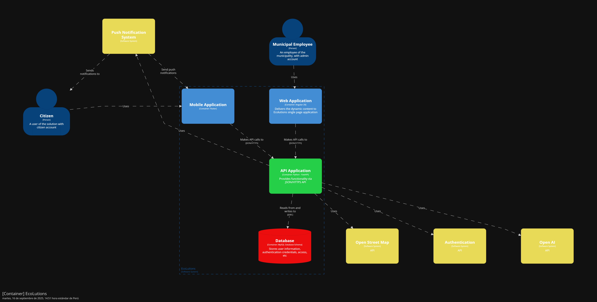

<body>
    

        
Universidad Peruana de Ciencias Aplicadas - Ingeniería de Software - 7 Ciclo

        
        
1ASI0732 - Diseño de Experimentos de Ingeniería de Software

        
Sección - 7491

        
Docente: Ing. Ivan Robles Fernández
   
        
Informe de Trabajo Final

        
Startup: EcoLutions

        
Producto: WasteTrack

    

    

        <h3 style="font-weight: bolder">Integrantes del equipo:</h3>
        <table style="width: fit-content">
            <tr>
                <th style="text-align:start;">Estudiante</th>
                <th style="text-align:center;">Código</th>
            </tr>
            <tr>
                <td style="text-align:start;">Gutiérrez Soto, Jhosepmyr Orlando</td>
                <td>202317638</td>
            </tr>
            <tr>
                <td style="text-align:start;">Hernández Tuiro, Eric Ernesto</td>
                <td>20221C857</td>
            </tr>
            <tr>
                <td style="text-align:start;">Ramirez Mestanza, Salim Ignacio</td>
                <td>20201E843</td>
            </tr>
            <tr>
                <td style="text-align:start;">Riva Rodríguez, Elmer Augusto</td>
                <td>202220829</td>
            <tr>
              <td style="text-align:start;">Sulca Gonzales, Paul Fernando</td>
              <td>20221C486</td>
            </tr>
        </table>
    

    
Septiembre 2025

</body>

# Registro de Versiones del Informe

| Versión | Fecha      | Autor                             | Descripción de modificación |
|---------|------------|-----------------------------------|-----------------------------|

# Project Report Collaboration Insights

En esta sección se documenta la colaboración del equipo en la elaboración del informe, mostrando evidencias gráficas de la actividad en GitHub y su coherencia con el registro de versiones.

* URL del repositorio del Project Report en la organización de GitHub del equipo:
* [https://github.com/EcoLutions/Report-Diseno-de-Experimentos-de-Ingenieria-de-Software](https://github.com/EcoLutions/Report-Diseno-de-Experimentos-de-Ingenieria-de-Software)

# Contenido

<!-- TOC -->
* [Registro de Versiones del Informe](#registro-de-versiones-del-informe)
* [Project Report Collaboration Insights](#project-report-collaboration-insights)
* [Contenido](#contenido)
* [Student Outcome](#student-outcome)
* [Capítulo I: Introducción](#capítulo-i-introducción)
  * [1.1. Startup Profile](#11-startup-profile)
    * [1.1.1. Descripción de la Startup](#111-descripción-de-la-startup)
    * [1.1.2. Perfiles de integrantes del equipo](#112-perfiles-de-integrantes-del-equipo)
  * [1.2. Solution Profile](#12-solution-profile)
    * [1.2.1. Antecedentes y problemática](#121-antecedentes-y-problemática)
    * [1.2.2. Lean UX Process](#122-lean-ux-process)
      * [1.2.2.1. Lean UX Problem Statements](#1221-lean-ux-problem-statements)
      * [1.2.2.2. Lean UX Assumptions](#1222-lean-ux-assumptions)
      * [1.2.2.3. Lean UX Hypothesis Statements](#1223-lean-ux-hypothesis-statements)
      * [1.2.2.4. Lean UX Canvas](#1224-lean-ux-canvas)
  * [1.3. Segmentos objetivos](#13-segmentos-objetivos)
* [Capítulo II: Requirements Elicitation & Analysis](#capítulo-ii-requirements-elicitation--analysis)
  * [2.1. Competidores](#21-competidores)
    * [2.1.1. Análisis competitivo](#211-análisis-competitivo)
    * [2.1.2. Estrategias y tácticas frente a competidores](#212-estrategias-y-tácticas-frente-a-competidores)
  * [2.2. Entrevistas](#22-entrevistas)
    * [2.2.1. Diseño de entrevistas](#221-diseño-de-entrevistas)
    * [2.2.2. Registro de entrevistas](#222-registro-de-entrevistas)
    * [2.2.3. Análisis de entrevistas](#223-análisis-de-entrevistas)
  * [2.3. Need finding](#23-need-finding)
    * [2.3.1. User personas](#231-user-personas)
    * [2.3.2. User Task Matrix](#232-user-task-matrix)
    * [2.3.3. User Journey Mapping](#233-user-journey-mapping)
    * [2.3.4. Empathy Mapping](#234-empathy-mapping)
    * [2.3.5. As-is Scenario Mapping](#235-as-is-scenario-mapping)
  * [2.4. Ubiquitous Language](#24-ubiquitous-language)
* [Capítulo III: Requirements Specification](#capítulo-iii-requirements-specification)
  * [3.1. To-Be Scenario Mapping](#31-to-be-scenario-mapping)
  * [3.2. User Stories](#32-user-stories)
  * [3.3. Product Backlog](#33-product-backlog)
  * [3.4. Impact Mapping](#34-impact-mapping)
* [Capítulo IV: Product Design](#capítulo-iv-product-design)
  * [4.1. Style Guidelines](#41-style-guidelines)
    * [4.1.1. General Style Guidelines](#411-general-style-guidelines)
    * [4.1.2. Web Style Guidelines](#412-web-style-guidelines)
    * [4.1.3. Mobile Style Guidelines](#413-mobile-style-guidelines)
      * [4.1.3.1. iOS Mobile Style Guidelines](#4131-ios-mobile-style-guidelines)
      * [4.1.3.2. Android Mobile Style Guidelines](#4132-android-mobile-style-guidelines)
  * [4.2. Information Architecture](#42-information-architecture)
    * [4.2.1. Organization Systems](#421-organization-systems)
    * [4.2.2. Labeling Systems](#422-labeling-systems)
    * [4.2.3. SEO Tags and Meta Tags](#423-seo-tags-and-meta-tags)
    * [4.2.4. Searching Systems](#424-searching-systems)
    * [4.2.5. Navigation Systems](#425-navigation-systems)
  * [4.3. Landing Page UI Design](#43-landing-page-ui-design)
    * [4.3.1. Landing Page Wireframe](#431-landing-page-wireframe)
    * [4.3.2. Landing Page Mock-up](#432-landing-page-mock-up)
  * [4.4. Mobile Applications UX/UI Design](#44-mobile-applications-uxui-design)
    * [4.4.1. Mobile Applications Wireframes](#441-mobile-applications-wireframes)
    * [4.4.2. Mobile Applications Wire flow Diagrams](#442-mobile-applications-wire-flow-diagrams)
    * [4.4.3. Mobile Applications Mock-ups](#443-mobile-applications-mock-ups)
    * [4.4.4. Mobile Applications User Flow Diagrams](#444-mobile-applications-user-flow-diagrams)
  * [4.5. Mobile Applications Prototyping](#45-mobile-applications-prototyping)
    * [4.5.1. Android Mobile Applications Prototyping](#451-android-mobile-applications-prototyping)
    * [4.5.2. iOS Mobile Applications Prototyping](#452-ios-mobile-applications-prototyping)
  * [4.6. Web Applications UX/UI Design](#46-web-applications-uxui-design)
    * [4.6.1. Web Applications Wireframes](#461-web-applications-wireframes)
    * [4.6.2. Web Applications Wire flow Diagrams](#462-web-applications-wire-flow-diagrams)
    * [4.6.3. Web Applications Mock-ups](#463-web-applications-mock-ups)
    * [4.6.4. Web Applications User Flow Diagrams](#464-web-applications-user-flow-diagrams)
  * [4.7. Web Applications Prototyping](#47-web-applications-prototyping)
  * [4.8. Domain-Driven Software Architecture](#48-domain-driven-software-architecture)
    * [4.8.1. Software Architecture Context Diagram](#481-software-architecture-context-diagram)
    * [4.8.2. Software Architecture Container Diagrams](#482-software-architecture-container-diagrams)
    * [4.8.3. Software Architecture Components Diagrams](#483-software-architecture-components-diagrams)
  * [4.9. Software Object-Oriented Design](#49-software-object-oriented-design)
    * [4.9.1. Class Diagrams](#491-class-diagrams)
    * [4.9.2. Class Dictionary](#492-class-dictionary)
  * [4.10. Database Design](#410-database-design)
    * [4.10.1. Relational/Non-Relational Database Diagram](#4101-relationalnon-relational-database-diagram)
* [Capítulo V: Product Implementation](#capítulo-v-product-implementation)
  * [5.1. Software Configuration Management](#51-software-configuration-management)
    * [5.1.1. Software Development Environment Configuration](#511-software-development-environment-configuration)
    * [5.1.2. Source Code Management](#512-source-code-management)
    * [5.1.3. Source Code Style Guide & Conventions](#513-source-code-style-guide--conventions)
    * [5.1.4. Software Deployment Configuration](#514-software-deployment-configuration)
  * [5.2. Product Implementation & Deployment](#52-product-implementation--deployment)
    * [5.2.1. Sprint Backlogs](#521-sprint-backlogs)
    * [5.2.2. Implemented Landing Page Evidence](#522-implemented-landing-page-evidence)
    * [5.2.3. Implemented Frontend-Web Application Evidence](#523-implemented-frontend-web-application-evidence)
    * [5.2.4. Implemented Native-Mobile Application Evidence](#524-implemented-native-mobile-application-evidence)
    * [5.2.5. Implemented Restful API and/or Serverless Backend Evidence](#525-implemented-restful-api-andor-serverless-backend-evidence)
    * [5.2.6. Restful API documentation](#526-restful-api-documentation)
    * [5.2.7. Team Collaboration Insights](#527-team-collaboration-insights)
  * [5.3. Video About-the-Product](#53-video-about-the-product)
* [Conclusiones](#conclusiones)
* [Bibliografía](#bibliografía)
* [Anexos](#anexos)
<!-- TOC -->

# Student Outcome

El curso contribuye al cumplimiento del Student Outcome ABET:

****ABET - EAC - Student Outcome 4****

**Criterio:** La capacidad de reconocer responsabilidades éticas y profesionales en situaciones de ingeniería y hacer juicios informados, que deben considerar el impacto de las soluciones de ingeniería en contextos globales, económicos, ambientales y sociales.

En el siguiente cuadro se describe las acciones realizadas y enunciados de conclusiones por parte del grupo, que permiten sustentar el haber alcanzado el logro del ABET – EAC - Student Outcome 4.

| **Criterio específico**                                                                                                                                           | **Acciones realizadas** | **Conclusiones** |
|-------------------------------------------------------------------------------------------------------------------------------------------------------------------|-------------------------|------------------|  
| **4.c.1 Reconoce responsabilidad ética y profesional en situaciones de ingeniería de software.**                                                                  |                         |                  |
| **4.c.2 Emite juicios informados considerando el impacto de las soluciones de ingeniería de software en contextos globales, económicos, ambientales y sociales.** |                         |                  |

# Capítulo I: Introducción

## 1.1. Startup Profile

### 1.1.1. Descripción de la Startup

EcoLutions es una startup peruana especializada en el desarrollo de soluciones IoT inteligentes para la optimización de la gestión de residuos sólidos urbanos. Fundada en 2025, nuestro enfoque se centra en revolucionar los sistemas tradicionales de recolección de basura mediante la implementación de tecnología de sensores avanzados, análisis de datos en tiempo real y algoritmos de optimización de rutas.
Nuestra misión es transformar la gestión de residuos sólidos en las ciudades peruanas, comenzando por Lima Metropolitana, a través de soluciones tecnológicas innovadoras que reduzcan costos operativos, mejoren la eficiencia del servicio y contribuyan a ciudades más limpias y sostenibles.

**Propuesta de Valor**

* Optimización inteligente: Algoritmos que combinan nivel de llenado y tiempo de permanencia para priorizar recolecciones
* Arquitectura híbrida: Procesamiento Edge para alertas inmediatas y Cloud para análisis avanzados
* Modelo B2B sostenible: Licencia anual fija que permite presupuestación municipal predecible
* Enfoque local: Soluciones adaptadas específicamente a las necesidades y regulaciones de distritos peruanos

**Visión**

Ser la empresa líder en soluciones IoT para gestión inteligente de residuos en Latinoamérica, contribuyendo al desarrollo de ciudades más eficientes, limpias y sostenibles.
Valores

* Innovación responsable: Tecnología que genera impacto social positivo
* Sostenibilidad: Compromiso con el medio ambiente y la eficiencia de recursos
* Transparencia: Datos abiertos que generen confianza en la gestión pública
* Colaboración: Trabajo conjunto con municipalidades y ciudadanía

### 1.1.2. Perfiles de integrantes del equipo

| Foto del participante                                                                       | Nombres y apellidos              | Código de estudiante | Carrera                | Conocimientos técnicos y habilidades                                                                                                                                                                                                                                                                                                |
|---------------------------------------------------------------------------------------------|----------------------------------|----------------------|------------------------|-------------------------------------------------------------------------------------------------------------------------------------------------------------------------------------------------------------------------------------------------------------------------------------------------------------------------------------|
|          | Eric Ernesto Hernández Tuiro     | 20221C857            | Ingeniería de Software | Especialista en desarrollo backend con Java/Spring Boot y diseño de arquitecturas de sistemas. Enfocado en tecnologías empresariales y soluciones eficientes. Será responsable de los servicios web, procesamiento de datos y desarrollo de APIs para la plataforma WasteTrack.                                                     |
|          | Elmer Augusto Riva Rodríguez     | 202220829            | Ingeniería de Software | Desarrollador con experiencia en Angular/Spring Boot y Vue.js/ASP.NET, enfocado en arquitecturas monolíticas y desarrollo de aplicaciones. Liderará el desarrollo de aplicaciones móviles para conductores y ciudadanos, garantizando interfaces intuitivas y funcionales.                                                          | 
|  | Jhosepmyr Orlando Gutiérrez Soto | 202317638            | Ingeniería de Software | Especialista en desarrollo full-stack con Java/Spring Boot y frameworks frontend como Angular y Vue.js. Experiencia en microservicios y servicios cloud (AWS, Azure, GCP). Aporta habilidades de liderazgo técnico, toma de decisiones y coordinación de equipos de desarrollo para la arquitectura general del sistema WasteTrack. | 

## 1.2. Solution Profile

### 1.2.1. Antecedentes y problemática

Esta sección presenta un análisis de la situación actual de la gestión de residuos sólidos en Lima Metropolitana. Se utiliza la técnica de las 5 W's y 2 H's para desglosar el problema, identificar a los actores involucrados, el contexto y, fundamentalmente, cuantificar su magnitud. El propósito es establecer una base fáctica sólida que justifique la necesidad y el enfoque de WasteTrack, nuestra solución tecnológica diseñada para abordar estas deficiencias.

**Análisis mediante la técnica de las 5 W's y 2 H's:**

* WHO - ¿Quién está afectado?:
  El problema impacta directamente a los habitantes de Lima Metropolitana, quienes generan más de 8,000 toneladas de residuos sólidos diariamente (Actualidad Ambiental, 2018). Involucra también a las 43 municipalidades distritales, responsables de la gestión, y a su personal operativo. De forma secundaria, afecta a recicladores y a las autoridades regulatorias como el Organismo de Evaluación y Fiscalización Ambiental (OEFA) y el Ministerio del Ambiente (MINAM).

* WHAT - ¿Cuál es el problema?:
  El problema central es la gestión ineficiente y reactiva de los residuos sólidos, caracterizada por rutas de recolección no optimizadas, una cobertura deficiente del servicio que deja puntos críticos de acumulación y altos costos operativos para los municipios. Esto deriva en un serio problema de salud pública y contaminación ambiental.

* WHERE - ¿Dónde ocurre?:
  El problema se manifiesta en toda Lima Metropolitana. Las zonas más críticas se concentran en distritos con alta densidad poblacional como Villa El Salvador (368.3 ton/día), San Juan de Lurigancho (1,026.5 ton/día) y Villa María del Triunfo (357.2 ton/día) (Infobae Perú, 2024b).

* WHEN - ¿Cuándo sucede?:
  La generación de residuos es continua (24/7), con picos durante fines de semana y temporadas festivas. La recolección se realiza principalmente en horarios nocturnos para evitar el tráfico, pero la falta de planificación provoca que los problemas de acumulación sean recurrentes y visibles durante el día.

* WHY - ¿Por qué persiste?:
  La persistencia del problema se debe a una combinación de factores:
  _Tecnológicos_: Ausencia de sistemas de monitoreo en tiempo real y planificación de rutas basada en métodos manuales obsoletos.
  _Administrativos_: Presupuestos insuficientes, una deficiente recaudación de arbitrios que afecta la sostenibilidad financiera del servicio (PUCP, 2022) y una limitada coordinación interdistrital.
  _Estructurales_: Crecimiento urbano no planificado y una cultura ciudadana con bajos índices de reciclaje, donde solo el 1% del material disponible se recicla formalmente (Actualidad Ambiental, 2018).

* HOW - ¿Cómo se manifiesta el problema?:
  El problema se evidencia a través de indicadores concretos. Lima Metropolitana genera más de 8,000 toneladas de residuos sólidos cada día (Actualidad Ambiental, 2018), y cerca del 35% de la población considera la acumulación de basura como el segundo problema ambiental que más los afecta (Infobae Perú, 2024b). Operativamente, se manifiesta en rutas de recolección redundantes y la existencia de 35 puntos críticos de acumulación tan solo en el Cercado de Lima (Infobae Perú, 2024a).

* HOW MUCH - ¿Cuál es la magnitud del impacto?:
  El impacto económico es masivo. El costo por tonelada recolectada varía entre S/120 y S/180 (PUCP, 2022). Sin optimización, se pierden recursos significativos; estudios de optimización de rutas sugieren un potencial de ahorro en costos de combustible de entre 20% y 40% (Zeo Route Planner, 2025). Adicionalmente, el 40% de los residuos de la capital terminan en botaderos informales (SNI, 2024), lo que agrava el costo ambiental y de salud pública.

**Diagrama de Ishikawa: Causas Raíz del Problema**

### 1.2.2. Lean UX Process

Esta sección aplica el Proceso Lean UX para estructurar la visión del negocio del proyecto WasteTrack. Se inicia con la formulación del problema, se desglosan las suposiciones fundamentales que sostienen el modelo de negocio y de producto, y finalmente se traducen estas suposiciones en hipótesis comprobables que guiarán el ciclo de desarrollo y validación.

#### 1.2.2.1. Lean UX Problem Statements

El estado actual de la gestión de residuos sólidos en Lima Metropolitana se basa en rutas de recolección fijas y procesos reactivos, los cuales no se adaptan a la dinámica diaria de generación de basura en una urbe de más de 10 millones de habitantes.

Lo que los métodos de gestión existentes no logran abordar es la falta de visibilidad y data en tiempo real sobre el estado de los contenedores. Esta carencia genera rutas ineficientes, desborde de basura en puntos críticos, un uso excesivo de recursos (combustible, personal, tiempo) y una creciente insatisfacción ciudadana.

Nuestro producto, WasteTrack, abordará esta brecha mediante el desarrollo de una plataforma IoT integral que monitorea el nivel de llenado y el tiempo de permanencia de los residuos en los contenedores, permitiendo a las municipalidades optimizar sus rutas de recolección de forma dinámica y proactiva.

El enfoque inicial del equipo serán las municipalidades de Lima Metropolitana, que enfrentan alta presión para mejorar la eficiencia de sus servicios públicos y reducir costos operativos, comenzando con un proyecto piloto en un distrito representativo para validar el modelo.

El equipo sabrá que ha tenido éxito cuando observe una reducción de al menos un 15% en los costos operativos de recolección, un incremento del 20% en la cobertura efectiva del servicio y una disminución del 50% en las quejas ciudadanas relacionadas con contenedores desbordados en las zonas de intervención.

#### 1.2.2.2. Lean UX Assumptions

Esta sección presenta las suposiciones fundamentales del proyecto, estructuradas en resultados de negocio, perfiles de usuario y resultados de usuario. Las suposiciones están ordenadas de manera implícita, priorizando las más críticas y riesgosas.

**Business Outcomes (Resultados de Negocio):**

Los resultados de negocio se establecen utilizando el framework AARRR (Pirate Metrics) para medir el éxito del producto y guiar las decisiones estratégicas. Se asume que se podrán alcanzar las siguientes métricas:
* Acquisition (Adquisición): El 30% de las municipalidades contactadas aceptarán una demostración del producto.
* Activation (Activación): El 50% de las municipalidades que reciban una demo firmarán un contrato para un proyecto piloto de 3 meses.
* Retention (Retención): El 75% de las municipalidades que completen el piloto se convertirán en clientes con un contrato anual.
* Revenue (Ingresos): Se logrará un Ingreso Anual por Contrato (ACV) promedio de S/ 60,000 por distrito.
* Referral (Recomendación): 1 de cada 3 municipalidades satisfechas referirá activamente la solución a otros distritos.

**Users (Usuarios):**

La identificación de usuarios se basa en el análisis del problema. Estas proto-personas representan los segmentos objetivo:

| Usuario               | Perfil                                     | Objetivos                                                                             | Obstáculos                                                                      |
|-----------------------|--------------------------------------------|---------------------------------------------------------------------------------------|---------------------------------------------------------------------------------|
| Jorge (Administrador) | 45 años, Gerente de Servicios a la Ciudad. | Reducir costos, eliminar quejas ciudadanas, modernizar la gestión.                    | Falta de datos, presión política, procesos burocráticos, resistencia al cambio. |
| Carlos (Conductor)    | 38 años, Conductor de camión recolector.   | Completar su ruta de forma eficiente, evitar sobrecargas, terminar su turno a tiempo. | Rutas ineficientes, tráfico impredecible, contenedores desbordados o vacíos.    |
| Maria (Ciudadana)     | 32 años, Vecina y madre de familia.        | Tener calles limpias, saber cuándo sacar la basura, sentirse segura en su comunidad.  | Servicio de recolección impredecible, falta de canales de información.          |

**User Outcomes (Resultados de Usuario)**

Estos son los resultados que los usuarios clave esperan lograr, categorizados en funcional, emocional y aspiracional.
* Administrador: Reducir costos y optimizar recursos (funcional), sentirse en control y proactivo (emocional), ser visto como un gestor público innovador (aspiracional).
* Conductor: Completar la ruta más rápido (funcional), sentirse menos frustrado y más eficiente (emocional), ser reconocido como un servidor público valioso (aspiracional).

#### 1.2.2.3. Lean UX Hypothesis Statements

Las hipótesis transforman las suposiciones más críticas en declaraciones testeables, priorizadas según su impacto y nivel de riesgo.

**Test (Alto valor, alto riesgo)**
* Hipótesis 1 (Riesgo de Valor):
  El equipo cree que implementando sensores en 20 contenedores y un dashboard de optimización para los administradores municipales se logrará una reducción significativa de los costos operativos. Se sabrá que esto es cierto cuando, al finalizar un piloto de 3 meses, se observe una disminución medible del 15% en el tiempo y combustible utilizados para la recolección en esos puntos específicos.

* Hipótesis 2 (Riesgo de Negocio):
  El equipo cree que presentando los resultados positivos del piloto a los decisores municipales se logrará demostrar un ROI claro que justifique la contratación del servicio. Se sabrá que esto es cierto cuando al menos 2 de 5 municipalidades contactadas firmen una carta de intención para un contrato anual post-piloto.

**Ship & Measure (Alto valor, bajo riesgo)**
* Hipótesis 3 (Riesgo de Adopción de Usuario):
  El equipo cree que diseñando una aplicación móvil intuitiva con rutas guiadas para los conductores de recolección se logrará una alta tasa de adopción de la nueva metodología. Se sabrá que esto es cierto cuando en pruebas de usabilidad, el 90% de los conductores completen sus tareas principales sin asistencia y califiquen la herramienta con un 4/5 o superior en facilidad de uso.

* Hipótesis 4 (Riesgo de Valor para el Ciudadano):
  El equipo cree que ofreciendo una aplicación móvil informativa a los ciudadanos se logrará mejorar su percepción sobre el servicio de limpieza. Se sabrá que esto es cierto cuando una encuesta post-lanzamiento muestre un aumento del 25% en el índice de satisfacción ciudadana en las zonas donde opera WasteTrack.

#### 1.2.2.4. Lean UX Canvas

El Lean UX Canvas sintetiza visualmente todos los elementos del proceso Lean UX en una sola página, facilitando la comprensión compartida del equipo y la toma de decisiones ágiles. A continuación se presenta la información condensada para cada sección del canvas:

## 1.3. Segmentos objetivos

Esta sección describe los perfiles de los tres segmentos de usuarios clave identificados en el dominio del problema de la gestión de residuos sólidos en Lima Metropolitana. La caracterización de cada segmento se respalda con datos estadísticos para contextualizar sus necesidades, desafíos y el entorno en el que operan.

**Segmento 1: Administrador de Limpieza Municipal**

**Descripción:**  
Este segmento representa al cliente principal y usuario estratégico de la plataforma WasteTrack. Son funcionarios o gestores públicos de nivel medio a alto, responsables de la planificación, ejecución y supervisión de los servicios de limpieza pública en uno de los 43 distritos de Lima.  
Su principal motivación es cumplir con los objetivos de gestión (eficiencia, cobertura, presupuesto) mientras manejan la presión política y las quejas ciudadanas. Actualmente, su toma de decisiones es mayormente reactiva debido a la falta de datos en tiempo real, lo que les genera frustración y limita su capacidad para innovar.

**Características Demográficas (Perfil Inferido):**

| Aspecto                  | Detalle                                                                |
|--------------------------|------------------------------------------------------------------------|
| Rango de Edad            | 40 - 60 años                                                           |
| Nivel Educativo          | Universitario o superior (Ingeniería, Administración Pública u afines) |
| Entorno Laboral          | Oficinas municipales, ambiente burocrático con procesos establecidos   |
| Familiaridad Tecnológica | Manejo avanzado de ofimática; limitada experiencia con analítica e IoT |

**Datos Estadísticos de Sustento:**
- El 40% de los residuos de la capital terminan en botaderos informales (SNI, 2024).
- Costo por tonelada de basura recolectada: entre S/ 120 y S/ 180 (PUCP, 2022).
- El 35% de los ciudadanos considera la acumulación de basura como el 2º problema ambiental más grave (Infobae Perú, 2024b).

---

**Segmento 2: Conductor de Recolección**

**Descripción:**  
Este segmento corresponde al usuario final operativo, pieza clave en la ejecución del servicio. Son trabajadores de primera línea que operan los vehículos recolectores y siguen las rutas diarias.  
Su principal objetivo es completar la jornada de trabajo de forma eficiente y segura. Se sienten frustrados por rutas ineficientes, tráfico de la ciudad, fallas mecánicas y contenedores desbordados o vacíos.

**Características Demográficas (Perfil Inferido):**

| Aspecto                  | Detalle                                                                                                            |
|--------------------------|--------------------------------------------------------------------------------------------------------------------|
| Rango de Edad            | 25 - 50 años                                                                                                       |
| Nivel Educativo          | Secundaria completa o educación técnica                                                                            |
| Entorno Laboral          | Trabajo de campo, operando vehículos pesados, a menudo en turnos nocturnos                                         |
| Familiaridad Tecnológica | Uso cotidiano de smartphones y apps (WhatsApp, Facebook, Waze). Capacidad de adopción de apps laborales intuitivas |

**Datos Estadísticos de Sustento:**
- Responsables de manejar más de 8,000 toneladas de residuos diarios en Lima (Actualidad Ambiental, 2018).
- Enfrentan puntos críticos de acumulación, como los 35 identificados en el Cercado de Lima (Infobae Perú, 2024a).

---

**Segmento 3: Ciudadano / Vecino Residente**

**Descripción:**  
Este segmento representa al beneficiario final del servicio y la principal fuente de validación social del proyecto.  
Abarca a toda la población residente de Lima Metropolitana, con la necesidad de vivir en un entorno limpio, seguro y saludable.  
Desean un servicio predecible y con canales de información transparentes, pero sienten desconfianza hacia la gestión municipal por la irregularidad del servicio.

**Características Demográficas (Generales de Lima):**

| Aspecto                  | Detalle                                                    |
|--------------------------|------------------------------------------------------------|
| Rango de Edad            | Todos los rangos                                           |
| Nivel Socioeconómico     | Diverso, todos los niveles de la capital                   |
| Entorno                  | Alta densidad poblacional, diversidad de contextos urbanos |
| Familiaridad Tecnológica | Alta penetración de smartphones en todos los segmentos     |

**Datos Estadísticos de Sustento:**
- Generan los miles de toneladas de residuos diarios y son los más afectados por una mala gestión (Actualidad Ambiental, 2018).
- El 35% de los ciudadanos ya considera la basura un problema prioritario en su vida diaria (Infobae Perú, 2024b).

# Capítulo II: Requirements Elicitation & Analysis

## 2.1. Competidores

### 2.1.1. Análisis competitivo

### 2.1.2. Estrategias y tácticas frente a competidores

## 2.2. Entrevistas

### 2.2.1. Diseño de entrevistas

### 2.2.2. Registro de entrevistas

### 2.2.3. Análisis de entrevistas

## 2.3. Need finding

### 2.3.1. User personas

### 2.3.2. User Task Matrix

### 2.3.3. User Journey Mapping

### 2.3.4. Empathy Mapping

### 2.3.5. As-is Scenario Mapping

## 2.4. Ubiquitous Language

# Capítulo III: Requirements Specification

## 3.1. To-Be Scenario Mapping

## 3.2. User Stories

## 3.3. Product Backlog

## 3.4. Impact Mapping

# Capítulo IV: Product Design

## 4.1. Style Guidelines

### 4.1.1. General Style Guidelines

### 4.1.2. Web Style Guidelines

### 4.1.3. Mobile Style Guidelines

#### 4.1.3.1. iOS Mobile Style Guidelines

#### 4.1.3.2. Android Mobile Style Guidelines

## 4.2. Information Architecture

### 4.2.1. Organization Systems

### 4.2.2. Labeling Systems

### 4.2.3. SEO Tags and Meta Tags

### 4.2.4. Searching Systems

### 4.2.5. Navigation Systems

## 4.3. Landing Page UI Design

### 4.3.1. Landing Page Wireframe

### 4.3.2. Landing Page Mock-up

## 4.4. Mobile Applications UX/UI Design

### 4.4.1. Mobile Applications Wireframes

### 4.4.2. Mobile Applications Wire flow Diagrams

### 4.4.3. Mobile Applications Mock-ups

### 4.4.4. Mobile Applications User Flow Diagrams

## 4.5. Mobile Applications Prototyping

### 4.5.1. Android Mobile Applications Prototyping

### 4.5.2. iOS Mobile Applications Prototyping

## 4.6. Web Applications UX/UI Design

### 4.6.1. Web Applications Wireframes

### 4.6.2. Web Applications Wire flow Diagrams

### 4.6.3. Web Applications Mock-ups

### 4.6.4. Web Applications User Flow Diagrams

## 4.7. Web Applications Prototyping

## 4.8. Domain-Driven Software Architecture

En esta sección se documenta la arquitectura de software basada en el enfoque de Domain-Driven Design (DDD). Se incluyen diagramas que representan el contexto del sistema, los contenedores y los componentes, proporcionando una visión clara de cómo se estructura y organiza la solución de software para abordar los requisitos del negocio y las necesidades del usuario.

### 4.8.1. Software Architecture Context Diagram

Se presenta el diagrama de contexto de la arquitectura de software, que ilustra los límites del sistema, los actores externos y las interacciones principales. Este diagrama ayuda a comprender cómo el sistema se integra con su entorno y cuáles son las responsabilidades clave del mismo.

### 4.8.2. Software Architecture Container Diagrams

Se incluyen los diagramas de contenedores de la arquitectura de software, que muestran los principales contenedores del sistema, como aplicaciones, servicios y bases de datos. Estos diagramas detallan cómo se comunican los contenedores entre sí y con los actores externos, proporcionando una visión más granular de la estructura del sistema.

### 4.8.3. Software Architecture Components Diagrams

Se presentan los diagramas de componentes de la arquitectura de software, que descomponen los contenedores en componentes más pequeños y manejables. Estos diagramas detallan las responsabilidades de cada componente y cómo interactúan entre sí para cumplir con los requisitos del sistema.

## 4.9. Software Object-Oriented Design

### 4.9.1. Class Diagrams

### 4.9.2. Class Dictionary

## 4.10. Database Design

### 4.10.1. Relational/Non-Relational Database Diagram

# Capítulo V: Product Implementation

## 5.1. Software Configuration Management

### 5.1.1. Software Development Environment Configuration

### 5.1.2. Source Code Management

### 5.1.3. Source Code Style Guide & Conventions

### 5.1.4. Software Deployment Configuration

## 5.2. Product Implementation & Deployment

### 5.2.1. Sprint Backlogs

### 5.2.2. Implemented Landing Page Evidence

### 5.2.3. Implemented Frontend-Web Application Evidence

### 5.2.4. Implemented Native-Mobile Application Evidence

### 5.2.5. Implemented Restful API and/or Serverless Backend Evidence

### 5.2.6. Restful API documentation

### 5.2.7. Team Collaboration Insights

## 5.3. Video About-the-Product

# Conclusiones

# Bibliografía

# Anexos
