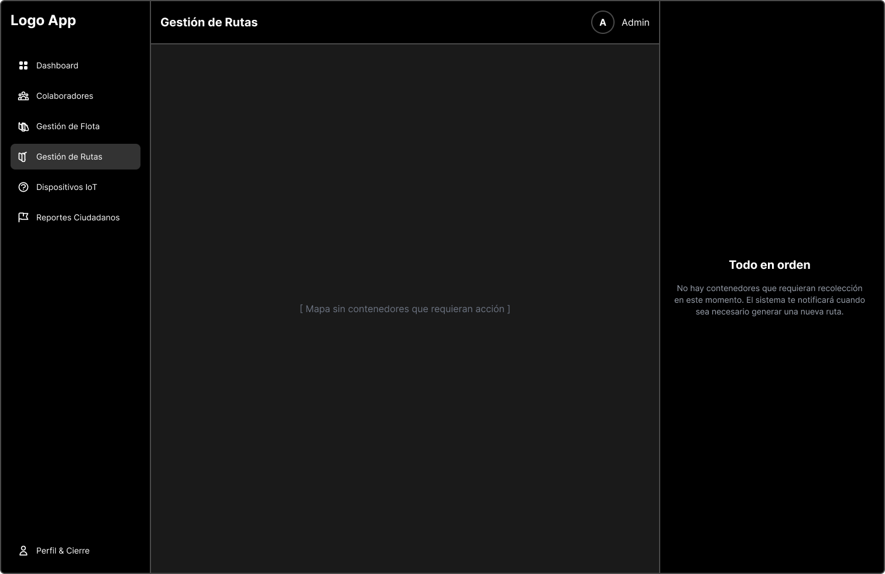
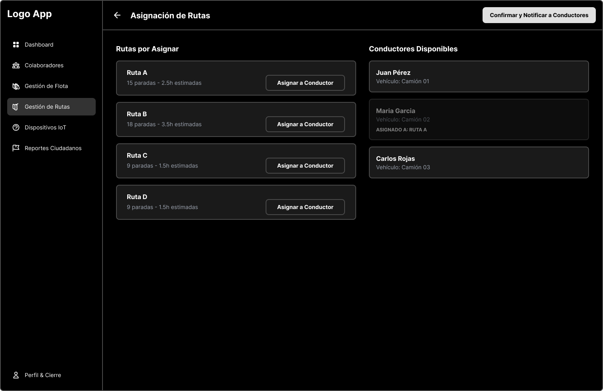

<body>
    

        
Universidad Peruana de Ciencias Aplicadas - Ingeniería de Software - 7 Ciclo

        
        
1ASI0732 - Diseño de Experimentos de Ingeniería de Software

        
Sección - 7491

        
Docente: Ing. Ivan Robles Fernández
   
        
Informe de Trabajo Final

        
Startup: EcoLutions

        
Producto: WasteTrack

    

    

        <h3 style="font-weight: bolder">Integrantes del equipo:</h3>
        <table style="width: fit-content">
            <tr>
                <th style="text-align:start;">Estudiante</th>
                <th style="text-align:center;">Código</th>
            </tr>
            <tr>
                <td style="text-align:start;">Gutiérrez Soto, Jhosepmyr Orlando</td>
                <td>202317638</td>
            </tr>
            <tr>
                <td style="text-align:start;">Hernández Tuiro, Eric Ernesto</td>
                <td>20221C857</td>
            </tr>
            <tr>
                <td style="text-align:start;">Ramirez Mestanza, Salim Ignacio</td>
                <td>20201E843</td>
            </tr>
            <tr>
                <td style="text-align:start;">Riva Rodríguez, Elmer Augusto</td>
                <td>202220829</td>
            <tr>
              <td style="text-align:start;">Sulca Gonzales, Paul Fernando</td>
              <td>20221C486</td>
            </tr>
        </table>
    

    
Septiembre 2025

</body>

# Registro de Versiones del Informe

| Versión | Fecha      | Autor                             | Descripción de modificación |
|---------|------------|-----------------------------------|-----------------------------|

# Project Report Collaboration Insights

En esta sección se documenta la colaboración del equipo en la elaboración del informe, mostrando evidencias gráficas de la actividad en GitHub y su coherencia con el registro de versiones.

* URL del repositorio del Project Report en la organización de GitHub del equipo:
* [https://github.com/EcoLutions/Report-Diseno-de-Experimentos-de-Ingenieria-de-Software](https://github.com/EcoLutions/Report-Diseno-de-Experimentos-de-Ingenieria-de-Software)

# Contenido

<!-- TOC -->
* [Registro de Versiones del Informe](#registro-de-versiones-del-informe)
* [Project Report Collaboration Insights](#project-report-collaboration-insights)
* [Contenido](#contenido)
* [Student Outcome](#student-outcome)
* [Capítulo I: Introducción](#capítulo-i-introducción)
  * [1.1. Startup Profile](#11-startup-profile)
    * [1.1.1. Descripción de la Startup](#111-descripción-de-la-startup)
    * [1.1.2. Perfiles de integrantes del equipo](#112-perfiles-de-integrantes-del-equipo)
  * [1.2. Solution Profile](#12-solution-profile)
    * [1.2.1. Antecedentes y problemática](#121-antecedentes-y-problemática)
    * [1.2.2. Lean UX Process](#122-lean-ux-process)
      * [1.2.2.1. Lean UX Problem Statements](#1221-lean-ux-problem-statements)
      * [1.2.2.2. Lean UX Assumptions](#1222-lean-ux-assumptions)
      * [1.2.2.3. Lean UX Hypothesis Statements](#1223-lean-ux-hypothesis-statements)
      * [1.2.2.4. Lean UX Canvas](#1224-lean-ux-canvas)
  * [1.3. Segmentos objetivos](#13-segmentos-objetivos)
* [Capítulo II: Requirements Elicitation & Analysis](#capítulo-ii-requirements-elicitation--analysis)
  * [2.1. Competidores](#21-competidores)
    * [2.1.1. Análisis competitivo](#211-análisis-competitivo)
    * [2.1.2. Estrategias y tácticas frente a competidores](#212-estrategias-y-tácticas-frente-a-competidores)
  * [2.2. Entrevistas](#22-entrevistas)
    * [2.2.1. Diseño de entrevistas](#221-diseño-de-entrevistas)
    * [2.2.2. Registro de entrevistas](#222-registro-de-entrevistas)
    * [2.2.3. Análisis de entrevistas](#223-análisis-de-entrevistas)
  * [2.3. Need finding](#23-need-finding)
    * [2.3.1. User personas](#231-user-personas)
    * [2.3.2. User Task Matrix](#232-user-task-matrix)
    * [2.3.3. User Journey Mapping](#233-user-journey-mapping)
    * [2.3.4. Empathy Mapping](#234-empathy-mapping)
    * [2.3.5. As-is Scenario Mapping](#235-as-is-scenario-mapping)
  * [2.4. Ubiquitous Language](#24-ubiquitous-language)
* [Capítulo III: Requirements Specification](#capítulo-iii-requirements-specification)
  * [3.1. To-Be Scenario Mapping](#31-to-be-scenario-mapping)
  * [3.2. User Stories](#32-user-stories)
  * [3.3. Product Backlog](#33-product-backlog)
  * [3.4. Impact Mapping](#34-impact-mapping)
* [Capítulo IV: Product Design](#capítulo-iv-product-design)
  * [4.1. Style Guidelines](#41-style-guidelines)
    * [4.1.1. General Style Guidelines](#411-general-style-guidelines)
    * [4.1.2. Web Style Guidelines](#412-web-style-guidelines)
    * [4.1.3. Mobile Style Guidelines](#413-mobile-style-guidelines)
      * [4.1.3.1. iOS Mobile Style Guidelines](#4131-ios-mobile-style-guidelines)
      * [4.1.3.2. Android Mobile Style Guidelines](#4132-android-mobile-style-guidelines)
  * [4.2. Information Architecture](#42-information-architecture)
    * [4.2.1. Organization Systems](#421-organization-systems)
    * [4.2.2. Labeling Systems](#422-labeling-systems)
    * [4.2.3. SEO Tags and Meta Tags](#423-seo-tags-and-meta-tags)
    * [4.2.4. Searching Systems](#424-searching-systems)
    * [4.2.5. Navigation Systems](#425-navigation-systems)
  * [4.3. Landing Page UI Design](#43-landing-page-ui-design)
    * [4.3.1. Landing Page Wireframe](#431-landing-page-wireframe)
    * [4.3.2. Landing Page Mock-up](#432-landing-page-mock-up)
  * [4.4. Mobile Applications UX/UI Design](#44-mobile-applications-uxui-design)
    * [4.4.1. Mobile Applications Wireframes](#441-mobile-applications-wireframes)
    * [4.4.2. Mobile Applications Wire flow Diagrams](#442-mobile-applications-wire-flow-diagrams)
    * [4.4.3. Mobile Applications Mock-ups](#443-mobile-applications-mock-ups)
    * [4.4.4. Mobile Applications User Flow Diagrams](#444-mobile-applications-user-flow-diagrams)
  * [4.5. Mobile Applications Prototyping](#45-mobile-applications-prototyping)
    * [4.5.1. Android Mobile Applications Prototyping](#451-android-mobile-applications-prototyping)
    * [4.5.2. iOS Mobile Applications Prototyping](#452-ios-mobile-applications-prototyping)
  * [4.6. Web Applications UX/UI Design](#46-web-applications-uxui-design)
    * [4.6.1. Web Applications Wireframes](#461-web-applications-wireframes)
    * [4.6.2. Web Applications Wire flow Diagrams](#462-web-applications-wire-flow-diagrams)
    * [4.6.3. Web Applications Mock-ups](#463-web-applications-mock-ups)
    * [4.6.4. Web Applications User Flow Diagrams](#464-web-applications-user-flow-diagrams)
  * [4.7. Web Applications Prototyping](#47-web-applications-prototyping)
  * [4.8. Domain-Driven Software Architecture](#48-domain-driven-software-architecture)
    * [4.8.1. Software Architecture Context Diagram](#481-software-architecture-context-diagram)
    * [4.8.2. Software Architecture Container Diagrams](#482-software-architecture-container-diagrams)
    * [4.8.3. Software Architecture Components Diagrams](#483-software-architecture-components-diagrams)
  * [4.9. Software Object-Oriented Design](#49-software-object-oriented-design)
    * [4.9.1. Class Diagrams](#491-class-diagrams)
    * [4.9.2. Class Dictionary](#492-class-dictionary)
  * [4.10. Database Design](#410-database-design)
    * [4.10.1. Relational/Non-Relational Database Diagram](#4101-relationalnon-relational-database-diagram)
* [Capítulo V: Product Implementation](#capítulo-v-product-implementation)
  * [5.1. Software Configuration Management](#51-software-configuration-management)
    * [5.1.1. Software Development Environment Configuration](#511-software-development-environment-configuration)
    * [5.1.2. Source Code Management](#512-source-code-management)
    * [5.1.3. Source Code Style Guide & Conventions](#513-source-code-style-guide--conventions)
    * [5.1.4. Software Deployment Configuration](#514-software-deployment-configuration)
  * [5.2. Product Implementation & Deployment](#52-product-implementation--deployment)
    * [5.2.1. Sprint Backlogs](#521-sprint-backlogs)
    * [5.2.2. Implemented Landing Page Evidence](#522-implemented-landing-page-evidence)
    * [5.2.3. Implemented Frontend-Web Application Evidence](#523-implemented-frontend-web-application-evidence)
    * [5.2.4. Implemented Native-Mobile Application Evidence](#524-implemented-native-mobile-application-evidence)
    * [5.2.5. Implemented Restful API and/or Serverless Backend Evidence](#525-implemented-restful-api-andor-serverless-backend-evidence)
    * [5.2.6. Restful API documentation](#526-restful-api-documentation)
    * [5.2.7. Team Collaboration Insights](#527-team-collaboration-insights)
  * [5.3. Video About-the-Product](#53-video-about-the-product)
* [Conclusiones](#conclusiones)
* [Bibliografía](#bibliografía)
* [Anexos](#anexos)
<!-- TOC -->

# Student Outcome

El curso contribuye al cumplimiento del Student Outcome ABET:

****ABET - EAC - Student Outcome 4****

**Criterio:** La capacidad de reconocer responsabilidades éticas y profesionales en situaciones de ingeniería y hacer juicios informados, que deben considerar el impacto de las soluciones de ingeniería en contextos globales, económicos, ambientales y sociales.

En el siguiente cuadro se describe las acciones realizadas y enunciados de conclusiones por parte del grupo, que permiten sustentar el haber alcanzado el logro del ABET – EAC - Student Outcome 4.

| **Criterio específico**                                                                                                                                           | **Acciones realizadas** | **Conclusiones** |
|-------------------------------------------------------------------------------------------------------------------------------------------------------------------|-------------------------|------------------|  
| **4.c.1 Reconoce responsabilidad ética y profesional en situaciones de ingeniería de software.**                                                                  |                         |                  |
| **4.c.2 Emite juicios informados considerando el impacto de las soluciones de ingeniería de software en contextos globales, económicos, ambientales y sociales.** |                         |                  |

# Capítulo I: Introducción

## 1.1. Startup Profile

### 1.1.1. Descripción de la Startup

EcoLutions es una startup peruana especializada en el desarrollo de soluciones IoT inteligentes para la optimización de la gestión de residuos sólidos urbanos. Fundada en 2025, nuestro enfoque se centra en revolucionar los sistemas tradicionales de recolección de basura mediante la implementación de tecnología de sensores avanzados, análisis de datos en tiempo real y algoritmos de optimización de rutas.
Nuestra misión es transformar la gestión de residuos sólidos en las ciudades peruanas, comenzando por Lima Metropolitana, a través de soluciones tecnológicas innovadoras que reduzcan costos operativos, mejoren la eficiencia del servicio y contribuyan a ciudades más limpias y sostenibles.

**Propuesta de Valor**

* Optimización inteligente: Algoritmos que combinan nivel de llenado y tiempo de permanencia para priorizar recolecciones
* Arquitectura híbrida: Procesamiento Edge para alertas inmediatas y Cloud para análisis avanzados
* Modelo B2B sostenible: Licencia anual fija que permite presupuestación municipal predecible
* Enfoque local: Soluciones adaptadas específicamente a las necesidades y regulaciones de distritos peruanos

**Visión**

Ser la empresa líder en soluciones IoT para gestión inteligente de residuos en Latinoamérica, contribuyendo al desarrollo de ciudades más eficientes, limpias y sostenibles.
Valores

* Innovación responsable: Tecnología que genera impacto social positivo
* Sostenibilidad: Compromiso con el medio ambiente y la eficiencia de recursos
* Transparencia: Datos abiertos que generen confianza en la gestión pública
* Colaboración: Trabajo conjunto con municipalidades y ciudadanía

### 1.1.2. Perfiles de integrantes del equipo

| Foto del participante                                                                       | Nombres y apellidos              | Código de estudiante | Carrera                | Conocimientos técnicos y habilidades                                                                                                                                                                                                                                                                                                |
|---------------------------------------------------------------------------------------------|----------------------------------|----------------------|------------------------|-------------------------------------------------------------------------------------------------------------------------------------------------------------------------------------------------------------------------------------------------------------------------------------------------------------------------------------|
|          | Eric Ernesto Hernández Tuiro     | 20221C857            | Ingeniería de Software | Especialista en desarrollo backend con Java/Spring Boot y diseño de arquitecturas de sistemas. Enfocado en tecnologías empresariales y soluciones eficientes. Será responsable de los servicios web, procesamiento de datos y desarrollo de APIs para la plataforma WasteTrack.                                                     |
|          | Elmer Augusto Riva Rodríguez     | 202220829            | Ingeniería de Software | Desarrollador con experiencia en Angular/Spring Boot y Vue.js/ASP.NET, enfocado en arquitecturas monolíticas y desarrollo de aplicaciones. Liderará el desarrollo de aplicaciones móviles para conductores y ciudadanos, garantizando interfaces intuitivas y funcionales.                                                          | 
|  | Jhosepmyr Orlando Gutiérrez Soto | 202317638            | Ingeniería de Software | Especialista en desarrollo full-stack con Java/Spring Boot y frameworks frontend como Angular y Vue.js. Experiencia en microservicios y servicios cloud (AWS, Azure, GCP). Aporta habilidades de liderazgo técnico, toma de decisiones y coordinación de equipos de desarrollo para la arquitectura general del sistema WasteTrack. | 

## 1.2. Solution Profile

### 1.2.1. Antecedentes y problemática

Esta sección presenta un análisis de la situación actual de la gestión de residuos sólidos en Lima Metropolitana. Se utiliza la técnica de las 5 W's y 2 H's para desglosar el problema, identificar a los actores involucrados, el contexto y, fundamentalmente, cuantificar su magnitud. El propósito es establecer una base fáctica sólida que justifique la necesidad y el enfoque de WasteTrack, nuestra solución tecnológica diseñada para abordar estas deficiencias.

**Análisis mediante la técnica de las 5 W's y 2 H's:**

* WHO - ¿Quién está afectado?:
  El problema impacta directamente a los habitantes de Lima Metropolitana, quienes generan más de 8,000 toneladas de residuos sólidos diariamente (Actualidad Ambiental, 2018). Involucra también a las 43 municipalidades distritales, responsables de la gestión, y a su personal operativo. De forma secundaria, afecta a recicladores y a las autoridades regulatorias como el Organismo de Evaluación y Fiscalización Ambiental (OEFA) y el Ministerio del Ambiente (MINAM).

* WHAT - ¿Cuál es el problema?:
  El problema central es la gestión ineficiente y reactiva de los residuos sólidos, caracterizada por rutas de recolección no optimizadas, una cobertura deficiente del servicio que deja puntos críticos de acumulación y altos costos operativos para los municipios. Esto deriva en un serio problema de salud pública y contaminación ambiental.

* WHERE - ¿Dónde ocurre?:
  El problema se manifiesta en toda Lima Metropolitana. Las zonas más críticas se concentran en distritos con alta densidad poblacional como Villa El Salvador (368.3 ton/día), San Juan de Lurigancho (1,026.5 ton/día) y Villa María del Triunfo (357.2 ton/día) (Infobae Perú, 2024b).

* WHEN - ¿Cuándo sucede?:
  La generación de residuos es continua (24/7), con picos durante fines de semana y temporadas festivas. La recolección se realiza principalmente en horarios nocturnos para evitar el tráfico, pero la falta de planificación provoca que los problemas de acumulación sean recurrentes y visibles durante el día.

* WHY - ¿Por qué persiste?:
  La persistencia del problema se debe a una combinación de factores:
  _Tecnológicos_: Ausencia de sistemas de monitoreo en tiempo real y planificación de rutas basada en métodos manuales obsoletos.
  _Administrativos_: Presupuestos insuficientes, una deficiente recaudación de arbitrios que afecta la sostenibilidad financiera del servicio (PUCP, 2022) y una limitada coordinación interdistrital.
  _Estructurales_: Crecimiento urbano no planificado y una cultura ciudadana con bajos índices de reciclaje, donde solo el 1% del material disponible se recicla formalmente (Actualidad Ambiental, 2018).

* HOW - ¿Cómo se manifiesta el problema?:
  El problema se evidencia a través de indicadores concretos. Lima Metropolitana genera más de 8,000 toneladas de residuos sólidos cada día (Actualidad Ambiental, 2018), y cerca del 35% de la población considera la acumulación de basura como el segundo problema ambiental que más los afecta (Infobae Perú, 2024b). Operativamente, se manifiesta en rutas de recolección redundantes y la existencia de 35 puntos críticos de acumulación tan solo en el Cercado de Lima (Infobae Perú, 2024a).

* HOW MUCH - ¿Cuál es la magnitud del impacto?:
  El impacto económico es masivo. El costo por tonelada recolectada varía entre S/120 y S/180 (PUCP, 2022). Sin optimización, se pierden recursos significativos; estudios de optimización de rutas sugieren un potencial de ahorro en costos de combustible de entre 20% y 40% (Zeo Route Planner, 2025). Adicionalmente, el 40% de los residuos de la capital terminan en botaderos informales (SNI, 2024), lo que agrava el costo ambiental y de salud pública.

**Diagrama de Ishikawa: Causas Raíz del Problema**

### 1.2.2. Lean UX Process

Esta sección aplica el Proceso Lean UX para estructurar la visión del negocio del proyecto WasteTrack. Se inicia con la formulación del problema, se desglosan las suposiciones fundamentales que sostienen el modelo de negocio y de producto, y finalmente se traducen estas suposiciones en hipótesis comprobables que guiarán el ciclo de desarrollo y validación.

#### 1.2.2.1. Lean UX Problem Statements

El estado actual de la gestión de residuos sólidos en Lima Metropolitana se basa en rutas de recolección fijas y procesos reactivos, los cuales no se adaptan a la dinámica diaria de generación de basura en una urbe de más de 10 millones de habitantes.

Lo que los métodos de gestión existentes no logran abordar es la falta de visibilidad y data en tiempo real sobre el estado de los contenedores. Esta carencia genera rutas ineficientes, desborde de basura en puntos críticos, un uso excesivo de recursos (combustible, personal, tiempo) y una creciente insatisfacción ciudadana.

Nuestro producto, WasteTrack, abordará esta brecha mediante el desarrollo de una plataforma IoT integral que monitorea el nivel de llenado y el tiempo de permanencia de los residuos en los contenedores, permitiendo a las municipalidades optimizar sus rutas de recolección de forma dinámica y proactiva.

El enfoque inicial del equipo serán las municipalidades de Lima Metropolitana, que enfrentan alta presión para mejorar la eficiencia de sus servicios públicos y reducir costos operativos, comenzando con un proyecto piloto en un distrito representativo para validar el modelo.

El equipo sabrá que ha tenido éxito cuando observe una reducción de al menos un 15% en los costos operativos de recolección, un incremento del 20% en la cobertura efectiva del servicio y una disminución del 50% en las quejas ciudadanas relacionadas con contenedores desbordados en las zonas de intervención.

#### 1.2.2.2. Lean UX Assumptions

Esta sección presenta las suposiciones fundamentales del proyecto, estructuradas en resultados de negocio, perfiles de usuario y resultados de usuario. Las suposiciones están ordenadas de manera implícita, priorizando las más críticas y riesgosas.

**Business Outcomes (Resultados de Negocio):**

Los resultados de negocio se establecen utilizando el framework AARRR (Pirate Metrics) para medir el éxito del producto y guiar las decisiones estratégicas. Se asume que se podrán alcanzar las siguientes métricas:
* Acquisition (Adquisición): El 30% de las municipalidades contactadas aceptarán una demostración del producto.
* Activation (Activación): El 50% de las municipalidades que reciban una demo firmarán un contrato para un proyecto piloto de 3 meses.
* Retention (Retención): El 75% de las municipalidades que completen el piloto se convertirán en clientes con un contrato anual.
* Revenue (Ingresos): Se logrará un Ingreso Anual por Contrato (ACV) promedio de S/ 60,000 por distrito.
* Referral (Recomendación): 1 de cada 3 municipalidades satisfechas referirá activamente la solución a otros distritos.

**Users (Usuarios):**

La identificación de usuarios se basa en el análisis del problema. Estas proto-personas representan los segmentos objetivo:

| Usuario               | Perfil                                     | Objetivos                                                                             | Obstáculos                                                                      |
|-----------------------|--------------------------------------------|---------------------------------------------------------------------------------------|---------------------------------------------------------------------------------|
| Jorge (Administrador) | 45 años, Gerente de Servicios a la Ciudad. | Reducir costos, eliminar quejas ciudadanas, modernizar la gestión.                    | Falta de datos, presión política, procesos burocráticos, resistencia al cambio. |
| Carlos (Conductor)    | 38 años, Conductor de camión recolector.   | Completar su ruta de forma eficiente, evitar sobrecargas, terminar su turno a tiempo. | Rutas ineficientes, tráfico impredecible, contenedores desbordados o vacíos.    |
| Maria (Ciudadana)     | 32 años, Vecina y madre de familia.        | Tener calles limpias, saber cuándo sacar la basura, sentirse segura en su comunidad.  | Servicio de recolección impredecible, falta de canales de información.          |

**User Outcomes (Resultados de Usuario)**

Estos son los resultados que los usuarios clave esperan lograr, categorizados en funcional, emocional y aspiracional.
* Administrador: Reducir costos y optimizar recursos (funcional), sentirse en control y proactivo (emocional), ser visto como un gestor público innovador (aspiracional).
* Conductor: Completar la ruta más rápido (funcional), sentirse menos frustrado y más eficiente (emocional), ser reconocido como un servidor público valioso (aspiracional).

#### 1.2.2.3. Lean UX Hypothesis Statements

Las hipótesis transforman las suposiciones más críticas en declaraciones testeables, priorizadas según su impacto y nivel de riesgo.

**Test (Alto valor, alto riesgo)**
* Hipótesis 1 (Riesgo de Valor):
  El equipo cree que implementando sensores en 20 contenedores y un dashboard de optimización para los administradores municipales se logrará una reducción significativa de los costos operativos. Se sabrá que esto es cierto cuando, al finalizar un piloto de 3 meses, se observe una disminución medible del 15% en el tiempo y combustible utilizados para la recolección en esos puntos específicos.

* Hipótesis 2 (Riesgo de Negocio):
  El equipo cree que presentando los resultados positivos del piloto a los decisores municipales se logrará demostrar un ROI claro que justifique la contratación del servicio. Se sabrá que esto es cierto cuando al menos 2 de 5 municipalidades contactadas firmen una carta de intención para un contrato anual post-piloto.

**Ship & Measure (Alto valor, bajo riesgo)**
* Hipótesis 3 (Riesgo de Adopción de Usuario):
  El equipo cree que diseñando una aplicación móvil intuitiva con rutas guiadas para los conductores de recolección se logrará una alta tasa de adopción de la nueva metodología. Se sabrá que esto es cierto cuando en pruebas de usabilidad, el 90% de los conductores completen sus tareas principales sin asistencia y califiquen la herramienta con un 4/5 o superior en facilidad de uso.

* Hipótesis 4 (Riesgo de Valor para el Ciudadano):
  El equipo cree que ofreciendo una aplicación móvil informativa a los ciudadanos se logrará mejorar su percepción sobre el servicio de limpieza. Se sabrá que esto es cierto cuando una encuesta post-lanzamiento muestre un aumento del 25% en el índice de satisfacción ciudadana en las zonas donde opera WasteTrack.

#### 1.2.2.4. Lean UX Canvas

El Lean UX Canvas sintetiza visualmente todos los elementos del proceso Lean UX en una sola página, facilitando la comprensión compartida del equipo y la toma de decisiones ágiles. A continuación se presenta la información condensada para cada sección del canvas:

## 1.3. Segmentos objetivos

Esta sección describe los perfiles de los tres segmentos de usuarios clave identificados en el dominio del problema de la gestión de residuos sólidos en Lima Metropolitana. La caracterización de cada segmento se respalda con datos estadísticos para contextualizar sus necesidades, desafíos y el entorno en el que operan.

**Segmento 1: Administrador de Limpieza Municipal**

**Descripción:**  
Este segmento representa al cliente principal y usuario estratégico de la plataforma WasteTrack. Son funcionarios o gestores públicos de nivel medio a alto, responsables de la planificación, ejecución y supervisión de los servicios de limpieza pública en uno de los 43 distritos de Lima.  
Su principal motivación es cumplir con los objetivos de gestión (eficiencia, cobertura, presupuesto) mientras manejan la presión política y las quejas ciudadanas. Actualmente, su toma de decisiones es mayormente reactiva debido a la falta de datos en tiempo real, lo que les genera frustración y limita su capacidad para innovar.

**Características Demográficas (Perfil Inferido):**

| Aspecto                  | Detalle                                                                |
|--------------------------|------------------------------------------------------------------------|
| Rango de Edad            | 40 - 60 años                                                           |
| Nivel Educativo          | Universitario o superior (Ingeniería, Administración Pública u afines) |
| Entorno Laboral          | Oficinas municipales, ambiente burocrático con procesos establecidos   |
| Familiaridad Tecnológica | Manejo avanzado de ofimática; limitada experiencia con analítica e IoT |

**Datos Estadísticos de Sustento:**
- El 40% de los residuos de la capital terminan en botaderos informales (SNI, 2024).
- Costo por tonelada de basura recolectada: entre S/ 120 y S/ 180 (PUCP, 2022).
- El 35% de los ciudadanos considera la acumulación de basura como el 2º problema ambiental más grave (Infobae Perú, 2024b).

---

**Segmento 2: Conductor de Recolección**

**Descripción:**  
Este segmento corresponde al usuario final operativo, pieza clave en la ejecución del servicio. Son trabajadores de primera línea que operan los vehículos recolectores y siguen las rutas diarias.  
Su principal objetivo es completar la jornada de trabajo de forma eficiente y segura. Se sienten frustrados por rutas ineficientes, tráfico de la ciudad, fallas mecánicas y contenedores desbordados o vacíos.

**Características Demográficas (Perfil Inferido):**

| Aspecto                  | Detalle                                                                                                            |
|--------------------------|--------------------------------------------------------------------------------------------------------------------|
| Rango de Edad            | 25 - 50 años                                                                                                       |
| Nivel Educativo          | Secundaria completa o educación técnica                                                                            |
| Entorno Laboral          | Trabajo de campo, operando vehículos pesados, a menudo en turnos nocturnos                                         |
| Familiaridad Tecnológica | Uso cotidiano de smartphones y apps (WhatsApp, Facebook, Waze). Capacidad de adopción de apps laborales intuitivas |

**Datos Estadísticos de Sustento:**
- Responsables de manejar más de 8,000 toneladas de residuos diarios en Lima (Actualidad Ambiental, 2018).
- Enfrentan puntos críticos de acumulación, como los 35 identificados en el Cercado de Lima (Infobae Perú, 2024a).

---

**Segmento 3: Ciudadano / Vecino Residente**

**Descripción:**  
Este segmento representa al beneficiario final del servicio y la principal fuente de validación social del proyecto.  
Abarca a toda la población residente de Lima Metropolitana, con la necesidad de vivir en un entorno limpio, seguro y saludable.  
Desean un servicio predecible y con canales de información transparentes, pero sienten desconfianza hacia la gestión municipal por la irregularidad del servicio.

**Características Demográficas (Generales de Lima):**

| Aspecto                  | Detalle                                                    |
|--------------------------|------------------------------------------------------------|
| Rango de Edad            | Todos los rangos                                           |
| Nivel Socioeconómico     | Diverso, todos los niveles de la capital                   |
| Entorno                  | Alta densidad poblacional, diversidad de contextos urbanos |
| Familiaridad Tecnológica | Alta penetración de smartphones en todos los segmentos     |

**Datos Estadísticos de Sustento:**
- Generan los miles de toneladas de residuos diarios y son los más afectados por una mala gestión (Actualidad Ambiental, 2018).
- El 35% de los ciudadanos ya considera la basura un problema prioritario en su vida diaria (Infobae Perú, 2024b).

# Capítulo II: Requirements Elicitation & Analysis

## 2.1. Competidores

### 2.1.1. Análisis competitivo

A continuación, se presenta el "Competitive Analysis Landscape" para EcoLutions y sus tres competidores principales.

<table style="border-collapse:collapse; width:100%; text-align:left; font-size:14px; border: 1px solid #e6f0ff;">
  <tr>
    <th colspan="5" style="text-align:center;">Competitive Analysis Landscape</th>
  </tr>
  <tr>
    <td colspan="2"><strong>¿Por qué llevar a cabo este análisis?</strong></td>
    <td colspan="3">
      El objetivo de este análisis es identificar las fortalezas, debilidades y estrategias de los actores clave en el mercado global de gestión inteligente de residuos. 
      Esto permitirá a EcoLutions definir con precisión su propuesta de valor única, anticipar desafíos y diseñar una estrategia de entrada efectiva y diferenciada para el mercado peruano y latinoamericano.
    </td>
  </tr>

  <tr>
    <th></th>
    <th>EcoLutions </th>
    <th>Competidor 1: Bigbelly </th>
    <th>Competidor 2: Sensoneo </th>
    <th>Competidor 3: Ecube Labs </th>
  </tr>

  <!-- Perfil -->
  <tr>
    <td colspan="5"><strong>Perfil</strong></td>
  </tr>
  <tr>
    <td>Overview</td>
    <td>Startup peruana enfocada en una solución SaaS y hardware-agnóstico para optimizar la recolección de residuos en municipios de mercados emergentes.</td>
    <td>Líder mundial con sede en EE.UU. Famoso por sus estaciones de compactación solar que reducen la frecuencia de recolección.</td>
    <td>Empresa europea (Eslovaquia) especializada en sensores inteligentes para modernizar contenedores existentes y un potente software de análisis y optimización de rutas.</td>
    <td>Compañía surcoreana que ofrece una solución de extremo a extremo, incluyendo sensores, contenedores inteligentes y una plataforma de software en la nube.</td>
  </tr>
  <tr>
    <td>Ventaja Competitiva</td>
    <td>Hiperlocalización y flexibilidad: Modelo de negocio y soporte adaptado a la realidad económica y burocrática de los municipios peruanos. Enfoque en software y datos.</td>
    <td>Tecnología de compactación y marca: Su tecnología patentada de compactación solar es única. Tienen una fuerte presencia de marca y reputación global.</td>
    <td>Software avanzado y flexibilidad: Su plataforma de software es una de las más robustas del mercado. Su modelo permite modernizar la infraestructura existente sin reemplazarla.</td>
    <td>Solución integral (One-Stop-Shop): Ofrecen un ecosistema completo de hardware y software de un solo proveedor, simplificando la adquisición para el cliente.</td>
  </tr>
  <tr>
    <td>Valor para Clientes</td>
    <td>Reducción de costos operativos (15-25%) con una inversión inicial baja y un modelo de pago flexible (SaaS anual). Soporte local y rápido.</td>
    <td>Reducción drástica de la frecuencia de recolección (hasta 80%), eliminando desbordamientos en zonas de alto tráfico y mejorando la estética urbana.</td>
    <td>Optimización de rutas basada en datos precisos, resultando en ahorros de hasta un 30% en costos de recolección. Alta visibilidad y control sobre la operación.</td>
    <td>Una solución integrada que cubre todas las necesidades de gestión inteligente de residuos, desde el sensor hasta el análisis de datos, con un único punto de contacto.</td>
  </tr>

  <!-- Marketing -->
  <tr>
    <td colspan="5"><strong>Perfil de Marketing</strong></td>
  </tr>
  <tr>
    <td>Mercado Objetivo</td>
    <td>Municipios de Lima Metropolitana como mercado inicial, con foco en distritos con problemas de gestión críticos y presupuestos limitados.</td>
    <td>Municipios, universidades, parques temáticos y grandes corporaciones en ciudades de alto perfil que buscan soluciones de alta visibilidad y eficiencia.</td>
    <td>Municipios y empresas privadas de gestión de residuos que buscan optimizar sus operaciones existentes y tomar decisiones basadas en datos.</td>
    <td>Ciudades y empresas que buscan implementar un sistema de gestión inteligente desde cero y prefieren un único proveedor para todo.</td>
  </tr>
  <tr>
    <td>Estrategias</td>
    <td>Enfoque B2G (Business-to-Government) con una estrategia de "aterrizaje y expansión" a través de proyectos piloto. Marketing de contenidos enfocado en casos de estudio locales.</td>
    <td>Modelo de venta directa y a través de distribuidores. Fuerte énfasis en el marketing de casos de éxito y presencia en ferias de smart cities.</td>
    <td>Venta directa y a través de socios (resellers, empresas de telecomunicaciones). Marketing digital muy técnico, enfocado en las capacidades de su software.</td>
    <td>Red global de distribuidores y venta directa. Participación activa en eventos de tecnología y sostenibilidad.</td>
  </tr>

  <!-- Producto -->
  <tr>
    <td colspan="5"><strong>Perfil de Producto</strong></td>
  </tr>
  <tr>
    <td>Productos & Servicios</td>
    <td>- Sensores de llenado (adaptables). - Plataforma web SaaS (dashboard, analítica, optimización de rutas). - App móvil para conductores. - App informativa para ciudadanos.</td>
    <td>- Estaciones de compactación solar (hardware). - Estaciones de reciclaje. - Plataforma de software CLEAN para la gestión de los contenedores.</td>
    <td>- Sensores ultrasónicos (para adaptar a cualquier contenedor). - Software de optimización de rutas. - Software de gestión de activos. - App para ciudadanos.</td>
    <td>- Sensores ultrasónicos. - Contenedores de compactación solar. - Papeleras inteligentes. - Plataforma de software (EcubeNet).</td>
  </tr>
  <tr>
    <td>Precios & Costos</td>
    <td>Modelo SaaS con suscripción anual (bajo costo inicial). El hardware se vende o se arrienda por separado para dar flexibilidad.</td>
    <td>Modelo de venta de hardware (CAPEX). Muy alto costo de inversión inicial por unidad, con costos de software recurrentes.</td>
    <td>Modelo SaaS (OPEX) para el software, con un costo único por la compra de los sensores. Flexible y escalable.</td>
    <td>Modelo mixto: venta de hardware (CAPEX) combinado con una licencia de software recurrente (OPEX).</td>
  </tr>
  <tr>
    <td>Canales</td>
    <td>Venta directa y sitio web. El piloto inicial servirá como principal canal de validación y adquisición.</td>
    <td>Red de distribuidores globales y equipo de ventas directas. Página web muy corporativa.</td>
    <td>Sitio web, equipo de ventas directas y red de socios tecnológicos.</td>
    <td>Distribuidores en más de 50 países y equipo de ventas regional.</td>
  </tr>

  <!-- SWOT -->
  <tr>
    <td colspan="5"><strong>Análisis SWOT</strong></td>
  </tr>
  <tr>
    <td>Fortalezas</td>
    <td>F: - Agilidad y bajo costo operativo. - Modelo de negocio adaptado al mercado local (SaaS). - Soporte técnico cercano y en español. - Enfoque en software y datos.</td>
    <td>F: - Marca líder y reconocida mundialmente. - Tecnología de compactación patentada y probada. - Alta calidad y durabilidad del hardware.</td>
    <td>F: - Software de optimización de rutas muy potente y avanzado. - Flexibilidad (moderniza contenedores existentes). - Modelo de negocio escalable (SaaS).</td>
    <td>F: - Portafolio de productos diversificado (solución integral). - Proveedor único simplifica la compra. - Experiencia en despliegues globales.</td>
  </tr>
  <tr>
    <td>Debilidades</td>
    <td>D: - Sin marca ni reputación inicial. - Dependencia de hardware de terceros. - Recursos financieros limitados. - Equipo pequeño.</td>
    <td>D: - Costo inicial extremadamente alto (barrera de entrada). - Poca flexibilidad (solución cerrada de hardware). - No optimiza contenedores existentes.</td>
    <td>D: - Menor reconocimiento de marca que Bigbelly. - Dependencia de la calidad de la infraestructura existente del cliente. - No fabrican su propio hardware de compactación.</td>
    <td>D: - Puede ser "un maestro de nada" al no especializarse en un solo área. - Complejidad logística al ofrecer tantos productos. - Menos flexible que las soluciones solo de software.</td>
  </tr>
  <tr>
    <td>Oportunidades</td>
    <td>O: - Mercado peruano y LATAM poco explotado. - Necesidad de soluciones de bajo costo en municipios. - Posibilidad de alianzas con empresas de telecomunicaciones locales.</td>
    <td>O: - Expansión a mercados emergentes de alto perfil en LATAM. - Proyectos de "Smart City" impulsados por gobiernos.</td>
    <td>O: - Gran mercado de contenedores existentes que pueden ser modernizados. - Creciente demanda de soluciones basadas en datos y eficiencia.</td>
    <td>O: - Contratos gubernamentales a gran escala para ciudades enteras. - Venta cruzada de su amplio portafolio de productos.</td>
  </tr>
  <tr>
    <td>Amenazas</td>
    <td>A: - Entrada de un líder global (como los competidores) con precios agresivos. - Lentos procesos de licitación pública. - Desconfianza en startups locales por parte del gobierno.</td>
    <td>A: - Soluciones de bajo costo basadas en sensores (como WasteTrack) que ofrecen "suficiente valor" por mucho menos dinero. - Crisis económicas que reducen los presupuestos públicos para grandes inversiones.</td>
    <td>A: - Competidores con soluciones de hardware integrado que ofrecen una experiencia más controlada. - Commoditización de los sensores IoT.</td>
    <td>A: - Competidores especializados (Bigbelly en compactación, Sensoneo en software) pueden ofrecer mejores soluciones en sus nichos. - Fluctuaciones en los costos de hardware.</td>
  </tr>
</table>

Tabla 1: Análisis Competitivo. Elaborado a partir de la información pública de los sitios web de Bigbelly (2025), Sensoneo (2025), y Ecube Labs (2025).

### 2.1.2. Estrategias y tácticas frente a competidores

A partir del análisis competitivo y el FODA, se ha diseñado un conjunto de estrategias y tácticas preliminares para posicionar a WasteTrack en el mercado peruano. El enfoque se centra en explotar las debilidades de los competidores globales, neutralizar sus fortalezas y construir una ventaja competitiva sostenible basada en el conocimiento y la agilidad local.

**1. Estrategia de Diferenciación por Modelo de Negocio y Accesibilidad**

Esta estrategia busca contrarrestar la principal fortaleza de los competidores (tecnología robusta y probada) atacando su mayor debilidad: el alto costo y la rigidez de su modelo de negocio, que no se ajusta a la realidad económica de los municipios peruanos.

* Táctica 1.1: Ofrecer un Modelo SaaS (OPEX) de Bajo Riesgo:
  Frente a Bigbelly: Se enfatizará la eliminación de la barrera de entrada que representa su altísimo costo de hardware (CAPEX). WasteTrack se posicionará como una solución que no requiere una inversión inicial millonaria, sino un pago por servicio (OPEX) predecible y alineado con los presupuestos anuales municipales.

* Táctica 1.2: Precios Localizados y Transparentes:
  Frente a Sensoneo y Ecube Labs: Se ofrecerá una estructura de precios en moneda local (Soles) y adaptada a la escala de los distritos de Lima. Esto contrasta con los precios en Euros/Dólares de los competidores, que están sujetos a la volatilidad del tipo de cambio y a estructuras de costos de mercados desarrollados.

* Táctica 1.3: Flexibilidad en el Hardware:
  Se aprovechará la debilidad de Bigbelly (solución cerrada) y la dependencia de Sensoneo de la infraestructura existente. WasteTrack ofrecerá una solución de sensores adaptable a los contenedores que los municipios ya poseen, maximizando la inversión previa del cliente y reduciendo el costo total del proyecto.

**2. Estrategia de Ventaja Competitiva por Hiper-Localización**

Esta estrategia capitaliza la principal fortaleza de EcoLutions: su presencia y profundo entendimiento del mercado peruano, una ventaja que los competidores globales no pueden replicar fácilmente.

* Táctica 2.1: Soporte Técnico Presencial, Rápido y en Español:
  Se establecerá un centro de soporte local que garantice tiempos de respuesta en horas, no días. Esto será un diferenciador clave frente a competidores que ofrecen soporte desde otras zonas horarias y a través de intermediarios, lo cual es crítico para un servicio público que no puede detenerse.

* Táctica 2.2: Adaptación del Producto a la Realidad Peruana:
  A diferencia de las soluciones "enlatadas" de los competidores, WasteTrack adaptará su software y hardware a desafíos locales. Esto incluye desde el diseño de carcasas de sensores más resistentes al vandalismo hasta la personalización de reportes para cumplir con las normativas de la contraloría peruana y sistemas de gestión gubernamentales.

* Táctica 2.3: Construcción de un Ecosistema de Alianzas Locales:
  Se buscarán alianzas estratégicas con empresas de telecomunicaciones peruanas para ofrecer paquetes de conectividad IoT, con universidades locales para proyectos de investigación y desarrollo, y con proveedores locales para el ensamblaje de componentes, fortaleciendo la cadena de valor nacional.

**3. Estrategia de Entrada al Mercado Basada en Confianza y Datos Locales**

Esta estrategia está diseñada para mitigar la principal amenaza para una startup local (la desconfianza del sector público) y capitalizar la oportunidad de un mercado emergente.

* Táctica 3.1: Implementar el "Modelo Piloto de Rápida Demostración de Valor":
  Para superar los largos ciclos de venta y la aversión al riesgo, se ofrecerán proyectos piloto de 3 a 6 meses, de bajo costo o cofinanciados, en un área acotada de un distrito. El objetivo es generar un caso de éxito con datos 100% peruanos y tangibles (ej. "En 3 meses, redujimos los costos en la zona X de Villa El Salvador en un 18%").

* Táctica 3.2: Marketing de Contenidos Basado en Evidencia Local:
  Mientras los competidores muestran casos de éxito en Dublín o Seúl, EcoLutions utilizará los datos de sus pilotos en Lima para crear contenido (informes, webinars, notas de prensa) que resuene directamente con los desafíos de otros alcaldes y gerentes municipales del país.

* Táctica 3.3: Convertirse en el Estándar de Datos del Sector:
  Al ser los primeros en desplegar una red de sensores y recolectar datos a nivel local, EcoLutions puede posicionarse como el líder de opinión y la principal fuente de inteligencia sobre la gestión de residuos en el Perú, creando una barrera de entrada basada en el conocimiento y los datos que es difícil de superar para un competidor que recién llega.

## 2.2. Entrevistas

### 2.2.1. Diseño de entrevistas

Esta sección presenta el diseño estructurado de entrevistas para los tres segmentos objetivo identificados. Las entrevistas están diseñadas con un enfoque exploratorio y abierto, priorizando preguntas que permitan comprender los comportamientos actuales, motivaciones profundas y contexto real de cada usuario. La información recolectada será fundamental para la construcción de User Persona(s), User Journey Maps, Empathy Maps y otros artefactos de UX.

**Objetivos de Investigación**

_Objetivo Principal:_
Comprender necesidades, comportamientos y motivaciones de los actores clave en la gestión de residuos sólidos urbanos para validar la propuesta de valor de WasteTrack.

_Objetivos Específicos:_
Identificar procesos actuales, herramientas utilizadas y puntos de dolor específicos
* Explorar relaciones con tecnología y receptividad a soluciones digitales
* Validar funcionalidades propuestas y recolectar feedback sobre prioridades
* Descubrir motivaciones, frustraciones y barreras para adopción de nuevas tecnologías

**Perfil de Entrevistados**

| Segmento                 | Criterios                                                                                        | Cantidad      |
|--------------------------|--------------------------------------------------------------------------------------------------|---------------|
| Administrador Municipal  | Funcionario con responsabilidades en gestión de servicios urbanos o limpieza pública, 35-60 años | 3 entrevistas |
| Conductor de Recolección | Conductor profesional con experiencia en rutas urbanas o transporte público, 20-50 años          | 3 entrevistas |
| Ciudadano Residente      | Residente de Lima Metropolitana, responsable del hogar, usuario de smartphone, 20-55 años        | 3 entrevistas |

**Guía de Entrevista - Administrador Municipal**

| Sección                                  | Categoría / Área      | Preguntas Principales                                                                                                                                                                           | Follow-up                                             |
|------------------------------------------|-----------------------|-------------------------------------------------------------------------------------------------------------------------------------------------------------------------------------------------|-------------------------------------------------------|
| A. Información Demográfica y de Contexto | Datos Básicos         | • ¿Cuál es su nombre, edad y cargo actual? • ¿En qué área de la municipalidad trabaja? • ¿Cuántos años lleva en gestión pública?                                                          | -                                                     |
|                                          | Contexto Laboral      | • ¿En qué distrito trabaja y en cuál vive? • ¿Cuáles son sus principales responsabilidades? • ¿Maneja presupuestos o equipos de trabajo?                                                  | -                                                     |
|                                          | Perfil Digital        | • ¿Qué dispositivo usa más: Android o iPhone? • ¿Usa Excel, sistemas municipales específicos? • ¿Cómo se mantiene informado sobre el trabajo diario?                                      | -                                                     |
| B. Procesos Actuales y Herramientas      | Rutina Diaria         | ¿Cómo es un día típico en su trabajo? ¿Qué decisiones toma regularmente relacionadas con servicios públicos?                                                                                    | ¿Qué información necesita para tomar esas decisiones? |
|                                          | Planificación         | Cuando debe planificar rutas de recolección o supervisar servicios, ¿qué datos utiliza y cómo los obtiene?                                                                                      | ¿Qué tan actualizados están esos datos?               |
|                                          | Herramientas          | ¿Qué sistemas o herramientas digitales usa en su trabajo diario? ¿Cuáles funcionan bien y cuáles le dan problemas?                                                                              | ¿Cómo se entera de problemas en terreno?              |
| C. Frustraciones y Desafíos              | Problemas Principales | ¿Cuál es su mayor frustración en el trabajo diario? ¿Qué le quita más tiempo o recursos?                                                                                                        | ¿Puede contarme la última vez que esto pasó?          |
|                                          | Presiones Externas    | ¿Recibe quejas de ciudadanos? ¿Cómo las maneja y qué tipo son más frecuentes?                                                                                                                   | ¿Qué le gustaría poder resolver inmediatamente?       |
| D. Objetivos y Métricas                  | Indicadores de Éxito  | ¿Cómo mide el éxito en su gestión? ¿Qué indicadores son más importantes para usted?                                                                                                             | ¿Cuánto del presupuesto se va en estos servicios?     |
|                                          | Mejoras Deseadas      | Si tuviera recursos ilimitados, ¿qué cambiaría primero en la gestión de servicios?                                                                                                              | ¿Qué impacto tendría ese cambio?                      |
| E. Presentación de Solución              | Receptividad          | Si existiera una herramienta que le diera información en tiempo real sobre contenedores de basura - cuáles están llenos, cuáles necesitan mantenimiento - ¿cómo cambiaría su forma de trabajar? | ¿Qué tipo de información sería más valiosa?           |

**Guía de Entrevista - Conductor de Recolección**

| Sección                                  | Categoría / Área         | Preguntas Principales                                                                                                            | Follow-up                                            |
|------------------------------------------|--------------------------|----------------------------------------------------------------------------------------------------------------------------------|------------------------------------------------------|
| A. Información Demográfica y de Contexto | Datos Básicos            | • ¿Cuál es su nombre, edad y a qué se dedica? • ¿En qué distrito vive? • ¿Cuántos años lleva manejando profesionalmente?   | -                                                    |
|                                          | Experiencia Laboral      | • ¿Trabaja en rutas fijas o variables? • ¿Conoce bien Lima o hay zonas complicadas? • ¿Trabaja solo o con ayudantes?       | -                                                    |
|                                          | Perfil Digital           | • ¿Qué dispositivo usa: Android o iPhone? • ¿Usa Waze, Google Maps para manejar? • ¿Qué apps usa más en el día a día?      | -                                                    |
| B. Rutina Diaria y Procesos              | Jornada Laboral          | ¿Cómo es un día normal de trabajo? ¿Cómo comienza su turno?                                                                      | ¿A qué hora empieza y termina normalmente?           |
|                                          | Planificación de Rutas   | ¿Cómo sabe a dónde ir cada día? ¿Quién le dice la ruta o ya la tiene memorizada?                                                 | ¿La ruta cambia o es siempre igual?                  |
|                                          | Herramientas Actuales    | ¿Usa alguna herramienta para orientarse o comunicarse durante el trabajo?                                                        | ¿Cómo reporta si hay problemas?                      |
| C. Frustraciones y Desafíos              | Problemas Diarios        | ¿Qué es lo más complicado de su trabajo? ¿Qué situaciones lo estresan o frustran?                                                | ¿Qué hace cuando encuentra un contenedor desbordado? |
|                                          | Eficiencia               | ¿Ha tenido días donde siente que pierde tiempo innecesariamente?                                                                 | ¿Qué lo ayudaría a ser más eficiente?                |
| D. Motivaciones y Satisfacción           | Motivación Laboral       | ¿Qué lo motiva en su trabajo? ¿Qué hace que se sienta bien al final del día?                                                     | ¿Se siente valorado en su trabajo?                   |
|                                          | Mejoras Deseadas         | Si pudiera cambiar algo para hacer su trabajo más fácil, ¿qué sería?                                                             | ¿Qué herramienta le gustaría tener?                  |
| E. Presentación de Solución              | Receptividad Tecnológica | Si tuviera una app que le mostrara la mejor ruta del día y le avisara sobre contenedores llenos o problemas, ¿le parecería útil? | ¿Qué información sería más importante ver?           |

**Guía de Entrevista - Ciudadano Residente**

| Sección                                  | Categoría / Área         | Preguntas Principales                                                                                                                        | Follow-up                                 |
|------------------------------------------|--------------------------|----------------------------------------------------------------------------------------------------------------------------------------------|-------------------------------------------|
| A. Información Demográfica y de Contexto | Datos Básicos            | • ¿Cuál es su nombre, edad y en qué distrito vive? • ¿Con quién vive? (familia, solo, compañeros) • ¿Cuánto tiempo lleva viviendo ahí? | -                                         |
|                                          | Contexto del Hogar       | • ¿Trabaja o estudia? ¿Tiene hijos? • ¿Cómo describiría su barrio? • ¿Está activo en temas vecinales?                                  | -                                         |
|                                          | Perfil Digital           | • ¿Qué dispositivo usa más: Android o iPhone? • ¿Está en grupos de WhatsApp del barrio? • ¿Qué apps usa más frecuentemente?            | -                                         |
| B. Experiencia con Servicios Públicos    | Manejo de Residuos       | ¿Cómo manejan la basura en su casa? ¿Quién se encarga y cómo se organizan?                                                                   | ¿Saben cuándo pasa el camión recolector?  |
|                                          | Calidad del Servicio     | ¿Cómo es el servicio de recojo de basura en su zona? ¿Pasa regular?                                                                          | ¿Ha notado mejoras o empeoramientos?      |
|                                          | Problemas Comunes        | ¿Ha tenido problemas con basura acumulada, contenedores llenos o malos olores?                                                               | ¿Qué hace cuando hay estos problemas?     |
| C. Comunicación y Quejas                 | Canales de Comunicación  | Cuando hay problemas en el barrio, ¿a quién acude? ¿Cómo reporta quejas?                                                                     | ¿Le responden? ¿Qué tan rápido?           |
|                                          | Información Disponible   | ¿Qué información le gustaría tener sobre los servicios municipales que no tiene ahora?                                                       | ¿Cómo prefiere recibir información?       |
| D. Expectativas y Frustraciones          | Mejoras Deseadas         | ¿Qué es lo que más le molesta de los servicios públicos en su distrito?                                                                      | ¿Qué cambio notaría inmediatamente?       |
|                                          | Participación Ciudadana  | ¿Le gustaría tener más información o mayor participación en temas municipales?                                                               | ¿Qué tipo de información sería útil?      |
| E. Presentación de Solución              | Interés en Transparencia | Si existiera una app donde pudiera ver cuándo pasa el camión de basura, reportar problemas y ver el estado de su distrito, ¿la usaría?       | ¿Qué funcionalidad le parecería más útil? |

### 2.2.2. Registro de entrevistas

### 2.2.3. Análisis de entrevistas

## 2.3. Need finding

### 2.3.1. User personas

### Administrador Municipal

### Conductor de Recoleccion 

### Ciudadano Residente

### 2.3.2. User Task Matrix

<table>
  <tr>
    <th rowspan="2">Tarea</th>
    <th colspan="2">Administrador Municipal</th>
    <th colspan="2">Conductor de Recolección</th>
    <th colspan="2">Ciudadano Residente</th>
  </tr>
  <tr>
    <th>Frecuencia</th>
    <th>Importancia</th>
    <th>Frecuencia</th>
    <th>Importancia</th>
    <th>Frecuencia</th>
    <th>Importancia</th>
  </tr>
  <tr>
    <td>Reportar Contenedores Llenos</td>
    <td>DIARIO</td><td>ALTA</td>
    <td>DIARIO</td><td>ALTA</td>
    <td>OCACIONAL</td><td>BAJA</td>
  </tr>
  <tr>
    <td>Reportar Problemas de Recolección</td>
    <td>DIARIO</td><td>ALTA</td>
    <td>DIARIO</td><td>MEDIA</td>
    <td>OCACIONAL</td><td>ALTA</td>
  </tr>
  <tr>
    <td>Monitorear el Progreso de la Recolección</td>
    <td>DIARIO</td><td>BAJA</td>
    <td>DIARIO</td><td>ALTA</td>
    <td>OCACIONAL</td><td>BAJA</td>
  </tr>
  <tr>
    <td>Acceder a Información de Servicios Municipales</td>
    <td>DIARIO</td><td>BAJA</td>
    <td>DIARIO</td><td>BAJA</td>
    <td>OCACIONAL</td><td>ALTA</td>
  </tr>
  <tr>
    <td>Reportar Problemas de Seguridad</td>
    <td>OCACIONAL</td><td>BAJA</td>
    <td>OCACIONAL</td><td>ALTA</td>
    <td>DIARIO</td><td>ALTA</td>
  </tr>
  <tr>
    <td>Enviar y recibir quejas de la comunidad</td>
    <td>OCACIONAL</td><td>MEDIA</td>
    <td>DIARIO</td><td>ALTA</td>
    <td>DIARIO</td><td>ALTA</td>
  </tr>
  <tr>
    <td>Analizar y Generar Informes</td>
    <td>DIARIO</td><td>BAJA</td>
    <td>DIARIO</td><td>ALTA</td>
    <td>OCACIONAL</td><td>BAJA</td>
  </tr>
  <tr>
    <td>Comunicarse con el equipo o municipalidad</td>
    <td>DIARIO</td><td>ALTA</td>
    <td>DIARIO</td><td>ALTA</td>
    <td>DIARIO</td><td>ALTA</td>
  </tr>
</table>

### 2.3.3. User Journey Mapping

### Administrador Municipal

### Conductor de Recoleccion

### Ciudadano Residente

### 2.3.4. Empathy Mapping

### Administrador Municipal

### Conductor de Recoleccion

### Ciudadano Residente

### 2.3.5. As-is Scenario Mapping

### Administrador Municipal

### Conductor de Recoleccion

### Ciudadano Residente

## 2.4. Ubiquitous Language

Esta sección presenta el glosario de términos y conceptos fundamentales utilizados en el dominio de gestión de residuos sólidos urbanos, estableciendo un vocabulario común y sin ambigüedades para todos los miembros del equipo y stakeholders del proyecto WasteTrack. Los términos han sido identificados durante el proceso de Big Picture Event Storming y representan conceptos clave del negocio.

### Términos del Dominio

**Budget Approval** (Aprobación de Presupuesto)  
Proceso administrativo mediante el cual la municipalidad asigna y autoriza recursos financieros específicos para las operaciones de recolección de residuos sólidos durante un período determinado.

**Collection Point** (Punto de Recolección)  
Ubicación específica donde se encuentran contenedores de residuos sólidos y donde los vehículos recolectores deben detenerse para realizar el vaciado y carga de residuos.

**Collection Route** (Ruta de Recolección)  
Secuencia planificada de puntos de recolección que debe seguir un vehículo recolector durante una jornada de trabajo, optimizada para maximizar la eficiencia operativa.

**Collection Supervisor** (Supervisor de Recolección)  
Funcionario municipal responsable de coordinar y supervisar las operaciones diarias de recolección de residuos, incluyendo asignación de personal, vehículos y rutas.

**Container** (Contenedor)  
Recipiente destinado al almacenamiento temporal de residuos sólidos, ubicado en espacios públicos o privados, con capacidad variable según su tipo y ubicación.

**Container Capacity** (Capacidad del Contenedor)  
Volumen máximo de residuos sólidos que puede almacenar un contenedor específico, medido generalmente en metros cúbicos o litros.

**Container Overflow** (Desbordamiento del Contenedor)  
Situación en la que el volumen de residuos depositados supera la capacidad física del contenedor, causando acumulación de residuos fuera del mismo.

**Container Saturation** (Saturación del Contenedor)  
Estado crítico del contenedor cuando alcanza su capacidad máxima sin desbordarse, requiriendo recolección inmediata para evitar problemas operativos.

**Disposal Fee** (Tasa de Disposición)  
Tarifa cobrada por las instalaciones de disposición final (rellenos sanitarios, plantas de tratamiento) por recibir y procesar residuos sólidos, calculada generalmente por tonelada.

**Emergency Collection** (Recolección de Emergencia)  
Servicio extraordinario de recolección activado fuera de los horarios regulares para atender situaciones críticas como desbordamientos o acumulaciones problemáticas.

**Emergency Dispatcher** (Despachador de Emergencias)  
Funcionario responsable de coordinar y activar servicios de recolección de emergencia en respuesta a reportes ciudadanos o situaciones críticas detectadas.

**Fleet Management** (Gestión de Flota)  
Administración integral de los vehículos recolectores incluyendo mantenimiento, asignación, seguimiento operativo y control de recursos asociados.

**Household Waste** (Residuos Domiciliarios)  
Residuos sólidos generados en viviendas como resultado de actividades domésticas cotidianas, incluyendo restos orgánicos, envases y materiales diversos.

**Commercial Waste** (Residuos Comerciales)  
Residuos sólidos producidos por establecimientos comerciales, oficinas y servicios, caracterizados por mayor volumen y composición específica según el tipo de negocio.

**Hospital Waste** (Residuos Hospitalarios)  
Residuos sólidos generados en establecimientos de salud, que pueden incluir materiales biocontaminados y requieren manejo especializado según normativas sanitarias.

**Industrial Waste** (Residuos Industriales)  
Residuos sólidos producidos por procesos industriales y manufactureros, que pueden requerir tratamiento especializado según su composición y características.

**Informal Recycler** (Reciclador Informal)  
Persona que se dedica a la recolección, separación y comercialización de materiales reciclables de manera independiente, operando fuera del sistema formal de gestión de residuos.

**Landfill** (Relleno Sanitario)  
Instalación de ingeniería diseñada para la disposición final segura de residuos sólidos, con sistemas de control ambiental y cumplimiento de normativas técnicas específicas.

**Maintenance Schedule** (Cronograma de Mantenimiento)  
Planificación sistemática de actividades de mantenimiento preventivo y correctivo para vehículos, contenedores y equipos del sistema de gestión de residuos.

**Municipal Administrator** (Administrador Municipal)  
Funcionario de alto nivel responsable de la planificación estratégica y gestión general del servicio municipal de limpieza pública y gestión de residuos sólidos.

**Organic Waste** (Residuos Orgánicos)  
Fracción de residuos sólidos de origen biológico, principalmente restos de alimentos y materiales vegetales, susceptibles de ser compostados o tratados biológicamente.

**Recyclable Material** (Material Reciclable)  
Componentes de los residuos sólidos que pueden ser reprocesados para la fabricación de nuevos productos, incluyendo papel, cartón, plásticos, metales y vidrio.

**Regulatory Compliance** (Cumplimiento Regulatorio)  
Adherencia a las normativas ambientales y sanitarias establecidas por entidades como MINAM, OEFA y otras autoridades competentes en materia de gestión de residuos.

**Route Optimization** (Optimización de Rutas)  
Proceso de planificación que busca determinar la secuencia más eficiente de puntos de recolección para minimizar tiempo, distancia y consumo de recursos operativos.

**Shift Schedule** (Cronograma de Turnos)  
Organización temporal de las jornadas de trabajo del personal operativo, definiendo horarios, responsabilidades y asignaciones específicas para cada turno.

**Transfer Station** (Estación de Transferencia)  
Instalación intermedia donde los residuos recolectados son consolidados y transferidos a vehículos de mayor capacidad para su transporte hacia la disposición final.

**Truck Driver** (Conductor de Camión)  
Operario especializado responsable de conducir vehículos recolectores y ejecutar las rutas de recolección siguiendo los protocolos establecidos.

**Waste Disposal** (Disposición de Residuos)  
Acto de colocar residuos sólidos en contenedores o ubicaciones designadas por parte de generadores (ciudadanos, comercios, instituciones).

**Waste Generation** (Generación de Residuos)  
Proceso mediante el cual las actividades humanas producen materiales que se descartan como residuos sólidos, variando según el tipo de generador y actividad.

**Waste Generator** (Generador de Residuos)  
Persona natural o jurídica cuyas actividades producen residuos sólidos, incluyendo hogares, comercios, industrias e instituciones públicas.

**Waste Segregation** (Segregación de Residuos)  
Separación de residuos sólidos en diferentes categorías (orgánicos, reciclables, no reciclables) en el punto de generación para facilitar su manejo posterior.

**Waste Transportation** (Transporte de Residuos)  
Traslado de residuos sólidos desde los puntos de recolección hacia estaciones de transferencia, plantas de tratamiento o sitios de disposición final.

**Waste Weighing** (Pesaje de Residuos)  
Proceso de medición del peso de residuos sólidos transportados, realizado en básculas especializadas para control operativo y facturación de servicios.

**Weekly Schedule** (Cronograma Semanal)  
Planificación operativa que define días, horarios y frecuencias de recolección para diferentes sectores del distrito, estableciendo la regularidad del servicio.

# Capítulo III: Requirements Specification

## 3.1. To-Be Scenario Mapping

### Administrador Municipal

### Conductor de Recolección

### Ciudadano Residente

## 3.2. User Stories

Esta sección presenta la especificación completa de requisitos del sistema WasteTrack mediante User Stories organizadas por Epics. Las User Stories han sido desarrolladas basándose en el análisis del Big Picture Event Storming, los segmentos objetivos identificados (Administrador de Limpieza Municipal, Conductor de Recolección y Ciudadano/Vecino Residente), y la arquitectura de productos digitales que incluye Landing Page, Web Application, Mobile Applications, RESTful API, Edge API y Embedded Applications.

Las User Stories incluyen criterios de aceptación siguiendo la estructura Gherkin (Given-When-Then) y abarcan tanto funcionalidades de interacción directa con usuarios como Technical Stories para APIs y Spike Stories para investigación técnica. La priorización está diseñada para un desarrollo en 3 sprints, priorizando las funcionalidades core de Container Monitoring y Route Optimization en los primeros sprints.

| Epic / Story ID | Título                                           | Descripción                                                                                                                                                                                                                                                        | Criterios de Aceptación                                                                                                                                                                                                                                                        | Relacionado con (Epic ID) |
|:----------------|:-------------------------------------------------|:-------------------------------------------------------------------------------------------------------------------------------------------------------------------------------------------------------------------------------------------------------------------|:-------------------------------------------------------------------------------------------------------------------------------------------------------------------------------------------------------------------------------------------------------------------------------|:--------------------------|
| **EP01**        | **User Management & Authentication**             | Gestión completa de usuarios, roles y autenticación para el sistema WasteTrack, incluyendo la creación controlada de distritos municipales, asignación de administradores y gestión de accesos según subscripciones activas.                                       | --                                                                                                                                                                                                                                                                             | --                        |
| US01            | Creación de distrito municipal                   | Como superusuario de EcoLutions, quiero crear un nuevo distrito municipal en el sistema para habilitarlo como cliente de WasteTrack con su respectiva subscripción.                                                                                                | Given el superusuario está autenticado en el sistema When ingresa datos válidos del distrito (nombre, región, contacto administrativo) Then el sistema crea el distrito con subscripción activa And genera credenciales para el primer administrador municipal        | EP01                      |
| US02            | Registro de administrador municipal              | Como administrador municipal designado, quiero acceder al sistema con las credenciales proporcionadas para comenzar a gestionar el servicio de residuos de mi distrito.                                                                                            | Given el administrador recibe credenciales válidas por email When accede por primera vez al sistema Then es redirigido a completar perfil y cambiar contraseña And accede al dashboard administrativo correspondiente                                                 | EP01                      |
| US03            | Autenticación de usuarios                        | Como usuario registrado, quiero iniciar sesión en la plataforma para acceder a mis funcionalidades correspondientes según mi rol.                                                                                                                                  | Given el usuario tiene credenciales válidas When ingresa email y contraseña correctos Then el sistema autentica y redirige al dashboard correspondiente a su rol And establece sesión activa con token JWT                                                            | EP01                      |
| US04            | Gestión de conductores por administrador         | Como administrador municipal, quiero crear y gestionar cuentas de conductores de mi distrito para que puedan acceder a la aplicación móvil de rutas.                                                                                                               | Given el administrador está autenticado When crea cuenta de conductor con datos básicos Then el sistema genera credenciales para el conductor And el conductor puede acceder a la aplicación móvil                                                                    | EP01                      |
| US05            | Registro libre de ciudadanos                     | Como ciudadano, quiero registrarme libremente en la aplicación móvil para acceder a información y reportar problemas de contenedores en mi distrito.                                                                                                               | Given el ciudadano descarga la app móvil When completa registro con email y ubicación Then el sistema crea cuenta de ciudadano And permite acceso a funcionalidades de consulta y reporte                                                                             | EP01                      |
| US06            | Recuperación de contraseña                       | Como usuario registrado, quiero recuperar mi contraseña cuando la olvide para poder acceder nuevamente al sistema.                                                                                                                                                 | Given el usuario ha olvidado su contraseña When solicita recuperación con email válido Then el sistema envía enlace de restablecimiento And permite crear nueva contraseña segura                                                                                     | EP01                      |
| **EP02**        | **Container Monitoring**                         | Sistema integral de monitoreo de contenedores de residuos que incluye visualización en tiempo real, alertas automatizadas, análisis histórico de llenado y gestión de estados críticos para optimizar la recolección de residuos sólidos urbanos.                  | --                                                                                                                                                                                                                                                                             | --                        |
| US07            | Visualización de contenedores en mapa            | Como administrador municipal, quiero ver todos los contenedores de mi distrito en un mapa interactivo para monitorear su ubicación y estado actual.                                                                                                                | Given el administrador está autenticado When accede al dashboard de contenedores Then el sistema muestra mapa con todos los contenedores del distrito And cada contenedor muestra su estado actual (vacío/medio/lleno/crítico)                                        | EP02                      |
| US08            | Alertas de contenedores críticos                 | Como administrador municipal, quiero recibir alertas automáticas cuando un contenedor esté crítico para programar recolección de emergencia.                                                                                                                       | Given un contenedor supera el 90% de capacidad o 5 días sin recolección When el sistema detecta estado crítico Then envía alerta inmediata al administrador And marca el contenedor como prioridad alta en el dashboard                                               | EP02                      |
| US09            | Historial de llenado de contenedores             | Como administrador municipal, quiero consultar el historial de llenado de contenedores para analizar patrones y optimizar frecuencias de recolección.                                                                                                              | Given el administrador selecciona un contenedor específico When solicita ver historial de llenado Then el sistema muestra gráfico de llenado por fechas And incluye estadísticas de tiempo promedio de llenado                                                        | EP02                      |
| US10            | Estado de contenedores para ciudadanos           | Como ciudadano, quiero consultar el estado de llenado del contenedor más cercano a mi ubicación para saber si puedo depositar mi basura.                                                                                                                           | Given el ciudadano abre la app móvil When consulta contenedores cercanos Then la app muestra contenedores en radio de 500m And indica nivel de llenado y disponibilidad para depositar residuos                                                                       | EP02                      |
| US11            | Configuración de parámetros de contenedores      | Como administrador municipal, quiero configurar parámetros específicos de cada contenedor para personalizar alertas según su ubicación y tipo.                                                                                                                     | Given el administrador accede a configuración de contenedor When modifica parámetros (capacidad, umbrales de alerta, tipo de residuo) Then el sistema actualiza configuración And aplica nuevos umbrales para alertas futuras                                         | EP02                      |
| **EP03**        | **Route Optimization**                           | Sistema de optimización inteligente de rutas de recolección que utiliza algoritmos avanzados para minimizar tiempo, distancia y costos operativos, considerando estados de contenedores, restricciones de tráfico y capacidad de vehículos.                        | --                                                                                                                                                                                                                                                                             | --                        |
| US12            | Generación automática de rutas optimizadas       | Como administrador municipal, quiero que el sistema genere automáticamente rutas optimizadas de recolección basadas en el estado actual de contenedores.                                                                                                           | Given existen contenedores con diferentes niveles de llenado When el administrador solicita generar ruta optimizada Then el sistema calcula ruta que minimiza tiempo y distancia And prioriza contenedores con mayor nivel de llenado y tiempo de permanencia         | EP03                      |
| US13            | Visualización de rutas en conductor móvil        | Como conductor de recolección, quiero ver la ruta asignada en mi dispositivo móvil con navegación paso a paso para seguir la secuencia optimizada.                                                                                                                 | Given el conductor está autenticado en app móvil When inicia su turno de trabajo Then la app muestra ruta asignada con navegación GPS And indica orden de contenedores a recolectar con direcciones específicas                                                       | EP03                      |
| US14            | Modificación dinámica de rutas                   | Como supervisor de recolección, quiero modificar rutas en tiempo real cuando surgen emergencias o contenedores críticos para mantener eficiencia operativa.                                                                                                        | Given existe una ruta en ejecución When surge contenedor crítico no incluido Then el sistema recalcula ruta incluyendo nuevo punto And notifica al conductor sobre cambio de ruta                                                                                     | EP03                      |
| US15            | Reporte de eficiencia de rutas                   | Como administrador municipal, quiero consultar reportes de eficiencia de rutas ejecutadas para evaluar mejoras y optimizar futuras planificaciones.                                                                                                                | Given se han ejecutado rutas durante un período When el administrador solicita reporte de eficiencia Then el sistema genera reporte con métricas de tiempo, distancia y combustible And compara con rutas anteriores mostrando mejoras porcentuales                   | EP03                      |
| US16            | Confirmación de recolección por conductor        | Como conductor de recolección, quiero confirmar la recolección de cada contenedor para actualizar el sistema y mantener información precisa del estado.                                                                                                            | Given el conductor llega a un punto de recolección When completa recolección del contenedor Then confirma en la app móvil la recolección exitosa And el sistema actualiza estado del contenedor a "vacío"                                                             | EP03                      |
| **EP04**        | **Citizen Communication**                        | Plataforma de comunicación bidireccional entre ciudadanos y municipalidades que facilita reportes de problemas, seguimiento de incidencias, notificaciones de servicio y educación ambiental para fomentar participación ciudadana activa.                         | --                                                                                                                                                                                                                                                                             | --                        |
| US17            | Reporte de problemas por ciudadanos              | Como ciudadano, quiero reportar problemas con contenedores (desbordamiento, daños, mal olor) para que sean atendidos oportunamente.                                                                                                                                | Given el ciudadano identifica problema en contenedor When envía reporte con descripción y foto Then el sistema registra reporte con ubicación y timestamp And notifica al administrador municipal correspondiente                                                     | EP04                      |
| US18            | Seguimiento de reportes ciudadanos               | Como ciudadano, quiero consultar el estado de mis reportes enviados para conocer si han sido atendidos y las acciones tomadas.                                                                                                                                     | Given el ciudadano ha enviado reportes previos When consulta estado de sus reportes Then la app muestra lista de reportes con estados And indica acciones tomadas y fecha de resolución                                                                               | EP04                      |
| US19            | Notificaciones de recolección programada         | Como ciudadano, quiero recibir notificaciones sobre horarios de recolección en mi zona para sacar la basura en tiempo apropiado.                                                                                                                                   | Given el sistema programa recolección en zona del ciudadano When se acerca horario de recolección (30 min antes) Then envía notificación push al ciudadano And incluye información sobre tipo de residuos a recolectar                                                | EP04                      |
| US20            | Información educativa sobre reciclaje            | Como ciudadano, quiero acceder a información educativa sobre separación de residuos y reciclaje para contribuir mejor con la gestión ambiental.                                                                                                                    | Given el ciudadano accede a sección educativa When consulta información sobre reciclaje Then la app muestra guías de separación por tipo de residuo And incluye tips de reducción de residuos y beneficios ambientales                                                | EP04                      |
| US21            | Sistema de puntos por buen comportamiento        | Como ciudadano, quiero acumular puntos por reportes útiles y buen comportamiento ambiental para canjear por beneficios municipales.                                                                                                                                | Given el ciudadano realiza acciones positivas When envía reporte válido o sigue prácticas recomendadas Then el sistema otorga puntos correspondientes And permite canjear puntos por descuentos en servicios municipales                                              | EP04                      |
| **EP05**        | **Fleet Management**                             | Sistema integral de gestión de flota de vehículos recolectores que incluye monitoreo GPS en tiempo real, programación de mantenimiento predictivo, control de gastos operativos y asignación optimizada de recursos vehiculares.                                   | --                                                                                                                                                                                                                                                                             | --                        |
| US22            | Monitoreo de flota de vehículos                  | Como administrador municipal, quiero monitorear en tiempo real la ubicación y estado de todos los vehículos de recolección para optimizar operaciones.                                                                                                             | Given los vehículos están equipados con GPS When el administrador accede al panel de flota Then el sistema muestra ubicación en tiempo real de cada vehículo And indica estado operativo (en ruta, mantenimiento, disponible)                                         | EP05                      |
| US23            | Programación de mantenimiento preventivo         | Como administrador municipal, quiero programar mantenimiento preventivo de vehículos basado en kilometraje y horas de operación para evitar fallas.                                                                                                                | Given los vehículos registran kilometraje y horas operativas When se acerca fecha de mantenimiento programado Then el sistema genera alerta de mantenimiento And sugiere agenda de mantenimiento sin afectar rutas críticas                                           | EP05                      |
| US24            | Control de combustible y gastos operativos       | Como administrador municipal, quiero controlar consumo de combustible y gastos operativos de cada vehículo para optimizar costos del servicio.                                                                                                                     | Given se registran datos de combustible y gastos When el administrador consulta gastos operativos Then el sistema muestra consumo por vehículo y ruta And compara con promedios históricos identificando anomalías                                                    | EP05                      |
| US25            | Asignación automática de vehículos               | Como supervisor de recolección, quiero que el sistema asigne automáticamente el vehículo más apropiado para cada ruta según capacidad y disponibilidad.                                                                                                            | Given existen rutas planificadas y vehículos disponibles When se requiere asignar vehículos a rutas Then el sistema asigna vehículo óptimo considerando capacidad y ubicación And evita conflictos de programación entre rutas                                        | EP05                      |
| **EP06**        | **Regulatory Compliance**                        | Sistema de cumplimiento regulatorio automatizado que genera reportes oficiales para MINAM, mantiene trazabilidad de residuos peligrosos y proporciona dashboards de indicadores ambientales para asegurar adherencia a normativas peruanas de gestión de residuos. | --                                                                                                                                                                                                                                                                             | --                        |
| US26            | Generación automática de reportes MINAM          | Como administrador municipal, quiero generar automáticamente reportes de gestión de residuos requeridos por MINAM para cumplir obligaciones regulatorias.                                                                                                          | Given el sistema tiene datos completos de recolección When se requiere generar reporte MINAM Then el sistema compila datos según formato oficial And genera reporte descargable en formato requerido                                                                  | EP06                      |
| US27            | Dashboard de cumplimiento regulatorio            | Como administrador municipal, quiero consultar dashboard de cumplimiento con indicadores clave para asegurar que cumplo todas las normativas ambientales.                                                                                                          | Given el sistema monitorea métricas de cumplimiento When el administrador accede al dashboard regulatorio Then muestra indicadores de cumplimiento en tiempo real And alerta sobre métricas que se aproximan a límites regulatorios                                   | EP06                      |
| US28            | Trazabilidad de residuos peligrosos              | Como administrador municipal, quiero mantener trazabilidad completa de residuos hospitalarios y peligrosos para cumplir normativas específicas de manejo.                                                                                                          | Given se recolectan residuos clasificados como peligrosos When se registra recolección de residuos peligrosos Then el sistema mantiene cadena de custodia completa And genera documentación requerida para disposición final                                          | EP06                      |
| **EP07**        | **Advanced Analytics**                           | Sistema de análisis avanzado e inteligencia de negocios que utiliza machine learning para predicción de llenado, análisis de patrones de generación y dashboards ejecutivos con KPIs estratégicos para toma de decisiones basada en datos.                         | --                                                                                                                                                                                                                                                                             | --                        |
| US29            | Predicción de llenado de contenedores            | Como administrador municipal, quiero que el sistema prediga cuándo se llenarán contenedores específicos para optimizar programación preventiva.                                                                                                                    | Given el sistema tiene historial de llenado de contenedores When se solicita predicción de llenado Then el algoritmo calcula tiempo estimado de llenado And considera factores estacionales y eventos especiales                                                      | EP07                      |
| US30            | Análisis de patrones de generación               | Como administrador municipal, quiero analizar patrones de generación de residuos por zonas y temporadas para optimizar recursos y planificación.                                                                                                                   | Given existe historial de datos de recolección When se solicita análisis de patrones Then el sistema muestra tendencias por zona geográfica And identifica picos estacionales y correlaciones con eventos                                                             | EP07                      |
| US31            | Dashboard ejecutivo con KPIs                     | Como alcalde o gerente municipal, quiero consultar dashboard ejecutivo con KPIs clave del servicio de limpieza para tomar decisiones estratégicas.                                                                                                                 | Given el sistema procesa datos operativos continuamente When se accede al dashboard ejecutivo Then muestra KPIs principales (eficiencia, costos, satisfacción ciudadana) And permite comparación con períodos anteriores y metas establecidas                         | EP07                      |
| **EP08**        | **Landing Page Experience**                      | Sitio web estático optimizado para conversión que presenta la propuesta de valor de WasteTrack a diferentes segmentos municipales, incluye casos de estudio, testimonios y funcionalidades específicas para generar leads calificados y demos del producto.        | --                                                                                                                                                                                                                                                                             | --                        |
| US32            | Página principal con propuesta de valor          | Como visitante, quiero entender inmediatamente los beneficios de WasteTrack para evaluarlo como solución para mi municipalidad.                                                                                                                                    | Given el visitante accede a la landing page When visualiza la sección hero Then comprende la propuesta de valor principal And identifica beneficios específicos para gestión de residuos                                                                              | EP08                      |
| US33            | Sección específica para administradores          | Como visitante del segmento administrativo municipal, quiero ver información relevante sobre funcionalidades de gestión para evaluar la herramienta.                                                                                                               | Given el visitante navega a sección administrativa When revisa funcionalidades presentadas Then encuentra información sobre dashboard, reportes y optimización And tiene call-to-action para solicitar demo                                                           | EP08                      |
| US34            | Sección específica para conductores              | Como visitante conductor de recolección, quiero entender cómo la app móvil facilitará mi trabajo diario para estar interesado en usar la herramienta.                                                                                                              | Given el visitante navega a sección de conductores When revisa funcionalidades móviles Then encuentra información sobre navegación GPS y confirmación de recolecciones And ve screenshots de la app móvil                                                             | EP08                      |
| US35            | Sección específica para ciudadanos               | Como visitante ciudadano, quiero conocer cómo puedo participar en mejorar el servicio de limpieza de mi distrito a través de la plataforma.                                                                                                                        | Given el visitante navega a sección ciudadana When revisa opciones de participación Then encuentra información sobre reportes y notificaciones And comprende beneficios de participar activamente                                                                     | EP08                      |
| US36            | Sección de casos de éxito y testimonios          | Como visitante municipal interesado, quiero conocer casos de éxito de otros distritos para evaluar el impacto real de WasteTrack.                                                                                                                                  | Given el visitante busca validación social When navega a sección de casos de éxito Then encuentra testimonios de municipalidades usuarias And ve métricas de mejora cuantificables                                                                                    | EP08                      |
| US37            | Formulario de contacto y solicitud de demo       | Como visitante interesado, quiero solicitar información adicional o demo del producto para evaluar implementación en mi municipalidad.                                                                                                                             | Given el visitante está interesado en conocer más When completa formulario de contacto Then el sistema registra solicitud con datos del municipio And envía confirmación y planifica seguimiento comercial                                                            | EP08                      |
| **EP09**        | **REST ful API Development**                     | Desarrollo de API REST robusta y escalable que proporciona todos los servicios backend necesarios para las aplicaciones web y móviles, incluyendo autenticación, gestión de datos, algoritmos de optimización y integración con servicios externos.                | --                                                                                                                                                                                                                                                                             | --                        |
| TS01            | API de autenticación y autorización              | Como developer, quiero implementar endpoints de autenticación seguros para proteger acceso a funcionalidades del sistema.                                                                                                                                          | Given se recibe request de login con credenciales When las credenciales son válidas Then el endpoint retorna JWT token con rol de usuario And el token permite acceso a endpoints autorizados según rol                                                               | EP09                      |
| TS02            | API de gestión de contenedores                   | Como developer, quiero implementar CRUD completo para contenedores para permitir gestión integral desde aplicaciones cliente.                                                                                                                                      | Given se recibe request de gestión de contenedor When los datos son válidos y usuario autorizado Then el endpoint ejecuta operación correspondiente And retorna respuesta estructurada con estado de operación                                                        | EP09                      |
| TS03            | API de optimización de rutas                     | Como developer, quiero implementar endpoint de cálculo de rutas optimizadas para proporcionar algoritmos de optimización a las aplicaciones.                                                                                                                       | Given se recibe request con parámetros de optimización When existen contenedores válidos para optimizar Then el algoritmo calcula ruta óptima considerando restricciones And retorna secuencia ordenada de puntos de recolección                                      | EP09                      |
| TS04            | API de datos de sensores IoT                     | Como developer, quiero implementar endpoints para recibir y procesar datos de sensores IoT para mantener información actualizada de contenedores.                                                                                                                  | Given se reciben datos de sensores IoT When los datos tienen formato válido y autenticación correcta Then el endpoint procesa y almacena datos de telemetría And actualiza estado de contenedores en tiempo real                                                      | EP09                      |
| TS05            | API de reportes y analytics                      | Como developer, quiero implementar endpoints de generación de reportes para proporcionar datos analíticos a las aplicaciones administrativas.                                                                                                                      | Given se solicita reporte específico con parámetros When el usuario tiene permisos para el tipo de reporte Then el endpoint procesa datos según filtros solicitados And retorna reporte en formato JSON o PDF según requerido                                         | EP09                      |
| **EP10**        | **Edge API Development**                         | Desarrollo de API Edge para procesamiento local en dispositivos IoT que permite respuesta inmediata a eventos críticos, sincronización eficiente con servicios cloud y operación offline para asegurar continuidad del servicio de monitoreo.                      | --                                                                                                                                                                                                                                                                             | --                        |
| TS08            | Edge API para procesamiento local                | Como developer, quiero implementar API edge para procesamiento local inmediato de datos críticos de sensores sin depender de conectividad cloud.                                                                                                                   | Given sensor IoT envía datos críticos a Edge API When los datos indican situación de emergencia Then la Edge API procesa localmente y genera alerta inmediata And sincroniza con Cloud API cuando hay conectividad                                                    | EP10                      |
| TS09            | Sincronización Edge-Cloud                        | Como developer, quiero implementar mecanismo de sincronización bidireccional entre Edge y Cloud APIs para mantener coherencia de datos.                                                                                                                            | Given Edge API tiene datos pendientes de sincronización When se establece conectividad con Cloud API Then ejecuta sincronización de datos locales al cloud And recibe actualizaciones de configuración desde cloud                                                    | EP10                      |
| **EP11**        | **Technical Research**                           | Investigaciones técnicas y spikes necesarios para validar viabilidad de componentes críticos, evaluar tecnologías IoT, algoritmos de optimización y arquitecturas de sistema antes de la implementación de funcionalidades core del producto.                      | --                                                                                                                                                                                                                                                                             | --                        |
| SP01            | Investigar bibliotecas de optimización de rutas  | Como developer, quiero investigar algoritmos y bibliotecas disponibles para optimización de rutas para seleccionar la más adecuada para WasteTrack.                                                                                                                | Given se requiere implementar optimización de rutas When se evalúan criterios de compatibilidad, rendimiento y licenciamiento Then se selecciona biblioteca con documentación de evaluación And se crea prototipo funcional mínimo de prueba                          | EP11                      |
| SP02            | Investigar protocolos de comunicación IoT        | Como developer, quiero investigar protocolos IoT disponibles en Lima (LoRaWAN, NB-IoT, WiFi) para seleccionar el más apropiado según cobertura y costos.                                                                                                           | Given se requiere comunicación confiable con sensores IoT When se evalúan opciones de conectividad disponibles en Lima Then se documenta análisis comparativo de protocolos And se recomienda protocolo óptimo con justificación técnica                              | EP11                      |
| SP03            | Investigar integración con servicios municipales | Como developer, quiero investigar APIs y sistemas existentes en municipalidades limeñas para evaluar posibilidades de integración directa.                                                                                                                         | Given se requiere integración con sistemas municipales When se contactan municipalidades para evaluar APIs disponibles Then se documenta estado de sistemas municipales existentes And se define estrategia de integración factible                                   | EP11                      |
| SP04            | Investigar estrategias de gestión de energía IoT | Como developer, quiero investigar opciones de alimentación y gestión de energía para sensores IoT para maximizar autonomía operativa.                                                                                                                              | Given los sensores IoT requieren operación continua When se evalúan opciones de baterías, paneles solares y optimización energética Then se documenta estrategia de alimentación recomendada And se estima autonomía operativa esperada                               | EP11                      |
| SP05            | Investigar cumplimiento de privacidad de datos   | Como developer, quiero investigar regulaciones de privacidad y protección de datos ciudadanos aplicables en Perú para asegurar cumplimiento legal.                                                                                                                 | Given el sistema procesará datos de ubicación y comportamiento ciudadano When se analizan regulaciones locales e internacionales aplicables Then se documenta marco regulatorio y requisitos de cumplimiento And se definen políticas de privacidad y manejo de datos | EP11                      |

## 3.3. Product Backlog

Esta sección presenta el Product Backlog completo de WasteTrack, donde las User Stories han sido priorizadas según su valor para el negocio y organizadas considerando dependencias técnicas. La priorización sigue la estrategia de entregar valor inmediato a través del Landing Page para captación de leads, seguido por las funcionalidades core de Container Monitoring, Route Optimization y Citizen Communication que constituyen la propuesta de valor diferenciada del producto.

El Product Backlog ha sido gestionado en Jira Software y está disponible públicamente para seguimiento del progreso del proyecto. Las estimaciones utilizan la escala de Fibonacci modificada (1, 2, 3, 5) donde cada story point representa la complejidad relativa de implementación, considerando factores técnicos, de integración y de incertidumbre.

| Orden | User Story ID | Título                                           | Descripción                                                                                                                                                             | Story Points |
|-------|---------------|--------------------------------------------------|-------------------------------------------------------------------------------------------------------------------------------------------------------------------------|--------------|
| 1     | US32          | Página principal con propuesta de valor          | Como visitante, quiero entender inmediatamente los beneficios de WasteTrack para evaluarlo como solución para mi municipalidad.                                         | 2            |
| 2     | US33          | Sección específica para administradores          | Como visitante del segmento administrativo municipal, quiero ver información relevante sobre funcionalidades de gestión para evaluar la herramienta.                    | 3            |
| 3     | US34          | Sección específica para conductores              | Como visitante conductor de recolección, quiero entender cómo la app móvil facilitará mi trabajo diario para estar interesado en usar la herramienta.                   | 3            |
| 4     | US35          | Sección específica para ciudadanos               | Como visitante ciudadano, quiero conocer cómo puedo participar en mejorar el servicio de limpieza de mi distrito a través de la plataforma.                             | 3            |
| 5     | US36          | Sección de casos de éxito y testimonios          | Como visitante municipal interesado, quiero conocer casos de éxito de otros distritos para evaluar el impacto real de WasteTrack.                                       | 2            |
| 6     | US37          | Formulario de contacto y solicitud de demo       | Como visitante interesado, quiero solicitar información adicional o demo del producto para evaluar implementación en mi municipalidad.                                  | 3            |
| 7     | SP02          | Investigar protocolos de comunicación IoT        | Como developer, quiero investigar protocolos IoT disponibles en Lima (LoRaWAN, NB-IoT, WiFi) para seleccionar el más apropiado según cobertura y costos.                | 3            |
| 8     | SP04          | Investigar estrategias de gestión de energía IoT | Como developer, quiero investigar opciones de alimentación y gestión de energía para sensores IoT para maximizar autonomía operativa.                                   | 3            |
| 9     | US07          | Visualización de contenedores en mapa            | Como administrador municipal, quiero ver todos los contenedores de mi distrito en un mapa interactivo para monitorear su ubicación y estado actual.                     | 5            |
| 10    | US08          | Alertas de contenedores críticos                 | Como administrador municipal, quiero recibir alertas automáticas cuando un contenedor esté crítico para programar recolección de emergencia.                            | 3            |
| 11    | US09          | Historial de llenado de contenedores             | Como administrador municipal, quiero consultar el historial de llenado de contenedores para analizar patrones y optimizar frecuencias de recolección.                   | 3            |
| 12    | US10          | Estado de contenedores para ciudadanos           | Como ciudadano, quiero consultar el estado de llenado del contenedor más cercano a mi ubicación para saber si puedo depositar mi basura.                                | 3            |
| 13    | US11          | Configuración de parámetros de contenedores      | Como administrador municipal, quiero configurar parámetros específicos de cada contenedor para personalizar alertas según su ubicación y tipo.                          | 3            |
| 14    | SP01          | Investigar bibliotecas de optimización de rutas  | Como developer, quiero investigar algoritmos y bibliotecas disponibles para optimización de rutas para seleccionar la más adecuada para WasteTrack.                     | 3            |
| 15    | US12          | Generación automática de rutas optimizadas       | Como administrador municipal, quiero que el sistema genere automáticamente rutas optimizadas de recolección basadas en el estado actual de contenedores.                | 5            |
| 16    | US13          | Visualización de rutas en conductor móvil        | Como conductor de recolección, quiero ver la ruta asignada en mi dispositivo móvil con navegación paso a paso para seguir la secuencia optimizada.                      | 5            |
| 17    | US14          | Modificación dinámica de rutas                   | Como supervisor de recolección, quiero modificar rutas en tiempo real cuando surgen emergencias o contenedores críticos para mantener eficiencia operativa.             | 5            |
| 18    | US15          | Reporte de eficiencia de rutas                   | Como administrador municipal, quiero consultar reportes de eficiencia de rutas ejecutadas para evaluar mejoras y optimizar futuras planificaciones.                     | 3            |
| 19    | US16          | Confirmación de recolección por conductor        | Como conductor de recolección, quiero confirmar la recolección de cada contenedor para actualizar el sistema y mantener información precisa del estado.                 | 2            |
| 20    | US17          | Reporte de problemas por ciudadanos              | Como ciudadano, quiero reportar problemas con contenedores (desbordamiento, daños, mal olor) para que sean atendidos oportunamente.                                     | 3            |
| 21    | US18          | Seguimiento de reportes ciudadanos               | Como ciudadano, quiero consultar el estado de mis reportes enviados para conocer si han sido atendidos y las acciones tomadas.                                          | 3            |
| 22    | US19          | Notificaciones de recolección programada         | Como ciudadano, quiero recibir notificaciones sobre horarios de recolección en mi zona para sacar la basura en tiempo apropiado.                                        | 3            |
| 23    | US20          | Información educativa sobre reciclaje            | Como ciudadano, quiero acceder a información educativa sobre separación de residuos y reciclaje para contribuir mejor con la gestión ambiental.                         | 2            |
| 24    | US21          | Sistema de puntos por buen comportamiento        | Como ciudadano, quiero acumular puntos por reportes útiles y buen comportamiento ambiental para canjear por beneficios municipales.                                     | 3            |
| 25    | US22          | Monitoreo de flota de vehículos                  | Como administrador municipal, quiero monitorear en tiempo real la ubicación y estado de todos los vehículos de recolección para optimizar operaciones.                  | 5            |
| 26    | US23          | Programación de mantenimiento preventivo         | Como administrador municipal, quiero programar mantenimiento preventivo de vehículos basado en kilometraje y horas de operación para evitar fallas.                     | 3            |
| 27    | US24          | Control de combustible y gastos operativos       | Como administrador municipal, quiero controlar consumo de combustible y gastos operativos de cada vehículo para optimizar costos del servicio.                          | 3            |
| 28    | US25          | Asignación automática de vehículos               | Como supervisor de recolección, quiero que el sistema asigne automáticamente el vehículo más apropiado para cada ruta según capacidad y disponibilidad.                 | 3            |
| 29    | US26          | Generación automática de reportes MINAM          | Como administrador municipal, quiero generar automáticamente reportes de gestión de residuos requeridos por MINAM para cumplir obligaciones regulatorias.               | 3            |
| 30    | US27          | Dashboard de cumplimiento regulatorio            | Como administrador municipal, quiero consultar dashboard de cumplimiento con indicadores clave para asegurar que cumplo todas las normativas ambientales.               | 3            |
| 31    | US28          | Trazabilidad de residuos peligrosos              | Como administrador municipal, quiero mantener trazabilidad completa de residuos hospitalarios y peligrosos para cumplir normativas específicas de manejo.               | 5            |
| 32    | US29          | Predicción de llenado de contenedores            | Como administrador municipal, quiero que el sistema prediga cuándo se llenarán contenedores específicos para optimizar programación preventiva.                         | 5            |
| 33    | US30          | Análisis de patrones de generación               | Como administrador municipal, quiero analizar patrones de generación de residuos por zonas y temporadas para optimizar recursos y planificación.                        | 3            |
| 34    | US31          | Dashboard ejecutivo con KPIs                     | Como alcalde o gerente municipal, quiero consultar dashboard ejecutivo con KPIs clave del servicio de limpieza para tomar decisiones estratégicas.                      | 3            |
| 35    | SP03          | Investigar integración con servicios municipales | Como developer, quiero investigar APIs y sistemas existentes en municipalidades limeñas para evaluar posibilidades de integración directa.                              | 2            |
| 36    | TS02          | API de gestión de contenedores                   | Como developer, quiero implementar CRUD completo para contenedores para permitir gestión integral desde aplicaciones cliente.                                           | 3            |
| 37    | TS03          | API de optimización de rutas                     | Como developer, quiero implementar endpoint de cálculo de rutas optimizadas para proporcionar algoritmos de optimización a las aplicaciones.                            | 5            |
| 38    | TS04          | API de datos de sensores IoT                     | Como developer, quiero implementar endpoints para recibir y procesar datos de sensores IoT para mantener información actualizada de contenedores.                       | 5            |
| 39    | TS05          | API de reportes y analytics                      | Como developer, quiero implementar endpoints de generación de reportes para proporcionar datos analíticos a las aplicaciones administrativas.                           | 3            |
| 40    | TS08          | Edge API para procesamiento local                | Como developer, quiero implementar API edge para procesamiento local inmediato de datos críticos de sensores sin depender de conectividad cloud.                        | 5            |
| 41    | TS09          | Sincronización Edge-Cloud                        | Como developer, quiero implementar mecanismo de sincronización bidireccional entre Edge y Cloud APIs para mantener coherencia de datos.                                 | 3            |
| 42    | SP05          | Investigar cumplimiento de privacidad de datos   | Como developer, quiero investigar regulaciones de privacidad y protección de datos ciudadanos aplicables en Perú para asegurar cumplimiento legal.                      | 3            |
| 43    | US01          | Creación de distrito municipal                   | Como superusuario de EcoLutions, quiero crear un nuevo distrito municipal en el sistema para habilitarlo como cliente de WasteTrack con su respectiva subscripción.     | 5            |
| 44    | US02          | Registro de administrador municipal              | Como administrador municipal designado, quiero acceder al sistema con las credenciales proporcionadas para comenzar a gestionar el servicio de residuos de mi distrito. | 3            |
| 45    | US03          | Autenticación de usuarios                        | Como usuario registrado, quiero iniciar sesión en la plataforma para acceder a mis funcionalidades correspondidades según mi rol.                                       | 3            |
| 46    | US04          | Gestión de conductores por administrador         | Como administrador municipal, quiero crear y gestionar cuentas de conductores de mi distrito para que puedan acceder a la aplicación móvil de rutas.                    | 3            |
| 47    | US05          | Registro libre de ciudadanos                     | Como ciudadano, quiero registrarme libremente en la aplicación móvil para acceder a información y reportar problemas de contenedores en mi distrito.                    | 2            |
| 48    | US06          | Recuperación de contraseña                       | Como usuario registrado, quiero recuperar mi contraseña cuando la olvide para poder acceder nuevamente al sistema.                                                      | 2            |
| 49    | TS01          | API de autenticación y autorización              | Como developer, quiero implementar endpoints de autenticación seguros para proteger acceso a funcionalidades del sistema.                                               | 5            |

**Product Backlog - Jira Dashboard**

[//]: <> (TODO: Insertar imagen del dashboard de Jira aquí)

URL público del proyecto:

El Product Backlog está configurado en Jira con estimaciones en story points, labels por Epic, y seguimiento de progreso por Sprint. La herramienta permite visibilidad completa del avance del proyecto y facilita la colaboración del equipo durante el desarrollo ágil.

## 3.4. Impact Mapping

# Capítulo IV: Product Design
En esta sección, presentaremos el diseño del producto como parte integral del sistema. El diseño de producto abarcará los componentes físicos como el software. Además, se va a detallar como los componentes influyen en la interacción humano-computadora

## 4.1. Style Guidelines
Esta sección sentará las bases para contar con un repositorio para el formato visual de nuestros productos. Dicho proceso es necesario para tener una consistencia visual en los productos tanto landing, web como mobile.

### 4.1.1. General Style Guidelines
### Branding
#### Descripción general de la marca
<b>WasteTrack</b> es una startup tecnológica que optimiza la recolección de basura urbana mediante sensores IoT en los contenedores. La plataforma monitorea en tiempo real los niveles de llenado para crear rutas de recolección eficientes, permitiendo a los municipios gestionar cada contenedor y a los ciudadanos seguir el recorrido de los camiones. Su objetivo es reducir costos, evitar desbordes y promover ciudades más sostenibles.
#### Misión:
Facilitar la gestión inteligente de los residuos urbanos mediante tecnología avanzada, optimizando las rutas de recolección y promoviendo la participación activa de los ciudadanos en el proceso de limpieza urbana. Buscamos empoderar a los municipios con herramientas eficaces para tomar decisiones basadas en datos, mientras incentivamos a los ciudadanos a participar activamente en el mantenimiento de una ciudad más limpia. 
#### Visión:
Convertirnos en la plataforma líder de gestión de residuos urbanos, utilizando tecnología de vanguardia para mejorar la sostenibilidad y la eficiencia en las ciudades. Aspiramos a crear una red global de comunidades colaborativas que utilicen WasteTrack para optimizar sus servicios de recolección de basura, contribuyendo a un modelo de ciudad más limpia, eficiente y transparente.
#### Producto
Nuestro primer producto es una plataforma web y móvil que integra sensores IoT en los contenedores de basura para monitorear en tiempo real sus niveles de llenado. La plataforma utiliza estos datos para optimizar las rutas de recolección, permitiendo a los municipios gestionar eficientemente cada contenedor y a los ciudadanos seguir el recorrido de los camiones de basura. Además, ofrece funcionalidades para reportar incidencias y recibir notificaciones, fomentando la participación ciudadana en la gestión de residuos.
#### Nombre del producto
El nombre de nuestro producto es "WasteTrack", que refleja su enfoque en la gestión eficiente de residuos ("Waste") y el seguimiento en tiempo real de los contenedores y rutas de recolección ("Track"). 
#### Logo del producto
  

El logo de WasteTrack representa la fusión de la gestión de residuos y la tecnología inteligente a través de su isotipo: un contenedor de basura estilizado con ondas de señal, enmarcado en un círculo verde. Debajo, el nombre de la marca utiliza una tipografía sans-serif moderna y legible en un tono verde oscuro. La paleta de colores, dominada por verdes, evoca sostenibilidad y ecología, mientras que el diseño general comunica de manera clara los valores de eficiencia, innovación y responsabilidad ambiental de la marca.
#### Color
La gama de colores principal corresponde a tonalidades de blanco, que se relacionan principalmente a limpieza y pulcritud, ambos términos alineados a nuestra visión y misión. La gama abarca también a tonos grises claros, donde la tonalidad más clara se asocia a la sofisticación, mientras que la más oscura va alineada con la formalidad y el profesionalismo. Esta gama nos permite mostrar un diseño limpio, pero procurando siempre formalidad, claridad y transparencia. Los colores seleccionados son: #FCFFF7 (Blanco hueso), #F2F5ED (Gris muy claro), #C9CCC4 (Gris claro), #2C2C2C (Gris oscuro) y #000000 (Negro). 

Por otro lado, los tonos de verde seleccionados para la aplicación se asocian a nuestro objetivo principal tanto como startup como aplicación: Asegurar un futuro mas limpio a través del cuidado del medio ambiente. El color verde siempre esta asociado a la vida y a la naturaleza, por lo que es una elección ideal para combinarlo con el color blanco y realizar un contraste entre ambos, mostrando así un balance entre el cuidado de la naturaleza manteniendo siempre formalidad y profesionalismo. Los colores seleccionados son: #C5FFD8 (Verde claro), #60B577 (Verde medio), #2E854B (Verde oscuro), #6AB04C (Verde vibrante) y #005300 (Verde profundo).

#### Tipografía
Se ha seleccionado un estilo roboto para la tipografía utilizada en la aplicación la cual comprende una serie de tamaños seleccionados cuidadosamente para que el usuario pueda ver la información y apartados de mayor relevancia de la aplicación. En caso el texto este mostrado en secciones con un fondo con tonalidad oscura, el color de texto pasará a ser blanco, siguiendo la misma fuente, tamaño y peso según lo establecido.

#### Tono de comunicación
El tono de comunicación adoptará un enfoque serio, formal, respetuoso y sereno. Este tono refuerza la percepción de profesionalismo, que es esencial en un sistema que gestiona servicios públicos. Al mantener un tono formal, se transmite credibilidad a los usuarios, asegurándoles que están interactuando con una plataforma confiable y bien estructurada. Además, el respeto en la comunicación es fundamental para fomentar una relación positiva con los usuarios, promoviendo la colaboración y el compromiso con la gestión eficiente de residuos. La serenidad en el tono ayuda a crear una experiencia de usuario agradable, lo que es crucial para mantener la atención y satisfacción del usuario en un entorno digital.

### 4.1.2. Web Style Guidelines
#### Componentes
#### Tipografía
El sistema de tipografía define la jerarquía visual de la aplicación. Utiliza la fuente 'Inter' para garantizar legibilidad y una apariencia moderna. Se establecen estilos claros para encabezados (H1 a H4), párrafos, texto secundario y enlaces, asegurando consistencia en toda la interfaz. En una implementación con Vue, estas clases de Tailwind CSS se aplicarían directamente en las plantillas para mantener un estilo coherente y escalable.

#### Botones
Este componente define un conjunto de botones de acción con tres variantes: primario, secundario y de acción en tabla. Será implementado como un único componente reutilizable en Vue que acepta propiedades (props) para modificar su estilo y tamaño. El botón primario se usará para llamadas a la acción principales, el secundario para acciones alternativas, y la variante de tabla para operaciones contextuales dentro de filas de datos.

#### Campos de formulario
Este componente agrupa varios tipos de campos de entrada, como texto, email, contraseña, select, textarea y un estado deshabilitado. Se implementará como un componente base en Vue, personalizable a través de props para cambiar su tipo (type), placeholder, label y estado. Su diseño minimalista y funcional asegura una experiencia de usuario clara al capturar información en formularios.

#### Barra lateral (Administrador)
Este componente es un menú de navegación vertical diseñado para el panel de administración. Incluye un espacio para el logo, enlaces de navegación con íconos, y una sección de perfil y cierre de sesión en la parte inferior. Implementado en Vue, utilizará vue-router para gestionar las rutas de la aplicación, con un estado activo que resalta la sección actual, ofreciendo una navegación intuitiva y organizada.

#### Encabezado de página
El componente de encabezado de página muestra el título de la vista actual y la información del usuario que ha iniciado sesión. Implementado en Vue, este componente recibirá el título de la página como una prop para hacerlo dinámico y mostrará un avatar y el nombre del usuario, sirviendo como un punto de referencia constante en la parte superior de la interfaz.

#### Tabla de datos
Este componente se utilizará para mostrar información de manera estructurada en filas y columnas. Incluye una cabecera (thead) para los títulos y un cuerpo (tbody) para los datos, además de una columna dedicada para botones de acción. Se puede implementar utilizando una librería como PrimeVue con su componente <DataTable> para añadir fácilmente funcionalidades avanzadas como ordenación, paginación y filtros.

#### Ventana modal
Este componente es una ventana emergente (modal) que se superpone al contenido principal para solicitar una confirmación del usuario. Incluye un título, un mensaje descriptivo y botones de acción como "Cancelar" y "Aceptar". En Vue, se puede implementar utilizando el componente <Dialog> de PrimeVue o crearlo desde cero, gestionando su visibilidad con una variable de estado para controlar cuándo debe mostrarse.

#### Notificación toast
El componente de notificación toast se utiliza para mostrar mensajes cortos y no intrusivos sobre el resultado de una acción (por ejemplo, "Éxito al guardar"). Aparece en una esquina de la pantalla y desaparece automáticamente. En Vue, se puede gestionar eficientemente con librerías como vue-toastification para manejar colas de notificaciones y diferentes estados (éxito, error, advertencia).

#### Tarjeta de métrica
Este componente es una tarjeta simple diseñada para mostrar un dato o indicador clave (KPI) de forma destacada en un dashboard. Su diseño minimalista se centra en un valor numérico grande y una etiqueta descriptiva. Como componente de Vue, recibirá el dato y la etiqueta como props para ser reutilizado fácilmente en cualquier panel de control.

#### Tarjeta de gráfico
Es un contenedor diseñado específicamente para albergar visualizaciones de datos, como gráficos de barras o líneas. Define un área con un título claro donde se puede renderizar un gráfico. En una aplicación Vue, este componente actuaría como un wrapper, integrando librerías de gráficos como Chart.js o ApexCharts a través de sus respectivos adaptadores para Vue.

#### Tarjeta de estado vacío
Este componente se muestra cuando no hay datos disponibles en una sección. Proporciona un mensaje claro al usuario explicando la situación e incluye un botón de llamada a la acción para guiarlo sobre cómo proceder (por ejemplo, "Crear nuevo colaborador"). Es fundamental para una buena experiencia de usuario, evitando pantallas en blanco y confusas.

### 4.1.3. Mobile Style Guidelines
Estos componentes son la base visual de la aplicación móvil y se han diseñado para ser consistentes en ambas plataformas (iOS y Android). Su implementación se realizará como un conjunto de componentes reutilizables en un framework multiplataforma como Flutter, garantizando una experiencia de marca unificada.

Define la jerarquía de texto para las pantallas móviles, estableciendo tamaños y pesos para títulos de pantalla, títulos de sección, cuerpo de texto y textos de ayuda. Utiliza la fuente 'Inter' para una legibilidad óptima en pantallas pequeñas.

El sistema de botones incluye una variante primaria para acciones principales, una secundaria para opciones alternativas, y un botón de selección (tipo chip o segmented control) para alternar entre estados activo e inactivo.

Es un componente de entrada de texto con un diseño limpio que incluye un label y un placeholder. Contempla un estado de error, resaltando el borde para notificar al usuario sobre datos incorrectos, garantizando una validación clara en los formularios.

Se definen dos tipos de tarjetas. La Tarjeta de Selección combina un ícono, título y subtítulo, ideal para menús o listas de opciones. La Tarjeta de Información es más simple y se usa para mostrar datos clave de manera concisa, como el estado de un contenedor.

Este grupo incluye la Notificación en Lista, diseñada para mostrar actualizaciones o mensajes dentro de una lista con su título, descripción y marca de tiempo. También define los Indicadores de Página (puntos), utilizados comúnmente en carruseles o flujos de onboarding para mostrar el progreso.

Este componente se utiliza para comunicar estados importantes que ocupan toda la pantalla, como pantallas de carga, error, o estados vacíos (empty states). Incluye un ícono, un título y un mensaje descriptivo para guiar al usuario.

#### 4.1.3.1. iOS Mobile Style Guidelines
Para ofrecer una experiencia nativa y familiar a los usuarios de iOS, los siguientes componentes se deben implementar siguiendo las "Human Interface Guidelines" de Apple. Se recomienda el uso de componentes nativos de SwiftUI.
- Barra de Navegación Superior: Este componente presenta un título centrado y un botón de "Atrás" a la izquierda, que combina un ícono de chevron con texto. Esta estructura es un patrón estándar en iOS y se implementa nativamente con NavigationView en SwiftUI. 
- Barra de Pestañas (Tab Bar): Es la barra de navegación principal en la parte inferior de la pantalla. Se caracteriza por su fondo translúcido con efecto blur. Los íconos de las pestañas inactivas no llevan texto, mientras que la pestaña activa se resalta con un color y muestra su etiqueta correspondiente. Se implementa con el componente TabView.

- 

#### 4.1.3.2. Android Mobile Style Guidelines
Estos componentes se basan en los principios de Material Design para asegurar una integración perfecta con el ecosistema Android. Su implementación se recomienda utilizando los componentes de Jetpack Compose.
- Barra de Aplicación Superior (Top App Bar): A diferencia de iOS, la barra de navegación superior de Android alinea el título a la izquierda, justo después del ícono de navegación (flecha para retroceder o ícono de "hamburguesa"). Este componente se implementa con TopAppBar en Jetpack Compose.
- Barra de Navegación Inferior: Este componente de navegación inferior se caracteriza por tener un fondo sólido y mostrar siempre las etiquetas de texto para todos los íconos, tanto para la pestaña activa como para las inactivas, facilitando el reconocimiento de cada sección. Se implementa con el componente NavigationBar.

#### 4.1.3.3. IoT Style Guidelines

Estas directrices definen las características físicas y visuales del hardware (dispositivo IoT) para asegurar su durabilidad, funcionalidad y coherencia con la identidad del sistema.

#### Diseño físico y carcasa

El diseño del dispositivo prioriza la robustez y la discreción para su instalación en contenedores de basura en entornos urbanos.

* **Material:** La carcasa está construida con plástico **ABS de alto impacto**, resistente a condiciones climáticas adversas (sol, lluvia, temperaturas extremas) y a posibles actos de vandalismo.
* **Color:** Se utiliza un color **gris neutro (Hex: #333333)** para que el dispositivo se integre discretamente con la mayoría de los diseños de contenedores sin llamar la atención.
* **Forma:** El diseño es compacto y de bajo perfil para minimizar su exposición. Las esquinas son redondeadas para evitar enganches durante la recole-cción de basura.
* **Certificación de Resistencia:** El dispositivo debe contar con una **certificación IP67**, garantizando que es completamente hermético al polvo y resistente a la inmersión temporal en agua.

#### Componentes visuales en campo

Son los elementos que permiten la interacción y el diagnóstico del dispositivo en el sitio de instalación.

* **Identificador Físico (QR / ID Numérico):** Es la etiqueta principal del dispositivo y sirve como su identificador único. Se implementa como una etiqueta de policarbonato grabada con láser para máxima durabilidad. Contiene un código QR para un escaneo rápido y un ID alfanumérico (ej. IOT-007) legible por humanos.
* **Indicadores de Estado (LED):** Proporciona feedback visual inmediato sobre el estado operativo. Utiliza luces LED de alta visibilidad protegidas por una cubierta transparente y sellada.
  * **Luz Verde Intermitente:** Funcionamiento normal y conexión a la red.
  * **Luz Roja Fija:** Error crítico de hardware o fallo de conexión.
  * **Luz Azul:** Modo de transmisión de datos activo.

#### Montaje e instalación

Define el método estándar para fijar el dispositivo al contenedor, asegurando su estabilidad y la precisión de sus mediciones.

* **Ubicación:** El dispositivo se debe montar en la parte interna superior de la tapa del contenedor, centrado para obtener una lectura ultrasónica precisa del nivel de llenado.
* **Fijación:** La instalación se realiza utilizando **tornillos de seguridad** (anti-manipulación) para prevenir robos o daños intencionados. Se debe utilizar una junta de goma para asegurar un sellado correcto.

## 4.2. Information Architecture

### 4.2.1. Organization Systems
Para asegurar una experiencia de usuario clara, intuitiva y eficiente, la arquitectura de información de la plataforma se ha estructurado utilizando una combinación de sistemas de organización visual y esquemas de categorización de contenido. A continuación, se detalla cómo se aplica cada sistema según el grupo de información y el perfil de usuario.

#### Ciudadanos

#### Administradores municipales

#### Choferes de camión de basura

Los diagramas presentados anteriormente ilustran la arquitectura de la información y la estructura de navegación para cada uno de los tres perfiles de usuario definidos: Ciudadano, Colaborador Municipal (Conductor) y Colaborador Municipal (Administrador).

Estos mapas de sitio jerárquicos sirven como una representación visual de los sistemas de organización aplicados. Muestran las vistas principales disponibles para cada usuario, las acciones que pueden realizar y la relación lógica entre las distintas funcionalidades. Esta estructura visual sienta las bases para la organización jerárquica y secuencial que se detalla a continuación.

#### Organización visual del contenido
La disposición visual de la información se ha diseñado para guiar al usuario de manera lógica a través de la interfaz.

- Organización Jerárquica (Visual Hierarchy): Este es el principal sistema de organización para la estructura general de la aplicación, especialmente en el panel del Administrador. La información se organiza desde lo general a lo específico, creando una jerarquía clara. Como se puede observar en el diagrama de flujo del "Colaborador Municipal - Administrador", esta jerarquía se manifiesta de la siguiente manera:
  - Nivel 1 (Punto de entrada): El Dashboard actúa como la vista principal y el nivel más alto de la jerarquía, ofreciendo un resumen de la información más relevante. 
  - Nivel 2 (Categorías principales): Desde el Dashboard, el usuario puede navegar a las secciones principales de la aplicación, que funcionan como categorías temáticas: Gestión de Rutas, Dispositivos IoT, Colaboradores, Reportes Ciudadanos y Perfil y Cierre. 
  - Nivel 3 (Acciones y vistas de detalle): Dentro de cada categoría, el usuario accede a vistas y acciones más específicas. Por ejemplo, dentro de Colaboradores, se encuentran las opciones Ver Lista de Colaboradores, Invitar Colaborador y Editar Colaborador.
- Organización secuencial (Step-by-step): Este sistema se aplica a todos los flujos de trabajo donde el usuario debe completar una tarea específica. El diseño guía al usuario a través de una serie de pasos lógicos y predefinidos para evitar errores y reducir la carga cognitiva. Ejemplos claros, visibles en los diagramas de flujo, incluyen:
  - Registro de una municipalidad: El flujo Registro de Municipalidad -> Dashboard es una secuencia lineal para incorporar a un nuevo usuario administrativo. 
  - Gestión de un reporte ciudadano: El administrador sigue la secuencia Ver Bandeja de Entrada -> Ver Detalle de Reporte -> Cambiar Estado, culminando en un Feedback de Éxito. Este enfoque paso a paso asegura que las tareas se completen de manera ordenada y eficiente.

#### Esquemas de categorización de contenido
Para agrupar y presentar la información de manera coherente, se utilizan los siguientes esquemas de categorización:
- Según Audiencia (Grupos de usuarios): Este es el esquema de organización más fundamental de toda la plataforma. La funcionalidad total se ha segmentado en tres flujos completamente distintos, cada uno diseñado para una audiencia específica:
  1. Ciudadano (Móvil y Web): Acceso a funciones públicas como visualización de mapas y creación de reportes.
  2. Conductor (Colaborador Móvil): Herramientas enfocadas exclusivamente en la ejecución de rutas de recolección.
  3. Administrador (Colaborador Web): Acceso completo a todas las funciones de gestión, configuración y monitoreo. 
  Esta separación garantiza que la interfaz de cada usuario sea relevante, simple y esté libre de información o herramientas innecesarias para su rol.
- Por Tópicos: Dentro del panel de Administración, la navegación principal se organiza por temas. El menú lateral agrupa toda la información y las herramientas en categorías lógicas (Gestión de Rutas, Dispositivos IoT, Colaboradores, etc.). Esto permite al administrador localizar rápidamente la función que necesita, ya que toda la información relacionada con un tema específico se encuentra en un único lugar.
- Cronológico: Este esquema se aplicará en todas las vistas que muestren listas de eventos o entradas dinámicas, como la bandeja de Reportes Ciudadanos o un futuro panel de notificaciones. Los elementos se ordenarán por fecha, mostrando los más recientes primero para asegurar que el administrador tenga acceso inmediato a la información más actualizada y relevante.
- Alfabético: Para facilitar la búsqueda y el escaneo en listas que pueden volverse extensas, se utilizará un esquema de organización alfabético. Esto se aplicará, por ejemplo, en la Lista de Colaboradores o en la Lista de Dispositivos, permitiendo al administrador encontrar un ítem específico de manera rápida y predecible.

### 4.2.2. Labeling Systems
Para garantizar que los usuarios puedan navegar por la plataforma de manera eficiente y comprender la información presentada sin ambigüedad, se ha desarrollado un sistema de etiquetado consistente. El objetivo principal de este sistema es representar los datos y las acciones con la máxima simplicidad, utilizando un lenguaje claro para evitar la confusión.

Las etiquetas se han diseñado considerando el contexto y las necesidades de cada perfil de usuario.

#### **Etiquetas de navegación principal**
Representan los conjuntos de información más grandes y sirven como puntos de anclaje para la navegación.
* **Aplicación Ciudadano (móvil y web):** Se utilizan etiquetas universalmente reconocibles como **Mapa**, **Reportar** y **Notificaciones**. Estas etiquetas de una sola palabra asocian inmediatamente la sección con su funcionalidad principal: visualizar información geoespacial o iniciar el proceso de creación de un reporte.
* **Aplicación Conductor (colaborador móvil):** Las etiquetas están orientadas a tareas específicas de su rol, como **Hoja de Ruta** y **Perfil**. La etiqueta **Hoja de Ruta** crea una asociación directa con su lista de tareas del día, agrupando todas las paradas y acciones relacionadas con su trabajo de recolección.
* **Aplicación Administrador (colaborador web):** Se emplea un sistema de etiquetado temático y descriptivo. Etiquetas como **Dashboard**, **Gestión de Rutas**, **Dispositivos IoT**, **Colaboradores** y **Reportes Ciudadanos** asocian cada sección con un conjunto completo de herramientas de administración. El uso de la palabra "Gestión" establece en la mente del usuario que dentro de esa sección encontrará funcionalidades para crear, visualizar, editar y monitorear los elementos correspondientes, sin necesidad de aglomerar todas las opciones en el menú principal.

#### **Etiquetas de acciones (Botones y enlaces)**
Las etiquetas para elementos interactivos se han estandarizado para ser claras, predecibles y orientadas a la acción.
* **Consistencia Verbo-Sustantivo:** La mayoría de las acciones principales se etiquetan con un formato de verbo imperativo, como **Enviar Reporte**, **Generar Ruta**, **Invitar Colaborador** o **Guardar Cambios**. Esta consistencia ayuda al usuario a entender inmediatamente el resultado de su interacción.
* **Concisión:** En contextos donde el espacio es limitado, como en las tablas de datos, se utilizan etiquetas cortas y directas. Por ejemplo, la etiqueta **Ver Detalles** en la lista de reportes asocia la acción con la apertura de una vista más completa que contendrá toda la información del reporte (mapa, foto, comentarios), evitando sobrecargar la tabla con datos innecesarios. De igual manera, **Editar** o **Configurar** comunican una acción específica sin ambigüedad.

#### **Etiquetas de contenido y datos**
Para la representación de datos dentro de formularios, tablas y vistas de detalle, se utilizan etiquetas descriptivas breves que definen claramente la información mostrada. Encabezados como **Nivel de Llenado**, **Estado del Dispositivo** o **Rol** son consistentes a través de toda la plataforma, asegurando que el usuario pueda escanear y comprender la información rápidamente, independientemente de la sección en la que se encuentre.

### Etiquetas del Dispositivo Físico (IoT)
Para crear un puente claro entre el hardware instalado en campo y la plataforma digital, los dispositivos IoT utilizan un sistema de etiquetado físico simple y funcional.

#### **Identificador Único (QR / ID Numérico)**

Cada sensor físico lleva una etiqueta indeleble con un **código QR** y un **ID alfanumérico único** (ej. *IOT-007*). Esta etiqueta es el identificador primario que asocia el dispositivo físico con su representación digital en el panel de administración. Durante el registro, el administrador escanea o introduce este código para vincular el sensor a un contenedor y ubicación específicos.

#### **Indicadores de Estado (LED)**

El propio dispositivo utiliza un sistema de **luces LED** como etiquetas visuales para comunicar su estado operativo a los técnicos en campo, sin necesidad de consultar la aplicación. Este sistema se define por:

*  **Luz Verde Intermitente:** Indica que el dispositivo está conectado a la red y funcionando correctamente.
*  **Luz Roja Fija:** Representa un error de hardware o un problema de conexión que requiere atención.
*  **Luz Azul:** Señaliza que el dispositivo está en proceso de transmitir datos al servidor.

### 4.2.3. SEO Tags and Meta Tags

A continuación se detallan los valores para las etiquetas SEO y Meta Tags recomendadas para las páginas clave del proyecto.

#### 1. Landing Page

El objetivo de esta página es atraer, informar y convertir a nuevos usuarios (municipios y ciudadanos). Por lo tanto, las etiquetas están optimizadas para motores de búsqueda públicos como Google.

* **Title:**
  * **Valor:** `WasteTrack | Gestión Inteligente de Residuos para Ciudades Modernas`
  * **Descripción:** Es conciso, incluye el nombre de la marca al inicio y las palabras clave principales ("Gestión Inteligente de Residuos", "Ciudades Modernas"). Tiene una longitud ideal para una buena visualización en los resultados de búsqueda.

* **Meta Tag Description:**
  * **Valor:** `Transforma la gestión de residuos de tu ciudad con WasteTrack. Usamos sensores IoT y optimización de rutas para una recolección de basura eficiente y sostenible. ¡Descubre más!`
  * **Descripción:** Ofrece un resumen atractivo de la propuesta de valor, utilizando palabras clave secundarias ("sensores IoT", "optimización de rutas", "recolección de basura") y finalizando con una llamada a la acción.

* **Meta Tag Keywords:**
  * **Valor:** `gestión de residuos, contenedores inteligentes, recolección de basura, optimización de rutas, IoT, ciudades inteligentes, sostenibilidad, software municipal, WasteTrack`
  * **Descripción:** Agrupa los términos de búsqueda más relevantes para el servicio. Aunque su peso en el SEO moderno ha disminuido, sigue siendo una buena práctica para contextualizar el contenido de la página.

* **Meta Tag Author:**
  * **Valor:** `WasteTrack`
  * **Descripción:** Identifica al creador o propietario del contenido, en este caso, el nombre del producto o la startup.

#### 2. Aplicación Web

Estas páginas no están destinadas a ser indexadas por motores de búsqueda públicos, ya que requieren autenticación. El objetivo aquí es la experiencia de usuario, especialmente en los títulos que se muestran en las pestañas del navegador.

* **Title (Estructura Dinámica):**
  * **Valor:** `[Nombre de la Vista Actual] - WasteTrack`
  * **Descripción:** Se utiliza una estructura dinámica donde el título de la página específica precede al nombre de la marca. Esto ayuda a los usuarios a identificar rápidamente qué pestaña corresponde a qué tarea.
  * **Ejemplos para Administrador:**
    * `Dashboard - WasteTrack`
    * `Gestión de Contenedores - WasteTrack`
    * `Rutas Activas - WasteTrack`
  * **Ejemplos para Ciudadano:**
    * `Mapa de Recolección - WasteTrack`
    * `Mis Reportes - WasteTrack`

* **Meta Tag Description:**
  * **Valor:** `Plataforma de WasteTrack para la gestión y monitoreo en tiempo real de la recolección de residuos urbanos.`
  * **Descripción:** Se puede usar una descripción general para todas las páginas internas de la aplicación, ya que su propósito no es el SEO público. Describe la función principal de la plataforma.

* **Meta Tag Keywords:**
  * **Valor:** `dashboard, monitoreo IoT, rutas, reportes de ciudadanos, gestión municipal, nivel de llenado, sensores, mapa de recolección`
  * **Descripción:** Incluye términos relacionados con las funcionalidades internas de la aplicación.

* **Meta Tag Author:**
  * **Valor:** `WasteTrack`
  * **Descripción:** Mantiene la consistencia de la marca.

### 4.2.4. Searching Systems
Para evitar que los usuarios se sientan abrumados por el volumen de información, la plataforma integra sistemas de búsqueda contextuales y eficientes en sus aplicaciones web. El objetivo es proporcionar medios de ayuda que permitan a los usuarios localizar datos específicos de manera rápida y precisa.

A continuación, se especifican las opciones de búsqueda y filtrado para cada aplicación.

#### **1. Aplicación Web del Ciudadano**

En esta aplicación, el principal sistema de búsqueda se encuentra en el flujo inicial de selección de la municipalidad.

* **Opción de Búsqueda:** Se ofrece una única barra de búsqueda textual con el placeholder `"Buscar municipalidad..."`.
* **Funcionamiento:** La búsqueda se activa en tiempo real a medida que el usuario escribe. No es necesario presionar "Enter" para ver los resultados.
* **Filtros:** No se aplican filtros adicionales en este caso, ya que es una búsqueda directa por nombre.
* **Visualización de Resultados:** La lista de municipalidades se filtra dinámicamente, mostrando únicamente aquellas cuyo nombre coincide con el texto ingresado. Esto reduce una lista potencialmente larga a unas pocas opciones relevantes, facilitando una selección rápida y sin errores.

#### **2. Aplicación Web de Administración**

La aplicación de administración, al manejar un volumen de datos considerablemente mayor, implementa sistemas de búsqueda y filtrado en todas sus secciones principales que contienen tablas de datos (Colaboradores, Dispositivos IoT y Reportes Ciudadanos).

* **Opción de Búsqueda General:** Cada sección cuenta con una barra de búsqueda textual que permite al administrador buscar por identificadores clave como nombre, email o ID del dispositivo.
* **Filtros Contextuales:** Para refinar las búsquedas, se proporcionan filtros específicos para cada tipo de dato:
  * **En la sección de Colaboradores:** El usuario podrá filtrar la lista por **Rol** (ej. "Conductor", "Administrador") y por **Estado** ("Activo", "Inactivo").
  * **En la sección de Dispositivos IoT:** Se ofrecerán filtros por **Estado del dispositivo** ("Encendido", "Apagado", "Mantenimiento") y, potencialmente, por alertas como **Batería Baja**.
  * **En la sección de Reportes Ciudadanos:** El administrador podrá filtrar los reportes por **Tipo de Incidencia** ("Contenedor Lleno", "Basura Fuera", etc.) y por **Estado** ("Pendiente", "Solucionado").
* **Visualización de Resultados:** Al aplicar una búsqueda o un filtro, la tabla de datos se actualizará instantáneamente para mostrar solo las filas que cumplen con los criterios seleccionados. Los filtros activos se mostrarán como etiquetas visuales encima de la tabla, permitiendo al usuario saber en todo momento qué subconjunto de datos está visualizando.

### 4.2.5. Navigation Systems

El sistema de navegación de la plataforma está diseñado para ser predecible, consistente y contextual, permitiendo a los usuarios moverse a través del contenido con confianza y cumplir sus metas de manera eficiente. Se han implementado diferentes técnicas de navegación adaptadas a cada producto digital (Landing Page, Aplicaciones Web y Móviles) y a las necesidades específicas de cada perfil de usuario.

#### **Sistemas de Navegación Global**

Estos son los mecanismos principales y persistentes que el usuario utiliza para moverse entre las secciones principales de la aplicación.

* **Aplicaciones Web (Ciudadano y Administrador):** La navegación se estructura en torno a una barra de navegación lateral persistente (Sidebar). Este componente siempre está visible en el lado izquierdo de la pantalla, proporcionando acceso constante a las funcionalidades clave como **Mapa** y **Notificaciones** para el ciudadano, y **Dashboard**, **Gestión de Rutas**, **Dispositivos IoT**, **Colaboradores** y **Reportes Ciudadanos** para el administrador. El enlace de la sección activa siempre se resalta visualmente, lo que sirve como un fuerte indicador de ubicación y ayuda al usuario a saber dónde se encuentra dentro de la arquitectura del sitio.

* **Aplicaciones Móviles (Ciudadano y Conductor):** La navegación principal se basa en una barra de pestañas inferior (Bottom Tab Bar). Este patrón es nativo de los sistemas operativos móviles y ofrece un acceso rápido y ergonómico (amigable con el pulgar) a las 2-3 funciones más importantes. Por ejemplo, en la app del ciudadano, permite cambiar instantáneamente entre **Mapa** y **Reportar**.

#### **Sistemas de Navegación Local y Contextual**

Estos sistemas guían al usuario dentro de secciones o tareas específicas.

* **Navegación de Lista a Detalle:** En vistas que presentan múltiples elementos, como la tabla de "Reportes Ciudadanos" o la "Hoja de Ruta" del conductor, los usuarios navegan hacia una vista más profunda haciendo clic en un elemento de la lista o en un botón de acción explícito (**Ver Detalles**). Este patrón permite mantener las vistas de lista limpias y con información resumida, ofreciendo el contenido completo solo cuando el usuario lo solicita.

* **Uso de Modales para Tareas Enfocadas:** Para acciones que requieren la entrada de datos o confirmaciones (**Reportar Incidencia**, **Invitar Colaborador**), se utiliza una navegación modal. La vista modal se superpone al contenido actual, manteniendo al usuario en el contexto de la página original. Esto es ideal para tareas cortas, ya que evita la desorientación que podría causar una navegación a una página completamente nueva.

* **Navegación Secuencial (Paso a Paso):** Los flujos de trabajo que requieren múltiples pasos, como el proceso de registro de una municipalidad o la finalización de una jornada laboral, utilizan una navegación lineal. Botones con etiquetas claras como **Continuar** o **Siguiente** guían al usuario a través de la secuencia, asegurando que completen todos los pasos necesarios en el orden correcto para cumplir su objetivo.

#### **Navegación en el Landing Page**

La navegación del sitio web estático está orientada a guiar a los potenciales clientes a través de la información del producto.

* **Navegación Principal Superior:** El encabezado del sitio contiene una barra de navegación con enlaces a las secciones informativas clave (**Beneficios**, **Características**, **Testimonios**, **Contacto**).

* **Llamadas a la Acción (Call to Action - CTAs):** Se utilizan botones prominentes (**Registrarse**, **Solicita demostración**) en puntos estratégicos para guiar a los visitantes hacia las acciones de conversión.

## 4.3. Landing Page UI Design
En esta sección se presentan los wireframes y mock-ups de alta fidelidad diseñados para la página de aterrizaje (landing page) del producto. El objetivo principal de esta página es captar la atención de potenciales clientes (municipalidades y ciudadanos), comunicar claramente la propuesta de valor del servicio y motivar a los visitantes a registrarse o solicitar una demostración.

### 4.3.1. Landing Page Wireframe
En esta sección, se muestra un esquema básico del diseño de la Landing Page, donde se resaltan las principales áreas de contenido, como el encabezado y las secciones de beneficios para ciudadanos y municipalidades. Este wireframe representa la estructura fundamental de la página sin detalles visuales específicos.

### 4.3.2. Landing Page Mock-up
El mock-up de la Landing Page ofrece una representación visual más avanzada del diseño final, incluyendo los colores, tipografía, imágenes y componentes interactivos. Este diseño está orientado a proporcionar una idea clara de cómo será la interfaz una vez implementada, reflejando la identidad visual de WasteTrack y su enfoque en la usabilidad.

## 4.4. Mobile Applications UX/UI Design

### 4.4.1. Mobile Applications Wireframes
Se puede encontrar todos los Mobile Applications Wireframes en el siguiente [enlace a Figma](https://www.figma.com/design/SYYxFeZgRViEvSUVEYlhZq/PRODUCT?node-id=0-1&p=f):

https://www.figma.com/design/SYYxFeZgRViEvSUVEYlhZq/PRODUCT?node-id=0-1&p=f

A continuación, se presentan los wireframes de baja fidelidad para la aplicación móvil del ciudadano. Estos wireframes ilustran la estructura básica y la disposición de los elementos en cada pantalla, proporcionando una visión clara de la experiencia del usuario y el flujo de navegación dentro de la aplicación.

### Flujo de usuario: Ciudadano
Este flujo está diseñado para ser simple e intuitivo, permitiendo a cualquier ciudadano interactuar con el sistema de gestión de residuos de su municipalidad.

#### Pantallas de bienvenida e integración (Onboarding)
Representa el primer contacto del usuario con la aplicación. A través de una serie de pantallas, se presenta la propuesta de valor, se le permite al usuario buscar y elegir la municipalidad a la que pertenece para personalizar el contenido de la aplicación.

#### Vista principal (Mapa)
Es el centro de la experiencia del ciudadano. Muestra un mapa en tiempo real con la ubicación de los contenedores de basura cercanos. Desde aquí, el usuario puede visualizar el estado de los contenedores y la ruta estimada del camión recolector. La barra de navegación inferior le da acceso directo a las funciones más importantes: "Mapa" y "Reportar".

#### Menú de municipalidad
Este es un menú contextual que se despliega al presionar el ícono de la municipalidad en la vista principal. Su función principal es permitir al usuario cambiar de municipalidad de manera rápida y heurística, sin tener que navegar a una pantalla de configuración separada.

#### Reporte de incidencia
Muestra un formulario simple y directo para que el ciudadano pueda reportar anónimamente problemas relacionados con la basura. Incluye campos para seleccionar el tipo de incidencia, añadir una descripción opcional y adjuntar una fotografía como evidencia, fomentando la colaboración para mantener la ciudad limpia.

#### Centro de notificaciones
Esta pantalla funciona como una bandeja de entrada donde el usuario recibe actualizaciones importantes. Aquí se le notificará sobre el estado de sus reportes (ej. "reporte recibido", "reporte solucionado") y otros avisos relevantes de su municipalidad. Cada notificación puede ser eliminada individualmente.

### Flujo de usuario: Colaborador municipal (Chofer)
Este flujo es una herramienta de trabajo diseñada para la eficiencia operativa. Es una aplicación robusta que guía al conductor a través de sus tareas diarias.

#### Pantallas de bienvenida e integración (Onboarding)
Representa el primer contacto del usuario con la aplicación. A través de una serie de dos pantallas, primero se diferencia que la aplicación es exclusivamente para choferes recolectores de basura, y se presenta la propuesta de valor.

#### Acceso de colaborador
Representa una pantalla de inicio de sesión segura y simple, diseñada para personal autorizado. El colaborador (conductor) ingresa sus credenciales (Usuario/ID y Contraseña) para acceder a sus funciones operativas. No incluye una opción de registro, ya que las cuentas son creadas por un administrador en la plataforma web.

#### Estado de acceso
Esta vista muestra los posibles mensajes de error o estados informativos durante el login. Incluye el "unhappy path" de credenciales incorrectas, resaltando visualmente los campos erróneos y mostrando un mensaje claro. También cubre el caso en que el login es exitoso pero no hay una ruta de trabajo asignada para el día.

#### Hoja de ruta del día
Es el dashboard principal del conductor después de iniciar sesión. Presenta la ruta optimizada del día de dos maneras: una vista de mapa para el contexto geográfico y una lista secuencial de las paradas a realizar. Desde aquí, el conductor puede iniciar su jornada y seleccionar cada parada para ver más detalles.

#### Detalle de parada
Muestra toda la información necesaria para una única parada de recolección: la ubicación exacta, el ID del contenedor y su nivel de llenado. Funciona como el centro de acciones, permitiendo al conductor confirmar la recolección, navegar a la ubicación vía GPS o reportar una incidencia específica de esa parada.

#### Navegación GPS
Representa la vista de navegación paso a paso. Se activa cuando el conductor presiona "Navegar a la Parada". Le proporciona instrucciones en tiempo real para llegar a su siguiente destino de la manera más eficiente, minimizando el tiempo de viaje.

#### Reporte de incidencia (Conductor)
Un formulario especializado para que el conductor reporte problemas operativos que encuentre en su ruta, como un contenedor dañado, un acceso bloqueado u otra eventualidad. Esto permite comunicar problemas internos al administrador de forma inmediata.

#### Pantalla de confirmación
Esta toast notification aparece como confirmación o feedback inmediato después de que el conductor realiza una acción clave, como confirmar una recolección o enviar un reporte. Es un mensaje breve que asegura al usuario que su acción fue exitosa sin interrumpir su flujo de trabajo. También, se utiliza para notificar errores críticos, como problemas de conexión a internet.

#### Perfil y opciones del Conductor
Representa una pantalla de ajustes donde el conductor puede ver su información básica (nombre, ID, vehículo asignado) y realizar acciones clave de fin de sesión, como "Finalizar Jornada" o "Cerrar Sesión".

#### Resumen de jornada
Esta es la pantalla final del flujo de trabajo diario. Al "Finalizar Jornada", la aplicación presenta un resumen del trabajo realizado (ej. paradas completadas, incidencias reportadas, duración del turno). Sirve para confirmar la finalización exitosa de las tareas del día.

#### Pantalla "Todo en Orden"
Esta pantalla se muestra cuando el conductor ha completado todas las paradas asignadas para el día. Es una confirmación visual de que no quedan tareas pendientes, proporcionando un sentido de logro y cierre al finalizar su jornada laboral. También, se muestra cuando el conductor intenta iniciar su jornada sin una ruta asignada, informándole que no hay tareas para realizar.

### 4.4.2. Mobile Applications Wire flow Diagrams
Los Wire Flow Diagrams representan de manera visual la navegación y los principales puntos de interacción dentro de las aplicaciones móviles, diferenciados según los perfiles de usuario: Ciudadano y Colaborador Municipal (Conductor). Estos diagramas combinan la estructura de los wireframes con la lógica de los flujos de usuario, mostrando cómo cada pantalla se conecta con la siguiente y qué acciones permiten avanzar en el proceso.

**Flujo de usuario: Ciudadano**

**1. Configuración inicial**

Pantallas donde el ciudadano puede establecer su ubicación principal (distrito o dirección) para personalizar la información del servicio.

**2. Ubicación de contenedores**

Muestra en un mapa interactivo los contenedores de basura más cercanos a la ubicación del ciudadano, con detalles básicos.

**3. Reportar incidencias**

Permite registrar incidencias relacionadas al servicio de limpieza (contenedores llenos, basura acumulada, etc.), adjuntando fotos y comentarios.

**4. Notificaciones de servicio**

Pantalla donde el usuario recibe notificaciones sobre el estado de sus reportes e información general del servicio de limpieza.

**5. Consulta de otra municipalidad**

Opción para seleccionar y consultar información de otra municipalidad distinta a la configurada inicialmente.

**Flujo de usuario: Colaborador municipal (Chofer)**

**1. Inicio de sesión**

Pantalla donde el colaborador accede a la aplicación con sus credenciales de usuario para comenzar la jornada.

**2. Ruta asignada**

Muestra la ruta diaria asignada al conductor, incluyendo paradas y horarios planificados.

**3. Navegación a contenedores**

Permite visualizar y seguir el recorrido hacia los contenedores asignados de manera eficiente, con apoyo de mapas o GPS integrado.

**4. Reportar incidencias**

Pantalla para registrar incidencias detectadas en los contenedores durante la jornada, adjuntando fotos y comentarios.

**5. Cierre de jornada**

Al finalizar la jornada, el colaborador puede confirmar el fin de su turno y acceder a un resumen con paradas completadas, incidencias reportadas y tiempo total trabajado.

### 4.4.3. Mobile Applications Mock-ups
Se pueden encontrar todos los Mobile Applications Mock-ups en el siguiente [enlace a Figma](https://www.figma.com/design/SYYxFeZgRViEvSUVEYlhZq/PRODUCT?node-id=108-2&p=f):

https://www.figma.com/design/SYYxFeZgRViEvSUVEYlhZq/PRODUCT?node-id=108-2&p=f

A continuación, se presentan los mock-ups de alta fidelidad diseñados para las aplicaciones móviles del ciudadano y del colaborador municipal (chofer). Estos diseños reflejan la identidad visual de WasteTrack, utilizando una paleta de colores coherente, tipografía legible y componentes interactivos optimizados para dispositivos móviles. Cada pantalla está diseñada para ofrecer una experiencia de usuario fluida y atractiva, facilitando la interacción con las funcionalidades clave del sistema de gestión de residuos.

### Flujo de usuario: Ciudadano
Este flujo está diseñado para ser simple e intuitivo, permitiendo a cualquier ciudadano interactuar con el sistema de gestión de residuos de su municipalidad.

#### Pantallas de bienvenida e integración (Onboarding)
Representa el primer contacto del usuario con la aplicación. A través de una serie de pantallas, se presenta la propuesta de valor, se le permite al usuario buscar y elegir la municipalidad a la que pertenece para personalizar el contenido de la aplicación.

#### Vista principal (Mapa)
Es el centro de la experiencia del ciudadano. Muestra un mapa en tiempo real con la ubicación de los contenedores de basura cercanos. Desde aquí, el usuario puede visualizar el estado de los contenedores y la ruta estimada del camión recolector. La barra de navegación inferior le da acceso directo a las funciones más importantes: "Mapa" y "Reportar".

#### Menú de municipalidad
Este es un menú contextual que se despliega al presionar el ícono de la municipalidad en la vista principal. Su función principal es permitir al usuario cambiar de municipalidad de manera rápida y heurística, sin tener que navegar a una pantalla de configuración separada.

#### Reporte de incidencia
Muestra un formulario simple y directo para que el ciudadano pueda reportar anónimamente problemas relacionados con la basura. Incluye campos para seleccionar el tipo de incidencia, añadir una descripción opcional y adjuntar una fotografía como evidencia, fomentando la colaboración para mantener la ciudad limpia.

#### Centro de notificaciones
Esta pantalla funciona como una bandeja de entrada donde el usuario recibe actualizaciones importantes. Aquí se le notificará sobre el estado de sus reportes (ej. "reporte recibido", "reporte solucionado") y otros avisos relevantes de su municipalidad. Cada notificación puede ser eliminada individualmente.

### Flujo de usuario: Colaborador municipal (Chofer)
Este flujo es una herramienta de trabajo diseñada para la eficiencia operativa. Es una aplicación robusta que guía al conductor a través de sus tareas diarias.

#### Pantallas de bienvenida e integración (Onboarding)
Representa el primer contacto del usuario con la aplicación. A través de una serie de dos pantallas, primero se diferencia que la aplicación es exclusivamente para choferes recolectores de basura, y se presenta la propuesta de valor.

#### Acceso de colaborador
Representa una pantalla de inicio de sesión segura y simple, diseñada para personal autorizado. El colaborador (conductor) ingresa sus credenciales (Usuario/ID y Contraseña) para acceder a sus funciones operativas. No incluye una opción de registro, ya que las cuentas son creadas por un administrador en la plataforma web.

#### Estado de acceso
Esta vista muestra los posibles mensajes de error o estados informativos durante el login. Incluye el "unhappy path" de credenciales incorrectas, resaltando visualmente los campos erróneos y mostrando un mensaje claro. También cubre el caso en que el login es exitoso pero no hay una ruta de trabajo asignada para el día.

#### Hoja de ruta del día
Es el dashboard principal del conductor después de iniciar sesión. Presenta la ruta optimizada del día de dos maneras: una vista de mapa para el contexto geográfico y una lista secuencial de las paradas a realizar. Desde aquí, el conductor puede iniciar su jornada y seleccionar cada parada para ver más detalles.

#### Detalle de parada
Muestra toda la información necesaria para una única parada de recolección: la ubicación exacta, el ID del contenedor y su nivel de llenado. Funciona como el centro de acciones, permitiendo al conductor confirmar la recolección, navegar a la ubicación vía GPS o reportar una incidencia específica de esa parada.

#### Navegación GPS
Representa la vista de navegación paso a paso. Se activa cuando el conductor presiona "Navegar a la Parada". Le proporciona instrucciones en tiempo real para llegar a su siguiente destino de la manera más eficiente, minimizando el tiempo de viaje.

#### Reporte de incidencia (Conductor)
Un formulario especializado para que el conductor reporte problemas operativos que encuentre en su ruta, como un contenedor dañado, un acceso bloqueado u otra eventualidad. Esto permite comunicar problemas internos al administrador de forma inmediata.

#### Pantalla de confirmación
Esta toast notification aparece como confirmación o feedback inmediato después de que el conductor realiza una acción clave, como confirmar una recolección o enviar un reporte. Es un mensaje breve que asegura al usuario que su acción fue exitosa sin interrumpir su flujo de trabajo. También, se utiliza para notificar errores críticos, como problemas de conexión a internet.

#### Perfil y opciones del Conductor
Representa una pantalla de ajustes donde el conductor puede ver su información básica (nombre, ID, vehículo asignado) y realizar acciones clave de fin de sesión, como "Finalizar Jornada" o "Cerrar Sesión".

#### Resumen de jornada
Esta es la pantalla final del flujo de trabajo diario. Al "Finalizar Jornada", la aplicación presenta un resumen del trabajo realizado (ej. paradas completadas, incidencias reportadas, duración del turno). Sirve para confirmar la finalización exitosa de las tareas del día.

#### Pantalla "Todo en Orden"
Esta pantalla se muestra cuando el conductor ha completado todas las paradas asignadas para el día. Es una confirmación visual de que no quedan tareas pendientes, proporcionando un sentido de logro y cierre al finalizar su jornada laboral. También, se muestra cuando el conductor intenta iniciar su jornada sin una ruta asignada, informándole que no hay tareas para realizar.

### 4.4.4. Mobile Applications User Flow Diagrams

Los **User Flow Diagrams** muestran de manera detallada la secuencia de pantallas y decisiones que sigue cada usuario para alcanzar un objetivo específico dentro de la aplicación. A diferencia de los Wireflows, aquí se representan tanto la ruta esperada (*happy path*) como las rutas alternativas o excepcionales (*unhappy paths*), evidenciando las condiciones de validación y mensajes que se presentan en cada escenario.

#### Flujo de usuario: Ciudadano

**User goal: Configuración inicial**
Flujo donde el ciudadano selecciona su municipalidad y define su ubicación inicial. El *happy path* considera la elección correcta de la municipalidad y la carga del mapa. 

**User goal: Ubicación de contenedores**
Flujo que muestra el mapa interactivo con los contenedores cercanos. El *happy path* es la visualización normal de los puntos en el mapa. 

**User goal: Reportar incidencias**
Flujo para registrar incidencias relacionadas al servicio. El *happy path* ocurre al seleccionar un tipo de incidencia, añadir detalles opcionales y enviar exitosamente el reporte. Los *unhappy paths* incluyen no seleccionar el tipo de incidencia (se muestra un mensaje de error) o problemas de conexión que impiden el envío.

**User goal: Notificaciones de servicio**
Flujo donde el ciudadano accede a la bandeja de notificaciones para ver alertas sobre la recolección, resolución de reportes o recordatorios de reciclaje. El *happy path* contempla notificaciones disponibles.

**User goal: Consulta de otra municipalidad**
Flujo que permite cambiar la municipalidad configurada inicialmente para consultar información en otra jurisdicción. El *happy path* es la selección correcta de una nueva municipalidad, que actualiza el mapa.

#### Flujo de usuario: Colaborador municipal (Chofer)

**User goal: Inicio de sesión**
Flujo donde el colaborador accede a la aplicación con sus credenciales para comenzar la jornada.

* *Happy path*: ingreso correcto y acceso a la ruta asignada.
* *Unhappy path*: credenciales incorrectas, mostrando mensaje de error e impidiendo avanzar.
  

**User goal: Ruta asignada**
Flujo que muestra las paradas del día y permite iniciar la jornada.

* *Happy path*: el conductor visualiza sus contenedores asignados y comienza el recorrido.
* *Unhappy path*: no hay ruta asignada en el sistema, mostrando un mensaje que indica al colaborador contactar a su supervisor.
  

**User goal: Navegación a contenedores**
Flujo que guía al colaborador hacia el contenedor seleccionado mediante GPS integrado.

* *Happy path*: se inicia la navegación hasta el contenedor y se muestra la llegada estimada.
  

**User goal: Reportar incidencias**
Flujo para registrar incidencias encontradas en un contenedor durante la jornada.

* *Happy path*: selección del tipo de incidencia, notas opcionales, foto y envío exitoso.
* *Unhappy path*: no seleccionar el tipo de incidencia impide completar el reporte y se muestra un mensaje de error.
  

**User goal: Cierre de jornada**
Flujo donde el colaborador confirma la recolección en el último contenedor y revisa un resumen con paradas completadas, incidencias reportadas y duración total del turno.

* *Happy path*: la jornada se completa con éxito y se muestra el resumen final.

## 4.5. Mobile Applications Prototyping
El propósito de esta sección es presentar los prototipos interactivos desarrollados para las aplicaciones móviles del ciudadano y del colaborador municipal (chofer). Estos prototipos permiten simular la experiencia de usuario final, facilitando la evaluación de la usabilidad, la navegación y la interacción con las funcionalidades clave antes de la implementación técnica.

A continuación, se presentan capturas y los enlaces a los videos explicativos que detallan los flujos de usuario relacionados:

Enlace para acceder al video explicativo del [Mobile Application Prototyping para Ciudadano](https://upcedupe-my.sharepoint.com/:v:/g/personal/u202220829_upc_edu_pe/EfacU1lOl0dDhVjvsiQTz80BNf47Kehz1Po42sXwE1Mz2A?nav=eyJyZWZlcnJhbEluZm8iOnsicmVmZXJyYWxBcHAiOiJTdHJlYW1XZWJBcHAiLCJyZWZlcnJhbFZpZXciOiJTaGFyZURpYWxvZy1MaW5rIiwicmVmZXJyYWxBcHBQbGF0Zm9ybSI6IldlYiIsInJlZmVycmFsTW9kZSI6InZpZXcifX0%3D&e=dJxpJk)

Enlace para acceder al video explicativo del [Mobile Application Prototyping para Colaborador Municipal (Chofer)](https://upcedupe-my.sharepoint.com/:v:/g/personal/u202220829_upc_edu_pe/EfA-tJfVYVdIufJ9c54xT7IB57K_1VjP_IFEgWfgSYoRbg?nav=eyJyZWZlcnJhbEluZm8iOnsicmVmZXJyYWxBcHAiOiJTdHJlYW1XZWJBcHAiLCJyZWZlcnJhbFZpZXciOiJTaGFyZURpYWxvZy1MaW5rIiwicmVmZXJyYWxBcHBQbGF0Zm9ybSI6IldlYiIsInJlZmVycmFsTW9kZSI6InZpZXcifX0%3D&e=5sZlbF)

Asimismo, a continuación se presentan los enlaces que llevan a los flujos por cada perfil de usuario:

* [Mobile Application Prototyping para Ciudadano](https://www.figma.com/proto/SYYxFeZgRViEvSUVEYlhZq/PRODUCT?node-id=148-1571&t=D0tjx3N2qsot8HmY-1&scaling=min-zoom&content-scaling=fixed&page-id=108%3A2&starting-point-node-id=148%3A1571&show-proto-sidebar=1)

* [Mobile Application Prototyping para Colaborador Municipal (Chofer)](https://www.figma.com/proto/SYYxFeZgRViEvSUVEYlhZq/PRODUCT?node-id=148-2635&t=D0tjx3N2qsot8HmY-1&scaling=min-zoom&content-scaling=fixed&page-id=108%3A2&starting-point-node-id=148%3A2635&show-proto-sidebar=1)

## 4.6. Web Applications UX/UI Design

### 4.6.1. Web Applications Wireframes
Se puede encontrar todos los Web Applications Wireframes en el siguiente [enlace a Figma](https://www.figma.com/design/SYYxFeZgRViEvSUVEYlhZq/PRODUCT?node-id=7-2&p=f):

https://www.figma.com/design/SYYxFeZgRViEvSUVEYlhZq/PRODUCT?node-id=7-2&p=f

A continuación, se presentan los wireframes de baja fidelidad para la aplicación web de administración. Estos wireframes ilustran la estructura básica y la disposición de los elementos en cada pantalla, proporcionando una visión clara de la experiencia del usuario y el flujo de navegación dentro de la aplicación.

### Flujo de Super Administrador
Este flujo está diseñado como una herramienta interna y segura, accesible únicamente para los desarrolladores o administradores del sistema. Su única finalidad es la creación y gestión de las cuentas maestras de las municipalidades, siguiendo un modelo de negocio B2B.

#### Acceso de Super Administrador
Representa un portal de inicio de sesión de alta seguridad, completamente separado del de los administradores municipales. Esta pantalla es el único punto de entrada para la gestión global de las cuentas de clientes. Se incluyen las vistas para un ingreso exitoso y para un intento fallido, mostrando un mensaje de error claro.

#### Dashboard de Municipalidades
Es la pantalla principal del super administrador. Muestra un listado de todas las cuentas de municipalidades creadas en el sistema, con información clave como el nombre, el email del administrador principal y su estado (Activa/Inactiva). Se ha diseñado tanto el estado ideal (con datos) como el estado vacío, que guía al usuario a crear la primera cuenta.

#### Creación de Cuenta Municipal
Muestra el formulario completo que utiliza el super administrador para registrar una nueva municipalidad en el sistema. Incluye campos para los datos de la municipalidad, la asignación de su ubicación geográfica mediante un mapa, y la creación de la cuenta inicial para el administrador principal de dicha municipalidad. Se contempla también el estado de error del formulario.

#### Gestión de Cuenta Municipal
Representa la pantalla de edición y gestión de una cuenta municipal existente. Desde aquí, el super administrador puede modificar datos, ver los administradores asociados y, crucialmente, acceder a la "Zona de Peligro" para desactivar temporalmente una cuenta en caso de ser necesario.

#### Modal de Confirmación
Esta vista modal aparece cuando el super administrador intenta realizar una acción crítica, como desactivar una cuenta. Su propósito es prevenir acciones accidentales, forzando al usuario a confirmar su decisión antes de que se aplique el cambio.

#### Notificación toast
Debe aparecer como confirmación o feedback inmediato después de que el super administrador realiza una acción clave, como crear o actualizar una cuenta. Es un mensaje breve que asegura al usuario que su acción fue exitosa sin interrumpir su flujo de trabajo. También, se utiliza para notificar errores críticos, como problemas de conexión a internet.

### Flujo de Colaborador Municipal (Administrador)
Este es el panel de control principal para el personal administrativo de cada municipalidad. Está diseñado como una herramienta de gestión operativa completa que permite monitorear y controlar todos los aspectos del sistema de recolección de residuos.

#### Acceso de Administrador Municipal
Representa el portal de inicio de sesión para el personal administrativo. A diferencia del super admin, este flujo permite la creación de una cuenta a través de una invitación, como se ve en la vista de "Activación de Cuenta".

#### Dashboard Principal
Es la vista central del administrador. Ofrece un resumen de alto nivel de las operaciones del día con métricas clave (contenedores llenos, rutas activas), una alerta de dispositivos para problemas urgentes y un gráfico de barras que visualiza la eficiencia de la recolección, permitiendo una toma de decisiones rápida e informada.

#### Gestión de Flota (Vehículos)
Muestra un inventario completo de todos los vehículos (camiones) de la municipalidad. Permite al administrador registrar nuevos vehículos, especificando datos cruciales como su capacidad de carga, y editar los existentes. Esta sección es la base para la generación de rutas optimizadas.

#### Gestión de Colaboradores
Presenta una lista de todo el personal registrado (conductores, otros administradores). Desde aquí, el administrador puede invitar a nuevos miembros y, fundamentalmente, asignar un vehículo específico a cada conductor, vinculando al personal con la flota.

#### Gestión de Dispositivos IoT
Muestra un listado de todos los sensores IoT instalados en los contenedores. El administrador puede ver su estado en tiempo real (nivel de llenado, batería) y acceder al modal de configuración para ajustar parámetros operativos como el umbral de "contenedor lleno". También puede registrar nuevos dispositivos mediante un proceso guiado.

#### Gestión de Rutas (Multi-Conductor)
Este es el centro de control operativo. La pantalla principal es un Dashboard de Monitoreo que muestra en un mapa las rutas que ya están activas. Un panel lateral informa sobre las Rutas Pendientes (generadas pero no asignadas), permitiendo al administrador acceder al Panel de Asignación en cualquier momento para distribuir el trabajo entre los conductores disponibles, cuya capacidad de vehículo se muestra para una mejor planificación. También incluye una vista de Historial para auditorías.

#### Reportes Ciudadanos
Funciona como una bandeja de entrada para todas las incidencias reportadas por los ciudadanos. El administrador puede ver una lista de los reportes, filtrarlos y hacer clic en "Ver Detalles" para acceder a una vista detallada con el mapa de ubicación, la foto adjunta y las opciones para cambiar el estado del reporte.

#### Perfil y Configuración
Permite al administrador ver y editar su información personal, cambiar su contraseña. También incluye la opción de cerrar sesión de manera segura.

#### Notificación toast
Debe aparecer como confirmación o feedback inmediato después de que el administrador realiza una acción clave, como crear una ruta o asignar un conductor. Es un mensaje breve que asegura al usuario que su acción fue exitosa sin interrumpir su flujo de trabajo. También, se utiliza para notificar errores críticos, como problemas de conexión a internet.

### 4.6.2. Web Applications Wire flow Diagrams

#### Flujo de usuario: Municipalidad (Administrador)

**User Goal:  Inicio de sesión administrador**

Flujo donde el administrador accede al sistema con sus credenciales para gestionar los recursos municipales.

**User Goal: Gestión de colaboradores**

**a. Invitar colaborador**
Flujo para registrar e invitar a nuevos colaboradores al sistema, asignándoles un rol o perfil específico.

**b. Editar colaborador**
Flujo que permite al administrador actualizar la información o rol de colaboradores ya registrados.

**User Goal: Gestión de rutas de recolección**

Flujo donde el administrador puede generar y asignar rutas de recolección de residuos, asignándolas a colaboradores.

**User Goal: Gestión de dispositivos IoT**

**a. Registrar dispositivo IoT**
Flujo para registrar nuevos dispositivos IoT destinados a monitorear contenedores u otros puntos de control.

**b. Editar dispositivo IoT**
Flujo que permite actualizar datos o reconfigurar dispositivos IoT existentes.

**User Goal: Gestión de reportes ciudadanos**

Flujo que muestra los reportes enviados por ciudadanos (ej. incidencias en el servicio de limpieza), con opciones para revisarlos y darles seguimiento.

**User Goal: Gestión de sesión y perfil**

Flujo donde el administrador puede actualizar su información básica, cambiar contraseña o cerrar sesión.

**User Goal: Registro de vehículos**

Flujo para registrar vehículos municipales, asociarlos a rutas y mantener actualizado el inventario de la flota.

### 4.6.3. Web Applications Mock-ups
### Flujo de Super Administrador
Este flujo está diseñado como una herramienta interna y segura, accesible únicamente para los desarrolladores o administradores del sistema. Su única finalidad es la creación y gestión de las cuentas maestras de las municipalidades, siguiendo un modelo de negocio B2B.

#### Acceso de Super Administrador
Representa un portal de inicio de sesión de alta seguridad, completamente separado del de los administradores municipales. Esta pantalla es el único punto de entrada para la gestión global de las cuentas de clientes. Se incluyen las vistas para un ingreso exitoso y para un intento fallido, mostrando un mensaje de error claro.

#### Dashboard de Municipalidades
Es la pantalla principal del super administrador. Muestra un listado de todas las cuentas de municipalidades creadas en el sistema, con información clave como el nombre, el email del administrador principal y su estado (Activa/Inactiva). Se ha diseñado tanto el estado ideal (con datos) como el estado vacío, que guía al usuario a crear la primera cuenta.

#### Creación de Cuenta Municipal
Muestra el formulario completo que utiliza el super administrador para registrar una nueva municipalidad en el sistema. Incluye campos para los datos de la municipalidad, la asignación de su ubicación geográfica mediante un mapa, y la creación de la cuenta inicial para el administrador principal de dicha municipalidad. Se contempla también el estado de error del formulario.

#### Gestión de Cuenta Municipal
Representa la pantalla de edición y gestión de una cuenta municipal existente. Desde aquí, el super administrador puede modificar datos, ver los administradores asociados y, crucialmente, acceder a la "Zona de Peligro" para desactivar temporalmente una cuenta en caso de ser necesario.

#### Modal de Confirmación
Esta vista modal aparece cuando el super administrador intenta realizar una acción crítica, como desactivar una cuenta. Su propósito es prevenir acciones accidentales, forzando al usuario a confirmar su decisión antes de que se aplique el cambio.

#### Notificación toast
Debe aparecer como confirmación o feedback inmediato después de que el super administrador realiza una acción clave, como crear o actualizar una cuenta. Es un mensaje breve que asegura al usuario que su acción fue exitosa sin interrumpir su flujo de trabajo. También, se utiliza para notificar errores críticos, como problemas de conexión a internet.

### Flujo de Colaborador Municipal (Administrador)
Este es el panel de control principal para el personal administrativo de cada municipalidad. Está diseñado como una herramienta de gestión operativa completa que permite monitorear y controlar todos los aspectos del sistema de recolección de residuos.

#### Acceso de Administrador Municipal
Representa el portal de inicio de sesión para el personal administrativo. A diferencia del super admin, este flujo permite la creación de una cuenta a través de una invitación, como se ve en la vista de "Activación de Cuenta".

#### Dashboard Principal
Es la vista central del administrador. Ofrece un resumen de alto nivel de las operaciones del día con métricas clave (contenedores llenos, rutas activas), una alerta de dispositivos para problemas urgentes y un gráfico de barras que visualiza la eficiencia de la recolección, permitiendo una toma de decisiones rápida e informada.

#### Gestión de Flota (Vehículos)
Muestra un inventario completo de todos los vehículos (camiones) de la municipalidad. Permite al administrador registrar nuevos vehículos, especificando datos cruciales como su capacidad de carga, y editar los existentes. Esta sección es la base para la generación de rutas optimizadas.

#### Gestión de Colaboradores
Presenta una lista de todo el personal registrado (conductores, otros administradores). Desde aquí, el administrador puede invitar a nuevos miembros y, fundamentalmente, asignar un vehículo específico a cada conductor, vinculando al personal con la flota.

#### Gestión de Dispositivos IoT
Muestra un listado de todos los sensores IoT instalados en los contenedores. El administrador puede ver su estado en tiempo real (nivel de llenado, batería) y acceder al modal de configuración para ajustar parámetros operativos como el umbral de "contenedor lleno". También puede registrar nuevos dispositivos mediante un proceso guiado.

#### Gestión de Rutas (Multi-Conductor)
Este es el centro de control operativo. La pantalla principal es un Dashboard de Monitoreo que muestra en un mapa las rutas que ya están activas. Un panel lateral informa sobre las Rutas Pendientes (generadas pero no asignadas), permitiendo al administrador acceder al Panel de Asignación en cualquier momento para distribuir el trabajo entre los conductores disponibles, cuya capacidad de vehículo se muestra para una mejor planificación. También incluye una vista de Historial para auditorías.

#### Reportes Ciudadanos
Funciona como una bandeja de entrada para todas las incidencias reportadas por los ciudadanos. El administrador puede ver una lista de los reportes, filtrarlos y hacer clic en "Ver Detalles" para acceder a una vista detallada con el mapa de ubicación, la foto adjunta y las opciones para cambiar el estado del reporte.

#### Perfil y Configuración
Permite al administrador ver y editar su información personal, cambiar su contraseña. También incluye la opción de cerrar sesión de manera segura.

#### Notificación toast
Debe aparecer como confirmación o feedback inmediato después de que el administrador realiza una acción clave, como crear una ruta o asignar un conductor. Es un mensaje breve que asegura al usuario que su acción fue exitosa sin interrumpir su flujo de trabajo. También, se utiliza para notificar errores críticos, como problemas de conexión a internet.

### 4.6.4. Web Applications User Flow Diagrams

Los **User Flow Diagrams** muestran de manera detallada la secuencia de pantallas y decisiones que sigue cada usuario para alcanzar un objetivo específico dentro de la aplicación. A diferencia de los Wireflows, aquí se representan tanto la ruta esperada (*happy path*) como las rutas alternativas o excepcionales (*unhappy paths*), evidenciando las condiciones de validación y mensajes que se presentan en cada escenario.

### Flujo de usuario: Municipalidad (Administrador)

**User Goal: Inicio de sesión administrador**
Flujo donde el administrador accede al sistema con sus credenciales para gestionar los recursos municipales.

* *Happy path*: credenciales correctas permiten el ingreso al panel principal.
* *Unhappy path*: credenciales incorrectas impiden el acceso y muestran un mensaje de error.

**User Goal: Gestión de colaboradores**

**a. Invitar colaborador**
Flujo para registrar e invitar a nuevos colaboradores al sistema, asignándoles un rol o perfil específico.

* *Happy path*: se completa el formulario y el colaborador recibe su acceso.

**b. Editar colaborador**
Flujo que permite al administrador actualizar la información o rol de colaboradores ya registrados.

* *Happy path*: los cambios se guardan exitosamente en el sistema.

**User Goal: Gestión de rutas de recolección**
Flujo donde el administrador puede generar y asignar rutas de recolección de residuos, así como consultar el historial de rutas ejecutadas.

* *Happy path*: se visualizan las rutas activas y se consulta el historial correctamente.

**User Goal: Gestión de dispositivos IoT**

**a. Registrar dispositivo IoT**
Flujo para registrar nuevos dispositivos IoT destinados a monitorear contenedores u otros puntos de control.

* *Happy path*: el dispositivo queda correctamente registrado en el sistema.

**b. Editar dispositivo IoT**
Flujo que permite actualizar datos o reconfigurar dispositivos IoT existentes.

* *Happy path*: los cambios de configuración se guardan y se confirma la actualización.

**User Goal: Gestión de reportes ciudadanos**
Flujo que muestra los reportes enviados por ciudadanos (ej. incidencias en el servicio de limpieza), con opciones para revisarlos, visualizar evidencia y darles seguimiento.

* *Happy path*: el estado del reporte se actualiza correctamente y queda registrado en el historial.

**User Goal: Gestión de sesión y perfil**
Flujo donde el administrador puede actualizar su información básica, cambiar contraseña o cerrar sesión.

* *Happy path*: al cerrar sesión se redirige a la pantalla de acceso.

**User Goal: Registro de vehículos**
Flujo para registrar vehículos municipales, asociarlos a rutas y mantener actualizado el inventario de la flota.

* *Happy path*: se guarda un nuevo vehículo y aparece en la lista de gestión de flota.

## 4.7. Web Applications Prototyping
El propósito de esta sección es presentar los prototipos interactivos desarrollados para la aplicación web de administración. Estos prototipos permiten simular la experiencia de usuario final, facilitando la evaluación de la usabilidad, la navegación y la interacción con las funcionalidades clave antes de la implementación técnica.

A continuación, se presentan capturas y los enlaces a los videos explicativos que detallan los flujos de usuario relacionados:

Enlace para acceder al video explicativo del [Web Application Prototyping para Super Administrador](https://upcedupe-my.sharepoint.com/:v:/g/personal/u202220829_upc_edu_pe/EXtElBFN9PVGnxtbblNzxEwB16x5kRUJpU78JlIh4HsWyQ?e=kUtnM8&nav=eyJyZWZlcnJhbEluZm8iOnsicmVmZXJyYWxBcHAiOiJTdHJlYW1XZWJBcHAiLCJyZWZlcnJhbFZpZXciOiJTaGFyZURpYWxvZy1MaW5rIiwicmVmZXJyYWxBcHBQbGF0Zm9ybSI6IldlYiIsInJlZmVycmFsTW9kZSI6InZpZXcifX0%3D)

Enlace para acceder al video explicativo del [Web Application Prototyping para Administrador Municipal](https://upcedupe-my.sharepoint.com/:v:/g/personal/u202220829_upc_edu_pe/EQ1EazbFsN9MiRw2o43XRUEBRIXp-3VqlKywOmt3kXHDhw?e=QCrwj1&nav=eyJyZWZlcnJhbEluZm8iOnsicmVmZXJyYWxBcHAiOiJTdHJlYW1XZWJBcHAiLCJyZWZlcnJhbFZpZXciOiJTaGFyZURpYWxvZy1MaW5rIiwicmVmZXJyYWxBcHBQbGF0Zm9ybSI6IldlYiIsInJlZmVycmFsTW9kZSI6InZpZXcifX0%3D)

Asimismo, a continuación se presentan los enlaces que llevan a los flujos por cada perfil de usuario:
* [Web Application Prototyping para Super Administrador](https://www.figma.com/proto/SYYxFeZgRViEvSUVEYlhZq/PRODUCT?node-id=229-11&t=LaKQIDXdLY978TmR-1&scaling=min-zoom&content-scaling=fixed&page-id=108%3A3&starting-point-node-id=229%3A11&show-proto-sidebar=1)
* [Web Application Prototyping para Administrador Municipal](https://www.figma.com/proto/SYYxFeZgRViEvSUVEYlhZq/PRODUCT?node-id=108-1167&t=LaKQIDXdLY978TmR-1&scaling=min-zoom&content-scaling=fixed&page-id=108%3A3&starting-point-node-id=108%3A1167&show-proto-sidebar=1)

## 4.8. Domain-Driven Software Architecture

En esta sección se documenta la arquitectura de software basada en el enfoque de Domain-Driven Design (DDD). Se incluyen diagramas que representan el contexto del sistema, los contenedores y los componentes, proporcionando una visión clara de cómo se estructura y organiza la solución de software para abordar los requisitos del negocio y las necesidades del usuario.

### 4.8.1. Software Architecture Context Diagram

Se presenta el diagrama de contexto de la arquitectura de software, que ilustra los límites del sistema, los actores externos y las interacciones principales. Este diagrama ayuda a comprender cómo el sistema se integra con su entorno y cuáles son las responsabilidades clave del mismo.

### 4.8.2. Software Architecture Container Diagrams

Se incluyen los diagramas de contenedores de la arquitectura de software, que muestran los principales contenedores del sistema, como aplicaciones, servicios y bases de datos. Estos diagramas detallan cómo se comunican los contenedores entre sí y con los actores externos, proporcionando una visión más granular de la estructura del sistema.

### 4.8.3. Software Architecture Components Diagrams

Se presentan los diagramas de componentes de la arquitectura de software, que descomponen los contenedores en componentes más pequeños y manejables. Estos diagramas detallan las responsabilidades de cada componente y cómo interactúan entre sí para cumplir con los requisitos del sistema.

## 4.9. Software Object-Oriented Design

En esta sección se documenta el diseño orientado a objetos del software, proporcionando diagramas y descripciones detalladas de las clases y sus interacciones. Se incluyen diagramas de clases que ilustran la estructura estática del sistema, así como un diccionario de clases que describe las responsabilidades y atributos de cada clase.

### 4.9.1. Class Diagrams

Los diagramas de clases representan la estructura estática del sistema, mostrando las clases, sus atributos, métodos y las relaciones entre ellas. Estos diagramas ayudan a visualizar cómo se organiza el código y cómo interactúan los diferentes componentes del sistema.

**Diagrama de clases del Bounded Context Container Monitoring:**
Encapsula toda la lógica de negocio relacionada con el monitoreo de contenedores de residuos mediante sensores IoT, la gestión de su estado operacional, y la generación de análisis predictivo para optimizar las operaciones de recolección municipal.

**Diagrama de clases del Bounded Context Route Planning**:
Encapsula toda la lógica de negocio relacionada con la optimización de rutas de recolección, la planificación inteligente de recorridos, y el seguimiento en tiempo real de la ejecución de rutas para maximizar la eficiencia operacional y minimizar costos ambientales.

**Diagrama de clases del Bounded Context Municipal Operations**:
Encapsula toda la lógica de negocio relacionada con la gestión de operaciones municipales, administración de distritos, gestión de flotas vehiculares, y coordinación de recursos humanos para optimizar la eficiencia operacional y el control presupuestario municipal.

**Diagrama de clases del Bounded Context Community Relations**:
Encapsula toda la lógica de negocio relacionada con el engagement ciudadano, gestión de reportes comunitarios, sistemas de recompensas gamificados, y comunicación omnicanal para fomentar la participación activa de los ciudadanos en la gestión municipal de residuos.

**Diagrama de clases del Bounded Context Payment & Subscriptions**:
Encapsula toda la lógica de negocio relacionada con la gestión del ciclo completo de revenue para clientes municipales, procesamiento de pagos mediante integración con Culqi, facturación automática por ciclos, y administración del lifecycle de suscripciones para asegurar sostenibilidad financiera del modelo SaaS.

**Diagrama de clases del Bounded Context Communication Hub**:
Encapsula toda la lógica de negocio relacionada con la orquestación de comunicaciones multi-canal, gestión de templates de mensajes, tracking de entrega, y coordinación de notificaciones entre todos los bounded contexts para asegurar comunicación efectiva y oportuna con stakeholders del sistema.

**Diagrama de clases del Bounded Context Profile**:
Encapsula toda la lógica de negocio relacionada con la gestión de perfiles de usuario (ciudadanos, administradores, conductores), sus preferencias personales, configuraciones de notificación y personalización de la experiencia de usuario, asegurando la privacidad de los datos y la validación de elegibilidad del área de servicio.

**Diagrama de clases del Bounded Context IAM**:
Encapsula toda la lógica de negocio relacionada con la gestión de identidades, autenticación, autorización y seguridad de acceso para todos los usuarios de la plataforma WasteTrack. Este contexto es fundamental para garantizar que solo los usuarios autorizados puedan acceder a las funcionalidades correspondientes a sus roles.

### 4.9.2. Class Dictionary

En esta sección se presenta el diccionario de clases, que proporciona descripciones detalladas de cada clase, incluyendo sus atributos, métodos y responsabilidades. Este diccionario sirve como referencia para los desarrolladores y facilita la comprensión del diseño orientado a objetos del sistema.

**Diccionario de Clases del Bounded Context Container Monitoring:**

Se presenta un diccionario detallado de clases para el Bounded Context "Container Monitoring" en un sistema de gestión de residuos con contenedores inteligentes equipados con sensores IoT. Este diccionario incluye entidades, objetos de valor, servicios de dominio, servicios de aplicación, fábricas e interfaces de repositorio, proporcionando una visión completa de la estructura del dominio y sus interacciones.

**Aggregates**

**1. `Container` (Aggregate Root)**

Representa un contenedor de residuos inteligente con capacidad de monitoreo en tiempo real, incluyendo sensores, ubicación, nivel de llenado y estado de recolección.

**Atributos Principales:**

| Atributo | Tipo | Visibilidad | Descripción |
| -------- | ---- | ----------- | ----------- |
| `id` | `Long` | `private` | Identificador único del contenedor. |
| `containerId` | `ContainerId` | `private` | Identificador de dominio del contenedor. |
| `location` | `Location` | `private` | Ubicación geográfica del contenedor. |
| `capacity` | `ContainerCapacity` | `private` | Capacidad máxima del contenedor. |
| `currentFillLevel` | `FillLevel` | `private` | Nivel actual de llenado del contenedor. |
| `status` | `ContainerStatus` | `private` | Estado operacional del contenedor. |
| `type` | `ContainerType` | `private` | Tipo de residuos que acepta el contenedor. |
| `lastCollectionDate` | `LocalDateTime` | `private` | Fecha y hora de la última recolección. |
| `sensorReadings` | `List<SensorReading>` | `private` | Lista de lecturas de sensores asociadas. |
| `version` | `Long` | `private` | Versión para control de concurrencia optimista. |

**Métodos principales:**

| Método | Tipo de Retorno | Visibilidad | Descripción |
|--------|-----------------|-------------|-------------|
| `Container()` | `Constructor` | `protected` | Constructor protegido para uso exclusivo del repositorio. |
| `Container(location, capacity, type)` | `Constructor` | `public` | Constructor que instancia un contenedor con ubicación, capacidad y tipo. |
| `addSensorReading(reading)` | `void` | `public` | Agrega una nueva lectura de sensor al contenedor. |
| `updateFillLevel(newLevel)` | `void` | `public` | Actualiza el nivel de llenado del contenedor. |
| `markAsCollected()` | `void` | `public` | Marca el contenedor como recolectado y actualiza la fecha. |
| `isOverflowing()` | `boolean` | `public` | Determina si el contenedor está desbordándose. |
| `needsCollection()` | `boolean` | `public` | Determina si el contenedor necesita ser recolectado. |
| `calculateFillRate()` | `double` | `public` | Calcula la tasa de llenado del contenedor. |
| `publishDomainEvents()` | `List<DomainEvent>` | `public` | Publica eventos de dominio relacionados con cambios de estado. |

---

**Entities**

**2. `SensorReading` (Entity)**

Representa una lectura individual de un sensor instalado en un contenedor, incluyendo datos de nivel de llenado, temperatura y estado del sensor.

**Atributos Principales:**

| Atributo | Tipo | Visibilidad | Descripción |
| -------- | ---- | ----------- | ----------- |
| `id` | `Long` | `private` | Identificador único de la lectura. |
| `readingId` | `SensorReadingId` | `private` | Identificador de dominio de la lectura. |
| `containerId` | `ContainerId` | `private` | Identificador del contenedor asociado. |
| `sensorId` | `SensorId` | `private` | Identificador del sensor que tomó la lectura. |
| `timestamp` | `LocalDateTime` | `private` | Marca de tiempo de la lectura. |
| `fillLevel` | `FillLevel` | `private` | Nivel de llenado registrado. |
| `temperature` | `Temperature` | `private` | Temperatura registrada por el sensor. |
| `sensorHealth` | `SensorHealth` | `private` | Estado de salud del sensor. |
| `isValidated` | `boolean` | `private` | Indica si la lectura ha sido validada. |

**Métodos principales:**

| Método | Tipo de Retorno | Visibilidad | Descripción |
|--------|-----------------|-------------|-------------|
| `SensorReading()` | `Constructor` | `protected` | Constructor protegido para uso exclusivo del repositorio. |
| `SensorReading(containerId, sensorId, fillLevel)` | `Constructor` | `public` | Constructor que instancia una lectura con datos básicos. |
| `validate()` | `ValidationResult` | `public` | Valida la consistencia y precisión de la lectura. |
| `isAnomalous()` | `boolean` | `public` | Determina si la lectura presenta anomalías. |

---

**Value Objects**

**3. `ContainerId` (Value Object)**

Identificador único inmutable para un contenedor en el sistema.

**Atributos Principales:**

| Atributo | Tipo | Visibilidad | Descripción |
| -------- | ---- | ----------- | ----------- |
| `containerId` | `Long` | `private` | Valor numérico del identificador. |

**Métodos principales:**

| Método | Tipo de Retorno | Visibilidad | Descripción |
|--------|-----------------|-------------|-------------|
| `isValid()` | `boolean` | `public` | Valida que el identificador sea válido. |

**4. `FillLevel` (Value Object)**

Representa el nivel de llenado de un contenedor como porcentaje y timestamp.

**Atributos Principales:**

| Atributo | Tipo | Visibilidad | Descripción |
| -------- | ---- | ----------- | ----------- |
| `percentage` | `double` | `private` | Porcentaje de llenado (0-100). |
| `lastUpdated` | `LocalDateTime` | `private` | Fecha y hora de la última actualización. |

**Métodos principales:**

| Método | Tipo de Retorno | Visibilidad | Descripción |
|--------|-----------------|-------------|-------------|
| `isCritical()` | `boolean` | `public` | Determina si el nivel es crítico (requiere recolección urgente). |
| `isNearFull()` | `boolean` | `public` | Determina si el contenedor está cerca de llenarse. |

**5. `ContainerCapacity` (Value Object)**

Define la capacidad máxima de un contenedor en volumen y peso.

**Atributos Principales:**

| Atributo | Tipo | Visibilidad | Descripción |
| -------- | ---- | ----------- | ----------- |
| `volumeInLiters` | `double` | `private` | Capacidad en litros del contenedor. |
| `maxWeight` | `double` | `private` | Peso máximo soportado en kilogramos. |

**Métodos principales:**

| Método | Tipo de Retorno | Visibilidad | Descripción |
|--------|-----------------|-------------|-------------|
| `calculateUtilization(currentFill)` | `double` | `public` | Calcula el porcentaje de utilización actual. |

**6. `ContainerStatus` (Value Object)**

Estado operacional del contenedor con historial de cambios.

**Atributos Principales:**

| Atributo | Tipo | Visibilidad | Descripción |
| -------- | ---- | ----------- | ----------- |
| `status` | `String` | `private` | Estado actual del contenedor. |
| `lastStatusChange` | `LocalDateTime` | `private` | Fecha del último cambio de estado. |

**Métodos principales:**

| Método | Tipo de Retorno | Visibilidad | Descripción |
|--------|-----------------|-------------|-------------|
| `isActive()` | `boolean` | `public` | Determina si el contenedor está activo. |
| `canTransitionTo(newStatus)` | `boolean` | `public` | Valida si puede cambiar al nuevo estado. |

**7. `SensorHealth` (Value Object)**

Estado de salud y diagnóstico de un sensor IoT.

**Atributos Principales:**

| Atributo | Tipo | Visibilidad | Descripción |
| -------- | ---- | ----------- | ----------- |
| `healthStatus` | `String` | `private` | Estado de salud del sensor. |
| `batteryLevel` | `double` | `private` | Nivel de batería del sensor (0-100). |
| `signalStrength` | `double` | `private` | Intensidad de señal de comunicación. |

**Métodos principales:**

| Método | Tipo de Retorno | Visibilidad | Descripción |
|--------|-----------------|-------------|-------------|
| `isHealthy()` | `boolean` | `public` | Determina si el sensor está funcionando correctamente. |
| `needsMaintenance()` | `boolean` | `public` | Determina si el sensor requiere mantenimiento. |

**8. `Temperature` (Value Object)**

Medición de temperatura con capacidades de conversión y validación.

**Atributos Principales:**

| Atributo | Tipo | Visibilidad | Descripción |
| -------- | ---- | ----------- | ----------- |
| `celsius` | `double` | `private` | Temperatura en grados Celsius. |

**Métodos principales:**

| Método | Tipo de Retorno | Visibilidad | Descripción |
|--------|-----------------|-------------|-------------|
| `toFahrenheit()` | `double` | `public` | Convierte la temperatura a Fahrenheit. |
| `isWithinNormalRange()` | `boolean` | `public` | Verifica si está dentro del rango normal. |

**9. `SensorReadingId` (Value Object)**

Identificador único inmutable para una lectura de sensor en el sistema.

**Atributos Principales:**

| Atributo | Tipo | Visibilidad | Descripción |
| -------- | ---- | ----------- | ----------- |
| `readingId` | `Long` | `private` | Valor numérico del identificador de lectura. |

**Métodos principales:**

| Método | Tipo de Retorno | Visibilidad | Descripción |
|--------|-----------------|-------------|-------------|
| `isValid()` | `boolean` | `public` | Valida que el identificador sea válido. |

**10. `SensorId` (Value Object)**

Identificador único inmutable para un sensor IoT en el sistema.

**Atributos Principales:**

| Atributo | Tipo | Visibilidad | Descripción |
| -------- | ---- | ----------- | ----------- |
| `sensorId` | `Long` | `private` | Valor numérico del identificador del sensor. |

**Métodos principales:**

| Método | Tipo de Retorno | Visibilidad | Descripción |
|--------|-----------------|-------------|-------------|
| `isValid()` | `boolean` | `public` | Valida que el identificador sea válido. |

---

**Application Services**

**11. `ContainerApplicationService` (Application Service)**

Servicio de aplicación que coordina las operaciones de negocio relacionadas con contenedores.

**Atributos Principales:**

| Atributo | Tipo | Visibilidad | Descripción |
| -------- | ---- | ----------- | ----------- |
| `containerRepository` | `ContainerRepository` | `private` | Repositorio para persistencia de contenedores. |
| `containerDomainService` | `ContainerDomainService` | `private` | Servicio de dominio para lógica compleja. |
| `containerFactory` | `ContainerFactory` | `private` | Factory para creación de contenedores. |
| `eventPublisher` | `DomainEventPublisher` | `private` | Publicador de eventos de dominio. |

**Métodos principales:**

| Método | Tipo de Retorno | Visibilidad | Descripción |
|--------|-----------------|-------------|-------------|
| `createContainer(location, capacity, type, municipalityId)` | `Container` | `public` | Crea un nuevo contenedor en el sistema. |
| `updateFillLevel(containerId, fillLevel, sensorId)` | `void` | `public` | Actualiza el nivel de llenado de un contenedor. |
| `markContainerAsCollected(containerId, driverId)` | `void` | `public` | Marca un contenedor como recolectado. |
| `getContainerById(containerId)` | `Optional<Container>` | `public` | Obtiene un contenedor por su identificador. |
| `getContainersByLocation(location, radiusKm)` | `List<Container>` | `public` | Obtiene contenedores en un radio específico. |
| `getOverflowingContainers(municipalityId)` | `List<Container>` | `public` | Obtiene contenedores que están desbordándose. |

**12. `SensorApplicationService` (Application Service)**

Servicio de aplicación para procesamiento y validación de datos de sensores.

**Atributos Principales:**

| Atributo | Tipo | Visibilidad | Descripción |
| -------- | ---- | ----------- | ----------- |
| `containerRepository` | `ContainerRepository` | `private` | Repositorio para acceso a contenedores. |
| `sensorValidationService` | `SensorValidationService` | `private` | Servicio para validación de datos de sensores. |
| `eventPublisher` | `DomainEventPublisher` | `private` | Publicador de eventos de dominio. |

**Métodos principales:**

| Método | Tipo de Retorno | Visibilidad | Descripción |
|--------|-----------------|-------------|-------------|
| `processSensorReading(containerId, sensorId, fillLevel, temperature)` | `void` | `public` | Procesa una nueva lectura de sensor. |
| `validateSensorReadings(containerId)` | `ValidationResult` | `public` | Valida las lecturas de sensores de un contenedor. |
| `getSensorReadings(containerId, startDate, endDate)` | `List<SensorReading>` | `public` | Obtiene lecturas de sensores en un período. |

---

**Domain Services**

**13. `ContainerDomainService` (Domain Service)**

Servicio de dominio que implementa lógica de negocio compleja relacionada con contenedores.

**Métodos principales:**

| Método | Tipo de Retorno | Visibilidad | Descripción |
|--------|-----------------|-------------|-------------|
| `calculateOptimalCollectionRoute(containers)` | `CollectionRoute` | `public` | Calcula la ruta óptima de recolección. |
| `determineMaintenancePriority(containers)` | `List<Container>` | `public` | Determina prioridad de mantenimiento de contenedores. |
| `validateContainerPlacement(location, type)` | `ValidationResult` | `public` | Valida la ubicación propuesta para un contenedor. |

**14. `SensorValidationService` (Domain Service)**

Servicio especializado en validación y análisis de datos de sensores.

**Métodos principales:**

| Método | Tipo de Retorno | Visibilidad | Descripción |
|--------|-----------------|-------------|-------------|
| `validateReading(reading)` | `ValidationResult` | `public` | Valida una lectura individual de sensor. |
| `detectAnomalies(readings)` | `List<Anomaly>` | `public` | Detecta anomalías en un conjunto de lecturas. |
| `calibrateSensor(sensorId, referenceValue)` | `CalibrationResult` | `public` | Calibra un sensor con un valor de referencia. |

**15. `ContainerAnalyticsService` (Domain Service)**

Servicio para análisis predictivo y generación de reportes de contenedores.

**Atributos Principales:**

| Atributo | Tipo | Visibilidad | Descripción |
| -------- | ---- | ----------- | ----------- |
| `predictionStrategy` | `FillLevelPredictionStrategy` | `private` | Estrategia de predicción de niveles de llenado. |

**Métodos principales:**

| Método | Tipo de Retorno | Visibilidad | Descripción |
|--------|-----------------|-------------|-------------|
| `calculateFillTrend(container)` | `FillTrend` | `public` | Calcula la tendencia de llenado de un contenedor. |
| `generateUsageReport(containers, period)` | `UsageReport` | `public` | Genera reporte de uso de contenedores. |
| `setPredictionStrategy(strategy)` | `void` | `public` | Establece la estrategia de predicción a usar. |

---

**Factories**

**16. `ContainerFactory` (Factory)**

Factory para la creación de instancias de Container con validaciones y configuraciones por defecto.

**Métodos principales:**

| Método | Tipo de Retorno | Visibilidad | Descripción |
|--------|-----------------|-------------|-------------|
| `createContainer(location, capacity, type, municipalityId)` | `Container` | `public` | Crea un contenedor con parámetros específicos. |
| `createWithDefaults(location, type)` | `Container` | `public` | Crea un contenedor con valores por defecto. |

**17. `SensorReadingFactory` (Factory)**

Factory para la creación de lecturas de sensores desde diferentes fuentes de datos.

**Métodos principales:**

| Método | Tipo de Retorno | Visibilidad | Descripción |
|--------|-----------------|-------------|-------------|
| `createFromSensorData(containerId, sensorData)` | `SensorReading` | `public` | Crea lectura desde datos raw del sensor. |
| `createFromIoTMessage(message)` | `SensorReading` | `public` | Crea lectura desde mensaje IoT estructurado. |

---

**Repository Interfaces**

**18. `ContainerRepository` (Repository Interface)**

Interfaz de repositorio para la persistencia y consulta de contenedores.

**Métodos principales:**

| Método | Tipo de Retorno | Visibilidad | Descripción |
|--------|-----------------|-------------|-------------|
| `findById(containerId)` | `Optional<Container>` | `public` | Busca un contenedor por su identificador. |
| `findByLocation(location, radiusKm)` | `List<Container>` | `public` | Busca contenedores en un área geográfica. |
| `findByMunicipality(municipalityId)` | `List<Container>` | `public` | Busca contenedores de una municipalidad. |
| `findOverflowing()` | `List<Container>` | `public` | Busca contenedores que están desbordándose. |
| `findByStatus(status)` | `List<Container>` | `public` | Busca contenedores por estado. |
| `save(container)` | `Container` | `public` | Persiste o actualiza un contenedor. |
| `delete(containerId)` | `void` | `public` | Elimina un contenedor del sistema. |
| `existsById(containerId)` | `boolean` | `public` | Verifica si existe un contenedor. |

---

**Diccionario de Clases del Bounded Context Route Planning:**

Se presenta un diccionario detallado de las clases que componen el Bounded Context de Planificación de Rutas para la recolección de residuos sólidos urbanos. Cada clase incluye sus atributos principales, métodos y una breve descripción de su propósito dentro del dominio.

**Aggregates**

**1. `Route` (Aggregate Root)**

Representa una ruta de recolección de residuos que incluye secuencia de contenedores a visitar, conductor asignado, vehículo, y métricas de optimización.

**Atributos Principales:**

| Atributo | Tipo | Visibilidad | Descripción |
| -------- | ---- | ----------- | ----------- |
| `id` | `Long` | `private` | Identificador único de la ruta. |
| `routeId` | `RouteId` | `private` | Identificador de dominio de la ruta. |
| `name` | `String` | `private` | Nombre descriptivo de la ruta. |
| `municipalityId` | `MunicipalityId` | `private` | Identificador de la municipalidad asociada. |
| `driverId` | `DriverId` | `private` | Identificador del conductor asignado. |
| `vehicleId` | `VehicleId` | `private` | Identificador del vehículo asignado. |
| `routeType` | `RouteType` | `private` | Tipo de ruta (regular, emergencia, residuos especiales). |
| `status` | `RouteStatus` | `private` | Estado actual de la ruta. |
| `scheduledDate` | `LocalDateTime` | `private` | Fecha y hora programada para la ruta. |
| `startTime` | `LocalDateTime` | `private` | Hora de inicio real de la ruta. |
| `endTime` | `LocalDateTime` | `private` | Hora de finalización real de la ruta. |
| `waypoints` | `List<Waypoint>` | `private` | Lista ordenada de puntos de parada. |
| `estimatedDuration` | `Duration` | `private` | Duración estimada de la ruta. |
| `actualDuration` | `Duration` | `private` | Duración real de la ruta. |
| `totalDistance` | `Distance` | `private` | Distancia total de la ruta. |
| `optimizationMetrics` | `OptimizationMetrics` | `private` | Métricas de optimización aplicadas. |
| `version` | `Long` | `private` | Versión para control de concurrencia optimista. |

**Métodos principales:**

| Método | Tipo de Retorno | Visibilidad | Descripción |
|--------|-----------------|-------------|-------------|
| `Route()` | `Constructor` | `protected` | Constructor protegido para uso exclusivo del repositorio. |
| `Route(name, municipalityId, routeType)` | `Constructor` | `public` | Constructor que instancia una ruta con datos básicos. |
| `addWaypoint(waypoint)` | `void` | `public` | Agrega un punto de parada a la ruta. |
| `removeWaypoint(waypointId)` | `void` | `public` | Elimina un punto de parada de la ruta. |
| `reorderWaypoints(newOrder)` | `void` | `public` | Reordena los puntos de parada según nueva secuencia. |
| `startExecution()` | `void` | `public` | Inicia la ejecución de la ruta. |
| `completeExecution()` | `void` | `public` | Finaliza la ejecución de la ruta. |
| `updateProgress(currentLocation)` | `void` | `public` | Actualiza el progreso actual de la ruta. |
| `optimizeWaypoints(strategy)` | `OptimizationResult` | `public` | Optimiza el orden de los puntos usando estrategia específica. |
| `calculateEstimatedDuration()` | `Duration` | `public` | Calcula la duración estimada de la ruta. |
| `isExecutable()` | `boolean` | `public` | Determina si la ruta puede ser ejecutada. |
| `canBeModified()` | `boolean` | `public` | Determina si la ruta puede ser modificada. |
| `canBeOptimized()` | `boolean` | `public` | Determina si la ruta puede ser optimizada. |
| `canStartExecution()` | `boolean` | `public` | Determina si la ruta puede iniciar ejecución. |
| `changeStatus(newStatus)` | `void` | `public` | Cambia el estado de la ruta. |
| `getAvailableActions()` | `List<RouteAction>` | `public` | Obtiene las acciones disponibles según el estado actual. |
| `publishDomainEvents()` | `List<DomainEvent>` | `public` | Publica eventos de dominio relacionados con cambios de estado. |

---

**Entities**

**2. `Waypoint` (Entity)**

Representa un punto de parada en una ruta, asociado a un contenedor específico con información de secuencia, tiempos y estado de visita.

**Atributos Principales:**

| Atributo | Tipo | Visibilidad | Descripción |
| -------- | ---- | ----------- | ----------- |
| `id` | `Long` | `private` | Identificador único del punto de parada. |
| `waypointId` | `WaypointId` | `private` | Identificador de dominio del punto de parada. |
| `routeId` | `RouteId` | `private` | Identificador de la ruta asociada. |
| `containerId` | `ContainerId` | `private` | Identificador del contenedor a visitar. |
| `location` | `Location` | `private` | Ubicación geográfica del punto de parada. |
| `priority` | `Priority` | `private` | Prioridad del punto de parada. |
| `estimatedArrivalTime` | `LocalDateTime` | `private` | Hora estimada de llegada. |
| `actualArrivalTime` | `LocalDateTime` | `private` | Hora real de llegada. |
| `estimatedServiceTime` | `Duration` | `private` | Tiempo estimado de servicio. |
| `actualServiceTime` | `Duration` | `private` | Tiempo real de servicio. |
| `sequenceOrder` | `Integer` | `private` | Orden de secuencia en la ruta. |
| `status` | `WaypointStatus` | `private` | Estado actual del punto de parada. |
| `collectionInstructions` | `String` | `private` | Instrucciones especiales para la recolección. |

**Métodos principales:**

| Método | Tipo de Retorno | Visibilidad | Descripción |
|--------|-----------------|-------------|-------------|
| `Waypoint()` | `Constructor` | `protected` | Constructor protegido para uso exclusivo del repositorio. |
| `Waypoint(containerId, location, priority)` | `Constructor` | `public` | Constructor que instancia un punto de parada con datos básicos. |
| `markAsVisited()` | `void` | `public` | Marca el punto de parada como visitado. |
| `updateServiceTime(duration)` | `void` | `public` | Actualiza el tiempo de servicio real. |
| `updateSequenceOrder(order)` | `void` | `public` | Actualiza el orden de secuencia. |
| `canBeVisited()` | `boolean` | `public` | Determina si el punto puede ser visitado. |
| `isCompleted()` | `boolean` | `public` | Determina si el punto ha sido completado. |
| `validateInstructions()` | `ValidationResult` | `public` | Valida las instrucciones de recolección. |

**3. `OptimizationResult` (Entity)**

Representa el resultado de un proceso de optimización de ruta, incluyendo métricas de eficiencia y detalles del algoritmo utilizado.

**Atributos Principales:**

| Atributo | Tipo | Visibilidad | Descripción |
| -------- | ---- | ----------- | ----------- |
| `id` | `Long` | `private` | Identificador único del resultado. |
| `resultId` | `OptimizationResultId` | `private` | Identificador de dominio del resultado. |
| `routeId` | `RouteId` | `private` | Identificador de la ruta optimizada. |
| `algorithmUsed` | `OptimizationAlgorithm` | `private` | Algoritmo utilizado para la optimización. |
| `executionTime` | `Duration` | `private` | Tiempo de ejecución del algoritmo. |
| `totalDistance` | `Distance` | `private` | Distancia total de la ruta optimizada. |
| `estimatedFuelConsumption` | `Double` | `private` | Consumo estimado de combustible. |
| `co2Emissions` | `Double` | `private` | Emisiones de CO2 estimadas. |
| `costEstimate` | `MonetaryAmount` | `private` | Estimación de costo de la ruta. |
| `optimizationScore` | `Double` | `private` | Puntuación de optimización obtenida. |
| `timestamp` | `LocalDateTime` | `private` | Marca de tiempo del resultado. |

**Métodos principales:**

| Método | Tipo de Retorno | Visibilidad | Descripción |
|--------|-----------------|-------------|-------------|
| `OptimizationResult(routeId, algorithm)` | `Constructor` | `public` | Constructor que instancia un resultado con ruta y algoritmo. |
| `calculateScore()` | `Double` | `public` | Calcula la puntuación de optimización. |
| `compareWith(other)` | `ComparisonResult` | `public` | Compara con otro resultado de optimización. |
| `isValidResult()` | `boolean` | `public` | Determina si el resultado es válido. |

---

**Value Objects**

**4. `RouteId` (Value Object)**

Identificador único inmutable para una ruta en el sistema.

**Atributos Principales:**

| Atributo | Tipo | Visibilidad | Descripción |
| -------- | ---- | ----------- | ----------- |
| `routeId` | `Long` | `private` | Valor numérico del identificador de ruta. |

**Métodos principales:**

| Método | Tipo de Retorno | Visibilidad | Descripción |
|--------|-----------------|-------------|-------------|
| `isValid()` | `Boolean` | `public` | Valida que el identificador sea válido. |

**5. `WaypointId` (Value Object)**

Identificador único inmutable para un punto de parada en el sistema.

**Atributos Principales:**

| Atributo | Tipo | Visibilidad | Descripción |
| -------- | ---- | ----------- | ----------- |
| `waypointId` | `Long` | `private` | Valor numérico del identificador del punto de parada. |

**6. `OptimizationResultId` (Value Object)**

Identificador único inmutable para un resultado de optimización en el sistema.

**Atributos Principales:**

| Atributo | Tipo | Visibilidad | Descripción |
| -------- | ---- | ----------- | ----------- |
| `resultId` | `Long` | `private` | Valor numérico del identificador del resultado. |

**7. `Priority` (Value Object)**

Representa el nivel de prioridad de un punto de parada o ruta.

**Atributos Principales:**

| Atributo | Tipo | Visibilidad | Descripción |
| -------- | ---- | ----------- | ----------- |
| `level` | `Integer` | `private` | Nivel numérico de prioridad. |
| `description` | `String` | `private` | Descripción textual de la prioridad. |

**Métodos principales:**

| Método | Tipo de Retorno | Visibilidad | Descripción |
|--------|-----------------|-------------|-------------|
| `isHighPriority()` | `Boolean` | `public` | Determina si es de alta prioridad. |
| `compareTo(other)` | `Integer` | `public` | Compara con otra prioridad. |

**8. `Distance` (Value Object)**

Representa una distancia con capacidades de conversión y operaciones aritméticas.

**Atributos Principales:**

| Atributo | Tipo | Visibilidad | Descripción |
| -------- | ---- | ----------- | ----------- |
| `kilometers` | `Double` | `private` | Distancia en kilómetros. |

**Métodos principales:**

| Método | Tipo de Retorno | Visibilidad | Descripción |
|--------|-----------------|-------------|-------------|
| `toMeters()` | `Double` | `public` | Convierte la distancia a metros. |
| `add(other)` | `Distance` | `public` | Suma otra distancia. |

**9. `OptimizationMetrics` (Value Object)**

Métricas consolidadas de optimización de una ruta.

**Atributos Principales:**

| Atributo | Tipo | Visibilidad | Descripción |
| -------- | ---- | ----------- | ----------- |
| `totalDistance` | `Distance` | `private` | Distancia total de la ruta. |
| `estimatedFuelCost` | `MonetaryAmount` | `private` | Costo estimado de combustible. |
| `co2Emissions` | `Double` | `private` | Emisiones de CO2 estimadas. |
| `timeEfficiency` | `Double` | `private` | Eficiencia temporal de la ruta. |

**Métodos principales:**

| Método | Tipo de Retorno | Visibilidad | Descripción |
|--------|-----------------|-------------|-------------|
| `calculateOverallScore()` | `Double` | `public` | Calcula la puntuación general de optimización. |

**10. `OptimizationAlgorithm` (Value Object)**

Representa un algoritmo de optimización con sus parámetros configurables.

**Atributos Principales:**

| Atributo | Tipo | Visibilidad | Descripción |
| -------- | ---- | ----------- | ----------- |
| `algorithmType` | `String` | `private` | Tipo de algoritmo de optimización. |
| `parameters` | `Map<String, Object>` | `private` | Parámetros de configuración del algoritmo. |

**Métodos principales:**

| Método | Tipo de Retorno | Visibilidad | Descripción |
|--------|-----------------|-------------|-------------|
| `isTravelingSalesman()` | `boolean` | `public` | Determina si es algoritmo de vendedor viajero. |
| `isGeneticAlgorithm()` | `boolean` | `public` | Determina si es algoritmo genético. |

**11. `OptimizationConstraints` (Value Object)**

Define las restricciones y limitaciones para el proceso de optimización de rutas.

**Atributos Principales:**

| Atributo | Tipo | Visibilidad | Descripción |
| -------- | ---- | ----------- | ----------- |
| `maxDuration` | `Duration` | `private` | Duración máxima permitida para la ruta. |
| `maxDistance` | `Distance` | `private` | Distancia máxima permitida. |
| `vehicleCapacity` | `Double` | `private` | Capacidad del vehículo asignado. |
| `timeWindows` | `List<TimeWindow>` | `private` | Ventanas de tiempo para restricciones horarias. |

**Métodos principales:**

| Método | Tipo de Retorno | Visibilidad | Descripción |
|--------|-----------------|-------------|-------------|
| `isValid()` | `boolean` | `public` | Valida que las restricciones sean coherentes. |

---

**Enums**

**12. `RouteStatus` (Enum)**

Estados posibles de una ruta durante su ciclo de vida.

**Valores:**

| Valor | Descripción |
| ----- | ----------- |
| `DRAFT` | Ruta en estado de borrador. |
| `OPTIMIZED` | Ruta optimizada lista para revisión. |
| `READY_FOR_EXECUTION` | Ruta lista para ser ejecutada. |
| `IN_PROGRESS` | Ruta en ejecución. |
| `PAUSED` | Ruta pausada temporalmente. |
| `COMPLETED` | Ruta completada exitosamente. |
| `CANCELLED` | Ruta cancelada. |

**Métodos principales:**

| Método | Tipo de Retorno | Visibilidad | Descripción |
|--------|-----------------|-------------|-------------|
| `canTransitionTo(newStatus)` | `boolean` | `public` | Valida si puede transicionar al nuevo estado. |
| `isExecutable()` | `boolean` | `public` | Determina si el estado permite ejecución. |
| `allowsModification()` | `boolean` | `public` | Determina si permite modificaciones. |
| `allowsOptimization()` | `boolean` | `public` | Determina si permite optimización. |
| `requiresDriverAssignment()` | `boolean` | `public` | Determina si requiere asignación de conductor. |
| `getAvailableTransitions()` | `List<RouteStatus>` | `public` | Obtiene las transiciones disponibles. |

**13. `WaypointStatus` (Enum)**

Estados posibles de un punto de parada durante la ejecución de una ruta.

**Valores:**

| Valor | Descripción |
| ----- | ----------- |
| `PENDING` | Punto de parada pendiente de visita. |
| `IN_PROGRESS` | Punto de parada en proceso de servicio. |
| `COMPLETED` | Punto de parada completado exitosamente. |
| `SKIPPED` | Punto de parada omitido. |
| `FAILED` | Punto de parada fallido. |

**Métodos principales:**

| Método | Tipo de Retorno | Visibilidad | Descripción |
|--------|-----------------|-------------|-------------|
| `canTransitionTo(newStatus)` | `boolean` | `public` | Valida si puede transicionar al nuevo estado. |
| `isCompleted()` | `boolean` | `public` | Determina si está completado. |
| `isPending()` | `boolean` | `public` | Determina si está pendiente. |
| `requiresAction()` | `boolean` | `public` | Determina si requiere acción del conductor. |

**14. `RouteAction` (Enum)**

Acciones disponibles que se pueden realizar sobre una ruta según su estado actual.

**Valores:**

| Valor | Descripción |
| ----- | ----------- |
| `CREATE_WAYPOINT` | Crear nuevo punto de parada. |
| `REMOVE_WAYPOINT` | Eliminar punto de parada existente. |
| `REORDER_WAYPOINTS` | Reordenar secuencia de puntos. |
| `OPTIMIZE_ROUTE` | Optimizar la ruta. |
| `START_EXECUTION` | Iniciar ejecución de la ruta. |
| `PAUSE_EXECUTION` | Pausar ejecución en curso. |
| `RESUME_EXECUTION` | Reanudar ejecución pausada. |
| `COMPLETE_ROUTE` | Completar la ruta. |
| `CANCEL_ROUTE` | Cancelar la ruta. |

**Métodos principales:**

| Método | Tipo de Retorno | Visibilidad | Descripción |
|--------|-----------------|-------------|-------------|
| `isAllowedForStatus(status)` | `boolean` | `public` | Determina si la acción está permitida para el estado. |
| `getRequiredPermissions()` | `List<Permission>` | `public` | Obtiene los permisos requeridos para la acción. |

---

**Application Services**

**15. `RouteApplicationService` (Application Service)**

Servicio de aplicación que coordina las operaciones de negocio relacionadas con rutas de recolección.

**Atributos Principales:**

| Atributo | Tipo | Visibilidad | Descripción |
| -------- | ---- | ----------- | ----------- |
| `routeRepository` | `RouteRepository` | `private` | Repositorio para persistencia de rutas. |
| `routeDomainService` | `RouteDomainService` | `private` | Servicio de dominio para lógica compleja. |
| `routeFactory` | `RouteFactory` | `private` | Factory para creación de rutas. |
| `optimizationService` | `RouteOptimizationService` | `private` | Servicio de optimización de rutas. |
| `eventPublisher` | `DomainEventPublisher` | `private` | Publicador de eventos de dominio. |

**Métodos principales:**

| Método | Tipo de Retorno | Visibilidad | Descripción |
|--------|-----------------|-------------|-------------|
| `createRoute(name, municipalityId, driverId, vehicleId, routeType, scheduledDate, containerIds)` | `Route` | `public` | Crea una nueva ruta en el sistema. |
| `optimizeRoute(routeId, algorithm, constraints)` | `OptimizationResult` | `public` | Optimiza una ruta usando algoritmo específico. |
| `startRouteExecution(routeId, driverId, startLocation)` | `void` | `public` | Inicia la ejecución de una ruta. |
| `updateRouteProgress(routeId, currentLocation, completedWaypointId)` | `void` | `public` | Actualiza el progreso de una ruta en ejecución. |
| `completeRoute(routeId, endLocation, totalCollectedVolume)` | `void` | `public` | Finaliza una ruta completada. |
| `getRouteById(routeId)` | `Optional<Route>` | `public` | Obtiene una ruta por su identificador. |
| `getRoutesByDriver(driverId, dateRange)` | `List<Route>` | `public` | Obtiene rutas asignadas a un conductor. |
| `getActiveRoutes(municipalityId)` | `List<Route>` | `public` | Obtiene rutas activas de una municipalidad. |

**16. `WaypointApplicationService` (Application Service)**

Servicio de aplicación para gestión de puntos de parada en rutas.

**Atributos Principales:**

| Atributo | Tipo | Visibilidad | Descripción |
| -------- | ---- | ----------- | ----------- |
| `routeRepository` | `RouteRepository` | `private` | Repositorio para acceso a rutas. |
| `waypointFactory` | `WaypointFactory` | `private` | Factory para creación de puntos de parada. |
| `routeValidationService` | `RouteValidationService` | `private` | Servicio de validación de rutas. |
| `eventPublisher` | `DomainEventPublisher` | `private` | Publicador de eventos de dominio. |

**Métodos principales:**

| Método | Tipo de Retorno | Visibilidad | Descripción |
|--------|-----------------|-------------|-------------|
| `addWaypointToRoute(routeId, containerId, location, priority)` | `Waypoint` | `public` | Agrega un punto de parada a una ruta. |
| `removeWaypointFromRoute(routeId, waypointId)` | `void` | `public` | Elimina un punto de parada de una ruta. |
| `updateWaypointStatus(routeId, waypointId, status)` | `void` | `public` | Actualiza el estado de un punto de parada. |
| `reorderWaypoints(routeId, newOrder)` | `void` | `public` | Reordena los puntos de parada de una ruta. |
| `getWaypointsByRoute(routeId)` | `List<Waypoint>` | `public` | Obtiene todos los puntos de una ruta. |

---

**Domain Services**

**17. `RouteDomainService` (Domain Service)**

Servicio de dominio que implementa lógica de negocio compleja relacionada con rutas.

**Métodos principales:**

| Método | Tipo de Retorno | Visibilidad | Descripción |
|--------|-----------------|-------------|-------------|
| `validateRouteCreation(route)` | `ValidationResult` | `public` | Valida la creación de una nueva ruta. |
| `calculateOptimalRouteSequence(waypoints)` | `List<Waypoint>` | `public` | Calcula la secuencia óptima de puntos. |
| `determineRoutePriority(routes)` | `List<Route>` | `public` | Determina la prioridad entre múltiples rutas. |
| `estimateRouteCompletion(route)` | `LocalDateTime` | `public` | Estima el tiempo de finalización de una ruta. |
| `checkRouteConflicts(route, existingRoutes)` | `List<RouteConflict>` | `public` | Verifica conflictos con rutas existentes. |

**18. `RouteOptimizationService` (Domain Service)**

Servicio especializado en optimización de rutas usando diferentes estrategias.

**Atributos Principales:**

| Atributo | Tipo | Visibilidad | Descripción |
| -------- | ---- | ----------- | ----------- |
| `optimizationStrategy` | `OptimizationStrategy` | `private` | Estrategia de optimización actual. |

**Métodos principales:**

| Método | Tipo de Retorno | Visibilidad | Descripción |
|--------|-----------------|-------------|-------------|
| `optimizeRoute(route, constraints)` | `OptimizationResult` | `public` | Optimiza una ruta con restricciones específicas. |
| `compareOptimizations(results)` | `OptimizationComparison` | `public` | Compara múltiples resultados de optimización. |
| `setOptimizationStrategy(strategy)` | `void` | `public` | Establece la estrategia de optimización a usar. |
| `analyzeRouteEfficiency(route)` | `EfficiencyAnalysis` | `public` | Analiza la eficiencia de una ruta. |

**19. `RouteValidationService` (Domain Service)**

Servicio para validación de rutas y puntos de parada.

**Métodos principales:**

| Método | Tipo de Retorno | Visibilidad | Descripción |
|--------|-----------------|-------------|-------------|
| `validateRoute(route)` | `ValidationResult` | `public` | Valida una ruta completa. |
| `validateWaypoint(waypoint)` | `ValidationResult` | `public` | Valida un punto de parada individual. |
| `checkTimeConstraints(route)` | `List<TimeConstraintViolation>` | `public` | Verifica restricciones de tiempo. |
| `checkVehicleCapacity(route, vehicle)` | `Boolean` | `public` | Verifica capacidad del vehículo. |
| `validateWaypointSequence(waypoints)` | `ValidationResult` | `public` | Valida la secuencia de puntos de parada. |

**20. `RouteAnalyticsService` (Domain Service)**

Servicio para análisis y generación de reportes de rutas.

**Métodos principales:**

| Método | Tipo de Retorno | Visibilidad | Descripción |
|--------|-----------------|-------------|-------------|
| `generateRouteReport(route)` | `RouteReport` | `public` | Genera reporte detallado de una ruta. |
| `calculateRouteMetrics(route)` | `RouteMetrics` | `public` | Calcula métricas de rendimiento de una ruta. |
| `analyzeRoutePerformance(routes, period)` | `PerformanceAnalysis` | `public` | Analiza rendimiento de rutas en un período. |
| `predictRouteCompletion(route)` | `CompletionPrediction` | `public` | Predice el tiempo de finalización de una ruta. |

---

**Strategies**

**21. `OptimizationStrategy` (Strategy Interface)**

Interfaz que define el contrato para diferentes algoritmos de optimización de rutas.

**Métodos principales:**

| Método | Tipo de Retorno | Visibilidad | Descripción |
|--------|-----------------|-------------|-------------|
| `optimizeRoute(waypoints, constraints)` | `List<Waypoint>` | `public` | Optimiza el orden de los puntos de parada. |
| `calculateScore(route)` | `Double` | `public` | Calcula la puntuación de una ruta. |

**22. `TravelingSalesmanStrategy` (Strategy)**

Implementación de estrategia basada en el algoritmo del vendedor viajero.

**Métodos principales:**

| Método | Tipo de Retorno | Visibilidad | Descripción |
|--------|-----------------|-------------|-------------|
| `optimizeRoute(waypoints, constraints)` | `List<Waypoint>` | `public` | Optimiza usando algoritmo del vendedor viajero. |
| `calculateScore(route)` | `Double` | `public` | Calcula puntuación basada en distancia total. |

**23. `NearestNeighborStrategy` (Strategy)**

Implementación de estrategia basada en el algoritmo del vecino más cercano.

**Métodos principales:**

| Método | Tipo de Retorno | Visibilidad | Descripción |
|--------|-----------------|-------------|-------------|
| `optimizeRoute(waypoints, constraints)` | `List<Waypoint>` | `public` | Optimiza usando algoritmo del vecino más cercano. |
| `calculateScore(route)` | `Double` | `public` | Calcula puntuación basada en proximidad. |

**24. `GeneticAlgorithmStrategy` (Strategy)**

Implementación de estrategia basada en algoritmos genéticos.

**Métodos principales:**

| Método | Tipo de Retorno | Visibilidad | Descripción |
|--------|-----------------|-------------|-------------|
| `optimizeRoute(waypoints, constraints)` | `List<Waypoint>` | `public` | Optimiza usando algoritmo genético. |
| `calculateScore(route)` | `Double` | `public` | Calcula puntuación basada en aptitud evolutiva. |

**25. `HybridOptimizationStrategy` (Strategy)**

Implementación de estrategia que combina múltiples algoritmos de optimización.

**Atributos Principales:**

| Atributo | Tipo | Visibilidad | Descripción |
| -------- | ---- | ----------- | ----------- |
| `strategies` | `List<OptimizationStrategy>` | `private` | Lista de estrategias a combinar. |

**Métodos principales:**

| Método | Tipo de Retorno | Visibilidad | Descripción |
|--------|-----------------|-------------|-------------|
| `optimizeRoute(waypoints, constraints)` | `List<Waypoint>` | `public` | Optimiza combinando múltiples estrategias. |
| `calculateScore(route)` | `Double` | `public` | Calcula puntuación promedio de todas las estrategias. |

---

**Factories**

**26. `RouteFactory` (Factory)**

Factory para la creación de instancias de Route con validaciones y configuraciones por defecto.

**Métodos principales:**

| Método | Tipo de Retorno | Visibilidad | Descripción |
|--------|-----------------|-------------|-------------|
| `createRoute(name, municipalityId, routeType)` | `Route` | `public` | Crea una ruta básica con parámetros mínimos. |
| `createEmergencyRoute(containers, priority)` | `Route` | `public` | Crea una ruta de emergencia con alta prioridad. |
| `createOptimizedRoute(containers, strategy)` | `Route` | `public` | Crea una ruta pre-optimizada usando estrategia específica. |

**27. `WaypointFactory` (Factory)**

Factory para la creación de puntos de parada desde diferentes fuentes de datos.

**Métodos principales:**

| Método | Tipo de Retorno | Visibilidad | Descripción |
|--------|-----------------|-------------|-------------|
| `createWaypoint(containerId, location, priority)` | `Waypoint` | `public` | Crea un punto de parada básico. |
| `createWaypointsFromContainers(containers)` | `List<Waypoint>` | `public` | Crea múltiples puntos desde lista de contenedores. |
| `createWithEstimatedTimes(containerId, location, estimatedArrival)` | `Waypoint` | `public` | Crea punto con tiempos estimados. |

**28. `OptimizationResultFactory` (Factory)**

Factory para la creación de resultados de optimización.

**Métodos principales:**

| Método | Tipo de Retorno | Visibilidad | Descripción |
|--------|-----------------|-------------|-------------|
| `createResult(routeId, algorithm)` | `OptimizationResult` | `public` | Crea resultado básico de optimización. |
| `createFromAnalysis(routeId, analysis)` | `OptimizationResult` | `public` | Crea resultado desde análisis completo. |

---

**Repository Interfaces**

**29. `RouteRepository` (Repository Interface)**

Interfaz de repositorio para la persistencia y consulta de rutas.

**Métodos principales:**

| Método | Tipo de Retorno | Visibilidad | Descripción |
|--------|-----------------|-------------|-------------|
| `findById(routeId)` | `Optional<Route>` | `public` | Busca una ruta por su identificador. |
| `findByDriverId(driverId)` | `List<Route>` | `public` | Busca rutas asignadas a un conductor. |
| `findByMunicipality(municipalityId)` | `List<Route>` | `public` | Busca rutas de una municipalidad. |
| `findByStatus(status)` | `List<Route>` | `public` | Busca rutas por estado. |
| `findByDateRange(startDate, endDate)` | `List<Route>` | `public` | Busca rutas en un rango de fechas. |
| `findActiveRoutes(municipalityId)` | `List<Route>` | `public` | Busca rutas activas de una municipalidad. |
| `save(route)` | `Route` | `public` | Persiste o actualiza una ruta. |
| `delete(routeId)` | `void` | `public` | Elimina una ruta del sistema. |
| `existsById(routeId)` | `boolean` | `public` | Verifica si existe una ruta. |
| `findOptimizationHistory(routeId)` | `List<OptimizationResult>` | `public` | Obtiene historial de optimizaciones de una ruta. |

**30. `OptimizationResultRepository` (Repository Interface)**

Interfaz de repositorio para la persistencia de resultados de optimización.

**Métodos principales:**

| Método | Tipo de Retorno | Visibilidad | Descripción |
|--------|-----------------|-------------|-------------|
| `findByRouteId(routeId)` | `List<OptimizationResult>` | `public` | Busca resultados por ruta. |
| `findByAlgorithm(algorithm)` | `List<OptimizationResult>` | `public` | Busca resultados por algoritmo. |
| `findBestResultForRoute(routeId)` | `Optional<OptimizationResult>` | `public` | Busca el mejor resultado para una ruta. |
| `save(result)` | `OptimizationResult` | `public` | Persiste un resultado de optimización. |
| `deleteOlderThan(date)` | `void` | `public` | Elimina resultados anteriores a una fecha. |

---

**Diccionario de Clases del Bounded Context Municipal Operations:**

Se definen las clases principales que componen el Bounded Context "Municipal Operations", incluyendo sus atributos, métodos y relaciones clave.

**Aggregates**

**1. `District` (Aggregate Root)**

Representa un distrito municipal con capacidad de gestión de recursos, presupuesto, límites geográficos y operaciones administrativas, incluyendo métricas de rendimiento y asignación de personal.

**Atributos Principales:**

| Atributo | Tipo | Visibilidad | Descripción |
| -------- | ---- | ----------- | ----------- |
| `id` | `Long` | `private` | Identificador único del distrito. |
| `districtId` | `DistrictId` | `private` | Identificador de dominio del distrito. |
| `name` | `String` | `private` | Nombre descriptivo del distrito. |
| `municipalityId` | `MunicipalityId` | `private` | Identificador de la municipalidad asociada. |
| `administratorId` | `AdministratorId` | `private` | Identificador del administrador asignado. |
| `boundaries` | `GeographicBoundary` | `private` | Límites geográficos del distrito. |
| `population` | `Population` | `private` | Población del distrito. |
| `budget` | `Budget` | `private` | Presupuesto asignado al distrito. |
| `operationalStatus` | `OperationalStatus` | `private` | Estado operacional actual del distrito. |
| `resources` | `List<Resource>` | `private` | Lista de recursos asignados al distrito. |
| `performanceMetrics` | `PerformanceMetrics` | `private` | Métricas de rendimiento del distrito. |
| `version` | `Long` | `private` | Versión para control de concurrencia optimista. |

**Métodos principales:**

| Método | Tipo de Retorno | Visibilidad | Descripción |
|--------|-----------------|-------------|-------------|
| `District()` | `Constructor` | `protected` | Constructor protegido para uso exclusivo del repositorio. |
| `District(name, municipalityId, boundaries)` | `Constructor` | `public` | Constructor que instancia un distrito con datos básicos. |
| `allocateResource(resource)` | `void` | `public` | Asigna un recurso al distrito. |
| `deallocateResource(resourceId)` | `void` | `public` | Desasigna un recurso del distrito. |
| `updateBudget(newBudget)` | `void` | `public` | Actualiza el presupuesto del distrito. |
| `assignAdministrator(administratorId)` | `void` | `public` | Asigna un administrador al distrito. |
| `calculateOperationalCost()` | `MonetaryAmount` | `public` | Calcula el costo operacional del distrito. |
| `isWithinBoundaries(location)` | `boolean` | `public` | Determina si una ubicación está dentro de los límites. |
| `hasAvailableCapacity()` | `boolean` | `public` | Determina si el distrito tiene capacidad disponible. |
| `getResourceUtilization()` | `ResourceUtilization` | `public` | Obtiene la utilización actual de recursos. |
| `publishDomainEvents()` | `List<DomainEvent>` | `public` | Publica eventos de dominio relacionados con cambios de estado. |

**2. `Vehicle` (Aggregate Root)**

Representa un vehículo municipal para recolección de residuos con capacidad de seguimiento GPS, historial de mantenimiento y asignación de conductores.

**Atributos Principales:**

| Atributo | Tipo | Visibilidad | Descripción |
| -------- | ---- | ----------- | ----------- |
| `id` | `Long` | `private` | Identificador único del vehículo. |
| `vehicleId` | `VehicleId` | `private` | Identificador de dominio del vehículo. |
| `registrationNumber` | `String` | `private` | Número de registro del vehículo. |
| `vehicleType` | `VehicleType` | `private` | Tipo de vehículo (camión recolector, mantenimiento, etc.). |
| `capacity` | `VehicleCapacity` | `private` | Capacidad de carga del vehículo. |
| `fuelType` | `FuelType` | `private` | Tipo de combustible que utiliza. |
| `status` | `VehicleStatus` | `private` | Estado actual del vehículo. |
| `districtId` | `DistrictId` | `private` | Identificador del distrito asignado. |
| `currentDriverId` | `DriverId` | `private` | Identificador del conductor actual. |
| `maintenanceHistory` | `List<MaintenanceRecord>` | `private` | Historial de mantenimientos realizados. |
| `operationalMetrics` | `OperationalMetrics` | `private` | Métricas operacionales del vehículo. |
| `gpsTracker` | `GPSTracker` | `private` | Dispositivo de seguimiento GPS. |
| `lastInspectionDate` | `LocalDateTime` | `private` | Fecha de la última inspección. |
| `nextMaintenanceDate` | `LocalDateTime` | `private` | Fecha programada para el próximo mantenimiento. |
| `version` | `Long` | `private` | Versión para control de concurrencia optimista. |

**Métodos principales:**

| Método | Tipo de Retorno | Visibilidad | Descripción |
|--------|-----------------|-------------|-------------|
| `Vehicle()` | `Constructor` | `protected` | Constructor protegido para uso exclusivo del repositorio. |
| `Vehicle(registrationNumber, vehicleType, capacity)` | `Constructor` | `public` | Constructor que instancia un vehículo con datos básicos. |
| `assignToDistrict(districtId)` | `void` | `public` | Asigna el vehículo a un distrito específico. |
| `assignDriver(driverId)` | `void` | `public` | Asigna un conductor al vehículo. |
| `scheduleMaintenance(maintenanceType, scheduledDate)` | `void` | `public` | Programa un mantenimiento para el vehículo. |
| `recordMaintenance(record)` | `void` | `public` | Registra un mantenimiento realizado. |
| `updateStatus(newStatus)` | `void` | `public` | Actualiza el estado del vehículo. |
| `isAvailableForRoute()` | `boolean` | `public` | Determina si está disponible para asignar a una ruta. |
| `requiresMaintenance()` | `boolean` | `public` | Determina si requiere mantenimiento. |
| `calculateOperationalCost()` | `MonetaryAmount` | `public` | Calcula el costo operacional del vehículo. |
| `updateLocation(location)` | `void` | `public` | Actualiza la ubicación actual del vehículo. |
| `publishDomainEvents()` | `List<DomainEvent>` | `public` | Publica eventos de dominio relacionados con cambios de estado. |

**3. `Driver` (Aggregate Root)**

Representa un conductor municipal con información personal, licencias, horarios de trabajo, certificaciones y registro de rendimiento.

**Atributos Principales:**

| Atributo | Tipo | Visibilidad | Descripción |
| -------- | ---- | ----------- | ----------- |
| `id` | `Long` | `private` | Identificador único del conductor. |
| `driverId` | `DriverId` | `private` | Identificador de dominio del conductor. |
| `personalInfo` | `PersonalInfo` | `private` | Información personal del conductor. |
| `licenseInfo` | `LicenseInfo` | `private` | Información de licencia de conducir. |
| `employmentStatus` | `EmploymentStatus` | `private` | Estado laboral del conductor. |
| `districtId` | `DistrictId` | `private` | Identificador del distrito asignado. |
| `assignedVehicleId` | `VehicleId` | `private` | Identificador del vehículo asignado. |
| `workSchedule` | `WorkSchedule` | `private` | Horario de trabajo del conductor. |
| `performanceRecord` | `PerformanceRecord` | `private` | Registro de rendimiento del conductor. |
| `certifications` | `List<Certification>` | `private` | Lista de certificaciones del conductor. |
| `contactInfo` | `ContactInfo` | `private` | Información de contacto del conductor. |
| `hireDate` | `LocalDateTime` | `private` | Fecha de contratación. |
| `version` | `Long` | `private` | Versión para control de concurrencia optimista. |

**Métodos principales:**

| Método | Tipo de Retorno | Visibilidad | Descripción |
|--------|-----------------|-------------|-------------|
| `Driver()` | `Constructor` | `protected` | Constructor protegido para uso exclusivo del repositorio. |
| `Driver(personalInfo, licenseInfo)` | `Constructor` | `public` | Constructor que instancia un conductor con datos básicos. |
| `assignToDistrict(districtId)` | `void` | `public` | Asigna el conductor a un distrito específico. |
| `assignVehicle(vehicleId)` | `void` | `public` | Asigna un vehículo al conductor. |
| `updateWorkSchedule(schedule)` | `void` | `public` | Actualiza el horario de trabajo del conductor. |
| `recordPerformance(metrics)` | `void` | `public` | Registra métricas de rendimiento del conductor. |
| `addCertification(certification)` | `void` | `public` | Agrega una nueva certificación al conductor. |
| `isAvailableForAssignment()` | `boolean` | `public` | Determina si está disponible para asignación. |
| `canOperateVehicle(vehicleType)` | `boolean` | `public` | Determina si puede operar un tipo específico de vehículo. |
| `calculateWorkingHours(period)` | `Duration` | `public` | Calcula las horas trabajadas en un período. |
| `publishDomainEvents()` | `List<DomainEvent>` | `public` | Publica eventos de dominio relacionados con cambios de estado. |

---

**Entities**

**4. `Resource` (Entity)**

Representa un recurso municipal asignable a distritos, con capacidad de utilización, estado y costos asociados.

**Atributos Principales:**

| Atributo | Tipo | Visibilidad | Descripción |
| -------- | ---- | ----------- | ----------- |
| `id` | `Long` | `private` | Identificador único del recurso. |
| `resourceId` | `ResourceId` | `private` | Identificador de dominio del recurso. |
| `resourceType` | `ResourceType` | `private` | Tipo de recurso (financiero, humano, equipo). |
| `name` | `String` | `private` | Nombre descriptivo del recurso. |
| `description` | `String` | `private` | Descripción detallada del recurso. |
| `capacity` | `ResourceCapacity` | `private` | Capacidad máxima del recurso. |
| `currentUtilization` | `ResourceUtilization` | `private` | Utilización actual del recurso. |
| `status` | `ResourceStatus` | `private` | Estado actual del recurso. |
| `acquisitionCost` | `MonetaryAmount` | `private` | Costo de adquisición del recurso. |
| `maintenanceCost` | `MonetaryAmount` | `private` | Costo de mantenimiento del recurso. |
| `location` | `Location` | `private` | Ubicación física del recurso. |

**Métodos principales:**

| Método | Tipo de Retorno | Visibilidad | Descripción |
|--------|-----------------|-------------|-------------|
| `Resource(resourceType, name, capacity)` | `Constructor` | `public` | Constructor que instancia un recurso con datos básicos. |
| `allocate(amount)` | `void` | `public` | Asigna una cantidad del recurso. |
| `deallocate(amount)` | `void` | `public` | Libera una cantidad del recurso. |
| `isAvailable()` | `boolean` | `public` | Determina si el recurso está disponible. |
| `getUtilizationPercentage()` | `Double` | `public` | Obtiene el porcentaje de utilización actual. |

**5. `MaintenanceRecord` (Entity)**

Representa un registro de mantenimiento realizado en un vehículo, con información de programación, costos y estado de finalización.

**Atributos Principales:**

| Atributo | Tipo | Visibilidad | Descripción |
| -------- | ---- | ----------- | ----------- |
| `id` | `Long` | `private` | Identificador único del registro. |
| `recordId` | `MaintenanceRecordId` | `private` | Identificador de dominio del registro. |
| `vehicleId` | `VehicleId` | `private` | Identificador del vehículo mantenido. |
| `maintenanceType` | `MaintenanceType` | `private` | Tipo de mantenimiento realizado. |
| `scheduledDate` | `LocalDateTime` | `private` | Fecha programada para el mantenimiento. |
| `completedDate` | `LocalDateTime` | `private` | Fecha de finalización del mantenimiento. |
| `description` | `String` | `private` | Descripción del mantenimiento realizado. |
| `cost` | `MonetaryAmount` | `private` | Costo total del mantenimiento. |
| `technicianId` | `TechnicianId` | `private` | Identificador del técnico responsable. |
| `status` | `MaintenanceStatus` | `private` | Estado del mantenimiento. |
| `notes` | `String` | `private` | Notas adicionales del mantenimiento. |

**Métodos principales:**

| Método | Tipo de Retorno | Visibilidad | Descripción |
|--------|-----------------|-------------|-------------|
| `MaintenanceRecord(vehicleId, maintenanceType)` | `Constructor` | `public` | Constructor que instancia un registro con datos básicos. |
| `complete(completedDate, cost)` | `void` | `public` | Marca el mantenimiento como completado. |
| `addNotes(notes)` | `void` | `public` | Agrega notas al registro de mantenimiento. |
| `isOverdue()` | `boolean` | `public` | Determina si el mantenimiento está atrasado. |

---

**Value Objects**

**6. `DistrictId` (Value Object)**

Identificador único inmutable para un distrito en el sistema.

**Atributos Principales:**

| Atributo | Tipo | Visibilidad | Descripción |
| -------- | ---- | ----------- | ----------- |
| `districtId` | `Long` | `private` | Valor numérico del identificador del distrito. |

**Métodos principales:**

| Método | Tipo de Retorno | Visibilidad | Descripción |
|--------|-----------------|-------------|-------------|
| `isValid()` | `Boolean` | `public` | Valida que el identificador sea válido. |

**7. `VehicleId` (Value Object)**

Identificador único inmutable para un vehículo en el sistema.

**Atributos Principales:**

| Atributo | Tipo | Visibilidad | Descripción |
| -------- | ---- | ----------- | ----------- |
| `vehicleId` | `Long` | `private` | Valor numérico del identificador del vehículo. |

**8. `DriverId` (Value Object)**

Identificador único inmutable para un conductor en el sistema.

**Atributos Principales:**

| Atributo | Tipo | Visibilidad | Descripción |
| -------- | ---- | ----------- | ----------- |
| `driverId` | `Long` | `private` | Valor numérico del identificador del conductor. |

**9. `ResourceId` (Value Object)**

Identificador único inmutable para un recurso en el sistema.

**Atributos Principales:**

| Atributo | Tipo | Visibilidad | Descripción |
| -------- | ---- | ----------- | ----------- |
| `resourceId` | `Long` | `private` | Valor numérico del identificador del recurso. |

**10. `MaintenanceRecordId` (Value Object)**

Identificador único inmutable para un registro de mantenimiento en el sistema.

**Atributos Principales:**

| Atributo | Tipo | Visibilidad | Descripción |
| -------- | ---- | ----------- | ----------- |
| `recordId` | `Long` | `private` | Valor numérico del identificador del registro. |

**11. `GeographicBoundary` (Value Object)**

Define los límites geográficos de un distrito con capacidades de cálculo de área y validación de ubicaciones.

**Atributos Principales:**

| Atributo | Tipo | Visibilidad | Descripción |
| -------- | ---- | ----------- | ----------- |
| `coordinates` | `List<Coordinate>` | `private` | Lista de coordenadas que definen el perímetro. |
| `area` | `Double` | `private` | Área total del distrito en kilómetros cuadrados. |

**Métodos principales:**

| Método | Tipo de Retorno | Visibilidad | Descripción |
|--------|-----------------|-------------|-------------|
| `contains(location)` | `Boolean` | `public` | Determina si una ubicación está dentro de los límites. |
| `calculateArea()` | `Double` | `public` | Calcula el área del distrito. |
| `getCenter()` | `Location` | `public` | Obtiene el centro geográfico del distrito. |

**12. `VehicleCapacity` (Value Object)**

Define la capacidad de carga de un vehículo en volumen y peso.

**Atributos Principales:**

| Atributo | Tipo | Visibilidad | Descripción |
| -------- | ---- | ----------- | ----------- |
| `volumeInCubicMeters` | `Double` | `private` | Capacidad de volumen en metros cúbicos. |
| `weightInKilograms` | `Double` | `private` | Capacidad de peso en kilogramos. |

**Métodos principales:**

| Método | Tipo de Retorno | Visibilidad | Descripción |
|--------|-----------------|-------------|-------------|
| `canAccommodate(load)` | `Boolean` | `public` | Determina si puede acomodar una carga específica. |
| `getRemainingCapacity(currentLoad)` | `VehicleCapacity` | `public` | Calcula la capacidad restante. |

**13. `Budget` (Value Object)**

Representa el presupuesto asignado a un distrito con categorías y controles fiscales.

**Atributos Principales:**

| Atributo | Tipo | Visibilidad | Descripción |
| -------- | ---- | ----------- | ----------- |
| `amount` | `MonetaryAmount` | `private` | Monto total del presupuesto. |
| `fiscalYear` | `Year` | `private` | Año fiscal del presupuesto. |
| `categories` | `Map<BudgetCategory, MonetaryAmount>` | `private` | Distribución por categorías presupuestarias. |

**Métodos principales:**

| Método | Tipo de Retorno | Visibilidad | Descripción |
|--------|-----------------|-------------|-------------|
| `allocate(category, amount)` | `Budget` | `public` | Asigna fondos a una categoría específica. |
| `hasAvailableFunds(amount)` | `Boolean` | `public` | Verifica si hay fondos disponibles. |

**14. `PerformanceMetrics` (Value Object)**

Métricas consolidadas de rendimiento para evaluación de desempeño.

**Atributos Principales:**

| Atributo | Tipo | Visibilidad | Descripción |
| -------- | ---- | ----------- | ----------- |
| `efficiency` | `Double` | `private` | Métrica de eficiencia (0-100). |
| `costEffectiveness` | `Double` | `private` | Métrica de costo-efectividad. |
| `customerSatisfaction` | `Double` | `private` | Métrica de satisfacción del cliente. |

**Métodos principales:**

| Método | Tipo de Retorno | Visibilidad | Descripción |
|--------|-----------------|-------------|-------------|
| `calculateOverallScore()` | `Double` | `public` | Calcula la puntuación general de rendimiento. |
| `compare(other)` | `ComparisonResult` | `public` | Compara con otras métricas de rendimiento. |

**15. `WorkSchedule` (Value Object)**

Define el horario de trabajo de un conductor con turnos y días laborables.

**Atributos Principales:**

| Atributo | Tipo | Visibilidad | Descripción |
| -------- | ---- | ----------- | ----------- |
| `shifts` | `List<WorkShift>` | `private` | Lista de turnos de trabajo. |
| `workingDays` | `Set<DayOfWeek>` | `private` | Días de la semana laborables. |
| `totalHoursPerWeek` | `Duration` | `private` | Total de horas por semana. |

**Métodos principales:**

| Método | Tipo de Retorno | Visibilidad | Descripción |
|--------|-----------------|-------------|-------------|
| `isWorkingDay(date)` | `Boolean` | `public` | Determina si es un día laboral. |
| `getShiftForDate(date)` | `Optional<WorkShift>` | `public` | Obtiene el turno para una fecha específica. |

**16. `PersonalInfo` (Value Object)**

Información personal de un conductor con datos de identificación.

**Atributos Principales:**

| Atributo | Tipo | Visibilidad | Descripción |
| -------- | ---- | ----------- | ----------- |
| `firstName` | `String` | `private` | Nombre del conductor. |
| `lastName` | `String` | `private` | Apellido del conductor. |
| `dateOfBirth` | `LocalDate` | `private` | Fecha de nacimiento. |
| `nationalId` | `String` | `private` | Número de identificación nacional. |

**Métodos principales:**

| Método | Tipo de Retorno | Visibilidad | Descripción |
|--------|-----------------|-------------|-------------|
| `getFullName()` | `String` | `public` | Obtiene el nombre completo. |
| `getAge()` | `Integer` | `public` | Calcula la edad actual. |

**17. `LicenseInfo` (Value Object)**

Información de licencia de conducir con validaciones de vigencia.

**Atributos Principales:**

| Atributo | Tipo | Visibilidad | Descripción |
| -------- | ---- | ----------- | ----------- |
| `licenseNumber` | `String` | `private` | Número de licencia de conducir. |
| `licenseType` | `LicenseType` | `private` | Tipo de licencia (categoría). |
| `issueDate` | `LocalDate` | `private` | Fecha de emisión de la licencia. |
| `expiryDate` | `LocalDate` | `private` | Fecha de vencimiento de la licencia. |

**Métodos principales:**

| Método | Tipo de Retorno | Visibilidad | Descripción |
|--------|-----------------|-------------|-------------|
| `isValid()` | `Boolean` | `public` | Determina si la licencia está vigente. |
| `isExpired()` | `Boolean` | `public` | Determina si la licencia está vencida. |

**18. `ResourceCapacity` (Value Object)**

Define la capacidad máxima de un recurso con unidades de medida.

**Atributos Principales:**

| Atributo | Tipo | Visibilidad | Descripción |
| -------- | ---- | ----------- | ----------- |
| `maxCapacity` | `Double` | `private` | Capacidad máxima del recurso. |
| `unit` | `String` | `private` | Unidad de medida de la capacidad. |

**Métodos principales:**

| Método | Tipo de Retorno | Visibilidad | Descripción |
|--------|-----------------|-------------|-------------|
| `canAccommodate(amount)` | `Boolean` | `public` | Determina si puede acomodar una cantidad. |

**19. `ResourceUtilization` (Value Object)**

Representa la utilización actual de un recurso con cálculos de porcentaje.

**Atributos Principales:**

| Atributo | Tipo | Visibilidad | Descripción |
| -------- | ---- | ----------- | ----------- |
| `currentUsage` | `Double` | `private` | Uso actual del recurso. |
| `maxCapacity` | `Double` | `private` | Capacidad máxima del recurso. |

**Métodos principales:**

| Método | Tipo de Retorno | Visibilidad | Descripción |
|--------|-----------------|-------------|-------------|
| `getUtilizationPercentage()` | `Double` | `public` | Calcula el porcentaje de utilización. |
| `hasCapacityFor(amount)` | `Boolean` | `public` | Determina si hay capacidad para una cantidad. |

---

**Enums**

**20. `OperationalStatus` (Enum)**

Estados operacionales posibles de un distrito.

**Valores:**

| Valor | Descripción |
| ----- | ----------- |
| `ACTIVE` | Distrito operativo y funcional. |
| `INACTIVE` | Distrito temporalmente inactivo. |
| `MAINTENANCE` | Distrito en mantenimiento. |
| `SUSPENDED` | Distrito suspendido por problemas. |

**Métodos principales:**

| Método | Tipo de Retorno | Visibilidad | Descripción |
|--------|-----------------|-------------|-------------|
| `canAcceptNewResources()` | `boolean` | `public` | Determina si puede aceptar nuevos recursos. |
| `allowsOperations()` | `boolean` | `public` | Determina si permite operaciones. |

**21. `VehicleStatus` (Enum)**

Estados posibles de un vehículo durante su ciclo de vida.

**Valores:**

| Valor | Descripción |
| ----- | ----------- |
| `AVAILABLE` | Vehículo disponible para asignación. |
| `IN_USE` | Vehículo en uso activo. |
| `MAINTENANCE` | Vehículo en mantenimiento. |
| `OUT_OF_SERVICE` | Vehículo fuera de servicio. |
| `RETIRED` | Vehículo retirado del servicio. |

**Métodos principales:**

| Método | Tipo de Retorno | Visibilidad | Descripción |
|--------|-----------------|-------------|-------------|
| `isOperational()` | `boolean` | `public` | Determina si está operativo. |
| `canBeAssigned()` | `boolean` | `public` | Determina si puede ser asignado. |

**22. `EmploymentStatus` (Enum)**

Estados laborales posibles de un conductor.

**Valores:**

| Valor | Descripción |
| ----- | ----------- |
| `ACTIVE` | Conductor activo y disponible. |
| `ON_LEAVE` | Conductor con licencia temporal. |
| `SUSPENDED` | Conductor suspendido. |
| `TERMINATED` | Conductor con contrato terminado. |
| `RETIRED` | Conductor jubilado. |

**Métodos principales:**

| Método | Tipo de Retorno | Visibilidad | Descripción |
|--------|-----------------|-------------|-------------|
| `isActive()` | `boolean` | `public` | Determina si está activo. |
| `canBeAssigned()` | `boolean` | `public` | Determina si puede ser asignado. |

**23. `ResourceStatus` (Enum)**

Estados posibles de un recurso municipal.

**Valores:**

| Valor | Descripción |
| ----- | ----------- |
| `AVAILABLE` | Recurso disponible para asignación. |
| `ALLOCATED` | Recurso asignado a un distrito. |
| `MAINTENANCE` | Recurso en mantenimiento. |
| `DEPLETED` | Recurso agotado o sin disponibilidad. |

**Métodos principales:**

| Método | Tipo de Retorno | Visibilidad | Descripción |
|--------|-----------------|-------------|-------------|
| `isAvailable()` | `boolean` | `public` | Determina si está disponible. |
| `canBeAllocated()` | `boolean` | `public` | Determina si puede ser asignado. |

**24. `MaintenanceStatus` (Enum)**

Estados posibles de un registro de mantenimiento.

**Valores:**

| Valor | Descripción |
| ----- | ----------- |
| `SCHEDULED` | Mantenimiento programado. |
| `IN_PROGRESS` | Mantenimiento en progreso. |
| `COMPLETED` | Mantenimiento completado. |
| `CANCELLED` | Mantenimiento cancelado. |
| `OVERDUE` | Mantenimiento atrasado. |

**Métodos principales:**

| Método | Tipo de Retorno | Visibilidad | Descripción |
|--------|-----------------|-------------|-------------|
| `isCompleted()` | `boolean` | `public` | Determina si está completado. |
| `isOverdue()` | `boolean` | `public` | Determina si está atrasado. |

---

**Application Services**

**25. `DistrictApplicationService` (Application Service)**

Servicio de aplicación que coordina las operaciones de negocio relacionadas con distritos municipales.

**Atributos Principales:**

| Atributo | Tipo | Visibilidad | Descripción |
| -------- | ---- | ----------- | ----------- |
| `districtRepository` | `DistrictRepository` | `private` | Repositorio para persistencia de distritos. |
| `districtDomainService` | `DistrictDomainService` | `private` | Servicio de dominio para lógica compleja. |
| `districtFactory` | `DistrictFactory` | `private` | Factory para creación de distritos. |
| `resourceAllocationService` | `ResourceAllocationService` | `private` | Servicio de asignación de recursos. |
| `eventPublisher` | `DomainEventPublisher` | `private` | Publicador de eventos de dominio. |

**Métodos principales:**

| Método | Tipo de Retorno | Visibilidad | Descripción |
|--------|-----------------|-------------|-------------|
| `createDistrict(name, municipalityId, boundaries, population, initialBudget, administratorId)` | `District` | `public` | Crea un nuevo distrito en el sistema. |
| `updateDistrictBudget(districtId, newBudget)` | `void` | `public` | Actualiza el presupuesto de un distrito. |
| `assignAdministrator(districtId, administratorId)` | `void` | `public` | Asigna un administrador a un distrito. |
| `allocateResource(districtId, resourceType, amount, allocationPeriod)` | `void` | `public` | Asigna un recurso a un distrito. |
| `deallocateResource(districtId, resourceId)` | `void` | `public` | Desasigna un recurso de un distrito. |
| `getDistrictById(districtId)` | `Optional<District>` | `public` | Obtiene un distrito por su identificador. |
| `getDistrictsByMunicipality(municipalityId)` | `List<District>` | `public` | Obtiene distritos de una municipalidad. |
| `generatePerformanceReport(districtId, period)` | `PerformanceReport` | `public` | Genera reporte de rendimiento de un distrito. |

**26. `VehicleApplicationService` (Application Service)**

Servicio de aplicación para gestión de vehículos municipales y su mantenimiento.

**Atributos Principales:**

| Atributo | Tipo | Visibilidad | Descripción |
| -------- | ---- | ----------- | ----------- |
| `vehicleRepository` | `VehicleRepository` | `private` | Repositorio para persistencia de vehículos. |
| `vehicleDomainService` | `VehicleDomainService` | `private` | Servicio de dominio para lógica compleja. |
| `vehicleFactory` | `VehicleFactory` | `private` | Factory para creación de vehículos. |
| `fleetManagementService` | `FleetManagementService` | `private` | Servicio de gestión de flota. |
| `eventPublisher` | `DomainEventPublisher` | `private` | Publicador de eventos de dominio. |

**Métodos principales:**

| Método | Tipo de Retorno | Visibilidad | Descripción |
|--------|-----------------|-------------|-------------|
| `registerVehicle(registrationNumber, vehicleType, capacity, fuelType, districtId)` | `Vehicle` | `public` | Registra un nuevo vehículo en el sistema. |
| `assignVehicleToDistrict(vehicleId, districtId)` | `void` | `public` | Asigna un vehículo a un distrito. |
| `assignDriverToVehicle(vehicleId, driverId)` | `void` | `public` | Asigna un conductor a un vehículo. |
| `scheduleMaintenance(vehicleId, maintenanceType, scheduledDate, priority)` | `void` | `public` | Programa mantenimiento para un vehículo. |
| `updateVehicleStatus(vehicleId, newStatus)` | `void` | `public` | Actualiza el estado de un vehículo. |
| `getVehicleById(vehicleId)` | `Optional<Vehicle>` | `public` | Obtiene un vehículo por su identificador. |
| `getVehiclesByDistrict(districtId, status)` | `List<Vehicle>` | `public` | Obtiene vehículos de un distrito por estado. |
| `getMaintenanceHistory(vehicleId)` | `List<MaintenanceRecord>` | `public` | Obtiene historial de mantenimiento de un vehículo. |

**27. `DriverApplicationService` (Application Service)**

Servicio de aplicación para gestión de conductores municipales y su rendimiento.

**Atributos Principales:**

| Atributo | Tipo | Visibilidad | Descripción |
| -------- | ---- | ----------- | ----------- |
| `driverRepository` | `DriverRepository` | `private` | Repositorio para persistencia de conductores. |
| `driverDomainService` | `DriverDomainService` | `private` | Servicio de dominio para lógica compleja. |
| `driverFactory` | `DriverFactory` | `private` | Factory para creación de conductores. |
| `performanceAnalysisService` | `PerformanceAnalysisService` | `private` | Servicio de análisis de rendimiento. |
| `eventPublisher` | `DomainEventPublisher` | `private` | Publicador de eventos de dominio. |

**Métodos principales:**

| Método | Tipo de Retorno | Visibilidad | Descripción |
|--------|-----------------|-------------|-------------|
| `registerDriver(personalInfo, licenseInfo, districtId, hireDate, initialCertifications)` | `Driver` | `public` | Registra un nuevo conductor en el sistema. |
| `assignDriverToDistrict(driverId, districtId)` | `void` | `public` | Asigna un conductor a un distrito. |
| `updateWorkSchedule(driverId, schedule)` | `void` | `public` | Actualiza el horario de trabajo de un conductor. |
| `addCertification(driverId, certification)` | `void` | `public` | Agrega una certificación a un conductor. |
| `updatePerformance(driverId, metrics)` | `void` | `public` | Actualiza métricas de rendimiento de un conductor. |
| `getDriverById(driverId)` | `Optional<Driver>` | `public` | Obtiene un conductor por su identificador. |
| `getAvailableDrivers(districtId, shiftDate)` | `List<Driver>` | `public` | Obtiene conductores disponibles para una fecha. |
| `getDriverPerformance(driverId, period)` | `PerformanceRecord` | `public` | Obtiene registro de rendimiento de un conductor. |

---

**Domain Services**

**28. `DistrictDomainService` (Domain Service)**

Servicio de dominio que implementa lógica de negocio compleja relacionada con distritos.

**Métodos principales:**

| Método | Tipo de Retorno | Visibilidad | Descripción |
|--------|-----------------|-------------|-------------|
| `validateDistrictCreation(district)` | `ValidationResult` | `public` | Valida la creación de un nuevo distrito. |
| `calculateOptimalResourceDistribution(districts)` | `ResourceDistribution` | `public` | Calcula distribución óptima de recursos. |
| `determineDistrictPriority(districts)` | `List<District>` | `public` | Determina prioridad entre distritos. |
| `checkDistrictBoundaryConflicts(district, existingDistricts)` | `List<BoundaryConflict>` | `public` | Verifica conflictos de límites geográficos. |
| `estimateOperationalCost(district)` | `MonetaryAmount` | `public` | Estima el costo operacional de un distrito. |

**29. `VehicleDomainService` (Domain Service)**

Servicio de dominio para lógica compleja relacionada con vehículos.

**Métodos principales:**

| Método | Tipo de Retorno | Visibilidad | Descripción |
|--------|-----------------|-------------|-------------|
| `validateVehicleRegistration(vehicle)` | `ValidationResult` | `public` | Valida el registro de un nuevo vehículo. |
| `calculateOptimalMaintenanceSchedule(vehicle)` | `MaintenanceSchedule` | `public` | Calcula programación óptima de mantenimiento. |
| `determineVehicleAssignment(vehicle, availableRoutes)` | `AssignmentRecommendation` | `public` | Determina asignación óptima de vehículo. |
| `checkVehicleCompatibility(vehicle, route)` | `CompatibilityResult` | `public` | Verifica compatibilidad vehículo-ruta. |
| `estimateVehicleLifecycle(vehicle)` | `LifecycleEstimate` | `public` | Estima el ciclo de vida del vehículo. |

**30. `DriverDomainService` (Domain Service)**

Servicio de dominio para lógica compleja relacionada con conductores.

**Métodos principales:**

| Método | Tipo de Retorno | Visibilidad | Descripción |
|--------|-----------------|-------------|-------------|
| `validateDriverRegistration(driver)` | `ValidationResult` | `public` | Valida el registro de un nuevo conductor. |
| `calculateOptimalWorkSchedule(driver, workload)` | `WorkSchedule` | `public` | Calcula horario óptimo de trabajo. |
| `determineDriverAssignment(driver, availableVehicles)` | `AssignmentRecommendation` | `public` | Determina asignación óptima de conductor. |
| `checkDriverQualifications(driver, vehicleType)` | `QualificationResult` | `public` | Verifica calificaciones del conductor. |
| `estimateDriverPerformance(driver)` | `PerformanceProjection` | `public` | Estima el rendimiento futuro del conductor. |

**31. `ResourceAllocationService` (Domain Service)**

Servicio especializado en asignación y optimización de recursos municipales.

**Métodos principales:**

| Método | Tipo de Retorno | Visibilidad | Descripción |
|--------|-----------------|-------------|-------------|
| `allocateResources(district, requirements)` | `AllocationResult` | `public` | Asigna recursos según requerimientos. |
| `optimizeResourceDistribution(districts)` | `OptimizationResult` | `public` | Optimiza distribución de recursos. |
| `calculateResourceNeeds(district, projectedDemand)` | `ResourceRequirements` | `public` | Calcula necesidades de recursos. |
| `balanceResourceUtilization(districts)` | `BalancingResult` | `public` | Balancea utilización de recursos. |

**32. `FleetManagementService` (Domain Service)**

Servicio para gestión integral de la flota de vehículos.

**Atributos Principales:**

| Atributo | Tipo | Visibilidad | Descripción |
| -------- | ---- | ----------- | ----------- |
| `maintenanceStrategy` | `MaintenanceStrategy` | `private` | Estrategia de mantenimiento actual. |

**Métodos principales:**

| Método | Tipo de Retorno | Visibilidad | Descripción |
|--------|-----------------|-------------|-------------|
| `assignVehicleToRoute(vehicleId, routeId)` | `AssignmentResult` | `public` | Asigna vehículo a una ruta específica. |
| `scheduleFleetMaintenance(vehicles)` | `MaintenanceSchedule` | `public` | Programa mantenimiento para la flota. |
| `calculateFleetUtilization(district)` | `FleetUtilizationReport` | `public` | Calcula utilización de flota por distrito. |
| `optimizeFleetDistribution(districts)` | `FleetOptimizationResult` | `public` | Optimiza distribución de vehículos. |
| `setMaintenanceStrategy(strategy)` | `void` | `public` | Establece estrategia de mantenimiento. |

**33. `PerformanceAnalysisService` (Domain Service)**

Servicio para análisis de rendimiento y generación de reportes.

**Métodos principales:**

| Método | Tipo de Retorno | Visibilidad | Descripción |
|--------|-----------------|-------------|-------------|
| `analyzeDistrictPerformance(district, period)` | `PerformanceReport` | `public` | Analiza rendimiento de un distrito. |
| `compareDistrictPerformance(districts)` | `ComparisonReport` | `public` | Compara rendimiento entre distritos. |
| `calculateKPIs(district)` | `Map<KPI, Double>` | `public` | Calcula indicadores clave de rendimiento. |
| `generateEfficiencyReport(entity, period)` | `EfficiencyReport` | `public` | Genera reporte de eficiencia. |

---

**Strategies**

**34. `MaintenanceStrategy` (Strategy Interface)**

Interfaz que define el contrato para diferentes estrategias de mantenimiento de vehículos.

**Métodos principales:**

| Método | Tipo de Retorno | Visibilidad | Descripción |
|--------|-----------------|-------------|-------------|
| `scheduleMaintenance(vehicle, currentDate)` | `MaintenanceSchedule` | `public` | Programa mantenimiento según la estrategia. |
| `calculateMaintenanceCost(vehicle, maintenanceType)` | `MonetaryAmount` | `public` | Calcula costo de mantenimiento. |

**35. `PreventiveMaintenanceStrategy` (Strategy)**

Implementación de estrategia de mantenimiento preventivo.

**Métodos principales:**

| Método | Tipo de Retorno | Visibilidad | Descripción |
|--------|-----------------|-------------|-------------|
| `scheduleMaintenance(vehicle, currentDate)` | `MaintenanceSchedule` | `public` | Programa mantenimiento preventivo. |
| `calculateMaintenanceCost(vehicle, maintenanceType)` | `MonetaryAmount` | `public` | Calcula costo de mantenimiento preventivo. |

**36. `CorrectiveMaintenanceStrategy` (Strategy)**

Implementación de estrategia de mantenimiento correctivo.

**Métodos principales:**

| Método | Tipo de Retorno | Visibilidad | Descripción |
|--------|-----------------|-------------|-------------|
| `scheduleMaintenance(vehicle, currentDate)` | `MaintenanceSchedule` | `public` | Programa mantenimiento correctivo. |
| `calculateMaintenanceCost(vehicle, maintenanceType)` | `MonetaryAmount` | `public` | Calcula costo de mantenimiento correctivo. |

**37. `PredictiveMaintenanceStrategy` (Strategy)**

Implementación de estrategia de mantenimiento predictivo.

**Métodos principales:**

| Método | Tipo de Retorno | Visibilidad | Descripción |
|--------|-----------------|-------------|-------------|
| `scheduleMaintenance(vehicle, currentDate)` | `MaintenanceSchedule` | `public` | Programa mantenimiento predictivo. |
| `calculateMaintenanceCost(vehicle, maintenanceType)` | `MonetaryAmount` | `public` | Calcula costo de mantenimiento predictivo. |

---

**Factories**

**38. `DistrictFactory` (Factory)**

Factory para la creación de instancias de District con validaciones y configuraciones por defecto.

**Métodos principales:**

| Método | Tipo de Retorno | Visibilidad | Descripción |
|--------|-----------------|-------------|-------------|
| `createDistrict(name, municipalityId, boundaries, population, initialBudget)` | `District` | `public` | Crea un distrito con parámetros completos. |
| `createUrbanDistrict(name, population)` | `District` | `public` | Crea un distrito urbano con configuración predeterminada. |
| `createRuralDistrict(name, area)` | `District` | `public` | Crea un distrito rural con configuración predeterminada. |

**39. `VehicleFactory` (Factory)**

Factory para la creación de vehículos según diferentes tipos y especificaciones.

**Métodos principales:**

| Método | Tipo de Retorno | Visibilidad | Descripción |
|--------|-----------------|-------------|-------------|
| `createVehicle(registrationNumber, vehicleType, capacity, fuelType)` | `Vehicle` | `public` | Crea un vehículo con especificaciones completas. |
| `createCollectionTruck(registrationNumber, capacity)` | `Vehicle` | `public` | Crea un camión recolector especializado. |
| `createMaintenanceVehicle(registrationNumber)` | `Vehicle` | `public` | Crea un vehículo de mantenimiento. |

**40. `DriverFactory` (Factory)**

Factory para la creación de conductores con diferentes configuraciones iniciales.

**Métodos principales:**

| Método | Tipo de Retorno | Visibilidad | Descripción |
|--------|-----------------|-------------|-------------|
| `createDriver(personalInfo, licenseInfo)` | `Driver` | `public` | Crea un conductor con información básica. |
| `createDriverWithCertifications(personalInfo, licenseInfo, certifications)` | `Driver` | `public` | Crea un conductor con certificaciones iniciales. |

**41. `ResourceFactory` (Factory)**

Factory para la creación de recursos municipales de diferentes tipos.

**Métodos principales:**

| Método | Tipo de Retorno | Visibilidad | Descripción |
|--------|-----------------|-------------|-------------|
| `createResource(resourceType, name, capacity)` | `Resource` | `public` | Crea un recurso con especificaciones básicas. |
| `createBudgetAllocation(district, budget)` | `Resource` | `public` | Crea una asignación presupuestaria como recurso. |

---

**Repository Interfaces**

**42. `DistrictRepository` (Repository Interface)**

Interfaz de repositorio para la persistencia y consulta de distritos.

**Métodos principales:**

| Método | Tipo de Retorno | Visibilidad | Descripción |
|--------|-----------------|-------------|-------------|
| `findById(districtId)` | `Optional<District>` | `public` | Busca un distrito por su identificador. |
| `findByMunicipality(municipalityId)` | `List<District>` | `public` | Busca distritos de una municipalidad. |
| `findByAdministrator(administratorId)` | `List<District>` | `public` | Busca distritos de un administrador. |
| `findByOperationalStatus(status)` | `List<District>` | `public` | Busca distritos por estado operacional. |
| `findByLocation(location)` | `Optional<District>` | `public` | Busca distrito que contiene una ubicación. |
| `save(district)` | `District` | `public` | Persiste o actualiza un distrito. |
| `delete(districtId)` | `void` | `public` | Elimina un distrito del sistema. |
| `existsById(districtId)` | `boolean` | `public` | Verifica si existe un distrito. |

**43. `VehicleRepository` (Repository Interface)**

Interfaz de repositorio para la persistencia y consulta de vehículos.

**Métodos principales:**

| Método | Tipo de Retorno | Visibilidad | Descripción |
|--------|-----------------|-------------|-------------|
| `findById(vehicleId)` | `Optional<Vehicle>` | `public` | Busca un vehículo por su identificador. |
| `findByDistrict(districtId)` | `List<Vehicle>` | `public` | Busca vehículos de un distrito. |
| `findByStatus(status)` | `List<Vehicle>` | `public` | Busca vehículos por estado. |
| `findByVehicleType(vehicleType)` | `List<Vehicle>` | `public` | Busca vehículos por tipo. |
| `findByDriver(driverId)` | `Optional<Vehicle>` | `public` | Busca vehículo asignado a un conductor. |
| `findAvailableVehicles(districtId)` | `List<Vehicle>` | `public` | Busca vehículos disponibles en un distrito. |
| `save(vehicle)` | `Vehicle` | `public` | Persiste o actualiza un vehículo. |
| `delete(vehicleId)` | `void` | `public` | Elimina un vehículo del sistema. |
| `existsById(vehicleId)` | `boolean` | `public` | Verifica si existe un vehículo. |

**44. `DriverRepository` (Repository Interface)**

Interfaz de repositorio para la persistencia y consulta de conductores.

**Métodos principales:**

| Método | Tipo de Retorno | Visibilidad | Descripción |
|--------|-----------------|-------------|-------------|
| `findById(driverId)` | `Optional<Driver>` | `public` | Busca un conductor por su identificador. |
| `findByDistrict(districtId)` | `List<Driver>` | `public` | Busca conductores de un distrito. |
| `findByEmploymentStatus(status)` | `List<Driver>` | `public` | Busca conductores por estado laboral. |
| `findByLicenseType(licenseType)` | `List<Driver>` | `public` | Busca conductores por tipo de licencia. |
| `findAvailableDrivers(districtId, shiftDate)` | `List<Driver>` | `public` | Busca conductores disponibles para una fecha. |
| `save(driver)` | `Driver` | `public` | Persiste o actualiza un conductor. |
| `delete(driverId)` | `void` | `public` | Elimina un conductor del sistema. |
| `existsById(driverId)` | `boolean` | `public` | Verifica si existe un conductor. |

**Diccionario de Clases del Bounded Context Community Relations:**

Se presenta un diccionario detallado de las clases principales que componen el Bounded Context Community Relations, incluyendo sus atributos, métodos y relaciones clave.

**Aggregates**

**1. `Citizen` (Aggregate Root)**

Representa un ciudadano participante en el sistema de gestión comunitaria con capacidad de reportar incidencias, ganar recompensas, recibir notificaciones y mantener un perfil de participación activa.

**Atributos Principales:**

| Atributo | Tipo | Visibilidad | Descripción |
| -------- | ---- | ----------- | ----------- |
| `id` | `Long` | `private` | Identificador único del ciudadano. |
| `citizenId` | `CitizenId` | `private` | Identificador de dominio del ciudadano. |
| `personalInfo` | `PersonalInfo` | `private` | Información personal del ciudadano. |
| `contactInfo` | `ContactInfo` | `private` | Información de contacto del ciudadano. |
| `address` | `Address` | `private` | Dirección de residencia del ciudadano. |
| `registrationDate` | `LocalDateTime` | `private` | Fecha y hora de registro en el sistema. |
| `membershipStatus` | `MembershipStatus` | `private` | Estado de membresía del ciudadano. |
| `engagementLevel` | `EngagementLevel` | `private` | Nivel de participación del ciudadano. |
| `preferences` | `CitizenPreferences` | `private` | Preferencias del ciudadano. |
| `rewardsAccount` | `RewardsAccount` | `private` | Cuenta de recompensas del ciudadano. |
| `notifications` | `List<Notification>` | `private` | Lista de notificaciones del ciudadano. |
| `version` | `Long` | `private` | Versión para control de concurrencia optimista. |

**Métodos principales:**

| Método | Tipo de Retorno | Visibilidad | Descripción |
|--------|-----------------|-------------|-------------|
| `Citizen()` | `Constructor` | `protected` | Constructor protegido para uso exclusivo del repositorio. |
| `Citizen(personalInfo, contactInfo, address)` | `Constructor` | `public` | Constructor que instancia un ciudadano con datos básicos. |
| `updateProfile(personalInfo, contactInfo)` | `void` | `public` | Actualiza el perfil del ciudadano. |
| `updatePreferences(preferences)` | `void` | `public` | Actualiza las preferencias del ciudadano. |
| `addNotification(notification)` | `void` | `public` | Agrega una notificación al ciudadano. |
| `earnRewardPoints(points, reason)` | `void` | `public` | Otorga puntos de recompensa al ciudadano. |
| `redeemRewards(redemption)` | `void` | `public` | Redime recompensas del ciudadano. |
| `updateEngagementLevel()` | `void` | `public` | Actualiza el nivel de participación. |
| `canSubmitReport()` | `boolean` | `public` | Determina si puede enviar reportes. |
| `calculateTotalRewardPoints()` | `RewardPoints` | `public` | Calcula el total de puntos de recompensa. |
| `isActiveInDistrict(districtId)` | `boolean` | `public` | Determina si está activo en un distrito. |
| `publishDomainEvents()` | `List<DomainEvent>` | `public` | Publica eventos de dominio relacionados con cambios de estado. |

**2. `Report` (Aggregate Root)**

Representa un reporte de incidencia enviado por un ciudadano con información detallada, imágenes, estado de resolución y asignación a contenedores específicos.

**Atributos Principales:**

| Atributo | Tipo | Visibilidad | Descripción |
| -------- | ---- | ----------- | ----------- |
| `id` | `Long` | `private` | Identificador único del reporte. |
| `reportId` | `ReportId` | `private` | Identificador de dominio del reporte. |
| `citizenId` | `CitizenId` | `private` | Identificador del ciudadano que envió el reporte. |
| `reportType` | `ReportType` | `private` | Tipo de reporte enviado. |
| `description` | `String` | `private` | Descripción detallada del reporte. |
| `location` | `Location` | `private` | Ubicación geográfica del reporte. |
| `priority` | `Priority` | `private` | Prioridad asignada al reporte. |
| `status` | `ReportStatus` | `private` | Estado actual del reporte. |
| `images` | `List<ReportImage>` | `private` | Lista de imágenes adjuntas al reporte. |
| `assignedContainerId` | `ContainerId` | `private` | Identificador del contenedor asignado. |
| `submissionDate` | `LocalDateTime` | `private` | Fecha y hora de envío del reporte. |
| `resolutionDate` | `LocalDateTime` | `private` | Fecha y hora de resolución del reporte. |
| `feedback` | `CitizenFeedback` | `private` | Retroalimentación del ciudadano. |
| `administratorNotes` | `String` | `private` | Notas del administrador. |
| `version` | `Long` | `private` | Versión para control de concurrencia optimista. |

**Métodos principales:**

| Método | Tipo de Retorno | Visibilidad | Descripción |
|--------|-----------------|-------------|-------------|
| `Report()` | `Constructor` | `protected` | Constructor protegido para uso exclusivo del repositorio. |
| `Report(citizenId, reportType, description, location)` | `Constructor` | `public` | Constructor que instancia un reporte con datos básicos. |
| `addImage(image)` | `void` | `public` | Agrega una imagen al reporte. |
| `assignToContainer(containerId)` | `void` | `public` | Asigna el reporte a un contenedor específico. |
| `updateStatus(newStatus, notes)` | `void` | `public` | Actualiza el estado del reporte. |
| `provideResolution(resolution, resolvedBy)` | `void` | `public` | Proporciona resolución al reporte. |
| `submitFeedback(feedback)` | `void` | `public` | Envía retroalimentación sobre el reporte. |
| `calculateResolutionTime()` | `Duration` | `public` | Calcula el tiempo de resolución del reporte. |
| `isOverdue()` | `boolean` | `public` | Determina si el reporte está atrasado. |
| `canBeUpdated()` | `boolean` | `public` | Determina si el reporte puede ser actualizado. |
| `canAddComments()` | `boolean` | `public` | Determina si se pueden agregar comentarios. |
| `canProvideResolution()` | `boolean` | `public` | Determina si se puede proporcionar resolución. |
| `getAvailableActions()` | `List<ReportAction>` | `public` | Obtiene las acciones disponibles según el estado. |
| `publishDomainEvents()` | `List<DomainEvent>` | `public` | Publica eventos de dominio relacionados con cambios de estado. |

**3. `RewardsProgram` (Aggregate Root)**

Representa un programa de recompensas con reglas específicas, opciones de redención y gestión de participantes para incentivar la participación ciudadana.

**Atributos Principales:**

| Atributo | Tipo | Visibilidad | Descripción |
| -------- | ---- | ----------- | ----------- |
| `id` | `Long` | `private` | Identificador único del programa. |
| `programId` | `RewardsProgramId` | `private` | Identificador de dominio del programa. |
| `name` | `String` | `private` | Nombre del programa de recompensas. |
| `description` | `String` | `private` | Descripción detallada del programa. |
| `isActive` | `Boolean` | `private` | Indica si el programa está activo. |
| `startDate` | `LocalDateTime` | `private` | Fecha de inicio del programa. |
| `endDate` | `LocalDateTime` | `private` | Fecha de finalización del programa. |
| `rules` | `List<RewardRule>` | `private` | Lista de reglas del programa. |
| `redemptionOptions` | `List<RedemptionOption>` | `private` | Opciones de redención disponibles. |
| `participants` | `List<CitizenId>` | `private` | Lista de participantes del programa. |
| `totalPointsAwarded` | `RewardPoints` | `private` | Total de puntos otorgados. |
| `version` | `Long` | `private` | Versión para control de concurrencia optimista. |

**Métodos principales:**

| Método | Tipo de Retorno | Visibilidad | Descripción |
|--------|-----------------|-------------|-------------|
| `RewardsProgram()` | `Constructor` | `protected` | Constructor protegido para uso exclusivo del repositorio. |
| `RewardsProgram(name, description, rules)` | `Constructor` | `public` | Constructor que instancia un programa con datos básicos. |
| `addRule(rule)` | `void` | `public` | Agrega una regla al programa. |
| `addRedemptionOption(option)` | `void` | `public` | Agrega una opción de redención. |
| `calculatePoints(action)` | `RewardPoints` | `public` | Calcula puntos según una acción ciudadana. |
| `enrollCitizen(citizenId)` | `void` | `public` | Inscribe un ciudadano al programa. |
| `isEligibleForRedemption(citizenId, option)` | `boolean` | `public` | Determina elegibilidad para redención. |
| `deactivateProgram()` | `void` | `public` | Desactiva el programa. |
| `isActive()` | `boolean` | `public` | Determina si el programa está activo. |
| `publishDomainEvents()` | `List<DomainEvent>` | `public` | Publica eventos de dominio relacionados con cambios de estado. |

---

**Entities**

**4. `ReportImage` (Entity)**

Representa una imagen adjunta a un reporte con metadatos de archivo, validaciones de formato y capacidades de gestión de contenido multimedia.

**Atributos Principales:**

| Atributo | Tipo | Visibilidad | Descripción |
| -------- | ---- | ----------- | ----------- |
| `id` | `Long` | `private` | Identificador único de la imagen. |
| `imageId` | `ReportImageId` | `private` | Identificador de dominio de la imagen. |
| `reportId` | `ReportId` | `private` | Identificador del reporte asociado. |
| `fileName` | `String` | `private` | Nombre del archivo de imagen. |
| `filePath` | `String` | `private` | Ruta del archivo en el sistema. |
| `fileSize` | `Long` | `private` | Tamaño del archivo en bytes. |
| `mimeType` | `String` | `private` | Tipo MIME del archivo. |
| `uploadedDate` | `LocalDateTime` | `private` | Fecha de subida de la imagen. |
| `description` | `String` | `private` | Descripción de la imagen. |

**Métodos principales:**

| Método | Tipo de Retorno | Visibilidad | Descripción |
|--------|-----------------|-------------|-------------|
| `ReportImage(reportId, fileName, filePath)` | `Constructor` | `public` | Constructor que instancia una imagen con datos básicos. |
| `getFileUrl()` | `String` | `public` | Obtiene la URL del archivo. |
| `isValidImageType()` | `Boolean` | `public` | Valida si es un tipo de imagen válido. |

**5. `Notification` (Entity)**

Representa una notificación enviada a un ciudadano con información sobre reportes, recompensas y actualizaciones del sistema.

**Atributos Principales:**

| Atributo | Tipo | Visibilidad | Descripción |
| -------- | ---- | ----------- | ----------- |
| `id` | `Long` | `private` | Identificador único de la notificación. |
| `notificationId` | `NotificationId` | `private` | Identificador de dominio de la notificación. |
| `citizenId` | `CitizenId` | `private` | Identificador del ciudadano destinatario. |
| `type` | `NotificationType` | `private` | Tipo de notificación. |
| `title` | `String` | `private` | Título de la notificación. |
| `message` | `String` | `private` | Mensaje de la notificación. |
| `priority` | `NotificationPriority` | `private` | Prioridad de la notificación. |
| `channel` | `NotificationChannel` | `private` | Canal de envío de la notificación. |
| `status` | `NotificationStatus` | `private` | Estado de la notificación. |
| `scheduledDate` | `LocalDateTime` | `private` | Fecha programada de envío. |
| `sentDate` | `LocalDateTime` | `private` | Fecha de envío real. |
| `readDate` | `LocalDateTime` | `private` | Fecha de lectura por el ciudadano. |

**Métodos principales:**

| Método | Tipo de Retorno | Visibilidad | Descripción |
|--------|-----------------|-------------|-------------|
| `Notification(citizenId, type, message)` | `Constructor` | `public` | Constructor que instancia una notificación con datos básicos. |
| `markAsRead()` | `void` | `public` | Marca la notificación como leída. |
| `markAsSent()` | `void` | `public` | Marca la notificación como enviada. |
| `isExpired()` | `Boolean` | `public` | Determina si la notificación ha expirado. |
| `canBeRead()` | `Boolean` | `public` | Determina si la notificación puede ser leída. |

---

**Value Objects**

**6. `CitizenId` (Value Object)**

Identificador único inmutable para un ciudadano en el sistema.

**Atributos Principales:**

| Atributo | Tipo | Visibilidad | Descripción |
| -------- | ---- | ----------- | ----------- |
| `citizenId` | `Long` | `private` | Valor numérico del identificador del ciudadano. |

**Métodos principales:**

| Método | Tipo de Retorno | Visibilidad | Descripción |
|--------|-----------------|-------------|-------------|
| `isValid()` | `Boolean` | `public` | Valida que el identificador sea válido. |

**7. `ReportId` (Value Object)**

Identificador único inmutable para un reporte en el sistema.

**Atributos Principales:**

| Atributo | Tipo | Visibilidad | Descripción |
| -------- | ---- | ----------- | ----------- |
| `reportId` | `Long` | `private` | Valor numérico del identificador del reporte. |

**8. `RewardsProgramId` (Value Object)**

Identificador único inmutable para un programa de recompensas en el sistema.

**Atributos Principales:**

| Atributo | Tipo | Visibilidad | Descripción |
| -------- | ---- | ----------- | ----------- |
| `programId` | `Long` | `private` | Valor numérico del identificador del programa. |

**9. `NotificationId` (Value Object)**

Identificador único inmutable para una notificación en el sistema.

**Atributos Principales:**

| Atributo | Tipo | Visibilidad | Descripción |
| -------- | ---- | ----------- | ----------- |
| `notificationId` | `Long` | `private` | Valor numérico del identificador de la notificación. |

**10. `ReportImageId` (Value Object)**

Identificador único inmutable para una imagen de reporte en el sistema.

**Atributos Principales:**

| Atributo | Tipo | Visibilidad | Descripción |
| -------- | ---- | ----------- | ----------- |
| `imageId` | `Long` | `private` | Valor numérico del identificador de la imagen. |

**11. `PersonalInfo` (Value Object)**

Información personal de un ciudadano con datos de identificación y validaciones correspondientes.

**Atributos Principales:**

| Atributo | Tipo | Visibilidad | Descripción |
| -------- | ---- | ----------- | ----------- |
| `firstName` | `String` | `private` | Nombre del ciudadano. |
| `lastName` | `String` | `private` | Apellido del ciudadano. |
| `documentType` | `DocumentType` | `private` | Tipo de documento de identidad. |
| `documentNumber` | `String` | `private` | Número de documento de identidad. |
| `birthDate` | `LocalDate` | `private` | Fecha de nacimiento. |

**Métodos principales:**

| Método | Tipo de Retorno | Visibilidad | Descripción |
|--------|-----------------|-------------|-------------|
| `getFullName()` | `String` | `public` | Obtiene el nombre completo. |
| `getAge()` | `Integer` | `public` | Calcula la edad actual. |

**12. `ContactInfo` (Value Object)**

Información de contacto de un ciudadano con validaciones de formato para email y teléfono.

**Atributos Principales:**

| Atributo | Tipo | Visibilidad | Descripción |
| -------- | ---- | ----------- | ----------- |
| `email` | `EmailAddress` | `private` | Dirección de correo electrónico. |
| `phoneNumber` | `PhoneNumber` | `private` | Número de teléfono principal. |
| `alternativePhone` | `PhoneNumber` | `private` | Número de teléfono alternativo. |

**Métodos principales:**

| Método | Tipo de Retorno | Visibilidad | Descripción |
|--------|-----------------|-------------|-------------|
| `isValidEmail()` | `Boolean` | `public` | Valida el formato del email. |
| `isValidPhone()` | `Boolean` | `public` | Valida el formato del teléfono. |

**13. `EngagementLevel` (Value Object)**

Nivel de participación de un ciudadano con cálculos de actividad y métricas de compromiso.

**Atributos Principales:**

| Atributo | Tipo | Visibilidad | Descripción |
| -------- | ---- | ----------- | ----------- |
| `level` | `String` | `private` | Nivel de participación del ciudadano. |
| `score` | `Double` | `private` | Puntuación de participación. |
| `lastCalculation` | `LocalDateTime` | `private` | Fecha del último cálculo. |

**Métodos principales:**

| Método | Tipo de Retorno | Visibilidad | Descripción |
|--------|-----------------|-------------|-------------|
| `isHighEngagement()` | `Boolean` | `public` | Determina si tiene alta participación. |
| `calculateNewLevel(recentActivity)` | `EngagementLevel` | `public` | Calcula nuevo nivel basado en actividad. |

**14. `RewardPoints` (Value Object)**

Puntos de recompensa otorgados a ciudadanos con capacidades de cálculo y gestión de expiración.

**Atributos Principales:**

| Atributo | Tipo | Visibilidad | Descripción |
| -------- | ---- | ----------- | ----------- |
| `points` | `Integer` | `private` | Cantidad de puntos de recompensa. |
| `earnedDate` | `LocalDateTime` | `private` | Fecha de obtención de los puntos. |
| `expiryDate` | `LocalDateTime` | `private` | Fecha de expiración de los puntos. |

**Métodos principales:**

| Método | Tipo de Retorno | Visibilidad | Descripción |
|--------|-----------------|-------------|-------------|
| `isExpired()` | `Boolean` | `public` | Determina si los puntos han expirado. |
| `add(other)` | `RewardPoints` | `public` | Suma otros puntos de recompensa. |
| `subtract(other)` | `RewardPoints` | `public` | Resta otros puntos de recompensa. |

**15. `CitizenPreferences` (Value Object)**

Preferencias configurables de un ciudadano para notificaciones, idioma y temas de interés.

**Atributos Principales:**

| Atributo | Tipo | Visibilidad | Descripción |
| -------- | ---- | ----------- | ----------- |
| `language` | `Language` | `private` | Idioma preferido del ciudadano. |
| `notificationChannels` | `Set<NotificationChannel>` | `private` | Canales de notificación preferidos. |
| `topicInterests` | `Set<TopicInterest>` | `private` | Temas de interés del ciudadano. |
| `privacySettings` | `PrivacySettings` | `private` | Configuraciones de privacidad. |

**Métodos principales:**

| Método | Tipo de Retorno | Visibilidad | Descripción |
|--------|-----------------|-------------|-------------|
| `allowsNotificationType(type)` | `Boolean` | `public` | Determina si permite un tipo de notificación. |

**16. `RewardsAccount` (Value Object)**

Cuenta de recompensas de un ciudadano con gestión de puntos disponibles y histórico de actividad.

**Atributos Principales:**

| Atributo | Tipo | Visibilidad | Descripción |
| -------- | ---- | ----------- | ----------- |
| `totalPoints` | `RewardPoints` | `private` | Total de puntos acumulados. |
| `availablePoints` | `RewardPoints` | `private` | Puntos disponibles para redención. |
| `lifetimeEarned` | `RewardPoints` | `private` | Total de puntos ganados históricos. |
| `lastActivity` | `LocalDateTime` | `private` | Fecha de última actividad. |

**Métodos principales:**

| Método | Tipo de Retorno | Visibilidad | Descripción |
|--------|-----------------|-------------|-------------|
| `canRedeem(amount)` | `Boolean` | `public` | Determina si puede redimir una cantidad. |
| `addPoints(points)` | `RewardsAccount` | `public` | Agrega puntos a la cuenta. |
| `redeemPoints(amount)` | `RewardsAccount` | `public` | Redime puntos de la cuenta. |

**17. `CitizenFeedback` (Value Object)**

Retroalimentación proporcionada por un ciudadano sobre un reporte con calificación y comentarios.

**Atributos Principales:**

| Atributo | Tipo | Visibilidad | Descripción |
| -------- | ---- | ----------- | ----------- |
| `rating` | `Integer` | `private` | Calificación numérica del ciudadano. |
| `comments` | `String` | `private` | Comentarios del ciudadano. |
| `submissionDate` | `LocalDateTime` | `private` | Fecha de envío de la retroalimentación. |

**Métodos principales:**

| Método | Tipo de Retorno | Visibilidad | Descripción |
|--------|-----------------|-------------|-------------|
| `isPositive()` | `Boolean` | `public` | Determina si la retroalimentación es positiva. |
| `isValid()` | `Boolean` | `public` | Valida la retroalimentación. |

**18. `ReportType` (Value Object)**

Tipo de reporte con categorización, requerimientos especiales y configuraciones específicas.

**Atributos Principales:**

| Atributo | Tipo | Visibilidad | Descripción |
| -------- | ---- | ----------- | ----------- |
| `type` | `String` | `private` | Tipo específico del reporte. |
| `category` | `String` | `private` | Categoría del reporte. |
| `requiresImages` | `Boolean` | `private` | Indica si requiere imágenes. |

**Métodos principales:**

| Método | Tipo de Retorno | Visibilidad | Descripción |
|--------|-----------------|-------------|-------------|
| `isEmergency()` | `Boolean` | `public` | Determina si es un reporte de emergencia. |
| `isContainerRelated()` | `Boolean` | `public` | Determina si está relacionado con contenedores. |

---

**Enums**

**19. `ReportStatus` (Enum)**

Estados posibles de un reporte durante su ciclo de vida y procesamiento.

**Valores:**

| Valor | Descripción |
| ----- | ----------- |
| `SUBMITTED` | Reporte enviado por el ciudadano. |
| `IN_REVIEW` | Reporte en proceso de revisión. |
| `IN_PROGRESS` | Reporte en proceso de resolución. |
| `RESOLVED` | Reporte resuelto exitosamente. |
| `CLOSED` | Reporte cerrado. |
| `REJECTED` | Reporte rechazado. |

**Métodos principales:**

| Método | Tipo de Retorno | Visibilidad | Descripción |
|--------|-----------------|-------------|-------------|
| `canTransitionTo(newStatus)` | `boolean` | `public` | Valida si puede transicionar al nuevo estado. |
| `isResolved()` | `boolean` | `public` | Determina si está resuelto. |
| `allowsUpdates()` | `boolean` | `public` | Determina si permite actualizaciones. |
| `allowsComments()` | `boolean` | `public` | Determina si permite comentarios. |
| `requiresResolution()` | `boolean` | `public` | Determina si requiere resolución. |
| `getAvailableTransitions()` | `List<ReportStatus>` | `public` | Obtiene las transiciones disponibles. |

**20. `MembershipStatus` (Enum)**

Estados de membresía de un ciudadano en el sistema comunitario.

**Valores:**

| Valor | Descripción |
| ----- | ----------- |
| `GUEST` | Ciudadano invitado sin membresía. |
| `BASIC` | Membresía básica estándar. |
| `PREMIUM` | Membresía premium con beneficios. |
| `VIP` | Membresía VIP con máximos beneficios. |
| `SUSPENDED` | Membresía suspendida temporalmente. |
| `INACTIVE` | Membresía inactiva. |

**Métodos principales:**

| Método | Tipo de Retorno | Visibilidad | Descripción |
|--------|-----------------|-------------|-------------|
| `isActive()` | `boolean` | `public` | Determina si está activo. |
| `canUpgrade()` | `boolean` | `public` | Determina si puede mejorar membresía. |
| `canSubmitReports()` | `boolean` | `public` | Determina si puede enviar reportes. |
| `getMaxReportsPerDay()` | `Integer` | `public` | Obtiene el máximo de reportes por día. |

**21. `NotificationStatus` (Enum)**

Estados posibles de una notificación durante su ciclo de vida.

**Valores:**

| Valor | Descripción |
| ----- | ----------- |
| `SCHEDULED` | Notificación programada para envío. |
| `SENT` | Notificación enviada al destinatario. |
| `DELIVERED` | Notificación entregada exitosamente. |
| `READ` | Notificación leída por el destinatario. |
| `FAILED` | Notificación falló en el envío. |
| `EXPIRED` | Notificación expirada. |

**Métodos principales:**

| Método | Tipo de Retorno | Visibilidad | Descripción |
|--------|-----------------|-------------|-------------|
| `isDelivered()` | `boolean` | `public` | Determina si fue entregada. |
| `canBeRead()` | `boolean` | `public` | Determina si puede ser leída. |
| `hasExpired()` | `boolean` | `public` | Determina si ha expirado. |

**22. `ReportAction` (Enum)**

Acciones disponibles que se pueden realizar sobre un reporte según su estado.

**Valores:**

| Valor | Descripción |
| ----- | ----------- |
| `UPDATE_STATUS` | Actualizar estado del reporte. |
| `ADD_COMMENT` | Agregar comentarios al reporte. |
| `ADD_IMAGE` | Agregar imágenes al reporte. |
| `ASSIGN_TO_CONTAINER` | Asignar reporte a contenedor. |
| `PROVIDE_RESOLUTION` | Proporcionar resolución. |
| `SUBMIT_FEEDBACK` | Enviar retroalimentación. |
| `CLOSE_REPORT` | Cerrar el reporte. |

**Métodos principales:**

| Método | Tipo de Retorno | Visibilidad | Descripción |
|--------|-----------------|-------------|-------------|
| `isAllowedForStatus(status)` | `boolean` | `public` | Determina si la acción está permitida para el estado. |
| `requiresAdminPrivileges()` | `boolean` | `public` | Determina si requiere privilegios de administrador. |

---

**Application Services**

**23. `CitizenApplicationService` (Application Service)**

Servicio de aplicación que coordina las operaciones de negocio relacionadas con ciudadanos y su participación comunitaria.

**Atributos Principales:**

| Atributo | Tipo | Visibilidad | Descripción |
| -------- | ---- | ----------- | ----------- |
| `citizenRepository` | `CitizenRepository` | `private` | Repositorio para persistencia de ciudadanos. |
| `citizenDomainService` | `CitizenDomainService` | `private` | Servicio de dominio para lógica compleja. |
| `citizenFactory` | `CitizenFactory` | `private` | Factory para creación de ciudadanos. |
| `rewardsManagementService` | `RewardsManagementService` | `private` | Servicio de gestión de recompensas. |
| `engagementAnalysisService` | `EngagementAnalysisService` | `private` | Servicio de análisis de participación. |
| `eventPublisher` | `DomainEventPublisher` | `private` | Publicador de eventos de dominio. |

**Métodos principales:**

| Método | Tipo de Retorno | Visibilidad | Descripción |
|--------|-----------------|-------------|-------------|
| `registerCitizen(personalInfo, contactInfo, address, preferences)` | `Citizen` | `public` | Registra un nuevo ciudadano en el sistema. |
| `updateProfile(citizenId, personalInfo, contactInfo)` | `void` | `public` | Actualiza el perfil de un ciudadano. |
| `updatePreferences(citizenId, preferences)` | `void` | `public` | Actualiza las preferencias de un ciudadano. |
| `earnRewardPoints(citizenId, points, reason)` | `void` | `public` | Otorga puntos de recompensa a un ciudadano. |
| `redeemRewards(citizenId, redemption)` | `void` | `public` | Procesa redención de recompensas. |
| `getCitizenById(citizenId)` | `Optional<Citizen>` | `public` | Obtiene un ciudadano por su identificador. |
| `getCitizensByDistrict(districtId, status)` | `List<Citizen>` | `public` | Obtiene ciudadanos de un distrito por estado. |
| `updateEngagementLevel(citizenId)` | `void` | `public` | Actualiza el nivel de participación. |

**24. `ReportApplicationService` (Application Service)**

Servicio de aplicación para gestión de reportes ciudadanos y su procesamiento.

**Atributos Principales:**

| Atributo | Tipo | Visibilidad | Descripción |
| -------- | ---- | ----------- | ----------- |
| `reportRepository` | `ReportRepository` | `private` | Repositorio para persistencia de reportes. |
| `reportDomainService` | `ReportDomainService` | `private` | Servicio de dominio para lógica compleja. |
| `reportFactory` | `ReportFactory` | `private` | Factory para creación de reportes. |
| `reportRoutingService` | `ReportRoutingService` | `private` | Servicio de enrutamiento de reportes. |
| `eventPublisher` | `DomainEventPublisher` | `private` | Publicador de eventos de dominio. |

**Métodos principales:**

| Método | Tipo de Retorno | Visibilidad | Descripción |
|--------|-----------------|-------------|-------------|
| `submitReport(citizenId, reportType, description, location, priority, images)` | `Report` | `public` | Envía un nuevo reporte al sistema. |
| `updateReportStatus(reportId, newStatus, adminNotes)` | `void` | `public` | Actualiza el estado de un reporte. |
| `addReportImage(reportId, image)` | `void` | `public` | Agrega una imagen a un reporte. |
| `provideResolution(reportId, resolution, resolvedBy)` | `void` | `public` | Proporciona resolución a un reporte. |
| `submitFeedback(reportId, feedback)` | `void` | `public` | Envía retroalimentación sobre un reporte. |
| `getReportById(reportId)` | `Optional<Report>` | `public` | Obtiene un reporte por su identificador. |
| `getCitizenReports(citizenId, status, dateRange)` | `List<Report>` | `public` | Obtiene reportes de un ciudadano. |
| `getReportsByLocation(location, radius, reportType)` | `List<Report>` | `public` | Obtiene reportes por ubicación geográfica. |
| `getActiveReports(priority, districtId)` | `List<Report>` | `public` | Obtiene reportes activos por prioridad y distrito. |

**25. `RewardsProgramApplicationService` (Application Service)**

Servicio de aplicación para gestión de programas de recompensas y participación ciudadana.

**Atributos Principales:**

| Atributo | Tipo | Visibilidad | Descripción |
| -------- | ---- | ----------- | ----------- |
| `rewardsProgramRepository` | `RewardsProgramRepository` | `private` | Repositorio para persistencia de programas. |
| `rewardsProgramDomainService` | `RewardsProgramDomainService` | `private` | Servicio de dominio para lógica compleja. |
| `rewardsProgramFactory` | `RewardsProgramFactory` | `private` | Factory para creación de programas. |
| `eventPublisher` | `DomainEventPublisher` | `private` | Publicador de eventos de dominio. |

**Métodos principales:**

| Método | Tipo de Retorno | Visibilidad | Descripción |
|--------|-----------------|-------------|-------------|
| `createProgram(name, description, rules, redemptionOptions)` | `RewardsProgram` | `public` | Crea un nuevo programa de recompensas. |
| `addRewardRule(programId, rule)` | `void` | `public` | Agrega una regla a un programa. |
| `addRedemptionOption(programId, option)` | `void` | `public` | Agrega una opción de redención. |
| `enrollCitizen(programId, citizenId)` | `void` | `public` | Inscribe un ciudadano al programa. |
| `deactivateProgram(programId)` | `void` | `public` | Desactiva un programa de recompensas. |
| `getProgramById(programId)` | `Optional<RewardsProgram>` | `public` | Obtiene un programa por su identificador. |
| `getActivePrograms()` | `List<RewardsProgram>` | `public` | Obtiene programas activos. |
| `calculatePoints(programId, action)` | `RewardPoints` | `public` | Calcula puntos según acción ciudadana. |

**26. `NotificationApplicationService` (Application Service)**

Servicio de aplicación para gestión de notificaciones ciudadanas y comunicación del sistema.

**Atributos Principales:**

| Atributo | Tipo | Visibilidad | Descripción |
| -------- | ---- | ----------- | ----------- |
| `citizenRepository` | `CitizenRepository` | `private` | Repositorio para acceso a ciudadanos. |
| `notificationFactory` | `NotificationFactory` | `private` | Factory para creación de notificaciones. |
| `notificationDomainService` | `NotificationDomainService` | `private` | Servicio de dominio para lógica compleja. |
| `eventPublisher` | `DomainEventPublisher` | `private` | Publicador de eventos de dominio. |

**Métodos principales:**

| Método | Tipo de Retorno | Visibilidad | Descripción |
|--------|-----------------|-------------|-------------|
| `sendNotification(citizenId, type, title, message, channel, priority)` | `void` | `public` | Envía una notificación a un ciudadano. |
| `markNotificationAsRead(citizenId, notificationId)` | `void` | `public` | Marca una notificación como leída. |
| `getCitizenNotifications(citizenId, status)` | `List<Notification>` | `public` | Obtiene notificaciones de un ciudadano. |
| `createWelcomeNotification(citizenId)` | `void` | `public` | Crea notificación de bienvenida. |
| `createReportStatusNotification(reportId, newStatus)` | `void` | `public` | Crea notificación de cambio de estado. |
| `createRewardsNotification(citizenId, points)` | `void` | `public` | Crea notificación de recompensas. |

---

**Domain Services**

**27. `CitizenDomainService` (Domain Service)**

Servicio de dominio que implementa lógica de negocio compleja relacionada con ciudadanos.

**Métodos principales:**

| Método | Tipo de Retorno | Visibilidad | Descripción |
|--------|-----------------|-------------|-------------|
| `validateCitizenRegistration(citizen)` | `ValidationResult` | `public` | Valida el registro de un nuevo ciudadano. |
| `calculateEngagementLevel(citizen, activities)` | `EngagementLevel` | `public` | Calcula el nivel de participación. |
| `determineEligibilityForUpgrade(citizen)` | `MembershipUpgradeResult` | `public` | Determina elegibilidad para mejora de membresía. |
| `validateRewardRedemption(citizen, redemption)` | `ValidationResult` | `public` | Valida redención de recompensas. |
| `checkDuplicateRegistration(personalInfo)` | `ValidationResult` | `public` | Verifica registros duplicados. |

**28. `ReportDomainService` (Domain Service)**

Servicio de dominio para lógica compleja relacionada con reportes ciudadanos.

**Métodos principales:**

| Método | Tipo de Retorno | Visibilidad | Descripción |
|--------|-----------------|-------------|-------------|
| `validateReportSubmission(report)` | `ValidationResult` | `public` | Valida el envío de un reporte. |
| `calculatePriority(report, systemLoad)` | `Priority` | `public` | Calcula la prioridad del reporte. |
| `estimateResolutionTime(report, workload)` | `Duration` | `public` | Estima tiempo de resolución. |
| `checkDuplicateReports(report, existingReports)` | `ValidationResult` | `public` | Verifica reportes duplicados. |
| `assignToNearestContainer(report, containers)` | `Optional<ContainerId>` | `public` | Asigna al contenedor más cercano. |

**29. `RewardsProgramDomainService` (Domain Service)**

Servicio de dominio para lógica compleja relacionada con programas de recompensas.

**Métodos principales:**

| Método | Tipo de Retorno | Visibilidad | Descripción |
|--------|-----------------|-------------|-------------|
| `validateProgramCreation(program)` | `ValidationResult` | `public` | Valida la creación de un programa. |
| `calculateProgramEffectiveness(program)` | `EffectivenessReport` | `public` | Calcula efectividad del programa. |
| `optimizeRewardRules(program, usage)` | `List<RewardRule>` | `public` | Optimiza reglas de recompensas. |
| `checkProgramEligibility(citizen, program)` | `EligibilityResult` | `public` | Verifica elegibilidad para el programa. |

**30. `EngagementAnalysisService` (Domain Service)**

Servicio especializado en análisis de participación y comportamiento ciudadano.

**Métodos principales:**

| Método | Tipo de Retorno | Visibilidad | Descripción |
|--------|-----------------|-------------|-------------|
| `calculateEngagementLevel(citizen)` | `EngagementLevel` | `public` | Calcula nivel de participación. |
| `analyzeReportingPatterns(citizen)` | `ReportingPatterns` | `public` | Analiza patrones de reportes. |
| `identifyInfluentialCitizens(district)` | `List<Citizen>` | `public` | Identifica ciudadanos influyentes. |
| `generateEngagementReport(period)` | `EngagementReport` | `public` | Genera reporte de participación. |
| `predictCitizenBehavior(citizen)` | `BehaviorPrediction` | `public` | Predice comportamiento ciudadano. |

**31. `RewardsManagementService` (Domain Service)**

Servicio para gestión integral de recompensas y estrategias de cálculo.

**Atributos Principales:**

| Atributo | Tipo | Visibilidad | Descripción |
| -------- | ---- | ----------- | ----------- |
| `rewardStrategy` | `RewardCalculationStrategy` | `private` | Estrategia de cálculo de recompensas actual. |

**Métodos principales:**

| Método | Tipo de Retorno | Visibilidad | Descripción |
|--------|-----------------|-------------|-------------|
| `calculateRewards(citizen, action)` | `RewardPoints` | `public` | Calcula recompensas por acción ciudadana. |
| `processRedemption(citizen, redemption)` | `RedemptionResult` | `public` | Procesa redención de recompensas. |
| `expirePoints(citizen)` | `List<ExpiredPoints>` | `public` | Expira puntos vencidos. |
| `setRewardStrategy(strategy)` | `void` | `public` | Establece estrategia de cálculo. |
| `analyzeRewardUsage(program)` | `UsageAnalysis` | `public` | Analiza uso de recompensas. |

**32. `ReportRoutingService` (Domain Service)**

Servicio especializado en enrutamiento y asignación de reportes.

**Métodos principales:**

| Método | Tipo de Retorno | Visibilidad | Descripción |
|--------|-----------------|-------------|-------------|
| `routeReport(report)` | `RoutingResult` | `public` | Enruta reporte al departamento apropiado. |
| `assignPriority(report)` | `Priority` | `public` | Asigna prioridad al reporte. |
| `findNearestContainer(location)` | `Optional<ContainerId>` | `public` | Encuentra contenedor más cercano. |
| `estimateResolutionTime(report)` | `Duration` | `public` | Estima tiempo de resolución. |
| `distributeWorkload(reports, districts)` | `WorkloadDistribution` | `public` | Distribuye carga de trabajo. |

**33. `NotificationDomainService` (Domain Service)**

Servicio de dominio para lógica compleja relacionada con notificaciones.

**Métodos principales:**

| Método | Tipo de Retorno | Visibilidad | Descripción |
|--------|-----------------|-------------|-------------|
| `validateNotification(notification)` | `ValidationResult` | `public` | Valida una notificación. |
| `determineOptimalChannel(citizen, notificationType)` | `NotificationChannel` | `public` | Determina canal óptimo de notificación. |
| `scheduleNotification(notification, preferences)` | `ScheduleResult` | `public` | Programa envío de notificación. |
| `prioritizeNotifications(notifications)` | `List<Notification>` | `public` | Prioriza lista de notificaciones. |

---

**Strategies**

**34. `RewardCalculationStrategy` (Strategy Interface)**

Interfaz que define el contrato para diferentes algoritmos de cálculo de recompensas.

**Métodos principales:**

| Método | Tipo de Retorno | Visibilidad | Descripción |
|--------|-----------------|-------------|-------------|
| `calculatePoints(action, citizen)` | `RewardPoints` | `public` | Calcula puntos según acción y ciudadano. |
| `getMultiplier(citizen)` | `Double` | `public` | Obtiene multiplicador según ciudadano. |

**35. `BasicRewardStrategy` (Strategy)**

Implementación de estrategia básica de cálculo de recompensas.

**Métodos principales:**

| Método | Tipo de Retorno | Visibilidad | Descripción |
|--------|-----------------|-------------|-------------|
| `calculatePoints(action, citizen)` | `RewardPoints` | `public` | Calcula puntos usando estrategia básica. |
| `getMultiplier(citizen)` | `Double` | `public` | Obtiene multiplicador básico. |

**36. `TieredRewardStrategy` (Strategy)**

Implementación de estrategia escalonada de recompensas según nivel de membresía.

**Métodos principales:**

| Método | Tipo de Retorno | Visibilidad | Descripción |
|--------|-----------------|-------------|-------------|
| `calculatePoints(action, citizen)` | `RewardPoints` | `public` | Calcula puntos usando estrategia escalonada. |
| `getMultiplier(citizen)` | `Double` | `public` | Obtiene multiplicador según nivel. |

**37. `SeasonalRewardStrategy` (Strategy)**

Implementación de estrategia estacional con bonificaciones temporales.

**Métodos principales:**

| Método | Tipo de Retorno | Visibilidad | Descripción |
|--------|-----------------|-------------|-------------|
| `calculatePoints(action, citizen)` | `RewardPoints` | `public` | Calcula puntos usando estrategia estacional. |
| `getMultiplier(citizen)` | `Double` | `public` | Obtiene multiplicador estacional. |

---

**Factories**

**38. `CitizenFactory` (Factory)**

Factory para la creación de instancias de Citizen con diferentes configuraciones iniciales.

**Métodos principales:**

| Método | Tipo de Retorno | Visibilidad | Descripción |
|--------|-----------------|-------------|-------------|
| `createCitizen(personalInfo, contactInfo, address, preferences)` | `Citizen` | `public` | Crea un ciudadano con configuración completa. |
| `createCitizenWithDefaults(basicInfo, contact)` | `Citizen` | `public` | Crea ciudadano con configuración por defecto. |
| `createGuestCitizen(tempId)` | `Citizen` | `public` | Crea ciudadano invitado temporal. |

**39. `ReportFactory` (Factory)**

Factory para la creación de reportes de diferentes tipos y configuraciones.

**Métodos principales:**

| Método | Tipo de Retorno | Visibilidad | Descripción |
|--------|-----------------|-------------|-------------|
| `createReport(citizenId, reportType, description, location, priority)` | `Report` | `public` | Crea un reporte con parámetros específicos. |
| `createEmergencyReport(citizenId, location, description)` | `Report` | `public` | Crea reporte de emergencia. |
| `createContainerReport(citizenId, containerId, issue)` | `Report` | `public` | Crea reporte relacionado con contenedor. |

**40. `RewardsProgramFactory` (Factory)**

Factory para la creación de programas de recompensas con diferentes configuraciones.

**Métodos principales:**

| Método | Tipo de Retorno | Visibilidad | Descripción |
|--------|-----------------|-------------|-------------|
| `createProgram(name, description, rules)` | `RewardsProgram` | `public` | Crea programa con reglas específicas. |
| `createBasicProgram(name)` | `RewardsProgram` | `public` | Crea programa básico con reglas estándar. |
| `createSeasonalProgram(name, season)` | `RewardsProgram` | `public` | Crea programa estacional. |

**41. `NotificationFactory` (Factory)**

Factory para la creación de notificaciones de diferentes tipos y propósitos.

**Métodos principales:**

| Método | Tipo de Retorno | Visibilidad | Descripción |
|--------|-----------------|-------------|-------------|
| `createWelcomeNotification(citizenId)` | `Notification` | `public` | Crea notificación de bienvenida. |
| `createReportStatusNotification(reportId, newStatus)` | `Notification` | `public` | Crea notificación de cambio de estado. |
| `createRewardsNotification(citizenId, points)` | `Notification` | `public` | Crea notificación de recompensas. |
| `createSystemNotification(citizenId, message)` | `Notification` | `public` | Crea notificación del sistema. |

---

**Repository Interfaces**

**42. `CitizenRepository` (Repository Interface)**

Interfaz de repositorio para la persistencia y consulta de ciudadanos.

**Métodos principales:**

| Método | Tipo de Retorno | Visibilidad | Descripción |
|--------|-----------------|-------------|-------------|
| `findById(citizenId)` | `Optional<Citizen>` | `public` | Busca un ciudadano por su identificador. |
| `findByDocumentNumber(documentNumber)` | `Optional<Citizen>` | `public` | Busca ciudadano por número de documento. |
| `findByEmail(email)` | `Optional<Citizen>` | `public` | Busca ciudadano por email. |
| `findByDistrict(districtId)` | `List<Citizen>` | `public` | Busca ciudadanos de un distrito. |
| `findByMembershipStatus(status)` | `List<Citizen>` | `public` | Busca ciudadanos por estado de membresía. |
| `findByEngagementLevel(minLevel)` | `List<Citizen>` | `public` | Busca ciudadanos por nivel de participación. |
| `save(citizen)` | `Citizen` | `public` | Persiste o actualiza un ciudadano. |
| `delete(citizenId)` | `void` | `public` | Elimina un ciudadano del sistema. |
| `existsById(citizenId)` | `boolean` | `public` | Verifica si existe un ciudadano. |

**43. `ReportRepository` (Repository Interface)**

Interfaz de repositorio para la persistencia y consulta de reportes ciudadanos.

**Métodos principales:**

| Método | Tipo de Retorno | Visibilidad | Descripción |
|--------|-----------------|-------------|-------------|
| `findById(reportId)` | `Optional<Report>` | `public` | Busca un reporte por su identificador. |
| `findByCitizenId(citizenId)` | `List<Report>` | `public` | Busca reportes de un ciudadano. |
| `findByStatus(status)` | `List<Report>` | `public` | Busca reportes por estado. |
| `findByLocation(location, radius)` | `List<Report>` | `public` | Busca reportes por ubicación geográfica. |
| `findByDateRange(startDate, endDate)` | `List<Report>` | `public` | Busca reportes en un rango de fechas. |
| `findByPriority(priority)` | `List<Report>` | `public` | Busca reportes por prioridad. |
| `findOverdueReports()` | `List<Report>` | `public` | Busca reportes atrasados. |
| `save(report)` | `Report` | `public` | Persiste o actualiza un reporte. |
| `delete(reportId)` | `void` | `public` | Elimina un reporte del sistema. |
| `existsById(reportId)` | `boolean` | `public` | Verifica si existe un reporte. |

**44. `RewardsProgramRepository` (Repository Interface)**

Interfaz de repositorio para la persistencia y consulta de programas de recompensas.

**Métodos principales:**

| Método | Tipo de Retorno | Visibilidad | Descripción |
|--------|-----------------|-------------|-------------|
| `findById(programId)` | `Optional<RewardsProgram>` | `public` | Busca un programa por su identificador. |
| `findActivePrograms()` | `List<RewardsProgram>` | `public` | Busca programas activos. |
| `findByParticipant(citizenId)` | `List<RewardsProgram>` | `public` | Busca programas de un participante. |
| `findByDateRange(startDate, endDate)` | `List<RewardsProgram>` | `public` | Busca programas en un rango de fechas. |
| `save(program)` | `RewardsProgram` | `public` | Persiste o actualiza un programa. |
| `delete(programId)` | `void` | `public` | Elimina un programa del sistema. |
| `existsById(programId)` | `boolean` | `public` | Verifica si existe un programa. |

---

**Diccionario de Clases del Bounded Context Payment & Subscriptions:**

Se presenta un diccionario detallado de clases para el Bounded Context de "Payment & Subscriptions" en un sistema de gestión inteligente de residuos municipales. Este diccionario incluye descripciones, atributos y métodos principales para cada clase, organizados por tipo (Aggregates, Entities, Value Objects, Enums y Application Services).

**Aggregates**

**1. `Subscription` (Aggregate Root)**

Representa una suscripción municipal al sistema de gestión inteligente de residuos con capacidad de facturación automática, gestión de planes, métodos de pago y renovación automática.

**Atributos Principales:**

| Atributo | Tipo | Visibilidad | Descripción |
| -------- | ---- | ----------- | ----------- |
| `id` | `Long` | `private` | Identificador único de la suscripción. |
| `subscriptionId` | `SubscriptionId` | `private` | Identificador de dominio de la suscripción. |
| `municipalityId` | `MunicipalityId` | `private` | Identificador de la municipalidad asociada. |
| `planId` | `PlanId` | `private` | Identificador del plan de suscripción. |
| `status` | `SubscriptionStatus` | `private` | Estado actual de la suscripción. |
| `startDate` | `LocalDateTime` | `private` | Fecha de inicio de la suscripción. |
| `endDate` | `LocalDateTime` | `private` | Fecha de finalización de la suscripción. |
| `nextBillingDate` | `LocalDateTime` | `private` | Fecha de la próxima facturación. |
| `paymentMethodId` | `PaymentMethodId` | `private` | Identificador del método de pago asignado. |
| `billingAddress` | `BillingAddress` | `private` | Dirección de facturación. |
| `billingCycle` | `BillingCycle` | `private` | Ciclo de facturación de la suscripción. |
| `trialEndDate` | `LocalDateTime` | `private` | Fecha de finalización del período de prueba. |
| `autoRenewal` | `Boolean` | `private` | Indica si la renovación automática está habilitada. |
| `gracePeriodEndDate` | `LocalDateTime` | `private` | Fecha de finalización del período de gracia. |
| `createdAt` | `LocalDateTime` | `private` | Fecha de creación de la suscripción. |
| `version` | `Long` | `private` | Versión para control de concurrencia optimista. |

**Métodos principales:**

| Método | Tipo de Retorno | Visibilidad | Descripción |
|--------|-----------------|-------------|-------------|
| `Subscription()` | `Constructor` | `protected` | Constructor protegido para uso exclusivo del repositorio. |
| `Subscription(municipalityId, planId, billingCycle)` | `Constructor` | `public` | Constructor que instancia una suscripción con datos básicos. |
| `activate()` | `void` | `public` | Activa la suscripción. |
| `suspend(reason)` | `void` | `public` | Suspende la suscripción por una razón específica. |
| `cancel(reason)` | `void` | `public` | Cancela la suscripción por una razón específica. |
| `updatePlan(newPlanId)` | `void` | `public` | Actualiza el plan de la suscripción. |
| `updatePaymentMethod(paymentMethodId)` | `void` | `public` | Actualiza el método de pago de la suscripción. |
| `processPayment(amount)` | `PaymentResult` | `public` | Procesa un pago para la suscripción. |
| `isActive()` | `boolean` | `public` | Determina si la suscripción está activa. |
| `isInGracePeriod()` | `boolean` | `public` | Determina si está en período de gracia. |
| `canBeUpgraded()` | `boolean` | `public` | Determina si puede ser actualizada a un plan superior. |
| `canBeDowngraded()` | `boolean` | `public` | Determina si puede ser degradada a un plan inferior. |
| `canBeCancelled()` | `boolean` | `public` | Determina si puede ser cancelada. |
| `canBeActivated()` | `boolean` | `public` | Determina si puede ser activada. |
| `calculateNextBilling()` | `LocalDateTime` | `public` | Calcula la fecha de la próxima facturación. |
| `getAvailableActions()` | `List<SubscriptionAction>` | `public` | Obtiene las acciones disponibles según el estado. |
| `publishDomainEvents()` | `List<DomainEvent>` | `public` | Publica eventos de dominio relacionados con cambios de estado. |

**2. `Payment` (Aggregate Root)**

Representa un pago realizado o programado para una suscripción con capacidad de reintentos, seguimiento de transacciones y gestión de fallos.

**Atributos Principales:**

| Atributo | Tipo | Visibilidad | Descripción |
| -------- | ---- | ----------- | ----------- |
| `id` | `Long` | `private` | Identificador único del pago. |
| `paymentId` | `PaymentId` | `private` | Identificador de dominio del pago. |
| `subscriptionId` | `SubscriptionId` | `private` | Identificador de la suscripción asociada. |
| `amount` | `MonetaryAmount` | `private` | Monto del pago. |
| `currency` | `Currency` | `private` | Moneda del pago. |
| `paymentMethod` | `PaymentMethodType` | `private` | Tipo de método de pago utilizado. |
| `status` | `PaymentStatus` | `private` | Estado actual del pago. |
| `transactionId` | `TransactionId` | `private` | Identificador de la transacción en el gateway. |
| `gatewayResponse` | `GatewayResponse` | `private` | Respuesta del gateway de pagos. |
| `attemptNumber` | `Integer` | `private` | Número de intento de pago. |
| `scheduledDate` | `LocalDateTime` | `private` | Fecha programada del pago. |
| `processedDate` | `LocalDateTime` | `private` | Fecha de procesamiento del pago. |
| `failureReason` | `FailureReason` | `private` | Razón del fallo si aplica. |
| `attempts` | `List<PaymentAttempt>` | `private` | Lista de intentos de pago realizados. |
| `version` | `Long` | `private` | Versión para control de concurrencia optimista. |

**Métodos principales:**

| Método | Tipo de Retorno | Visibilidad | Descripción |
|--------|-----------------|-------------|-------------|
| `Payment()` | `Constructor` | `protected` | Constructor protegido para uso exclusivo del repositorio. |
| `Payment(subscriptionId, amount, paymentMethod)` | `Constructor` | `public` | Constructor que instancia un pago con datos básicos. |
| `process()` | `PaymentResult` | `public` | Procesa el pago. |
| `retry()` | `PaymentResult` | `public` | Reintenta el pago. |
| `markAsSuccessful(transactionId)` | `void` | `public` | Marca el pago como exitoso. |
| `markAsFailed(reason)` | `void` | `public` | Marca el pago como fallido. |
| `canBeRetried()` | `boolean` | `public` | Determina si el pago puede ser reintentado. |
| `isSuccessful()` | `boolean` | `public` | Determina si el pago fue exitoso. |
| `canBeProcessed()` | `boolean` | `public` | Determina si el pago puede ser procesado. |
| `canBeCancelled()` | `boolean` | `public` | Determina si el pago puede ser cancelado. |
| `getAvailableActions()` | `List<PaymentAction>` | `public` | Obtiene las acciones disponibles según el estado. |
| `getAttemptHistory()` | `List<PaymentAttempt>` | `public` | Obtiene el historial de intentos de pago. |
| `publishDomainEvents()` | `List<DomainEvent>` | `public` | Publica eventos de dominio relacionados con cambios de estado. |

**3. `Invoice` (Aggregate Root)**

Representa una factura generada para una suscripción con líneas de detalle, cálculos de impuestos y seguimiento de pagos.

**Atributos Principales:**

| Atributo | Tipo | Visibilidad | Descripción |
| -------- | ---- | ----------- | ----------- |
| `id` | `Long` | `private` | Identificador único de la factura. |
| `invoiceId` | `InvoiceId` | `private` | Identificador de dominio de la factura. |
| `subscriptionId` | `SubscriptionId` | `private` | Identificador de la suscripción asociada. |
| `invoiceNumber` | `InvoiceNumber` | `private` | Número de factura único. |
| `billingPeriod` | `BillingPeriod` | `private` | Período de facturación. |
| `issueDate` | `LocalDateTime` | `private` | Fecha de emisión de la factura. |
| `dueDate` | `LocalDateTime` | `private` | Fecha de vencimiento de la factura. |
| `subtotal` | `MonetaryAmount` | `private` | Subtotal antes de impuestos. |
| `taxAmount` | `MonetaryAmount` | `private` | Monto de impuestos. |
| `totalAmount` | `MonetaryAmount` | `private` | Monto total de la factura. |
| `status` | `InvoiceStatus` | `private` | Estado actual de la factura. |
| `paymentId` | `PaymentId` | `private` | Identificador del pago asociado. |
| `lineItems` | `List<InvoiceLineItem>` | `private` | Lista de líneas de detalle de la factura. |
| `version` | `Long` | `private` | Versión para control de concurrencia optimista. |

**Métodos principales:**

| Método | Tipo de Retorno | Visibilidad | Descripción |
|--------|-----------------|-------------|-------------|
| `Invoice()` | `Constructor` | `protected` | Constructor protegido para uso exclusivo del repositorio. |
| `Invoice(subscriptionId, billingPeriod)` | `Constructor` | `public` | Constructor que instancia una factura con datos básicos. |
| `addLineItem(item)` | `void` | `public` | Agrega una línea de detalle a la factura. |
| `calculateTotals()` | `void` | `public` | Calcula los totales de la factura. |
| `markAsPaid(paymentId)` | `void` | `public` | Marca la factura como pagada. |
| `markAsOverdue()` | `void` | `public` | Marca la factura como vencida. |
| `isPaid()` | `boolean` | `public` | Determina si la factura está pagada. |
| `isOverdue()` | `boolean` | `public` | Determina si la factura está vencida. |
| `canBePaid()` | `boolean` | `public` | Determina si la factura puede ser pagada. |
| `canBeVoided()` | `boolean` | `public` | Determina si la factura puede ser anulada. |
| `getDaysOverdue()` | `Integer` | `public` | Obtiene los días de vencimiento. |
| `getAvailableActions()` | `List<InvoiceAction>` | `public` | Obtiene las acciones disponibles según el estado. |
| `publishDomainEvents()` | `List<DomainEvent>` | `public` | Publica eventos de dominio relacionados con cambios de estado. |

---

**Entities**

**4. `PaymentMethod` (Entity)**

Representa un método de pago configurado para una municipalidad con información de tarjetas de crédito, cuentas bancarias y validaciones.

**Atributos Principales:**

| Atributo | Tipo | Visibilidad | Descripción |
| -------- | ---- | ----------- | ----------- |
| `id` | `Long` | `private` | Identificador único del método de pago. |
| `paymentMethodId` | `PaymentMethodId` | `private` | Identificador de dominio del método de pago. |
| `municipalityId` | `MunicipalityId` | `private` | Identificador de la municipalidad asociada. |
| `type` | `PaymentMethodType` | `private` | Tipo de método de pago. |
| `cardDetails` | `CardDetails` | `private` | Detalles de tarjeta de crédito. |
| `bankAccountDetails` | `BankAccountDetails` | `private` | Detalles de cuenta bancaria. |
| `isDefault` | `Boolean` | `private` | Indica si es el método de pago por defecto. |
| `isActive` | `Boolean` | `private` | Indica si el método está activo. |
| `expiryDate` | `LocalDateTime` | `private` | Fecha de expiración. |
| `lastUsedDate` | `LocalDateTime` | `private` | Fecha de último uso. |

**Métodos principales:**

| Método | Tipo de Retorno | Visibilidad | Descripción |
|--------|-----------------|-------------|-------------|
| `PaymentMethod(municipalityId, type)` | `Constructor` | `public` | Constructor que instancia un método de pago con datos básicos. |
| `validate()` | `ValidationResult` | `public` | Valida el método de pago. |
| `isExpired()` | `boolean` | `public` | Determina si el método de pago está vencido. |
| `canProcess(amount)` | `boolean` | `public` | Determina si puede procesar un monto específico. |
| `updateDetails(cardDetails, bankDetails)` | `void` | `public` | Actualiza los detalles del método de pago. |

**5. `InvoiceLineItem` (Entity)**

Representa una línea de detalle en una factura con información de producto, cantidad, precio e impuestos.

**Atributos Principales:**

| Atributo | Tipo | Visibilidad | Descripción |
| -------- | ---- | ----------- | ----------- |
| `id` | `Long` | `private` | Identificador único de la línea. |
| `lineItemId` | `LineItemId` | `private` | Identificador de dominio de la línea. |
| `description` | `String` | `private` | Descripción del servicio o producto. |
| `quantity` | `Integer` | `private` | Cantidad del servicio o producto. |
| `unitPrice` | `MonetaryAmount` | `private` | Precio unitario. |
| `totalPrice` | `MonetaryAmount` | `private` | Precio total de la línea. |
| `taxRate` | `TaxRate` | `private` | Tasa de impuesto aplicada. |
| `taxAmount` | `MonetaryAmount` | `private` | Monto de impuesto. |

**Métodos principales:**

| Método | Tipo de Retorno | Visibilidad | Descripción |
|--------|-----------------|-------------|-------------|
| `InvoiceLineItem(description, quantity, unitPrice)` | `Constructor` | `public` | Constructor que instancia una línea con datos básicos. |
| `calculateTotal()` | `MonetaryAmount` | `public` | Calcula el total de la línea. |
| `applyTax(rate)` | `void` | `public` | Aplica una tasa de impuesto a la línea. |

**6. `PaymentAttempt` (Entity)**

Representa un intento de procesamiento de pago con información de respuesta del gateway y manejo de errores.

**Atributos Principales:**

| Atributo | Tipo | Visibilidad | Descripción |
| -------- | ---- | ----------- | ----------- |
| `id` | `Long` | `private` | Identificador único del intento. |
| `attemptId` | `AttemptId` | `private` | Identificador de dominio del intento. |
| `paymentId` | `PaymentId` | `private` | Identificador del pago asociado. |
| `attemptNumber` | `Integer` | `private` | Número de intento. |
| `attemptDate` | `LocalDateTime` | `private` | Fecha del intento. |
| `status` | `AttemptStatus` | `private` | Estado del intento. |
| `gatewayResponse` | `GatewayResponse` | `private` | Respuesta del gateway de pagos. |
| `errorCode` | `String` | `private` | Código de error si aplica. |
| `errorMessage` | `String` | `private` | Mensaje de error si aplica. |

**Métodos principales:**

| Método | Tipo de Retorno | Visibilidad | Descripción |
|--------|-----------------|-------------|-------------|
| `PaymentAttempt(paymentId, attemptNumber)` | `Constructor` | `public` | Constructor que instancia un intento con datos básicos. |
| `isSuccessful()` | `boolean` | `public` | Determina si el intento fue exitoso. |
| `getResponseTime()` | `Duration` | `public` | Obtiene el tiempo de respuesta del intento. |

---

**Value Objects**

**7. `SubscriptionId` (Value Object)**

Identificador único inmutable para una suscripción en el sistema.

**Atributos Principales:**

| Atributo | Tipo | Visibilidad | Descripción |
| -------- | ---- | ----------- | ----------- |
| `subscriptionId` | `String` | `private` | Valor alfanumérico del identificador de suscripción. |

**Métodos principales:**

| Método | Tipo de Retorno | Visibilidad | Descripción |
|--------|-----------------|-------------|-------------|
| `isValid()` | `Boolean` | `public` | Valida que el identificador sea válido. |

**8. `PaymentId` (Value Object)**

Identificador único inmutable para un pago en el sistema.

**Atributos Principales:**

| Atributo | Tipo | Visibilidad | Descripción |
| -------- | ---- | ----------- | ----------- |
| `paymentId` | `String` | `private` | Valor alfanumérico del identificador de pago. |

**9. `InvoiceId` (Value Object)**

Identificador único inmutable para una factura en el sistema.

**Atributos Principales:**

| Atributo | Tipo | Visibilidad | Descripción |
| -------- | ---- | ----------- | ----------- |
| `invoiceId` | `String` | `private` | Valor alfanumérico del identificador de factura. |

**10. `PaymentMethodId` (Value Object)**

Identificador único inmutable para un método de pago en el sistema.

**Atributos Principales:**

| Atributo | Tipo | Visibilidad | Descripción |
| -------- | ---- | ----------- | ----------- |
| `paymentMethodId` | `String` | `private` | Valor alfanumérico del identificador del método de pago. |

**11. `MonetaryAmount` (Value Object)**

Representa un monto monetario con operaciones aritméticas y validaciones de moneda.

**Atributos Principales:**

| Atributo | Tipo | Visibilidad | Descripción |
| -------- | ---- | ----------- | ----------- |
| `amount` | `BigDecimal` | `private` | Valor numérico del monto. |
| `currency` | `Currency` | `private` | Moneda del monto. |

**Métodos principales:**

| Método | Tipo de Retorno | Visibilidad | Descripción |
|--------|-----------------|-------------|-------------|
| `add(other)` | `MonetaryAmount` | `public` | Suma otro monto monetario. |
| `subtract(other)` | `MonetaryAmount` | `public` | Resta otro monto monetario. |
| `multiply(factor)` | `MonetaryAmount` | `public` | Multiplica por un factor. |
| `isZero()` | `boolean` | `public` | Determina si el monto es cero. |
| `isPositive()` | `boolean` | `public` | Determina si el monto es positivo. |

**12. `BillingAddress` (Value Object)**

Dirección de facturación con validaciones de formato y completitud.

**Atributos Principales:**

| Atributo | Tipo | Visibilidad | Descripción |
| -------- | ---- | ----------- | ----------- |
| `street` | `String` | `private` | Calle de la dirección. |
| `city` | `String` | `private` | Ciudad de la dirección. |
| `state` | `String` | `private` | Estado o provincia. |
| `postalCode` | `String` | `private` | Código postal. |
| `country` | `String` | `private` | País de la dirección. |

**Métodos principales:**

| Método | Tipo de Retorno | Visibilidad | Descripción |
|--------|-----------------|-------------|-------------|
| `getFullAddress()` | `String` | `public` | Obtiene la dirección completa formateada. |

**13. `BillingCycle` (Value Object)**

Define el ciclo de facturación con tipo y frecuencia de facturación.

**Atributos Principales:**

| Atributo | Tipo | Visibilidad | Descripción |
| -------- | ---- | ----------- | ----------- |
| `type` | `BillingCycleType` | `private` | Tipo de ciclo de facturación. |
| `intervalMonths` | `Integer` | `private` | Intervalo en meses entre facturaciones. |

**Métodos principales:**

| Método | Tipo de Retorno | Visibilidad | Descripción |
|--------|-----------------|-------------|-------------|
| `calculateNextBilling(startDate)` | `LocalDateTime` | `public` | Calcula la fecha de la próxima facturación. |

**14. `PaymentMethodType` (Value Object)**

Tipo de método de pago con capacidades de validación y categorización.

**Atributos Principales:**

| Atributo | Tipo | Visibilidad | Descripción |
| -------- | ---- | ----------- | ----------- |
| `type` | `String` | `private` | Tipo específico del método de pago. |

**Métodos principales:**

| Método | Tipo de Retorno | Visibilidad | Descripción |
|--------|-----------------|-------------|-------------|
| `isCreditCard()` | `boolean` | `public` | Determina si es tarjeta de crédito. |
| `isBankTransfer()` | `boolean` | `public` | Determina si es transferencia bancaria. |
| `isDigitalWallet()` | `boolean` | `public` | Determina si es billetera digital. |

**15. `CardDetails` (Value Object)**

Detalles de tarjeta de crédito con validaciones de formato y expiración.

**Atributos Principales:**

| Atributo | Tipo | Visibilidad | Descripción |
| -------- | ---- | ----------- | ----------- |
| `cardNumber` | `String` | `private` | Número de tarjeta (enmascarado). |
| `expiryDate` | `LocalDate` | `private` | Fecha de expiración. |
| `cardHolderName` | `String` | `private` | Nombre del titular. |
| `cvv` | `String` | `private` | Código de seguridad. |

**Métodos principales:**

| Método | Tipo de Retorno | Visibilidad | Descripción |
|--------|-----------------|-------------|-------------|
| `isExpired()` | `boolean` | `public` | Determina si la tarjeta está vencida. |
| `isValid()` | `boolean` | `public` | Valida el formato de la tarjeta. |

**16. `BankAccountDetails` (Value Object)**

Detalles de cuenta bancaria con validaciones de formato y verificación.

**Atributos Principales:**

| Atributo | Tipo | Visibilidad | Descripción |
| -------- | ---- | ----------- | ----------- |
| `accountNumber` | `String` | `private` | Número de cuenta bancaria. |
| `routingNumber` | `String` | `private` | Número de ruta bancaria. |
| `accountHolderName` | `String` | `private` | Nombre del titular de la cuenta. |
| `bankName` | `String` | `private` | Nombre del banco. |

**Métodos principales:**

| Método | Tipo de Retorno | Visibilidad | Descripción |
|--------|-----------------|-------------|-------------|
| `isValid()` | `boolean` | `public` | Valida el formato de la cuenta bancaria. |

**17. `GatewayResponse` (Value Object)**

Respuesta del gateway de pagos con código de respuesta y detalles de transacción.

**Atributos Principales:**

| Atributo | Tipo | Visibilidad | Descripción |
| -------- | ---- | ----------- | ----------- |
| `responseCode` | `String` | `private` | Código de respuesta del gateway. |
| `responseMessage` | `String` | `private` | Mensaje de respuesta. |
| `transactionId` | `String` | `private` | Identificador de transacción. |
| `timestamp` | `LocalDateTime` | `private` | Marca de tiempo de la respuesta. |

**Métodos principales:**

| Método | Tipo de Retorno | Visibilidad | Descripción |
|--------|-----------------|-------------|-------------|
| `isSuccessful()` | `boolean` | `public` | Determina si la respuesta indica éxito. |

**18. `BillingPeriod` (Value Object)**

Período de facturación con fechas de inicio y fin para cálculos de prorateo.

**Atributos Principales:**

| Atributo | Tipo | Visibilidad | Descripción |
| -------- | ---- | ----------- | ----------- |
| `startDate` | `LocalDate` | `private` | Fecha de inicio del período. |
| `endDate` | `LocalDate` | `private` | Fecha de fin del período. |

**Métodos principales:**

| Método | Tipo de Retorno | Visibilidad | Descripción |
|--------|-----------------|-------------|-------------|
| `getDurationInDays()` | `Integer` | `public` | Obtiene la duración en días del período. |
| `contains(date)` | `boolean` | `public` | Determina si una fecha está dentro del período. |

**19. `InvoiceNumber` (Value Object)**

Número de factura único con formato y secuencia automática.

**Atributos Principales:**

| Atributo | Tipo | Visibilidad | Descripción |
| -------- | ---- | ----------- | ----------- |
| `number` | `String` | `private` | Número completo de la factura. |
| `prefix` | `String` | `private` | Prefijo del número de factura. |
| `sequence` | `Integer` | `private` | Secuencia numérica. |

**Métodos principales:**

| Método | Tipo de Retorno | Visibilidad | Descripción |
|--------|-----------------|-------------|-------------|
| `getFormattedNumber()` | `String` | `public` | Obtiene el número formateado completo. |

---

**Enums**

**20. `SubscriptionStatus` (Enum)**

Estados posibles de una suscripción durante su ciclo de vida.

**Valores:**

| Valor | Descripción |
| ----- | ----------- |
| `TRIAL` | Suscripción en período de prueba. |
| `ACTIVE` | Suscripción activa y funcional. |
| `SUSPENDED` | Suscripción suspendida temporalmente. |
| `CANCELLED` | Suscripción cancelada. |
| `EXPIRED` | Suscripción vencida. |
| `PENDING_ACTIVATION` | Suscripción pendiente de activación. |

**Métodos principales:**

| Método | Tipo de Retorno | Visibilidad | Descripción |
|--------|-----------------|-------------|-------------|
| `canTransitionTo(newStatus)` | `boolean` | `public` | Valida si puede transicionar al nuevo estado. |
| `isActive()` | `boolean` | `public` | Determina si está activo. |
| `isSuspended()` | `boolean` | `public` | Determina si está suspendido. |
| `isCancelled()` | `boolean` | `public` | Determina si está cancelado. |
| `canBeActivated()` | `boolean` | `public` | Determina si puede ser activado. |
| `canBeUpgraded()` | `boolean` | `public` | Determina si puede ser actualizado. |
| `getAvailableTransitions()` | `List<SubscriptionStatus>` | `public` | Obtiene las transiciones disponibles. |

**21. `PaymentStatus` (Enum)**

Estados posibles de un pago durante su procesamiento.

**Valores:**

| Valor | Descripción |
| ----- | ----------- |
| `PENDING` | Pago pendiente de procesamiento. |
| `PROCESSING` | Pago en proceso. |
| `SUCCESSFUL` | Pago procesado exitosamente. |
| `FAILED` | Pago fallido. |
| `CANCELLED` | Pago cancelado. |
| `REFUNDED` | Pago reembolsado. |

**Métodos principales:**

| Método | Tipo de Retorno | Visibilidad | Descripción |
|--------|-----------------|-------------|-------------|
| `canTransitionTo(newStatus)` | `boolean` | `public` | Valida si puede transicionar al nuevo estado. |
| `isPending()` | `boolean` | `public` | Determina si está pendiente. |
| `isSuccessful()` | `boolean` | `public` | Determina si fue exitoso. |
| `isFailed()` | `boolean` | `public` | Determina si falló. |
| `canBeRetried()` | `boolean` | `public` | Determina si puede ser reintentado. |
| `canBeCancelled()` | `boolean` | `public` | Determina si puede ser cancelado. |
| `getAvailableTransitions()` | `List<PaymentStatus>` | `public` | Obtiene las transiciones disponibles. |

**22. `InvoiceStatus` (Enum)**

Estados posibles de una factura durante su ciclo de vida.

**Valores:**

| Valor | Descripción |
| ----- | ----------- |
| `DRAFT` | Factura en borrador. |
| `ISSUED` | Factura emitida. |
| `PAID` | Factura pagada. |
| `OVERDUE` | Factura vencida. |
| `CANCELLED` | Factura cancelada. |
| `VOIDED` | Factura anulada. |

**Métodos principales:**

| Método | Tipo de Retorno | Visibilidad | Descripción |
|--------|-----------------|-------------|-------------|
| `canTransitionTo(newStatus)` | `boolean` | `public` | Valida si puede transicionar al nuevo estado. |
| `isPaid()` | `boolean` | `public` | Determina si está pagada. |
| `isOverdue()` | `boolean` | `public` | Determina si está vencida. |
| `canBePaid()` | `boolean` | `public` | Determina si puede ser pagada. |
| `canBeVoided()` | `boolean` | `public` | Determina si puede ser anulada. |
| `getAvailableTransitions()` | `List<InvoiceStatus>` | `public` | Obtiene las transiciones disponibles. |

**23. `SubscriptionAction` (Enum)**

Acciones disponibles que se pueden realizar sobre una suscripción.

**Valores:**

| Valor | Descripción |
| ----- | ----------- |
| `ACTIVATE` | Activar la suscripción. |
| `SUSPEND` | Suspender la suscripción. |
| `CANCEL` | Cancelar la suscripción. |
| `UPGRADE_PLAN` | Actualizar a un plan superior. |
| `DOWNGRADE_PLAN` | Degradar a un plan inferior. |
| `UPDATE_PAYMENT_METHOD` | Actualizar método de pago. |
| `RENEW` | Renovar la suscripción. |

**Métodos principales:**

| Método | Tipo de Retorno | Visibilidad | Descripción |
|--------|-----------------|-------------|-------------|
| `isAllowedForStatus(status)` | `boolean` | `public` | Determina si la acción está permitida para el estado. |
| `requiresPaymentMethod()` | `boolean` | `public` | Determina si requiere método de pago. |

**24. `PaymentAction` (Enum)**

Acciones disponibles que se pueden realizar sobre un pago.

**Valores:**

| Valor | Descripción |
| ----- | ----------- |
| `PROCESS` | Procesar el pago. |
| `RETRY` | Reintentar el pago. |
| `CANCEL` | Cancelar el pago. |
| `REFUND` | Reembolsar el pago. |

**Métodos principales:**

| Método | Tipo de Retorno | Visibilidad | Descripción |
|--------|-----------------|-------------|-------------|
| `isAllowedForStatus(status)` | `boolean` | `public` | Determina si la acción está permitida para el estado. |
| `requiresGatewayInteraction()` | `boolean` | `public` | Determina si requiere interacción con gateway. |

**25. `InvoiceAction` (Enum)**

Acciones disponibles que se pueden realizar sobre una factura.

**Valores:**

| Valor | Descripción |
| ----- | ----------- |
| `PAY` | Pagar la factura. |
| `VOID` | Anular la factura. |
| `SEND_REMINDER` | Enviar recordatorio de pago. |
| `APPLY_DISCOUNT` | Aplicar descuento. |

**Métodos principales:**

| Método | Tipo de Retorno | Visibilidad | Descripción |
|--------|-----------------|-------------|-------------|
| `isAllowedForStatus(status)` | `boolean` | `public` | Determina si la acción está permitida para el estado. |
| `requiresPayment()` | `boolean` | `public` | Determina si requiere procesamiento de pago. |

---

**Application Services**

**26. `SubscriptionApplicationService` (Application Service)**

Servicio de aplicación que coordina las operaciones de negocio relacionadas con suscripciones municipales.

**Atributos Principales:**

| Atributo | Tipo | Visibilidad | Descripción |
| -------- | ---- | ----------- | ----------- |
| `subscriptionRepository` | `SubscriptionRepository` | `private` | Repositorio para persistencia de suscripciones. |
| `subscriptionDomainService` | `SubscriptionDomainService` | `private` | Servicio de dominio para lógica compleja. |
| `subscriptionFactory` | `SubscriptionFactory` | `private` | Factory para creación de suscripciones. |
| `billingService` | `BillingService` | `private` | Servicio de gestión de facturación. |
| `eventPublisher` | `DomainEventPublisher` | `private` | Publicador de eventos de dominio. |

**Métodos principales:**

| Método | Tipo de Retorno | Visibilidad | Descripción |
|--------|-----------------|-------------|-------------|
| `createSubscription(municipalityId, planId, billingCycle, paymentMethodId, billingAddress, autoRenewal)` | `Subscription` | `public` | Crea una nueva suscripción en el sistema. |
| `updateSubscription(subscriptionId, newPlanId, effectiveDate, prorationPolicy)` | `void` | `public` | Actualiza el plan de una suscripción. |
| `activateSubscription(subscriptionId)` | `void` | `public` | Activa una suscripción. |
| `suspendSubscription(subscriptionId, reason)` | `void` | `public` | Suspende una suscripción. |
| `cancelSubscription(subscriptionId, reason)` | `void` | `public` | Cancela una suscripción. |
| `updatePaymentMethod(subscriptionId, paymentMethodId)` | `void` | `public` | Actualiza el método de pago. |
| `getSubscriptionById(subscriptionId)` | `Optional<Subscription>` | `public` | Obtiene una suscripción por su identificador. |
| `getSubscriptionsByMunicipality(municipalityId, status)` | `List<Subscription>` | `public` | Obtiene suscripciones de una municipalidad. |

**27. `PaymentApplicationService` (Application Service)**

Servicio de aplicación para gestión de pagos y métodos de pago.

**Atributos Principales:**

| Atributo | Tipo | Visibilidad | Descripción |
| -------- | ---- | ----------- | ----------- |
| `paymentRepository` | `PaymentRepository` | `private` | Repositorio para persistencia de pagos. |
| `paymentDomainService` | `PaymentDomainService` | `private` | Servicio de dominio para lógica compleja. |
| `paymentFactory` | `PaymentFactory` | `private` | Factory para creación de pagos. |
| `paymentProcessingService` | `PaymentProcessingService` | `private` | Servicio de procesamiento de pagos. |
| `eventPublisher` | `DomainEventPublisher` | `private` | Publicador de eventos de dominio. |

**Métodos principales:**

| Método | Tipo de Retorno | Visibilidad | Descripción |
|--------|-----------------|-------------|-------------|
| `processPayment(subscriptionId, amount, paymentMethodId, scheduledDate)` | `Payment` | `public` | Procesa un pago para una suscripción. |
| `retryPayment(paymentId)` | `PaymentResult` | `public` | Reintenta un pago fallido. |
| `addPaymentMethod(municipalityId, type, cardDetails, bankAccountDetails, isDefault)` | `PaymentMethod` | `public` | Agrega un método de pago. |
| `updatePaymentMethod(paymentMethodId, cardDetails, bankAccountDetails)` | `void` | `public` | Actualiza un método de pago. |
| `getPaymentById(paymentId)` | `Optional<Payment>` | `public` | Obtiene un pago por su identificador. |
| `getPaymentHistory(subscriptionId, startDate, endDate)` | `List<Payment>` | `public` | Obtiene historial de pagos. |
| `getPaymentMethods(municipalityId)` | `List<PaymentMethod>` | `public` | Obtiene métodos de pago de una municipalidad. |

**28. `InvoiceApplicationService` (Application Service)**

Servicio de aplicación para gestión de facturas y reportes financieros.

**Atributos Principales:**

| Atributo | Tipo | Visibilidad | Descripción |
| -------- | ---- | ----------- | ----------- |
| `invoiceRepository` | `InvoiceRepository` | `private` | Repositorio para persistencia de facturas. |
| `invoiceDomainService` | `InvoiceDomainService` | `private` | Servicio de dominio para lógica compleja. |
| `invoiceFactory` | `InvoiceFactory` | `private` | Factory para creación de facturas. |
| `financialReportingService` | `FinancialReportingService` | `private` | Servicio de reportes financieros. |
| `eventPublisher` | `DomainEventPublisher` | `private` | Publicador de eventos de dominio. |

**Métodos principales:**

| Método | Tipo de Retorno | Visibilidad | Descripción |
|--------|-----------------|-------------|-------------|
| `generateInvoice(subscriptionId, billingPeriod, includeUsageCharges)` | `Invoice` | `public` | Genera una factura para una suscripción. |
| `markInvoiceAsPaid(invoiceId, paymentId)` | `void` | `public` | Marca una factura como pagada. |
| `markInvoiceAsOverdue(invoiceId)` | `void` | `public` | Marca una factura como vencida. |
| `getInvoiceById(invoiceId)` | `Optional<Invoice>` | `public` | Obtiene una factura por su identificador. |
| `getInvoicesBySubscription(subscriptionId)` | `List<Invoice>` | `public` | Obtiene facturas de una suscripción. |
| `getOutstandingInvoices(municipalityId, overdueOnly)` | `List<Invoice>` | `public` | Obtiene facturas pendientes. |
| `generateFinancialReport(municipalityId, period)` | `FinancialReport` | `public` | Genera reporte financiero. |

---

**Domain Services**

**29. `SubscriptionDomainService` (Domain Service)**

Servicio de dominio que implementa lógica de negocio compleja relacionada con suscripciones.

**Métodos principales:**

| Método | Tipo de Retorno | Visibilidad | Descripción |
|--------|-----------------|-------------|-------------|
| `validateSubscriptionCreation(subscription)` | `ValidationResult` | `public` | Valida la creación de una nueva suscripción. |
| `calculateProrationAmount(subscription, change)` | `MonetaryAmount` | `public` | Calcula el monto de prorateo por cambios. |
| `determineBillingDate(subscription, planChange)` | `LocalDateTime` | `public` | Determina la fecha de facturación. |
| `checkMunicipalityEligibility(municipalityId, planId)` | `EligibilityResult` | `public` | Verifica elegibilidad de municipalidad. |
| `calculateUpgradeDowngradeFee(currentPlan, newPlan)` | `MonetaryAmount` | `public` | Calcula tarifa de cambio de plan. |

**30. `PaymentDomainService` (Domain Service)**

Servicio de dominio para lógica compleja relacionada con pagos.

**Métodos principales:**

| Método | Tipo de Retorno | Visibilidad | Descripción |
|--------|-----------------|-------------|-------------|
| `validatePayment(payment, paymentMethod)` | `ValidationResult` | `public` | Valida un pago antes de procesarlo. |
| `calculateRetrySchedule(payment)` | `List<LocalDateTime>` | `public` | Calcula horarios de reintentos. |
| `determineFailureReason(gatewayResponse)` | `FailureReason` | `public` | Determina la razón de fallo. |
| `checkFraudRisk(payment, paymentMethod)` | `FraudRiskResult` | `public` | Verifica riesgo de fraude. |
| `calculateProcessingFee(amount, paymentMethod)` | `MonetaryAmount` | `public` | Calcula tarifa de procesamiento. |

**31. `InvoiceDomainService` (Domain Service)**

Servicio de dominio para lógica compleja relacionada con facturas.

**Métodos principales:**

| Método | Tipo de Retorno | Visibilidad | Descripción |
|--------|-----------------|-------------|-------------|
| `validateInvoiceGeneration(subscription, period)` | `ValidationResult` | `public` | Valida la generación de una factura. |
| `calculateInvoiceLineItems(subscription, period)` | `List<InvoiceLineItem>` | `public` | Calcula líneas de la factura. |
| `applyDiscounts(invoice, discounts)` | `MonetaryAmount` | `public` | Aplica descuentos a una factura. |
| `calculateTaxes(invoice, taxRules)` | `MonetaryAmount` | `public` | Calcula impuestos de una factura. |
| `generateInvoiceNumber(subscription)` | `InvoiceNumber` | `public` | Genera número único de factura. |

**32. `BillingService` (Domain Service)**

Servicio especializado en gestión de facturación y ciclos de cobro.

**Métodos principales:**

| Método | Tipo de Retorno | Visibilidad | Descripción |
|--------|-----------------|-------------|-------------|
| `calculateNextBillingDate(subscription)` | `LocalDateTime` | `public` | Calcula próxima fecha de facturación. |
| `generateBillingCycle(subscription)` | `BillingCycle` | `public` | Genera ciclo de facturación. |
| `processScheduledBilling(subscriptions)` | `List<Invoice>` | `public` | Procesa facturación programada. |
| `handlePaymentFailure(payment, subscription)` | `BillingAction` | `public` | Maneja fallos de pago. |
| `calculateGracePeriod(subscription)` | `LocalDateTime` | `public` | Calcula período de gracia. |

**33. `PaymentProcessingService` (Domain Service)**

Servicio para procesamiento de pagos usando diferentes estrategias.

**Atributos Principales:**

| Atributo | Tipo | Visibilidad | Descripción |
| -------- | ---- | ----------- | ----------- |
| `processingStrategy` | `PaymentProcessingStrategy` | `private` | Estrategia de procesamiento actual. |

**Métodos principales:**

| Método | Tipo de Retorno | Visibilidad | Descripción |
|--------|-----------------|-------------|-------------|
| `processPayment(payment, paymentMethod)` | `PaymentResult` | `public` | Procesa un pago usando la estrategia. |
| `retryPayment(payment)` | `PaymentResult` | `public` | Reintenta un pago fallido. |
| `refundPayment(payment, amount)` | `RefundResult` | `public` | Procesa un reembolso. |
| `setProcessingStrategy(strategy)` | `void` | `public` | Establece la estrategia de procesamiento. |
| `validatePaymentMethod(paymentMethod)` | `ValidationResult` | `public` | Valida un método de pago. |

**34. `FinancialReportingService` (Domain Service)**

Servicio para generación de reportes financieros y análisis.

**Métodos principales:**

| Método | Tipo de Retorno | Visibilidad | Descripción |
|--------|-----------------|-------------|-------------|
| `generateRevenueReport(municipalityId, period)` | `RevenueReport` | `public` | Genera reporte de ingresos. |
| `calculateOutstandingBalance(municipalityId)` | `MonetaryAmount` | `public` | Calcula saldo pendiente. |
| `generatePaymentAnalytics(subscriptions)` | `PaymentAnalytics` | `public` | Genera analíticas de pagos. |
| `calculateChurnRate(municipalityId, period)` | `Double` | `public` | Calcula tasa de cancelación. |
| `generateFinancialSummary(period)` | `FinancialSummary` | `public` | Genera resumen financiero. |

---

**Strategies**

**35. `PaymentProcessingStrategy` (Strategy Interface)**

Interfaz que define el contrato para diferentes estrategias de procesamiento de pagos.

**Métodos principales:**

| Método | Tipo de Retorno | Visibilidad | Descripción |
|--------|-----------------|-------------|-------------|
| `processPayment(payment, paymentMethod)` | `PaymentResult` | `public` | Procesa un pago según la estrategia. |
| `validatePayment(payment)` | `ValidationResult` | `public` | Valida un pago antes de procesarlo. |
| `canProcess(paymentMethod)` | `boolean` | `public` | Determina si puede procesar el tipo de método. |

**36. `CreditCardStrategy` (Strategy)**

Implementación de estrategia para procesamiento de pagos con tarjeta de crédito.

**Métodos principales:**

| Método | Tipo de Retorno | Visibilidad | Descripción |
|--------|-----------------|-------------|-------------|
| `processPayment(payment, paymentMethod)` | `PaymentResult` | `public` | Procesa pago con tarjeta de crédito. |
| `validatePayment(payment)` | `ValidationResult` | `public` | Valida pago con tarjeta. |
| `canProcess(paymentMethod)` | `boolean` | `public` | Verifica si es tarjeta de crédito. |

**37. `BankTransferStrategy` (Strategy)**

Implementación de estrategia para procesamiento de transferencias bancarias.

**Métodos principales:**

| Método | Tipo de Retorno | Visibilidad | Descripción |
|--------|-----------------|-------------|-------------|
| `processPayment(payment, paymentMethod)` | `PaymentResult` | `public` | Procesa transferencia bancaria. |
| `validatePayment(payment)` | `ValidationResult` | `public` | Valida transferencia bancaria. |
| `canProcess(paymentMethod)` | `boolean` | `public` | Verifica si es transferencia bancaria. |

**38. `DigitalWalletStrategy` (Strategy)**

Implementación de estrategia para procesamiento de pagos con billetera digital.

**Métodos principales:**

| Método | Tipo de Retorno | Visibilidad | Descripción |
|--------|-----------------|-------------|-------------|
| `processPayment(payment, paymentMethod)` | `PaymentResult` | `public` | Procesa pago con billetera digital. |
| `validatePayment(payment)` | `ValidationResult` | `public` | Valida pago con billetera digital. |
| `canProcess(paymentMethod)` | `boolean` | `public` | Verifica si es billetera digital. |

---

**Factories**

**39. `SubscriptionFactory` (Factory)**

Factory para la creación de diferentes tipos de suscripciones con configuraciones específicas.

**Métodos principales:**

| Método | Tipo de Retorno | Visibilidad | Descripción |
|--------|-----------------|-------------|-------------|
| `createTrialSubscription(municipalityId, planId)` | `Subscription` | `public` | Crea suscripción de prueba. |
| `createPaidSubscription(municipalityId, planId, paymentMethod)` | `Subscription` | `public` | Crea suscripción pagada. |
| `createSubscription(municipalityId, planId, billingCycle, paymentMethodId)` | `Subscription` | `public` | Crea suscripción con configuración específica. |

**40. `PaymentFactory` (Factory)**

Factory para la creación de pagos según diferentes escenarios.

**Métodos principales:**

| Método | Tipo de Retorno | Visibilidad | Descripción |
|--------|-----------------|-------------|-------------|
| `createScheduledPayment(subscription, amount)` | `Payment` | `public` | Crea pago programado. |
| `createRetryPayment(originalPayment)` | `Payment` | `public` | Crea pago de reintento. |
| `createPayment(subscriptionId, amount, paymentMethod)` | `Payment` | `public` | Crea pago con parámetros específicos. |

**41. `InvoiceFactory` (Factory)**

Factory para la creación de facturas según diferentes tipos de facturación.

**Métodos principales:**

| Método | Tipo de Retorno | Visibilidad | Descripción |
|--------|-----------------|-------------|-------------|
| `createMonthlyInvoice(subscription, period)` | `Invoice` | `public` | Crea factura mensual. |
| `createProrationInvoice(subscription, adjustment)` | `Invoice` | `public` | Crea factura de prorateo. |
| `createInvoice(subscriptionId, billingPeriod)` | `Invoice` | `public` | Crea factura con período específico. |

**42. `PaymentMethodFactory` (Factory)**

Factory para la creación de métodos de pago según diferentes tipos.

**Métodos principales:**

| Método | Tipo de Retorno | Visibilidad | Descripción |
|--------|-----------------|-------------|-------------|
| `createCreditCard(municipalityId, cardDetails)` | `PaymentMethod` | `public` | Crea método de tarjeta de crédito. |
| `createBankAccount(municipalityId, bankDetails)` | `PaymentMethod` | `public` | Crea método de cuenta bancaria. |
| `createDigitalWallet(municipalityId, walletDetails)` | `PaymentMethod` | `public` | Crea método de billetera digital. |

---

**Repository Interfaces**

**43. `SubscriptionRepository` (Repository Interface)**

Interfaz de repositorio para la persistencia y consulta de suscripciones.

**Métodos principales:**

| Método | Tipo de Retorno | Visibilidad | Descripción |
|--------|-----------------|-------------|-------------|
| `findById(subscriptionId)` | `Optional<Subscription>` | `public` | Busca una suscripción por su identificador. |
| `findByMunicipality(municipalityId)` | `List<Subscription>` | `public` | Busca suscripciones de una municipalidad. |
| `findByStatus(status)` | `List<Subscription>` | `public` | Busca suscripciones por estado. |
| `findByPlan(planId)` | `List<Subscription>` | `public` | Busca suscripciones por plan. |
| `findActiveSubscriptions()` | `List<Subscription>` | `public` | Busca suscripciones activas. |
| `findExpiringSubscriptions(withinDays)` | `List<Subscription>` | `public` | Busca suscripciones próximas a vencer. |
| `save(subscription)` | `Subscription` | `public` | Persiste o actualiza una suscripción. |
| `delete(subscriptionId)` | `void` | `public` | Elimina una suscripción del sistema. |
| `existsById(subscriptionId)` | `boolean` | `public` | Verifica si existe una suscripción. |

**44. `PaymentRepository` (Repository Interface)**

Interfaz de repositorio para la persistencia y consulta de pagos.

**Métodos principales:**

| Método | Tipo de Retorno | Visibilidad | Descripción |
|--------|-----------------|-------------|-------------|
| `findById(paymentId)` | `Optional<Payment>` | `public` | Busca un pago por su identificador. |
| `findBySubscription(subscriptionId)` | `List<Payment>` | `public` | Busca pagos de una suscripción. |
| `findByStatus(status)` | `List<Payment>` | `public` | Busca pagos por estado. |
| `findByDateRange(startDate, endDate)` | `List<Payment>` | `public` | Busca pagos en un rango de fechas. |
| `findFailedPayments()` | `List<Payment>` | `public` | Busca pagos fallidos. |
| `findPaymentsForRetry()` | `List<Payment>` | `public` | Busca pagos pendientes de reintento. |
| `save(payment)` | `Payment` | `public` | Persiste o actualiza un pago. |
| `delete(paymentId)` | `void` | `public` | Elimina un pago del sistema. |
| `existsById(paymentId)` | `boolean` | `public` | Verifica si existe un pago. |

**45. `InvoiceRepository` (Repository Interface)**

Interfaz de repositorio para la persistencia y consulta de facturas.

**Métodos principales:**

| Método | Tipo de Retorno | Visibilidad | Descripción |
|--------|-----------------|-------------|-------------|
| `findById(invoiceId)` | `Optional<Invoice>` | `public` | Busca una factura por su identificador. |
| `findBySubscription(subscriptionId)` | `List<Invoice>` | `public` | Busca facturas de una suscripción. |
| `findByStatus(status)` | `List<Invoice>` | `public` | Busca facturas por estado. |
| `findByMunicipality(municipalityId)` | `List<Invoice>` | `public` | Busca facturas de una municipalidad. |
| `findOverdueInvoices()` | `List<Invoice>` | `public` | Busca facturas vencidas. |
| `findByDateRange(startDate, endDate)` | `List<Invoice>` | `public` | Busca facturas en un rango de fechas. |
| `save(invoice)` | `Invoice` | `public` | Persiste o actualiza una factura. |
| `delete(invoiceId)` | `void` | `public` | Elimina una factura del sistema. |
| `existsById(invoiceId)` | `boolean` | `public` | Verifica si existe una factura. |

**Diccionario de Clases del Bounded Context Communication Hub:**

Se presenta un diccionario detallado de clases para el Bounded Context Communication Hub, que incluye agregados, entidades, objetos de valor, enumeraciones y servicios de aplicación. Cada clase está descrita con sus atributos principales, métodos y relaciones clave.

**Aggregates**

**1. `NotificationRequest` (Aggregate Root)**

Representa una solicitud de notificación con capacidad de programación, entrega multi-canal, seguimiento de intentos y gestión de estados del ciclo de vida de notificaciones.

**Atributos Principales:**

| Atributo | Tipo | Visibilidad | Descripción |
| -------- | ---- | ----------- | ----------- |
| `id` | `Long` | `private` | Identificador único de la solicitud. |
| `requestId` | `NotificationRequestId` | `private` | Identificador de dominio de la solicitud. |
| `sourceContext` | `SourceContext` | `private` | Contexto de origen de la notificación. |
| `recipientId` | `RecipientId` | `private` | Identificador del destinatario. |
| `recipientType` | `RecipientType` | `private` | Tipo de destinatario de la notificación. |
| `messageType` | `MessageType` | `private` | Tipo de mensaje de la notificación. |
| `priority` | `Priority` | `private` | Prioridad de la notificación. |
| `channels` | `List<DeliveryChannel>` | `private` | Lista de canales de entrega. |
| `templateId` | `TemplateId` | `private` | Identificador de la plantilla asociada. |
| `templateData` | `TemplateData` | `private` | Datos para renderizar la plantilla. |
| `scheduledDate` | `LocalDateTime` | `private` | Fecha programada de entrega. |
| `expiryDate` | `LocalDateTime` | `private` | Fecha de expiración de la notificación. |
| `status` | `RequestStatus` | `private` | Estado actual de la solicitud. |
| `deliveryAttempts` | `List<DeliveryAttempt>` | `private` | Lista de intentos de entrega. |
| `createdAt` | `LocalDateTime` | `private` | Fecha de creación de la solicitud. |
| `version` | `Long` | `private` | Versión para control de concurrencia optimista. |

**Métodos principales:**

| Método | Tipo de Retorno | Visibilidad | Descripción |
|--------|-----------------|-------------|-------------|
| `NotificationRequest()` | `Constructor` | `protected` | Constructor protegido para uso exclusivo del repositorio. |
| `NotificationRequest(sourceContext, recipientId, messageType)` | `Constructor` | `public` | Constructor que instancia una solicitud con datos básicos. |
| `addDeliveryChannel(channel)` | `void` | `public` | Agrega un canal de entrega a la solicitud. |
| `scheduleDelivery(scheduledDate)` | `void` | `public` | Programa la entrega para una fecha específica. |
| `processDelivery()` | `DeliveryResult` | `public` | Procesa la entrega de la notificación. |
| `markAsDelivered(channel, deliveryId)` | `void` | `public` | Marca la notificación como entregada. |
| `markAsFailed(channel, reason)` | `void` | `public` | Marca la notificación como fallida. |
| `canBeRetried()` | `boolean` | `public` | Determina si la notificación puede ser reintentada. |
| `isExpired()` | `boolean` | `public` | Determina si la notificación ha expirado. |
| `isScheduled()` | `boolean` | `public` | Determina si la notificación está programada. |
| `canBeProcessed()` | `boolean` | `public` | Determina si la notificación puede ser procesada. |
| `canBeCancelled()` | `boolean` | `public` | Determina si la notificación puede ser cancelada. |
| `getPreferredChannel()` | `DeliveryChannel` | `public` | Obtiene el canal preferido de entrega. |
| `requiresImmediateDelivery()` | `boolean` | `public` | Determina si requiere entrega inmediata. |
| `getAvailableActions()` | `List<NotificationAction>` | `public` | Obtiene las acciones disponibles según el estado. |
| `publishDomainEvents()` | `List<DomainEvent>` | `public` | Publica eventos de dominio relacionados con cambios de estado. |

**2. `MessageTemplate` (Aggregate Root)**

Representa una plantilla de mensaje reutilizable con soporte multi-idioma, variables dinámicas, validaciones y gestión de versiones para diferentes canales de comunicación.

**Atributos Principales:**

| Atributo | Tipo | Visibilidad | Descripción |
| -------- | ---- | ----------- | ----------- |
| `id` | `Long` | `private` | Identificador único de la plantilla. |
| `templateId` | `TemplateId` | `private` | Identificador de dominio de la plantilla. |
| `name` | `String` | `private` | Nombre descriptivo de la plantilla. |
| `category` | `TemplateCategory` | `private` | Categoría de la plantilla. |
| `messageType` | `MessageType` | `private` | Tipo de mensaje de la plantilla. |
| `channels` | `List<DeliveryChannel>` | `private` | Lista de canales compatibles. |
| `subject` | `String` | `private` | Asunto de la plantilla. |
| `bodyTemplate` | `String` | `private` | Cuerpo de la plantilla con variables. |
| `variables` | `List<TemplateVariable>` | `private` | Lista de variables de la plantilla. |
| `localization` | `Map<Language, LocalizedContent>` | `private` | Contenido localizado por idioma. |
| `version` | `TemplateVersion` | `private` | Versión de la plantilla. |
| `status` | `TemplateStatus` | `private` | Estado actual de la plantilla. |
| `metadata` | `TemplateMetadata` | `private` | Metadatos de la plantilla. |
| `createdAt` | `LocalDateTime` | `private` | Fecha de creación de la plantilla. |
| `version` | `Long` | `private` | Versión para control de concurrencia optimista. |

**Métodos principales:**

| Método | Tipo de Retorno | Visibilidad | Descripción |
|--------|-----------------|-------------|-------------|
| `MessageTemplate()` | `Constructor` | `protected` | Constructor protegido para uso exclusivo del repositorio. |
| `MessageTemplate(name, category, messageType)` | `Constructor` | `public` | Constructor que instancia una plantilla con datos básicos. |
| `updateContent(subject, body)` | `void` | `public` | Actualiza el contenido de la plantilla. |
| `addLocalization(language, content)` | `void` | `public` | Agrega localización en un idioma específico. |
| `addVariable(variable)` | `void` | `public` | Agrega una variable a la plantilla. |
| `renderMessage(data, language)` | `RenderedMessage` | `public` | Renderiza el mensaje con datos específicos. |
| `isCompatibleWith(channel)` | `boolean` | `public` | Determina si es compatible con un canal. |
| `validateTemplate()` | `ValidationResult` | `public` | Valida la consistencia de la plantilla. |
| `activate()` | `void` | `public` | Activa la plantilla para uso. |
| `deactivate()` | `void` | `public` | Desactiva la plantilla. |
| `canBeModified()` | `boolean` | `public` | Determina si la plantilla puede ser modificada. |
| `canBeActivated()` | `boolean` | `public` | Determina si la plantilla puede ser activada. |
| `canBeDeactivated()` | `boolean` | `public` | Determina si la plantilla puede ser desactivada. |
| `getAvailableActions()` | `List<TemplateAction>` | `public` | Obtiene las acciones disponibles según el estado. |
| `publishDomainEvents()` | `List<DomainEvent>` | `public` | Publica eventos de dominio relacionados con cambios de estado. |

**3. `DeliveryRecord` (Aggregate Root)**

Representa un registro de entrega de notificación con seguimiento de estado, costos, metadatos de proveedor y capacidades de confirmación y reintento.

**Atributos Principales:**

| Atributo | Tipo | Visibilidad | Descripción |
| -------- | ---- | ----------- | ----------- |
| `id` | `Long` | `private` | Identificador único del registro. |
| `recordId` | `DeliveryRecordId` | `private` | Identificador de dominio del registro. |
| `requestId` | `NotificationRequestId` | `private` | Identificador de la solicitud asociada. |
| `recipientId` | `RecipientId` | `private` | Identificador del destinatario. |
| `channel` | `DeliveryChannel` | `private` | Canal de entrega utilizado. |
| `providerTransactionId` | `String` | `private` | Identificador de transacción del proveedor. |
| `status` | `DeliveryStatus` | `private` | Estado actual de la entrega. |
| `attemptNumber` | `Integer` | `private` | Número de intento de entrega. |
| `deliveryDate` | `LocalDateTime` | `private` | Fecha de entrega. |
| `confirmationDate` | `LocalDateTime` | `private` | Fecha de confirmación de entrega. |
| `failureReason` | `FailureReason` | `private` | Razón del fallo si aplica. |
| `cost` | `MonetaryAmount` | `private` | Costo de la entrega. |
| `metadata` | `DeliveryMetadata` | `private` | Metadatos adicionales de la entrega. |
| `version` | `Long` | `private` | Versión para control de concurrencia optimista. |

**Métodos principales:**

| Método | Tipo de Retorno | Visibilidad | Descripción |
|--------|-----------------|-------------|-------------|
| `DeliveryRecord()` | `Constructor` | `protected` | Constructor protegido para uso exclusivo del repositorio. |
| `DeliveryRecord(requestId, channel)` | `Constructor` | `public` | Constructor que instancia un registro con datos básicos. |
| `markAsDelivered(providerTransactionId)` | `void` | `public` | Marca la entrega como exitosa. |
| `markAsFailed(reason)` | `void` | `public` | Marca la entrega como fallida. |
| `markAsConfirmed()` | `void` | `public` | Marca la entrega como confirmada. |
| `calculateDeliveryTime()` | `Duration` | `public` | Calcula el tiempo de entrega. |
| `isSuccessful()` | `boolean` | `public` | Determina si la entrega fue exitosa. |
| `canBeRetried()` | `boolean` | `public` | Determina si la entrega puede ser reintentada. |
| `canBeUpdated()` | `boolean` | `public` | Determina si el registro puede ser actualizado. |
| `getAvailableActions()` | `List<DeliveryAction>` | `public` | Obtiene las acciones disponibles según el estado. |
| `publishDomainEvents()` | `List<DomainEvent>` | `public` | Publica eventos de dominio relacionados con cambios de estado. |

---

**Entities**

**4. `DeliveryAttempt` (Entity)**

Representa un intento individual de entrega de notificación con información de canal, estado, respuesta del proveedor y programación de reintentos.

**Atributos Principales:**

| Atributo | Tipo | Visibilidad | Descripción |
| -------- | ---- | ----------- | ----------- |
| `id` | `Long` | `private` | Identificador único del intento. |
| `attemptId` | `AttemptId` | `private` | Identificador de dominio del intento. |
| `requestId` | `NotificationRequestId` | `private` | Identificador de la solicitud asociada. |
| `channel` | `DeliveryChannel` | `private` | Canal de entrega utilizado. |
| `attemptNumber` | `Integer` | `private` | Número de intento. |
| `attemptDate` | `LocalDateTime` | `private` | Fecha del intento. |
| `status` | `AttemptStatus` | `private` | Estado del intento. |
| `providerResponse` | `ProviderResponse` | `private` | Respuesta del proveedor de entrega. |
| `errorCode` | `String` | `private` | Código de error si aplica. |
| `errorMessage` | `String` | `private` | Mensaje de error si aplica. |
| `retryDate` | `LocalDateTime` | `private` | Fecha programada para reintento. |

**Métodos principales:**

| Método | Tipo de Retorno | Visibilidad | Descripción |
|--------|-----------------|-------------|-------------|
| `DeliveryAttempt(requestId, channel)` | `Constructor` | `public` | Constructor que instancia un intento con datos básicos. |
| `isSuccessful()` | `boolean` | `public` | Determina si el intento fue exitoso. |
| `canRetry()` | `boolean` | `public` | Determina si el intento puede ser reintentado. |
| `getNextRetryDate()` | `LocalDateTime` | `public` | Obtiene la fecha del próximo reintento. |

**5. `RecipientPreference` (Entity)**

Representa las preferencias de notificación de un destinatario con configuración de canales, horarios de silencio, idioma y frecuencia de notificaciones.

**Atributos Principales:**

| Atributo | Tipo | Visibilidad | Descripción |
| -------- | ---- | ----------- | ----------- |
| `id` | `Long` | `private` | Identificador único de la preferencia. |
| `preferenceId` | `PreferenceId` | `private` | Identificador de dominio de la preferencia. |
| `recipientId` | `RecipientId` | `private` | Identificador del destinatario. |
| `recipientType` | `RecipientType` | `private` | Tipo de destinatario. |
| `preferredChannels` | `List<DeliveryChannel>` | `private` | Lista de canales preferidos. |
| `blockedChannels` | `List<DeliveryChannel>` | `private` | Lista de canales bloqueados. |
| `quietHours` | `QuietHours` | `private` | Horarios de silencio configurados. |
| `language` | `Language` | `private` | Idioma preferido del destinatario. |
| `timezone` | `Timezone` | `private` | Zona horaria del destinatario. |
| `frequency` | `NotificationFrequency` | `private` | Frecuencia de notificaciones. |
| `isActive` | `boolean` | `private` | Indica si las preferencias están activas. |

**Métodos principales:**

| Método | Tipo de Retorno | Visibilidad | Descripción |
|--------|-----------------|-------------|-------------|
| `RecipientPreference(recipientId, recipientType)` | `Constructor` | `public` | Constructor que instancia preferencias con datos básicos. |
| `getPreferredChannel(messageType)` | `DeliveryChannel` | `public` | Obtiene el canal preferido para un tipo de mensaje. |
| `isChannelAllowed(channel)` | `boolean` | `public` | Determina si un canal está permitido. |
| `isInQuietHours(timestamp)` | `boolean` | `public` | Determina si está en horario de silencio. |
| `shouldReceiveNotification(messageType)` | `boolean` | `public` | Determina si debe recibir un tipo de notificación. |

**6. `TemplateVariable` (Entity)**

Representa una variable de plantilla con tipo de datos, validaciones, valor por defecto y reglas de formateo.

**Atributos Principales:**

| Atributo | Tipo | Visibilidad | Descripción |
| -------- | ---- | ----------- | ----------- |
| `id` | `Long` | `private` | Identificador único de la variable. |
| `variableId` | `VariableId` | `private` | Identificador de dominio de la variable. |
| `name` | `String` | `private` | Nombre de la variable. |
| `dataType` | `VariableDataType` | `private` | Tipo de datos de la variable. |
| `isRequired` | `boolean` | `private` | Indica si la variable es requerida. |
| `defaultValue` | `String` | `private` | Valor por defecto de la variable. |
| `validation` | `ValidationRule` | `private` | Regla de validación de la variable. |
| `description` | `String` | `private` | Descripción de la variable. |

**Métodos principales:**

| Método | Tipo de Retorno | Visibilidad | Descripción |
|--------|-----------------|-------------|-------------|
| `TemplateVariable(name, dataType)` | `Constructor` | `public` | Constructor que instancia una variable con datos básicos. |
| `validate(value)` | `ValidationResult` | `public` | Valida un valor contra las reglas. |
| `getFormattedValue(value, format)` | `String` | `public` | Obtiene el valor formateado según especificación. |

---

**Value Objects**

**7. `NotificationRequestId` (Value Object)**

Identificador único inmutable para una solicitud de notificación en el sistema.

**Atributos Principales:**

| Atributo | Tipo | Visibilidad | Descripción |
| -------- | ---- | ----------- | ----------- |
| `requestId` | `String` | `private` | Valor alfanumérico del identificador de solicitud. |

**Métodos principales:**

| Método | Tipo de Retorno | Visibilidad | Descripción |
|--------|-----------------|-------------|-------------|
| `isValid()` | `Boolean` | `public` | Valida que el identificador sea válido. |

**8. `TemplateId` (Value Object)**

Identificador único inmutable para una plantilla de mensaje en el sistema.

**Atributos Principales:**

| Atributo | Tipo | Visibilidad | Descripción |
| -------- | ---- | ----------- | ----------- |
| `templateId` | `String` | `private` | Valor alfanumérico del identificador de plantilla. |

**9. `DeliveryRecordId` (Value Object)**

Identificador único inmutable para un registro de entrega en el sistema.

**Atributos Principales:**

| Atributo | Tipo | Visibilidad | Descripción |
| -------- | ---- | ----------- | ----------- |
| `recordId` | `String` | `private` | Valor alfanumérico del identificador de registro. |

**10. `DeliveryChannel` (Value Object)**

Canal de entrega de notificaciones con capacidades de identificación y categorización.

**Atributos Principales:**

| Atributo | Tipo | Visibilidad | Descripción |
| -------- | ---- | ----------- | ----------- |
| `channel` | `String` | `private` | Nombre del canal de entrega. |

**Métodos principales:**

| Método | Tipo de Retorno | Visibilidad | Descripción |
|--------|-----------------|-------------|-------------|
| `isEmail()` | `boolean` | `public` | Determina si es canal de email. |
| `isSMS()` | `boolean` | `public` | Determina si es canal de SMS. |
| `isPush()` | `boolean` | `public` | Determina si es canal de push notification. |
| `isInApp()` | `boolean` | `public` | Determina si es canal in-app. |
| `getChannelName()` | `String` | `public` | Obtiene el nombre del canal. |

**11. `Priority` (Value Object)**

Prioridad de notificación con nivel numérico y capacidades de comparación.

**Atributos Principales:**

| Atributo | Tipo | Visibilidad | Descripción |
| -------- | ---- | ----------- | ----------- |
| `level` | `Integer` | `private` | Nivel numérico de prioridad. |
| `description` | `String` | `private` | Descripción textual de la prioridad. |

**Métodos principales:**

| Método | Tipo de Retorno | Visibilidad | Descripción |
|--------|-----------------|-------------|-------------|
| `isHighPriority()` | `boolean` | `public` | Determina si es de alta prioridad. |
| `isCritical()` | `boolean` | `public` | Determina si es crítica. |
| `compareTo(other)` | `int` | `public` | Compara con otra prioridad. |

**12. `TemplateData` (Value Object)**

Datos utilizados para renderizar plantillas con variables dinámicas.

**Atributos Principales:**

| Atributo | Tipo | Visibilidad | Descripción |
| -------- | ---- | ----------- | ----------- |
| `data` | `Map<String, Object>` | `private` | Mapa de datos clave-valor. |

**Métodos principales:**

| Método | Tipo de Retorno | Visibilidad | Descripción |
|--------|-----------------|-------------|-------------|
| `getValue(key)` | `Object` | `public` | Obtiene el valor de una clave. |
| `containsKey(key)` | `boolean` | `public` | Determina si contiene una clave. |
| `merge(other)` | `TemplateData` | `public` | Combina con otros datos de plantilla. |

**13. `RenderedMessage` (Value Object)**

Mensaje renderizado listo para entrega con contenido formateado y metadatos.

**Atributos Principales:**

| Atributo | Tipo | Visibilidad | Descripción |
| -------- | ---- | ----------- | ----------- |
| `subject` | `String` | `private` | Asunto del mensaje renderizado. |
| `body` | `String` | `private` | Cuerpo del mensaje renderizado. |
| `channel` | `DeliveryChannel` | `private` | Canal de entrega del mensaje. |
| `metadata` | `MessageMetadata` | `private` | Metadatos adicionales del mensaje. |

**Métodos principales:**

| Método | Tipo de Retorno | Visibilidad | Descripción |
|--------|-----------------|-------------|-------------|
| `getSubject()` | `String` | `public` | Obtiene el asunto del mensaje. |
| `getBody()` | `String` | `public` | Obtiene el cuerpo del mensaje. |
| `getMetadata()` | `MessageMetadata` | `public` | Obtiene los metadatos del mensaje. |

**14. `MessageType` (Value Object)**

Tipo de mensaje con categorización y capacidades de clasificación.

**Atributos Principales:**

| Atributo | Tipo | Visibilidad | Descripción |
| -------- | ---- | ----------- | ----------- |
| `type` | `String` | `private` | Tipo específico del mensaje. |

**Métodos principales:**

| Método | Tipo de Retorno | Visibilidad | Descripción |
|--------|-----------------|-------------|-------------|
| `isAlert()` | `boolean` | `public` | Determina si es un mensaje de alerta. |
| `isNotification()` | `boolean` | `public` | Determina si es una notificación. |
| `isMarketing()` | `boolean` | `public` | Determina si es un mensaje de marketing. |
| `isTransactional()` | `boolean` | `public` | Determina si es un mensaje transaccional. |

**15. `QuietHours` (Value Object)**

Horarios de silencio configurados para un destinatario con zona horaria.

**Atributos Principales:**

| Atributo | Tipo | Visibilidad | Descripción |
| -------- | ---- | ----------- | ----------- |
| `startTime` | `LocalTime` | `private` | Hora de inicio del período de silencio. |
| `endTime` | `LocalTime` | `private` | Hora de fin del período de silencio. |
| `timezone` | `Timezone` | `private` | Zona horaria del período. |

**Métodos principales:**

| Método | Tipo de Retorno | Visibilidad | Descripción |
|--------|-----------------|-------------|-------------|
| `isInQuietPeriod(timestamp)` | `boolean` | `public` | Determina si una marca de tiempo está en período silencioso. |
| `getDuration()` | `Duration` | `public` | Obtiene la duración del período de silencio. |

**16. `SourceContext` (Value Object)**

Contexto de origen de una notificación con identificación y metadatos.

**Atributos Principales:**

| Atributo | Tipo | Visibilidad | Descripción |
| -------- | ---- | ----------- | ----------- |
| `contextName` | `String` | `private` | Nombre del contexto de origen. |
| `contextId` | `String` | `private` | Identificador del contexto. |
| `metadata` | `Map<String, String>` | `private` | Metadatos adicionales del contexto. |

**Métodos principales:**

| Método | Tipo de Retorno | Visibilidad | Descripción |
|--------|-----------------|-------------|-------------|
| `getFullContext()` | `String` | `public` | Obtiene el contexto completo formateado. |

---

**Enums**

**17. `RequestStatus` (Enum)**

Estados posibles de una solicitud de notificación durante su ciclo de vida.

**Valores:**

| Valor | Descripción |
| ----- | ----------- |
| `DRAFT` | Solicitud en estado de borrador. |
| `SCHEDULED` | Solicitud programada para entrega. |
| `PROCESSING` | Solicitud en proceso de entrega. |
| `DELIVERED` | Solicitud entregada exitosamente. |
| `FAILED` | Solicitud fallida en la entrega. |
| `CANCELLED` | Solicitud cancelada. |
| `EXPIRED` | Solicitud expirada. |

**Métodos principales:**

| Método | Tipo de Retorno | Visibilidad | Descripción |
|--------|-----------------|-------------|-------------|
| `canTransitionTo(newStatus)` | `boolean` | `public` | Valida si puede transicionar al nuevo estado. |
| `isDelivered()` | `boolean` | `public` | Determina si está entregado. |
| `isFailed()` | `boolean` | `public` | Determina si falló. |
| `canBeRetried()` | `boolean` | `public` | Determina si puede ser reintentado. |
| `canBeCancelled()` | `boolean` | `public` | Determina si puede ser cancelado. |
| `getAvailableTransitions()` | `List<RequestStatus>` | `public` | Obtiene las transiciones disponibles. |

**18. `TemplateStatus` (Enum)**

Estados posibles de una plantilla de mensaje durante su ciclo de vida.

**Valores:**

| Valor | Descripción |
| ----- | ----------- |
| `DRAFT` | Plantilla en estado de borrador. |
| `ACTIVE` | Plantilla activa y disponible. |
| `INACTIVE` | Plantilla inactiva temporalmente. |
| `DEPRECATED` | Plantilla obsoleta. |

**Métodos principales:**

| Método | Tipo de Retorno | Visibilidad | Descripción |
|--------|-----------------|-------------|-------------|
| `canTransitionTo(newStatus)` | `boolean` | `public` | Valida si puede transicionar al nuevo estado. |
| `isActive()` | `boolean` | `public` | Determina si está activa. |
| `canBeModified()` | `boolean` | `public` | Determina si puede ser modificada. |
| `canBeActivated()` | `boolean` | `public` | Determina si puede ser activada. |
| `getAvailableTransitions()` | `List<TemplateStatus>` | `public` | Obtiene las transiciones disponibles. |

**19. `DeliveryStatus` (Enum)**

Estados posibles de un registro de entrega durante su procesamiento.

**Valores:**

| Valor | Descripción |
| ----- | ----------- |
| `PENDING` | Entrega pendiente de procesamiento. |
| `IN_PROGRESS` | Entrega en progreso. |
| `DELIVERED` | Entrega completada exitosamente. |
| `FAILED` | Entrega fallida. |
| `CONFIRMED` | Entrega confirmada por el destinatario. |

**Métodos principales:**

| Método | Tipo de Retorno | Visibilidad | Descripción |
|--------|-----------------|-------------|-------------|
| `canTransitionTo(newStatus)` | `boolean` | `public` | Valida si puede transicionar al nuevo estado. |
| `isDelivered()` | `boolean` | `public` | Determina si está entregado. |
| `isFailed()` | `boolean` | `public` | Determina si falló. |
| `canBeUpdated()` | `boolean` | `public` | Determina si puede ser actualizado. |
| `getAvailableTransitions()` | `List<DeliveryStatus>` | `public` | Obtiene las transiciones disponibles. |

**20. `NotificationAction` (Enum)**

Acciones disponibles que se pueden realizar sobre una solicitud de notificación.

**Valores:**

| Valor | Descripción |
| ----- | ----------- |
| `SCHEDULE` | Programar la notificación. |
| `SEND` | Enviar la notificación. |
| `RETRY` | Reintentar la notificación. |
| `CANCEL` | Cancelar la notificación. |
| `UPDATE_PRIORITY` | Actualizar la prioridad. |

**Métodos principales:**

| Método | Tipo de Retorno | Visibilidad | Descripción |
|--------|-----------------|-------------|-------------|
| `isAllowedForStatus(status)` | `boolean` | `public` | Determina si la acción está permitida para el estado. |
| `requiresChannel()` | `boolean` | `public` | Determina si requiere especificación de canal. |

**21. `TemplateAction` (Enum)**

Acciones disponibles que se pueden realizar sobre una plantilla de mensaje.

**Valores:**

| Valor | Descripción |
| ----- | ----------- |
| `ACTIVATE` | Activar la plantilla. |
| `DEACTIVATE` | Desactivar la plantilla. |
| `UPDATE_CONTENT` | Actualizar el contenido. |
| `ADD_LOCALIZATION` | Agregar localización. |
| `DEPRECATE` | Marcar como obsoleta. |

**Métodos principales:**

| Método | Tipo de Retorno | Visibilidad | Descripción |
|--------|-----------------|-------------|-------------|
| `isAllowedForStatus(status)` | `boolean` | `public` | Determina si la acción está permitida para el estado. |
| `requiresValidation()` | `boolean` | `public` | Determina si requiere validación. |

**22. `DeliveryAction` (Enum)**

Acciones disponibles que se pueden realizar sobre un registro de entrega.

**Valores:**

| Valor | Descripción |
| ----- | ----------- |
| `RETRY` | Reintentar la entrega. |
| `CONFIRM` | Confirmar la entrega. |
| `UPDATE_STATUS` | Actualizar el estado. |
| `CANCEL` | Cancelar la entrega. |

**Métodos principales:**

| Método | Tipo de Retorno | Visibilidad | Descripción |
|--------|-----------------|-------------|-------------|
| `isAllowedForStatus(status)` | `boolean` | `public` | Determina si la acción está permitida para el estado. |
| `requiresProvider()` | `boolean` | `public` | Determina si requiere interacción con proveedor. |

---

**Application Services**

**23. `NotificationApplicationService` (Application Service)**

Servicio de aplicación que coordina las operaciones de negocio relacionadas con solicitudes de notificación y su procesamiento.

**Atributos Principales:**

| Atributo | Tipo | Visibilidad | Descripción |
| -------- | ---- | ----------- | ----------- |
| `notificationRepository` | `NotificationRepository` | `private` | Repositorio para persistencia de notificaciones. |
| `notificationDomainService` | `NotificationDomainService` | `private` | Servicio de dominio para lógica compleja. |
| `notificationFactory` | `NotificationFactory` | `private` | Factory para creación de notificaciones. |
| `deliveryOrchestrationService` | `DeliveryOrchestrationService` | `private` | Servicio de orquestación de entregas. |
| `eventPublisher` | `DomainEventPublisher` | `private` | Publicador de eventos de dominio. |

**Métodos principales:**

| Método | Tipo de Retorno | Visibilidad | Descripción |
|--------|-----------------|-------------|-------------|
| `createNotification(sourceContext, recipientId, recipientType, messageType, templateId, templateData, priority)` | `NotificationRequest` | `public` | Crea una nueva solicitud de notificación. |
| `scheduleNotification(requestId, scheduledDate)` | `void` | `public` | Programa una notificación para entrega futura. |
| `sendNotification(requestId, forceDelivery, overrideChannels)` | `DeliveryResult` | `public` | Envía una notificación inmediatamente. |
| `retryNotification(requestId, channel)` | `DeliveryResult` | `public` | Reintenta una notificación fallida. |
| `cancelNotification(requestId)` | `void` | `public` | Cancela una notificación pendiente. |
| `getNotificationById(requestId)` | `Optional<NotificationRequest>` | `public` | Obtiene una notificación por su identificador. |
| `getNotificationsByRecipient(recipientId, status, dateRange)` | `List<NotificationRequest>` | `public` | Obtiene notificaciones de un destinatario. |

**24. `TemplateApplicationService` (Application Service)**

Servicio de aplicación para gestión de plantillas de mensaje y renderizado de contenido.

**Atributos Principales:**

| Atributo | Tipo | Visibilidad | Descripción |
| -------- | ---- | ----------- | ----------- |
| `templateRepository` | `TemplateRepository` | `private` | Repositorio para persistencia de plantillas. |
| `templateDomainService` | `TemplateDomainService` | `private` | Servicio de dominio para lógica compleja. |
| `templateFactory` | `TemplateFactory` | `private` | Factory para creación de plantillas. |
| `messageRenderingService` | `MessageRenderingService` | `private` | Servicio de renderizado de mensajes. |
| `eventPublisher` | `DomainEventPublisher` | `private` | Publicador de eventos de dominio. |

**Métodos principales:**

| Método | Tipo de Retorno | Visibilidad | Descripción |
|--------|-----------------|-------------|-------------|
| `createTemplate(name, category, messageType, channels, subject, bodyTemplate, variables)` | `MessageTemplate` | `public` | Crea una nueva plantilla de mensaje. |
| `updateTemplate(templateId, subject, bodyTemplate, variables)` | `void` | `public` | Actualiza el contenido de una plantilla. |
| `activateTemplate(templateId)` | `void` | `public` | Activa una plantilla para uso. |
| `deactivateTemplate(templateId)` | `void` | `public` | Desactiva una plantilla. |
| `addLocalization(templateId, language, content)` | `void` | `public` | Agrega localización a una plantilla. |
| `getTemplateById(templateId)` | `Optional<MessageTemplate>` | `public` | Obtiene una plantilla por su identificador. |
| `getTemplatesByType(messageType, channel, activeOnly)` | `List<MessageTemplate>` | `public` | Obtiene plantillas por tipo y canal. |
| `renderPreview(templateId, data, language)` | `RenderedMessage` | `public` | Genera vista previa de una plantilla. |

**25. `DeliveryApplicationService` (Application Service)**

Servicio de aplicación para gestión de registros de entrega y análisis de rendimiento.

**Atributos Principales:**

| Atributo | Tipo | Visibilidad | Descripción |
| -------- | ---- | ----------- | ----------- |
| `deliveryRepository` | `DeliveryRepository` | `private` | Repositorio para persistencia de entregas. |
| `deliveryDomainService` | `DeliveryDomainService` | `private` | Servicio de dominio para lógica compleja. |
| `deliveryRecordFactory` | `DeliveryRecordFactory` | `private` | Factory para creación de registros. |
| `deliveryAnalyticsService` | `DeliveryAnalyticsService` | `private` | Servicio de análisis de entregas. |
| `eventPublisher` | `DomainEventPublisher` | `private` | Publicador de eventos de dominio. |

**Métodos principales:**

| Método | Tipo de Retorno | Visibilidad | Descripción |
|--------|-----------------|-------------|-------------|
| `recordDeliveryAttempt(requestId, channel, attemptNumber)` | `DeliveryRecord` | `public` | Registra un intento de entrega. |
| `markDeliveryAsSuccessful(recordId, providerTransactionId)` | `void` | `public` | Marca una entrega como exitosa. |
| `markDeliveryAsFailed(recordId, reason)` | `void` | `public` | Marca una entrega como fallida. |
| `getDeliveryRecord(recordId)` | `Optional<DeliveryRecord>` | `public` | Obtiene un registro de entrega. |
| `getDeliveryHistory(requestId)` | `List<DeliveryRecord>` | `public` | Obtiene historial de entregas de una solicitud. |
| `getDeliveryAnalytics(startDate, endDate, channel)` | `DeliveryAnalytics` | `public` | Obtiene análisis de entregas. |
| `getChannelPerformance(channel, period)` | `ChannelPerformance` | `public` | Obtiene rendimiento de un canal. |

**26. `PreferenceApplicationService` (Application Service)**

Servicio de aplicación para gestión de preferencias de destinatarios y verificación de elegibilidad.

**Atributos Principales:**

| Atributo | Tipo | Visibilidad | Descripción |
| -------- | ---- | ----------- | ----------- |
| `notificationRepository` | `NotificationRepository` | `private` | Repositorio para acceso a notificaciones. |
| `preferenceDomainService` | `PreferenceDomainService` | `private` | Servicio de dominio para lógica compleja. |
| `eventPublisher` | `DomainEventPublisher` | `private` | Publicador de eventos de dominio. |

**Métodos principales:**

| Método | Tipo de Retorno | Visibilidad | Descripción |
|--------|-----------------|-------------|-------------|
| `getRecipientPreferences(recipientId)` | `Optional<RecipientPreference>` | `public` | Obtiene preferencias de un destinatario. |
| `updatePreferences(recipientId, preferredChannels, blockedChannels, language, timezone, frequency)` | `void` | `public` | Actualiza preferencias de un destinatario. |
| `setQuietHours(recipientId, quietHours)` | `void` | `public` | Configura horarios de silencio. |
| `checkNotificationEligibility(recipientId, messageType, timestamp)` | `Boolean` | `public` | Verifica elegibilidad para recibir notificación. |

---

**Domain Services**

**27. `NotificationDomainService` (Domain Service)**

Servicio de dominio que implementa lógica de negocio compleja relacionada con notificaciones.

**Métodos principales:**

| Método | Tipo de Retorno | Visibilidad | Descripción |
|--------|-----------------|-------------|-------------|
| `validateNotificationCreation(request)` | `ValidationResult` | `public` | Valida la creación de una nueva notificación. |
| `determineOptimalDeliveryChannels(request, preferences)` | `List<DeliveryChannel>` | `public` | Determina los canales óptimos de entrega. |
| `calculateDeliverySchedule(request, preferences)` | `LocalDateTime` | `public` | Calcula la programación de entrega. |
| `checkRecipientEligibility(recipientId, messageType)` | `Boolean` | `public` | Verifica elegibilidad del destinatario. |
| `estimateDeliveryCost(request, channels)` | `MonetaryAmount` | `public` | Estima el costo de entrega. |

**28. `TemplateDomainService` (Domain Service)**

Servicio de dominio para lógica compleja relacionada con plantillas de mensaje.

**Métodos principales:**

| Método | Tipo de Retorno | Visibilidad | Descripción |
|--------|-----------------|-------------|-------------|
| `validateTemplateCreation(template)` | `ValidationResult` | `public` | Valida la creación de una nueva plantilla. |
| `validateTemplateVariables(variables)` | `ValidationResult` | `public` | Valida las variables de una plantilla. |
| `optimizeTemplateContent(template, channel)` | `String` | `public` | Optimiza el contenido para un canal específico. |
| `checkTemplateDuplication(template, existingTemplates)` | `ValidationResult` | `public` | Verifica duplicación de plantillas. |
| `generateTemplateMetrics(template, usage)` | `TemplateMetrics` | `public` | Genera métricas de uso de plantilla. |

**29. `DeliveryDomainService` (Domain Service)**

Servicio de dominio para lógica compleja relacionada con entregas.

**Métodos principales:**

| Método | Tipo de Retorno | Visibilidad | Descripción |
|--------|-----------------|-------------|-------------|
| `validateDeliveryAttempt(record)` | `ValidationResult` | `public` | Valida un intento de entrega. |
| `calculateRetrySchedule(record, attempt)` | `LocalDateTime` | `public` | Calcula programación de reintentos. |
| `estimateDeliveryTime(channel, messageType)` | `Duration` | `public` | Estima tiempo de entrega. |
| `checkProviderCapacity(channel, timestamp)` | `Boolean` | `public` | Verifica capacidad del proveedor. |
| `calculateDeliveryCost(channel, messageType)` | `MonetaryAmount` | `public` | Calcula costo de entrega. |

**30. `DeliveryOrchestrationService` (Domain Service)**

Servicio de orquestación para gestión integral de entregas usando estrategias configurables.

**Atributos Principales:**

| Atributo | Tipo | Visibilidad | Descripción |
| -------- | ---- | ----------- | ----------- |
| `channelStrategy` | `ChannelSelectionStrategy` | `private` | Estrategia de selección de canales actual. |

**Métodos principales:**

| Método | Tipo de Retorno | Visibilidad | Descripción |
|--------|-----------------|-------------|-------------|
| `orchestrateDelivery(request, preferences)` | `DeliveryResult` | `public` | Orquesta la entrega de una notificación. |
| `handleDeliveryFailure(record, request)` | `RetryStrategy` | `public` | Maneja fallos de entrega. |
| `optimizeDeliverySequence(requests)` | `List<DeliveryPlan>` | `public` | Optimiza secuencia de entregas. |
| `setChannelStrategy(strategy)` | `void` | `public` | Establece la estrategia de selección de canales. |
| `monitorDeliveryProgress(requests)` | `DeliveryProgress` | `public` | Monitorea el progreso de entregas. |

**31. `MessageRenderingService` (Domain Service)**

Servicio especializado en renderizado y procesamiento de plantillas de mensaje.

**Métodos principales:**

| Método | Tipo de Retorno | Visibilidad | Descripción |
|--------|-----------------|-------------|-------------|
| `renderMessage(template, data, channel)` | `RenderedMessage` | `public` | Renderiza un mensaje desde plantilla. |
| `validateTemplateData(template, data)` | `ValidationResult` | `public` | Valida datos contra plantilla. |
| `processTemplateVariables(template, data)` | `String` | `public` | Procesa variables en plantilla. |
| `optimizeMessageForChannel(message, channel)` | `RenderedMessage` | `public` | Optimiza mensaje para canal específico. |
| `generatePreview(template, data)` | `RenderedMessage` | `public` | Genera vista previa de mensaje. |

**32. `DeliveryAnalyticsService` (Domain Service)**

Servicio para análisis y generación de reportes de entregas.

**Métodos principales:**

| Método | Tipo de Retorno | Visibilidad | Descripción |
|--------|-----------------|-------------|-------------|
| `generateDeliveryReport(startDate, endDate)` | `DeliveryReport` | `public` | Genera reporte de entregas. |
| `calculateChannelPerformance(channel, period)` | `ChannelPerformance` | `public` | Calcula rendimiento de canal. |
| `analyzeDeliveryTrends(records)` | `DeliveryTrends` | `public` | Analiza tendencias de entregas. |
| `calculateSuccessRates(channel, messageType)` | `Double` | `public` | Calcula tasas de éxito. |
| `generateCostAnalysis(period)` | `CostAnalysis` | `public` | Genera análisis de costos. |

**33. `PreferenceDomainService` (Domain Service)**

Servicio de dominio para lógica compleja relacionada con preferencias de destinatarios.

**Métodos principales:**

| Método | Tipo de Retorno | Visibilidad | Descripción |
|--------|-----------------|-------------|-------------|
| `validatePreferences(preferences)` | `ValidationResult` | `public` | Valida configuración de preferencias. |
| `mergePreferences(existing, updates)` | `RecipientPreference` | `public` | Combina preferencias existentes con actualizaciones. |
| `determineDefaultPreferences(recipientType)` | `RecipientPreference` | `public` | Determina preferencias por defecto. |
| `checkConsentCompliance(preferences, messageType)` | `Boolean` | `public` | Verifica cumplimiento de consentimiento. |
| `optimizePreferences(preferences, usage)` | `RecipientPreference` | `public` | Optimiza preferencias basado en uso. |

---

**Strategies**

**34. `ChannelSelectionStrategy` (Strategy Interface)**

Interfaz que define el contrato para diferentes estrategias de selección de canales de entrega.

**Métodos principales:**

| Método | Tipo de Retorno | Visibilidad | Descripción |
|--------|-----------------|-------------|-------------|
| `selectOptimalChannel(request, preferences)` | `DeliveryChannel` | `public` | Selecciona el canal óptimo para entrega. |
| `getFallbackChannels(primaryChannel)` | `List<DeliveryChannel>` | `public` | Obtiene canales de respaldo. |
| `isChannelAvailable(channel, timestamp)` | `boolean` | `public` | Verifica disponibilidad de canal. |

**35. `PriorityBasedStrategy` (Strategy)**

Implementación de estrategia basada en prioridad de notificación.

**Métodos principales:**

| Método | Tipo de Retorno | Visibilidad | Descripción |
|--------|-----------------|-------------|-------------|
| `selectOptimalChannel(request, preferences)` | `DeliveryChannel` | `public` | Selecciona canal basado en prioridad. |
| `getFallbackChannels(primaryChannel)` | `List<DeliveryChannel>` | `public` | Obtiene canales de respaldo por prioridad. |
| `isChannelAvailable(channel, timestamp)` | `boolean` | `public` | Verifica disponibilidad considerando prioridad. |

**36. `CostOptimizedStrategy` (Strategy)**

Implementación de estrategia optimizada por costo de entrega.

**Métodos principales:**

| Método | Tipo de Retorno | Visibilidad | Descripción |
|--------|-----------------|-------------|-------------|
| `selectOptimalChannel(request, preferences)` | `DeliveryChannel` | `public` | Selecciona canal más económico. |
| `getFallbackChannels(primaryChannel)` | `List<DeliveryChannel>` | `public` | Obtiene canales de respaldo por costo. |
| `isChannelAvailable(channel, timestamp)` | `boolean` | `public` | Verifica disponibilidad considerando costo. |

**37. `ReliabilityBasedStrategy` (Strategy)**

Implementación de estrategia basada en confiabilidad de canales.

**Métodos principales:**

| Método | Tipo de Retorno | Visibilidad | Descripción |
|--------|-----------------|-------------|-------------|
| `selectOptimalChannel(request, preferences)` | `DeliveryChannel` | `public` | Selecciona canal más confiable. |
| `getFallbackChannels(primaryChannel)` | `List<DeliveryChannel>` | `public` | Obtiene canales de respaldo por confiabilidad. |
| `isChannelAvailable(channel, timestamp)` | `boolean` | `public` | Verifica disponibilidad considerando confiabilidad. |

---

**Factories**

**38. `NotificationFactory` (Factory)**

Factory para la creación de diferentes tipos de solicitudes de notificación.

**Métodos principales:**

| Método | Tipo de Retorno | Visibilidad | Descripción |
|--------|-----------------|-------------|-------------|
| `createUrgentNotification(recipientId, messageType, data)` | `NotificationRequest` | `public` | Crea notificación urgente. |
| `createScheduledNotification(recipientId, messageType, scheduledDate)` | `NotificationRequest` | `public` | Crea notificación programada. |
| `createBulkNotification(recipients, messageType)` | `List<NotificationRequest>` | `public` | Crea notificaciones en lote. |
| `createNotification(sourceContext, recipientId, messageType)` | `NotificationRequest` | `public` | Crea notificación con contexto específico. |

**39. `TemplateFactory` (Factory)**

Factory para la creación de plantillas según diferentes tipos de canal.

**Métodos principales:**

| Método | Tipo de Retorno | Visibilidad | Descripción |
|--------|-----------------|-------------|-------------|
| `createEmailTemplate(name, subject, body)` | `MessageTemplate` | `public` | Crea plantilla para email. |
| `createSMSTemplate(name, body)` | `MessageTemplate` | `public` | Crea plantilla para SMS. |
| `createPushTemplate(name, title, body)` | `MessageTemplate` | `public` | Crea plantilla para push notification. |
| `createTemplate(name, category, messageType)` | `MessageTemplate` | `public` | Crea plantilla con configuración específica. |

**40. `DeliveryRecordFactory` (Factory)**

Factory para la creación de registros de entrega según diferentes escenarios.

**Métodos principales:**

| Método | Tipo de Retorno | Visibilidad | Descripción |
|--------|-----------------|-------------|-------------|
| `createDeliveryRecord(request, channel)` | `DeliveryRecord` | `public` | Crea registro para una entrega. |
| `createRetryRecord(originalRecord)` | `DeliveryRecord` | `public` | Crea registro de reintento. |
| `createBulkRecords(requests)` | `List<DeliveryRecord>` | `public` | Crea registros en lote. |

---

**Repository Interfaces**

**41. `NotificationRepository` (Repository Interface)**

Interfaz de repositorio para la persistencia y consulta de solicitudes de notificación.

**Métodos principales:**

| Método | Tipo de Retorno | Visibilidad | Descripción |
|--------|-----------------|-------------|-------------|
| `findById(requestId)` | `Optional<NotificationRequest>` | `public` | Busca una solicitud por su identificador. |
| `findByRecipient(recipientId)` | `List<NotificationRequest>` | `public` | Busca solicitudes de un destinatario. |
| `findByStatus(status)` | `List<NotificationRequest>` | `public` | Busca solicitudes por estado. |
| `findByDateRange(startDate, endDate)` | `List<NotificationRequest>` | `public` | Busca solicitudes en un rango de fechas. |
| `findScheduledNotifications(beforeDate)` | `List<NotificationRequest>` | `public` | Busca notificaciones programadas. |
| `findExpiredNotifications()` | `List<NotificationRequest>` | `public` | Busca notificaciones expiradas. |
| `save(request)` | `NotificationRequest` | `public` | Persiste o actualiza una solicitud. |
| `delete(requestId)` | `void` | `public` | Elimina una solicitud del sistema. |
| `existsById(requestId)` | `boolean` | `public` | Verifica si existe una solicitud. |

**42. `TemplateRepository` (Repository Interface)**

Interfaz de repositorio para la persistencia y consulta de plantillas de mensaje.

**Métodos principales:**

| Método | Tipo de Retorno | Visibilidad | Descripción |
|--------|-----------------|-------------|-------------|
| `findById(templateId)` | `Optional<MessageTemplate>` | `public` | Busca una plantilla por su identificador. |
| `findByMessageType(messageType)` | `List<MessageTemplate>` | `public` | Busca plantillas por tipo de mensaje. |
| `findByChannel(channel)` | `List<MessageTemplate>` | `public` | Busca plantillas por canal. |
| `findActiveTemplates()` | `List<MessageTemplate>` | `public` | Busca plantillas activas. |
| `findByCategory(category)` | `List<MessageTemplate>` | `public` | Busca plantillas por categoría. |
| `save(template)` | `MessageTemplate` | `public` | Persiste o actualiza una plantilla. |
| `delete(templateId)` | `void` | `public` | Elimina una plantilla del sistema. |
| `existsById(templateId)` | `boolean` | `public` | Verifica si existe una plantilla. |

**43. `DeliveryRepository` (Repository Interface)**

Interfaz de repositorio para la persistencia y consulta de registros de entrega.

**Métodos principales:**

| Método | Tipo de Retorno | Visibilidad | Descripción |
|--------|-----------------|-------------|-------------|
| `findById(recordId)` | `Optional<DeliveryRecord>` | `public` | Busca un registro por su identificador. |
| `findByRequestId(requestId)` | `List<DeliveryRecord>` | `public` | Busca registros de una solicitud. |
| `findByChannel(channel)` | `List<DeliveryRecord>` | `public` | Busca registros por canal. |
| `findByStatus(status)` | `List<DeliveryRecord>` | `public` | Busca registros por estado. |
| `findByDateRange(startDate, endDate)` | `List<DeliveryRecord>` | `public` | Busca registros en un rango de fechas. |
| `findFailedDeliveries()` | `List<DeliveryRecord>` | `public` | Busca entregas fallidas. |
| `save(record)` | `DeliveryRecord` | `public` | Persiste o actualiza un registro. |
| `delete(recordId)` | `void` | `public` | Elimina un registro del sistema. |
| `existsById(recordId)` | `boolean` | `public` | Verifica si existe un registro. |

---

**Diccionario de Clases del Bounded Context Profile:**

Se presenta un diccionario detallado de clases para el Bounded Context Profile, incluyendo agregados, entidades, objetos de valor, enumeraciones y servicios de aplicación. Cada clase incluye sus atributos principales, métodos y descripciones para facilitar la comprensión y el desarrollo dentro del contexto.

**Aggregates**

**1. `UserProfile` (Aggregate Root)**

Representa el perfil de usuario en el sistema con información personal, contacto, dirección, configuraciones de privacidad y completitud del perfil con capacidades de validación y gestión de elegibilidad de servicios.

**Atributos Principales:**

| Atributo | Tipo | Visibilidad | Descripción |
| -------- | ---- | ----------- | ----------- |
| `id` | `Long` | `private` | Identificador único del perfil. |
| `profileId` | `ProfileId` | `private` | Identificador de dominio del perfil. |
| `userId` | `UserId` | `private` | Identificador del usuario asociado. |
| `userType` | `UserType` | `private` | Tipo de usuario del perfil. |
| `personalInfo` | `PersonalInfo` | `private` | Información personal del usuario. |
| `contactInfo` | `ContactInfo` | `private` | Información de contacto del usuario. |
| `addressInfo` | `AddressInfo` | `private` | Información de dirección del usuario. |
| `serviceArea` | `ServiceArea` | `private` | Área de servicio del usuario. |
| `status` | `ProfileStatus` | `private` | Estado actual del perfil. |
| `privacySettings` | `PrivacySettings` | `private` | Configuraciones de privacidad. |
| `accountSettings` | `AccountSettings` | `private` | Configuraciones de cuenta. |
| `profileCompleteness` | `ProfileCompleteness` | `private` | Nivel de completitud del perfil. |
| `lastLoginDate` | `LocalDateTime` | `private` | Fecha del último inicio de sesión. |
| `createdAt` | `LocalDateTime` | `private` | Fecha de creación del perfil. |
| `version` | `Long` | `private` | Versión para control de concurrencia optimista. |

**Métodos principales:**

| Método | Tipo de Retorno | Visibilidad | Descripción |
|--------|-----------------|-------------|-------------|
| `UserProfile()` | `Constructor` | `protected` | Constructor protegido para uso exclusivo del repositorio. |
| `UserProfile(userId, userType, personalInfo)` | `Constructor` | `public` | Constructor que instancia un perfil con datos básicos. |
| `updatePersonalInfo(personalInfo)` | `void` | `public` | Actualiza la información personal del usuario. |
| `updateContactInfo(contactInfo)` | `void` | `public` | Actualiza la información de contacto del usuario. |
| `updateAddress(addressInfo)` | `void` | `public` | Actualiza la información de dirección del usuario. |
| `validateServiceAreaEligibility(location)` | `EligibilityResult` | `public` | Valida la elegibilidad del área de servicio. |
| `updatePrivacySettings(settings)` | `void` | `public` | Actualiza las configuraciones de privacidad. |
| `deactivate(reason)` | `void` | `public` | Desactiva el perfil por una razón específica. |
| `isComplete()` | `boolean` | `public` | Determina si el perfil está completo. |
| `canAccessService(serviceType)` | `boolean` | `public` | Determina si puede acceder a un tipo de servicio. |
| `calculateProfileScore()` | `ProfileScore` | `public` | Calcula la puntuación del perfil. |
| `recordLogin()` | `void` | `public` | Registra un inicio de sesión. |
| `isActive()` | `boolean` | `public` | Determina si el perfil está activo. |
| `canBeModified()` | `boolean` | `public` | Determina si el perfil puede ser modificado. |
| `canBeDeactivated()` | `boolean` | `public` | Determina si el perfil puede ser desactivado. |
| `getAvailableActions()` | `List<ProfileAction>` | `public` | Obtiene las acciones disponibles según el estado. |
| `publishDomainEvents()` | `List<DomainEvent>` | `public` | Publica eventos de dominio relacionados con cambios de estado. |

**2. `UserPreferences` (Aggregate Root)**

Representa las preferencias del usuario para notificaciones, comunicación, idioma, zona horaria, tema, accesibilidad y consentimientos de marketing con capacidades de gestión y validación.

**Atributos Principales:**

| Atributo | Tipo | Visibilidad | Descripción |
| -------- | ---- | ----------- | ----------- |
| `id` | `Long` | `private` | Identificador único de las preferencias. |
| `preferencesId` | `PreferencesId` | `private` | Identificador de dominio de las preferencias. |
| `profileId` | `ProfileId` | `private` | Identificador del perfil asociado. |
| `notificationSettings` | `NotificationSettings` | `private` | Configuraciones de notificaciones. |
| `communicationChannels` | `List<CommunicationChannel>` | `private` | Lista de canales de comunicación. |
| `languagePreference` | `Language` | `private` | Idioma preferido del usuario. |
| `timezonePreference` | `Timezone` | `private` | Zona horaria preferida del usuario. |
| `themePreference` | `ThemePreference` | `private` | Tema preferido de la interfaz. |
| `accessibilitySettings` | `AccessibilitySettings` | `private` | Configuraciones de accesibilidad. |
| `dataRetentionSettings` | `DataRetentionSettings` | `private` | Configuraciones de retención de datos. |
| `marketingConsent` | `MarketingConsent` | `private` | Consentimiento para comunicaciones de marketing. |
| `version` | `Long` | `private` | Versión para control de concurrencia optimista. |

**Métodos principales:**

| Método | Tipo de Retorno | Visibilidad | Descripción |
|--------|-----------------|-------------|-------------|
| `UserPreferences()` | `Constructor` | `protected` | Constructor protegido para uso exclusivo del repositorio. |
| `UserPreferences(profileId, defaultSettings)` | `Constructor` | `public` | Constructor que instancia preferencias con configuraciones por defecto. |
| `updateNotificationSettings(settings)` | `void` | `public` | Actualiza las configuraciones de notificaciones. |
| `addCommunicationChannel(channel)` | `void` | `public` | Agrega un canal de comunicación. |
| `removeCommunicationChannel(channel)` | `void` | `public` | Elimina un canal de comunicación. |
| `updateLanguage(language)` | `void` | `public` | Actualiza el idioma preferido. |
| `updateTheme(theme)` | `void` | `public` | Actualiza el tema preferido. |
| `updateAccessibilitySettings(settings)` | `void` | `public` | Actualiza las configuraciones de accesibilidad. |
| `grantMarketingConsent()` | `void` | `public` | Otorga consentimiento para marketing. |
| `revokeMarketingConsent()` | `void` | `public` | Revoca consentimiento para marketing. |
| `isChannelEnabled(channel)` | `boolean` | `public` | Determina si un canal está habilitado. |
| `getEffectiveTimezone()` | `Timezone` | `public` | Obtiene la zona horaria efectiva. |
| `canBeModified()` | `boolean` | `public` | Determina si las preferencias pueden ser modificadas. |
| `getAvailableActions()` | `List<PreferencesAction>` | `public` | Obtiene las acciones disponibles según el estado. |
| `publishDomainEvents()` | `List<DomainEvent>` | `public` | Publica eventos de dominio relacionados con cambios de estado. |

**3. `PersonalizationSettings` (Aggregate Root)**

Representa la configuración de personalización del usuario incluyendo diseño de dashboard, widgets, atajos, campos personalizados y preferencias de vista con capacidades de exportación y restablecimiento.

**Atributos Principales:**

| Atributo | Tipo | Visibilidad | Descripción |
| -------- | ---- | ----------- | ----------- |
| `id` | `Long` | `private` | Identificador único de la configuración. |
| `settingsId` | `PersonalizationSettingsId` | `private` | Identificador de dominio de la configuración. |
| `profileId` | `ProfileId` | `private` | Identificador del perfil asociado. |
| `dashboardLayout` | `DashboardLayout` | `private` | Diseño del dashboard del usuario. |
| `widgetConfigurations` | `List<WidgetConfiguration>` | `private` | Lista de configuraciones de widgets. |
| `shortcuts` | `List<Shortcut>` | `private` | Lista de atajos personalizados. |
| `customFields` | `List<CustomField>` | `private` | Lista de campos personalizados. |
| `viewPreferences` | `ViewPreferences` | `private` | Preferencias de vista del usuario. |
| `reportingPreferences` | `ReportingPreferences` | `private` | Preferencias de reportes del usuario. |
| `version` | `Long` | `private` | Versión para control de concurrencia optimista. |

**Métodos principales:**

| Método | Tipo de Retorno | Visibilidad | Descripción |
|--------|-----------------|-------------|-------------|
| `PersonalizationSettings()` | `Constructor` | `protected` | Constructor protegido para uso exclusivo del repositorio. |
| `PersonalizationSettings(profileId, userType)` | `Constructor` | `public` | Constructor que instancia configuración con tipo de usuario. |
| `updateDashboardLayout(layout)` | `void` | `public` | Actualiza el diseño del dashboard. |
| `addWidget(widget)` | `void` | `public` | Agrega un widget a la configuración. |
| `removeWidget(widgetId)` | `void` | `public` | Elimina un widget de la configuración. |
| `createShortcut(shortcut)` | `void` | `public` | Crea un atajo personalizado. |
| `addCustomField(field)` | `void` | `public` | Agrega un campo personalizado. |
| `updateViewPreferences(preferences)` | `void` | `public` | Actualiza las preferencias de vista. |
| `resetToDefaults(userType)` | `void` | `public` | Restablece a configuraciones por defecto. |
| `exportConfiguration()` | `PersonalizationExport` | `public` | Exporta la configuración de personalización. |
| `canBeModified()` | `boolean` | `public` | Determina si la configuración puede ser modificada. |
| `canBeReset()` | `boolean` | `public` | Determina si la configuración puede ser restablecida. |
| `getAvailableActions()` | `List<PersonalizationAction>` | `public` | Obtiene las acciones disponibles según el estado. |
| `publishDomainEvents()` | `List<DomainEvent>` | `public` | Publica eventos de dominio relacionados con cambios de estado. |

---

**Entities**

**4. `ContactMethod` (Entity)**

Representa un método de contacto del usuario con información de tipo, valor, verificación y uso con capacidades de validación y seguimiento de actividad.

**Atributos Principales:**

| Atributo | Tipo | Visibilidad | Descripción |
| -------- | ---- | ----------- | ----------- |
| `id` | `Long` | `private` | Identificador único del método de contacto. |
| `methodId` | `ContactMethodId` | `private` | Identificador de dominio del método. |
| `type` | `ContactMethodType` | `private` | Tipo del método de contacto. |
| `value` | `String` | `private` | Valor del método de contacto. |
| `isPrimary` | `boolean` | `private` | Indica si es el método primario. |
| `isVerified` | `boolean` | `private` | Indica si está verificado. |
| `verificationDate` | `LocalDateTime` | `private` | Fecha de verificación. |
| `lastUsedDate` | `LocalDateTime` | `private` | Fecha del último uso. |

**Métodos principales:**

| Método | Tipo de Retorno | Visibilidad | Descripción |
|--------|-----------------|-------------|-------------|
| `ContactMethod(type, value)` | `Constructor` | `public` | Constructor que instancia un método con tipo y valor. |
| `verify(verificationCode)` | `VerificationResult` | `public` | Verifica el método con un código. |
| `markAsUsed()` | `void` | `public` | Marca el método como utilizado. |
| `isActive()` | `boolean` | `public` | Determina si el método está activo. |
| `canBeVerified()` | `boolean` | `public` | Determina si puede ser verificado. |

**5. `AddressHistory` (Entity)**

Representa el historial de direcciones de un usuario con información de período de validez y razón de cambio para seguimiento de ubicaciones históricas.

**Atributos Principales:**

| Atributo | Tipo | Visibilidad | Descripción |
| -------- | ---- | ----------- | ----------- |
| `id` | `Long` | `private` | Identificador único del historial. |
| `historyId` | `AddressHistoryId` | `private` | Identificador de dominio del historial. |
| `profileId` | `ProfileId` | `private` | Identificador del perfil asociado. |
| `address` | `AddressInfo` | `private` | Información de la dirección histórica. |
| `validFrom` | `LocalDateTime` | `private` | Fecha de inicio de validez. |
| `validTo` | `LocalDateTime` | `private` | Fecha de fin de validez. |
| `changeReason` | `AddressChangeReason` | `private` | Razón del cambio de dirección. |

**Métodos principales:**

| Método | Tipo de Retorno | Visibilidad | Descripción |
|--------|-----------------|-------------|-------------|
| `AddressHistory(profileId, address)` | `Constructor` | `public` | Constructor que instancia historial con perfil y dirección. |
| `isCurrentAddress()` | `boolean` | `public` | Determina si es la dirección actual. |
| `overlaps(other)` | `boolean` | `public` | Determina si se superpone con otro historial. |
| `endPeriod()` | `void` | `public` | Finaliza el período de validez. |

**6. `WidgetConfiguration` (Entity)**

Representa la configuración de un widget en el dashboard del usuario con información de posición, tamaño, configuración y visibilidad con capacidades de personalización.

**Atributos Principales:**

| Atributo | Tipo | Visibilidad | Descripción |
| -------- | ---- | ----------- | ----------- |
| `id` | `Long` | `private` | Identificador único del widget. |
| `widgetId` | `WidgetId` | `private` | Identificador de dominio del widget. |
| `widgetType` | `WidgetType` | `private` | Tipo del widget. |
| `position` | `WidgetPosition` | `private` | Posición del widget en el dashboard. |
| `size` | `WidgetSize` | `private` | Tamaño del widget. |
| `configuration` | `WidgetConfig` | `private` | Configuración específica del widget. |
| `isVisible` | `boolean` | `private` | Indica si el widget está visible. |
| `refreshInterval` | `Duration` | `private` | Intervalo de actualización del widget. |

**Métodos principales:**

| Método | Tipo de Retorno | Visibilidad | Descripción |
|--------|-----------------|-------------|-------------|
| `WidgetConfiguration(widgetType, position)` | `Constructor` | `public` | Constructor que instancia widget con tipo y posición. |
| `updatePosition(position)` | `void` | `public` | Actualiza la posición del widget. |
| `resize(size)` | `void` | `public` | Cambia el tamaño del widget. |
| `hide()` | `void` | `public` | Oculta el widget. |
| `show()` | `void` | `public` | Muestra el widget. |
| `updateConfiguration(config)` | `void` | `public` | Actualiza la configuración del widget. |

---

**Value Objects**

**7. `ProfileId` (Value Object)**

Identificador único inmutable para un perfil de usuario en el sistema.

**Atributos Principales:**

| Atributo | Tipo | Visibilidad | Descripción |
| -------- | ---- | ----------- | ----------- |
| `profileId` | `String` | `private` | Valor alfanumérico del identificador del perfil. |

**Métodos principales:**

| Método | Tipo de Retorno | Visibilidad | Descripción |
|--------|-----------------|-------------|-------------|
| `getValue()` | `String` | `public` | Obtiene el valor del identificador. |
| `isValid()` | `boolean` | `public` | Valida que el identificador sea válido. |

**8. `PreferencesId` (Value Object)**

Identificador único inmutable para las preferencias de usuario en el sistema.

**Atributos Principales:**

| Atributo | Tipo | Visibilidad | Descripción |
| -------- | ---- | ----------- | ----------- |
| `preferencesId` | `String` | `private` | Valor alfanumérico del identificador de preferencias. |

**9. `PersonalizationSettingsId` (Value Object)**

Identificador único inmutable para las configuraciones de personalización en el sistema.

**Atributos Principales:**

| Atributo | Tipo | Visibilidad | Descripción |
| -------- | ---- | ----------- | ----------- |
| `settingsId` | `String` | `private` | Valor alfanumérico del identificador de configuración. |

**10. `ContactMethodId` (Value Object)**

Identificador único inmutable para un método de contacto en el sistema.

**Atributos Principales:**

| Atributo | Tipo | Visibilidad | Descripción |
| -------- | ---- | ----------- | ----------- |
| `methodId` | `String` | `private` | Valor alfanumérico del identificador del método. |

**11. `WidgetId` (Value Object)**

Identificador único inmutable para un widget en el sistema.

**Atributos Principales:**

| Atributo | Tipo | Visibilidad | Descripción |
| -------- | ---- | ----------- | ----------- |
| `widgetId` | `String` | `private` | Valor alfanumérico del identificador del widget. |

**12. `PersonalInfo` (Value Object)**

Información personal del usuario con datos de identificación, validaciones y capacidades de cálculo de edad.

**Atributos Principales:**

| Atributo | Tipo | Visibilidad | Descripción |
| -------- | ---- | ----------- | ----------- |
| `firstName` | `String` | `private` | Nombre del usuario. |
| `lastName` | `String` | `private` | Apellido del usuario. |
| `documentType` | `DocumentType` | `private` | Tipo de documento de identidad. |
| `documentNumber` | `String` | `private` | Número de documento de identidad. |
| `dateOfBirth` | `LocalDate` | `private` | Fecha de nacimiento del usuario. |
| `gender` | `Gender` | `private` | Género del usuario. |

**Métodos principales:**

| Método | Tipo de Retorno | Visibilidad | Descripción |
|--------|-----------------|-------------|-------------|
| `getFullName()` | `String` | `public` | Obtiene el nombre completo del usuario. |
| `getAge()` | `Integer` | `public` | Calcula la edad actual del usuario. |
| `isMinor()` | `boolean` | `public` | Determina si el usuario es menor de edad. |
| `isValidDocumentNumber()` | `boolean` | `public` | Valida el número de documento. |

**13. `ContactInfo` (Value Object)**

Información de contacto del usuario con emails, teléfonos y contacto de emergencia con validaciones y preferencias.

**Atributos Principales:**

| Atributo | Tipo | Visibilidad | Descripción |
| -------- | ---- | ----------- | ----------- |
| `primaryEmail` | `EmailAddress` | `private` | Email principal del usuario. |
| `secondaryEmail` | `EmailAddress` | `private` | Email secundario del usuario. |
| `primaryPhone` | `PhoneNumber` | `private` | Teléfono principal del usuario. |
| `secondaryPhone` | `PhoneNumber` | `private` | Teléfono secundario del usuario. |
| `emergencyContact` | `EmergencyContact` | `private` | Contacto de emergencia del usuario. |

**Métodos principales:**

| Método | Tipo de Retorno | Visibilidad | Descripción |
|--------|-----------------|-------------|-------------|
| `hasSecondaryContacts()` | `boolean` | `public` | Determina si tiene contactos secundarios. |
| `getPreferredContactMethod()` | `ContactMethodType` | `public` | Obtiene el método de contacto preferido. |
| `isValidContactInfo()` | `boolean` | `public` | Valida la información de contacto. |

**14. `AddressInfo` (Value Object)**

Información de dirección del usuario con datos completos de ubicación, coordenadas y validaciones de área de servicio.

**Atributos Principales:**

| Atributo | Tipo | Visibilidad | Descripción |
| -------- | ---- | ----------- | ----------- |
| `street` | `String` | `private` | Calle de la dirección. |
| `number` | `String` | `private` | Número de la dirección. |
| `district` | `String` | `private` | Distrito de la dirección. |
| `city` | `String` | `private` | Ciudad de la dirección. |
| `region` | `String` | `private` | Región de la dirección. |
| `postalCode` | `String` | `private` | Código postal de la dirección. |
| `coordinates` | `GeoCoordinates` | `private` | Coordenadas geográficas de la dirección. |

**Métodos principales:**

| Método | Tipo de Retorno | Visibilidad | Descripción |
|--------|-----------------|-------------|-------------|
| `getFullAddress()` | `String` | `public` | Obtiene la dirección completa formateada. |
| `isInServiceArea(serviceArea)` | `boolean` | `public` | Determina si está en el área de servicio. |
| `isValidAddress()` | `boolean` | `public` | Valida la dirección. |

**15. `NotificationSettings` (Value Object)**

Configuraciones de notificaciones del usuario con canales habilitados, horarios silenciosos y frecuencia de notificaciones.

**Atributos Principales:**

| Atributo | Tipo | Visibilidad | Descripción |
| -------- | ---- | ----------- | ----------- |
| `emailEnabled` | `boolean` | `private` | Indica si las notificaciones por email están habilitadas. |
| `smsEnabled` | `boolean` | `private` | Indica si las notificaciones por SMS están habilitadas. |
| `pushEnabled` | `boolean` | `private` | Indica si las notificaciones push están habilitadas. |
| `inAppEnabled` | `boolean` | `private` | Indica si las notificaciones in-app están habilitadas. |
| `quietHours` | `QuietHours` | `private` | Horarios de silencio para notificaciones. |
| `frequency` | `NotificationFrequency` | `private` | Frecuencia de las notificaciones. |

**Métodos principales:**

| Método | Tipo de Retorno | Visibilidad | Descripción |
|--------|-----------------|-------------|-------------|
| `isChannelEnabled(channel)` | `boolean` | `public` | Determina si un canal está habilitado. |
| `isInQuietHours(timestamp)` | `boolean` | `public` | Determina si está en horario silencioso. |
| `merge(other)` | `NotificationSettings` | `public` | Combina con otras configuraciones. |

**16. `PrivacySettings` (Value Object)**

Configuraciones de privacidad del usuario con visibilidad de perfil, compartición de datos y seguimiento analítico.

**Atributos Principales:**

| Atributo | Tipo | Visibilidad | Descripción |
| -------- | ---- | ----------- | ----------- |
| `profileVisibility` | `ProfileVisibility` | `private` | Visibilidad del perfil del usuario. |
| `dataSharing` | `DataSharingLevel` | `private` | Nivel de compartición de datos. |
| `analyticsTracking` | `boolean` | `private` | Indica si permite seguimiento analítico. |
| `marketingCommunications` | `boolean` | `private` | Indica si permite comunicaciones de marketing. |
| `thirdPartySharing` | `boolean` | `private` | Indica si permite compartir con terceros. |

**Métodos principales:**

| Método | Tipo de Retorno | Visibilidad | Descripción |
|--------|-----------------|-------------|-------------|
| `allowsDataSharing()` | `boolean` | `public` | Determina si permite compartir datos. |
| `allowsAnalytics()` | `boolean` | `public` | Determina si permite análisis. |
| `isCompliantWithRegulations()` | `boolean` | `public` | Verifica cumplimiento de regulaciones. |

**17. `ProfileCompleteness` (Value Object)**

Nivel de completitud del perfil del usuario con porcentaje, campos faltantes y puntuación calculada.

**Atributos Principales:**

| Atributo | Tipo | Visibilidad | Descripción |
| -------- | ---- | ----------- | ----------- |
| `completionPercentage` | `Double` | `private` | Porcentaje de completitud del perfil. |
| `missingFields` | `List<String>` | `private` | Lista de campos faltantes. |
| `lastCalculated` | `LocalDateTime` | `private` | Fecha del último cálculo. |

**Métodos principales:**

| Método | Tipo de Retorno | Visibilidad | Descripción |
|--------|-----------------|-------------|-------------|
| `isComplete()` | `boolean` | `public` | Determina si el perfil está completo. |
| `getNextRequiredField()` | `String` | `public` | Obtiene el siguiente campo requerido. |
| `calculateScore()` | `Double` | `public` | Calcula la puntuación de completitud. |

---

**Enums**

**18. `ProfileStatus` (Enum)**

Estados posibles de un perfil de usuario durante su ciclo de vida.

**Valores:**

| Valor | Descripción |
| ----- | ----------- |
| `ACTIVE` | Perfil activo y funcional. |
| `INACTIVE` | Perfil inactivo temporalmente. |
| `SUSPENDED` | Perfil suspendido por infracciones. |
| `DEACTIVATED` | Perfil desactivado por el usuario. |
| `PENDING_VERIFICATION` | Perfil pendiente de verificación. |

**Métodos principales:**

| Método | Tipo de Retorno | Visibilidad | Descripción |
|--------|-----------------|-------------|-------------|
| `canTransitionTo(newStatus)` | `boolean` | `public` | Valida si puede transicionar al nuevo estado. |
| `isActive()` | `boolean` | `public` | Determina si está activo. |
| `canBeModified()` | `boolean` | `public` | Determina si puede ser modificado. |
| `canBeDeactivated()` | `boolean` | `public` | Determina si puede ser desactivado. |
| `getAvailableTransitions()` | `List<ProfileStatus>` | `public` | Obtiene las transiciones disponibles. |

**19. `ProfileAction` (Enum)**

Acciones disponibles que se pueden realizar sobre un perfil de usuario.

**Valores:**

| Valor | Descripción |
| ----- | ----------- |
| `UPDATE_PERSONAL_INFO` | Actualizar información personal. |
| `UPDATE_CONTACT_INFO` | Actualizar información de contacto. |
| `UPDATE_ADDRESS` | Actualizar dirección. |
| `DEACTIVATE` | Desactivar el perfil. |
| `VERIFY_CONTACT` | Verificar método de contacto. |
| `UPDATE_PRIVACY` | Actualizar configuraciones de privacidad. |

**Métodos principales:**

| Método | Tipo de Retorno | Visibilidad | Descripción |
|--------|-----------------|-------------|-------------|
| `isAllowedForStatus(status)` | `boolean` | `public` | Determina si la acción está permitida para el estado. |
| `requiresVerification()` | `boolean` | `public` | Determina si requiere verificación. |

**20. `PreferencesAction` (Enum)**

Acciones disponibles que se pueden realizar sobre las preferencias de usuario.

**Valores:**

| Valor | Descripción |
| ----- | ----------- |
| `UPDATE_NOTIFICATIONS` | Actualizar configuraciones de notificaciones. |
| `ADD_CHANNEL` | Agregar canal de comunicación. |
| `REMOVE_CHANNEL` | Eliminar canal de comunicación. |
| `UPDATE_LANGUAGE` | Actualizar idioma preferido. |
| `UPDATE_TIMEZONE` | Actualizar zona horaria. |
| `UPDATE_CONSENT` | Actualizar consentimientos. |

**Métodos principales:**

| Método | Tipo de Retorno | Visibilidad | Descripción |
|--------|-----------------|-------------|-------------|
| `isAllowedForProfile(profile)` | `boolean` | `public` | Determina si está permitida para el perfil. |
| `requiresConfirmation()` | `boolean` | `public` | Determina si requiere confirmación. |

**21. `PersonalizationAction` (Enum)**

Acciones disponibles que se pueden realizar sobre la configuración de personalización.

**Valores:**

| Valor | Descripción |
| ----- | ----------- |
| `UPDATE_LAYOUT` | Actualizar diseño del dashboard. |
| `ADD_WIDGET` | Agregar widget al dashboard. |
| `REMOVE_WIDGET` | Eliminar widget del dashboard. |
| `CREATE_SHORTCUT` | Crear atajo personalizado. |
| `RESET_TO_DEFAULTS` | Restablecer a configuraciones por defecto. |
| `EXPORT_CONFIG` | Exportar configuración. |

**Métodos principales:**

| Método | Tipo de Retorno | Visibilidad | Descripción |
|--------|-----------------|-------------|-------------|
| `isAllowedForUserType(userType)` | `boolean` | `public` | Determina si está permitida para el tipo de usuario. |
| `requiresPermission()` | `boolean` | `public` | Determina si requiere permisos especiales. |

---

**Application Services**

**22. `ProfileApplicationService` (Application Service)**

Servicio de aplicación que coordina las operaciones de negocio relacionadas con perfiles de usuario y su gestión.

**Atributos Principales:**

| Atributo | Tipo | Visibilidad | Descripción |
| -------- | ---- | ----------- | ----------- |
| `profileRepository` | `ProfileRepository` | `private` | Repositorio para persistencia de perfiles. |
| `profileDomainService` | `ProfileDomainService` | `private` | Servicio de dominio para lógica compleja. |
| `profileFactory` | `ProfileFactory` | `private` | Factory para creación de perfiles. |
| `eligibilityService` | `ProfileEligibilityService` | `private` | Servicio de elegibilidad de perfiles. |
| `eventPublisher` | `DomainEventPublisher` | `private` | Publicador de eventos de dominio. |

**Métodos principales:**

| Método | Tipo de Retorno | Visibilidad | Descripción |
|--------|-----------------|-------------|-------------|
| `createProfile(userId, userType, personalInfo, contactInfo, addressInfo)` | `UserProfile` | `public` | Crea un nuevo perfil de usuario. |
| `updateProfile(profileId, personalInfo, contactInfo, addressInfo)` | `void` | `public` | Actualiza información del perfil. |
| `updateContactInfo(profileId, contactInfo)` | `void` | `public` | Actualiza información de contacto. |
| `updateAddress(profileId, addressInfo)` | `void` | `public` | Actualiza dirección del perfil. |
| `deactivateProfile(profileId, reason)` | `void` | `public` | Desactiva un perfil de usuario. |
| `verifyContactMethod(profileId, methodId, verificationCode)` | `VerificationResult` | `public` | Verifica un método de contacto. |
| `getProfileById(profileId)` | `Optional<UserProfile>` | `public` | Obtiene un perfil por su identificador. |
| `getProfileByUserId(userId)` | `Optional<UserProfile>` | `public` | Obtiene un perfil por ID de usuario. |
| `getProfilesByUserType(userType, municipalityId)` | `List<UserProfile>` | `public` | Obtiene perfiles por tipo de usuario. |

**23. `PreferencesApplicationService` (Application Service)**

Servicio de aplicación para gestión de preferencias de usuario y configuraciones personalizadas.

**Atributos Principales:**

| Atributo | Tipo | Visibilidad | Descripción |
| -------- | ---- | ----------- | ----------- |
| `preferencesRepository` | `PreferencesRepository` | `private` | Repositorio para persistencia de preferencias. |
| `preferencesDomainService` | `PreferencesDomainService` | `private` | Servicio de dominio para lógica compleja. |
| `preferencesFactory` | `PreferencesFactory` | `private` | Factory para creación de preferencias. |
| `eventPublisher` | `DomainEventPublisher` | `private` | Publicador de eventos de dominio. |

**Métodos principales:**

| Método | Tipo de Retorno | Visibilidad | Descripción |
|--------|-----------------|-------------|-------------|
| `createPreferences(profileId, defaultSettings)` | `UserPreferences` | `public` | Crea preferencias para un perfil. |
| `updatePreferences(preferencesId, notificationSettings, communicationChannels, language, timezone)` | `void` | `public` | Actualiza preferencias del usuario. |
| `updateNotificationSettings(preferencesId, settings)` | `void` | `public` | Actualiza configuraciones de notificaciones. |
| `addCommunicationChannel(preferencesId, channel)` | `void` | `public` | Agrega canal de comunicación. |
| `removeCommunicationChannel(preferencesId, channel)` | `void` | `public` | Elimina canal de comunicación. |
| `updateLanguage(preferencesId, language)` | `void` | `public` | Actualiza idioma preferido. |
| `updateMarketingConsent(preferencesId, consent)` | `void` | `public` | Actualiza consentimiento de marketing. |
| `getPreferencesByProfile(profileId)` | `Optional<UserPreferences>` | `public` | Obtiene preferencias por perfil. |

**24. `PersonalizationApplicationService` (Application Service)**

Servicio de aplicación para gestión de configuraciones de personalización y diseño de dashboard.

**Atributos Principales:**

| Atributo | Tipo | Visibilidad | Descripción |
| -------- | ---- | ----------- | ----------- |
| `personalizationRepository` | `PersonalizationRepository` | `private` | Repositorio para persistencia de personalizaciones. |
| `personalizationDomainService` | `PersonalizationDomainService` | `private` | Servicio de dominio para lógica compleja. |
| `personalizationFactory` | `PersonalizationFactory` | `private` | Factory para creación de personalizaciones. |
| `eventPublisher` | `DomainEventPublisher` | `private` | Publicador de eventos de dominio. |

**Métodos principales:**

| Método | Tipo de Retorno | Visibilidad | Descripción |
|--------|-----------------|-------------|-------------|
| `createPersonalization(profileId, userType)` | `PersonalizationSettings` | `public` | Crea configuración de personalización. |
| `updateDashboardLayout(settingsId, layout)` | `void` | `public` | Actualiza diseño del dashboard. |
| `addWidget(settingsId, widget)` | `void` | `public` | Agrega widget al dashboard. |
| `removeWidget(settingsId, widgetId)` | `void` | `public` | Elimina widget del dashboard. |
| `updateWidget(settingsId, widgetId, configuration)` | `void` | `public` | Actualiza configuración de widget. |
| `createShortcut(settingsId, shortcut)` | `void` | `public` | Crea atajo personalizado. |
| `resetToDefaults(settingsId, userType)` | `void` | `public` | Restablece a configuraciones por defecto. |
| `getPersonalizationByProfile(profileId)` | `Optional<PersonalizationSettings>` | `public` | Obtiene personalización por perfil. |
| `exportConfiguration(settingsId)` | `PersonalizationExport` | `public` | Exporta configuración de personalización. |

---

**Domain Services**

**25. `ProfileDomainService` (Domain Service)**

Servicio de dominio que implementa lógica de negocio compleja relacionada con perfiles de usuario.

**Atributos Principales:**

| Atributo | Tipo | Visibilidad | Descripción |
| -------- | ---- | ----------- | ----------- |
| `validationStrategy` | `ProfileValidationStrategy` | `private` | Estrategia de validación de perfiles actual. |

**Métodos principales:**

| Método | Tipo de Retorno | Visibilidad | Descripción |
|--------|-----------------|-------------|-------------|
| `validateProfileCreation(profile)` | `ValidationResult` | `public` | Valida la creación de un nuevo perfil. |
| `validateProfileUpdate(profile, changes)` | `ValidationResult` | `public` | Valida actualizaciones del perfil. |
| `calculateProfileCompleteness(profile)` | `ProfileCompleteness` | `public` | Calcula la completitud del perfil. |
| `checkDuplicateProfile(personalInfo, documentNumber)` | `ValidationResult` | `public` | Verifica duplicación de perfiles. |
| `setValidationStrategy(strategy)` | `void` | `public` | Establece la estrategia de validación. |

**26. `PreferencesDomainService` (Domain Service)**

Servicio de dominio para lógica compleja relacionada con preferencias de usuario.

**Métodos principales:**

| Método | Tipo de Retorno | Visibilidad | Descripción |
|--------|-----------------|-------------|-------------|
| `validatePreferencesSettings(preferences)` | `ValidationResult` | `public` | Valida configuraciones de preferencias. |
| `mergePreferencesSettings(existing, updates)` | `UserPreferences` | `public` | Combina preferencias existentes con actualizaciones. |
| `determineDefaultPreferences(userType)` | `DefaultPreferences` | `public` | Determina preferencias por defecto. |
| `checkConsentCompliance(preferences)` | `ComplianceResult` | `public` | Verifica cumplimiento de consentimientos. |
| `optimizeNotificationSettings(preferences, usage)` | `NotificationSettings` | `public` | Optimiza configuraciones de notificaciones. |

**27. `PersonalizationDomainService` (Domain Service)**

Servicio de dominio para lógica compleja relacionada con personalización de dashboard.

**Métodos principales:**

| Método | Tipo de Retorno | Visibilidad | Descripción |
|--------|-----------------|-------------|-------------|
| `validatePersonalizationSettings(settings)` | `ValidationResult` | `public` | Valida configuraciones de personalización. |
| `generateDefaultLayout(userType)` | `DashboardLayout` | `public` | Genera diseño por defecto según tipo de usuario. |
| `optimizeWidgetConfiguration(widgets, usage)` | `List<WidgetConfiguration>` | `public` | Optimiza configuración de widgets. |
| `validateWidgetCompatibility(widget, userType)` | `ValidationResult` | `public` | Valida compatibilidad de widget. |
| `exportPersonalizationData(settings)` | `PersonalizationExport` | `public` | Exporta datos de personalización. |

**28. `ProfileEligibilityService` (Domain Service)**

Servicio especializado en validación de elegibilidad y acceso a servicios.

**Métodos principales:**

| Método | Tipo de Retorno | Visibilidad | Descripción |
|--------|-----------------|-------------|-------------|
| `validateServiceAreaEligibility(profile, serviceArea)` | `EligibilityResult` | `public` | Valida elegibilidad de área de servicio. |
| `checkAccessPermissions(profile, serviceType)` | `AccessResult` | `public` | Verifica permisos de acceso. |
| `calculateEligibilityScore(profile)` | `EligibilityScore` | `public` | Calcula puntuación de elegibilidad. |
| `determineServiceRestrictions(profile)` | `List<ServiceRestriction>` | `public` | Determina restricciones de servicios. |
| `validateUserTypeRequirements(userType, profile)` | `ValidationResult` | `public` | Valida requerimientos por tipo de usuario. |

---

**Strategies**

**29. `ProfileValidationStrategy` (Strategy Interface)**

Interfaz que define el contrato para diferentes estrategias de validación de perfiles.

**Métodos principales:**

| Método | Tipo de Retorno | Visibilidad | Descripción |
|--------|-----------------|-------------|-------------|
| `validateProfile(profile)` | `ValidationResult` | `public` | Valida un perfil según la estrategia. |
| `validatePersonalInfo(personalInfo)` | `ValidationResult` | `public` | Valida información personal. |
| `validateServiceAreaEligibility(address, userType)` | `EligibilityResult` | `public` | Valida elegibilidad de área de servicio. |

**30. `CitizenValidationStrategy` (Strategy)**

Implementación de estrategia de validación específica para ciudadanos.

**Métodos principales:**

| Método | Tipo de Retorno | Visibilidad | Descripción |
|--------|-----------------|-------------|-------------|
| `validateProfile(profile)` | `ValidationResult` | `public` | Valida perfil usando reglas de ciudadano. |
| `validatePersonalInfo(personalInfo)` | `ValidationResult` | `public` | Valida información personal de ciudadano. |
| `validateServiceAreaEligibility(address, userType)` | `EligibilityResult` | `public` | Valida elegibilidad de ciudadano. |

**31. `AdministratorValidationStrategy` (Strategy)**

Implementación de estrategia de validación específica para administradores.

**Métodos principales:**

| Método | Tipo de Retorno | Visibilidad | Descripción |
|--------|-----------------|-------------|-------------|
| `validateProfile(profile)` | `ValidationResult` | `public` | Valida perfil usando reglas de administrador. |
| `validatePersonalInfo(personalInfo)` | `ValidationResult` | `public` | Valida información personal de administrador. |
| `validateServiceAreaEligibility(address, userType)` | `EligibilityResult` | `public` | Valida elegibilidad de administrador. |

**32. `DriverValidationStrategy` (Strategy)**

Implementación de estrategia de validación específica para conductores.

**Métodos principales:**

| Método | Tipo de Retorno | Visibilidad | Descripción |
|--------|-----------------|-------------|-------------|
| `validateProfile(profile)` | `ValidationResult` | `public` | Valida perfil usando reglas de conductor. |
| `validatePersonalInfo(personalInfo)` | `ValidationResult` | `public` | Valida información personal de conductor. |
| `validateServiceAreaEligibility(address, userType)` | `EligibilityResult` | `public` | Valida elegibilidad de conductor. |

---

**Factories**

**33. `ProfileFactory` (Factory)**

Factory para la creación de diferentes tipos de perfiles de usuario con configuraciones específicas.

**Métodos principales:**

| Método | Tipo de Retorno | Visibilidad | Descripción |
|--------|-----------------|-------------|-------------|
| `createCitizenProfile(userId, personalInfo, contactInfo)` | `UserProfile` | `public` | Crea perfil de ciudadano. |
| `createAdministratorProfile(userId, personalInfo, municipality)` | `UserProfile` | `public` | Crea perfil de administrador. |
| `createDriverProfile(userId, personalInfo, licenseInfo)` | `UserProfile` | `public` | Crea perfil de conductor. |
| `createProfile(userId, userType, personalInfo, contactInfo)` | `UserProfile` | `public` | Crea perfil con tipo específico. |

**34. `PreferencesFactory` (Factory)**

Factory para la creación de preferencias según diferentes configuraciones iniciales.

**Métodos principales:**

| Método | Tipo de Retorno | Visibilidad | Descripción |
|--------|-----------------|-------------|-------------|
| `createDefaultPreferences(profileId, userType)` | `UserPreferences` | `public` | Crea preferencias por defecto. |
| `createCustomPreferences(profileId, settings)` | `UserPreferences` | `public` | Crea preferencias personalizadas. |
| `createPreferences(profileId, defaultSettings)` | `UserPreferences` | `public` | Crea preferencias con configuración específica. |

**35. `PersonalizationFactory` (Factory)**

Factory para la creación de configuraciones de personalización según tipo de usuario.

**Métodos principales:**

| Método | Tipo de Retorno | Visibilidad | Descripción |
|--------|-----------------|-------------|-------------|
| `createDefaultPersonalization(profileId, userType)` | `PersonalizationSettings` | `public` | Crea personalización por defecto. |
| `createCustomPersonalization(profileId, layout)` | `PersonalizationSettings` | `public` | Crea personalización personalizada. |
| `createPersonalization(profileId, userType)` | `PersonalizationSettings` | `public` | Crea personalización con tipo específico. |

---

**Repository Interfaces**

**36. `ProfileRepository` (Repository Interface)**

Interfaz de repositorio para la persistencia y consulta de perfiles de usuario.

**Métodos principales:**

| Método | Tipo de Retorno | Visibilidad | Descripción |
|--------|-----------------|-------------|-------------|
| `findById(profileId)` | `Optional<UserProfile>` | `public` | Busca un perfil por su identificador. |
| `findByUserId(userId)` | `Optional<UserProfile>` | `public` | Busca perfil por ID de usuario. |
| `findByUserType(userType)` | `List<UserProfile>` | `public` | Busca perfiles por tipo de usuario. |
| `findByServiceArea(serviceArea)` | `List<UserProfile>` | `public` | Busca perfiles por área de servicio. |
| `findByStatus(status)` | `List<UserProfile>` | `public` | Busca perfiles por estado. |
| `findByDocumentNumber(documentNumber)` | `Optional<UserProfile>` | `public` | Busca perfil por número de documento. |
| `save(profile)` | `UserProfile` | `public` | Persiste o actualiza un perfil. |
| `delete(profileId)` | `void` | `public` | Elimina un perfil del sistema. |
| `existsById(profileId)` | `boolean` | `public` | Verifica si existe un perfil. |

**37. `PreferencesRepository` (Repository Interface)**

Interfaz de repositorio para la persistencia y consulta de preferencias de usuario.

**Métodos principales:**

| Método | Tipo de Retorno | Visibilidad | Descripción |
|--------|-----------------|-------------|-------------|
| `findById(preferencesId)` | `Optional<UserPreferences>` | `public` | Busca preferencias por su identificador. |
| `findByProfileId(profileId)` | `Optional<UserPreferences>` | `public` | Busca preferencias por perfil. |
| `findByLanguage(language)` | `List<UserPreferences>` | `public` | Busca preferencias por idioma. |
| `findByTimezone(timezone)` | `List<UserPreferences>` | `public` | Busca preferencias por zona horaria. |
| `findWithMarketingConsent(consent)` | `List<UserPreferences>` | `public` | Busca preferencias con consentimiento. |
| `save(preferences)` | `UserPreferences` | `public` | Persiste o actualiza preferencias. |
| `delete(preferencesId)` | `void` | `public` | Elimina preferencias del sistema. |
| `existsById(preferencesId)` | `boolean` | `public` | Verifica si existen las preferencias. |

**38. `PersonalizationRepository` (Repository Interface)**

Interfaz de repositorio para la persistencia y consulta de configuraciones de personalización.

**Métodos principales:**

| Método | Tipo de Retorno | Visibilidad | Descripción |
|--------|-----------------|-------------|-------------|
| `findById(settingsId)` | `Optional<PersonalizationSettings>` | `public` | Busca configuración por su identificador. |
| `findByProfileId(profileId)` | `Optional<PersonalizationSettings>` | `public` | Busca configuración por perfil. |
| `findByUserType(userType)` | `List<PersonalizationSettings>` | `public` | Busca configuraciones por tipo de usuario. |
| `save(settings)` | `PersonalizationSettings` | `public` | Persiste o actualiza configuración. |
| `delete(settingsId)` | `void` | `public` | Elimina configuración del sistema. |
| `existsById(settingsId)` | `boolean` | `public` | Verifica si existe la configuración. |

---

**Diccionario de Clases del Bounded Context IAM:**

Se presenta un diccionario detallado de clases para el Bounded Context de Gestión de Identidad y Acceso (IAM). Este diccionario incluye descripciones, atributos y métodos principales para cada clase, organizadas por categorías como Agregados, Entidades, Objetos de Valor, Enums, Servicios de Aplicación, Servicios de Dominio y Estrategias.

**Aggregates**

**1. `User` (Aggregate Root)**

Representa un usuario del sistema con capacidad de autenticación, gestión de roles, información personal, configuraciones de seguridad y seguimiento de intentos de inicio de sesión.

**Atributos Principales:**

| Atributo | Tipo | Visibilidad | Descripción |
| -------- | ---- | ----------- | ----------- |
| `id` | `Long` | `private` | Identificador único del usuario. |
| `userId` | `UserId` | `private` | Identificador de dominio del usuario. |
| `username` | `Username` | `private` | Nombre de usuario único en el sistema. |
| `email` | `EmailAddress` | `private` | Dirección de correo electrónico del usuario. |
| `hashedPassword` | `HashedPassword` | `private` | Contraseña hasheada del usuario. |
| `status` | `UserStatus` | `private` | Estado actual del usuario. |
| `personalInfo` | `PersonalInfo` | `private` | Información personal del usuario. |
| `securityInfo` | `SecurityInfo` | `private` | Información de seguridad del usuario. |
| `roles` | `Set<Role>` | `private` | Conjunto de roles asignados al usuario. |
| `createdAt` | `LocalDateTime` | `private` | Fecha de creación del usuario. |
| `lastLoginAt` | `LocalDateTime` | `private` | Fecha del último inicio de sesión. |
| `failedLoginAttempts` | `Integer` | `private` | Número de intentos fallidos de inicio de sesión. |
| `lockoutTime` | `LocalDateTime` | `private` | Fecha de bloqueo de la cuenta. |
| `version` | `Long` | `private` | Versión para control de concurrencia optimista. |

**Métodos principales:**

| Método | Tipo de Retorno | Visibilidad | Descripción |
|--------|-----------------|-------------|-------------|
| `User()` | `Constructor` | `protected` | Constructor protegido para uso exclusivo del repositorio. |
| `User(username, email, hashedPassword, userType)` | `Constructor` | `public` | Constructor que instancia un usuario con datos básicos. |
| `authenticate(password)` | `AuthenticationResult` | `public` | Autentica al usuario con contraseña proporcionada. |
| `changePassword(oldPassword, newPassword, policy)` | `void` | `public` | Cambia la contraseña del usuario. |
| `assignRole(role)` | `void` | `public` | Asigna un rol al usuario. |
| `removeRole(role)` | `void` | `public` | Elimina un rol del usuario. |
| `activate()` | `void` | `public` | Activa el usuario. |
| `deactivate(reason)` | `void` | `public` | Desactiva el usuario por una razón específica. |
| `suspend()` | `void` | `public` | Suspende temporalmente el usuario. |
| `updatePersonalInfo(personalInfo)` | `void` | `public` | Actualiza la información personal del usuario. |
| `recordLogin()` | `void` | `public` | Registra un inicio de sesión exitoso. |
| `recordFailedLogin()` | `void` | `public` | Registra un intento fallido de inicio de sesión. |
| `isLocked()` | `boolean` | `public` | Determina si la cuenta está bloqueada. |
| `unlock()` | `void` | `public` | Desbloquea la cuenta del usuario. |
| `hasRole(roleName)` | `boolean` | `public` | Determina si el usuario tiene un rol específico. |
| `hasPermission(permissionName)` | `boolean` | `public` | Determina si el usuario tiene un permiso específico. |
| `canPerformAction(action)` | `boolean` | `public` | Determina si el usuario puede realizar una acción. |
| `isActive()` | `boolean` | `public` | Determina si el usuario está activo. |
| `canBeModified()` | `boolean` | `public` | Determina si el usuario puede ser modificado. |
| `canBeDeactivated()` | `boolean` | `public` | Determina si el usuario puede ser desactivado. |
| `getAvailableActions()` | `List<UserAction>` | `public` | Obtiene las acciones disponibles según el estado. |
| `publishDomainEvents()` | `List<DomainEvent>` | `public` | Publica eventos de dominio relacionados con cambios de estado. |

**2. `Role` (Aggregate Root)**

Representa un rol del sistema con permisos asociados, capacidades de gestión jerárquica y validaciones de dependencias para control de acceso basado en roles.

**Atributos Principales:**

| Atributo | Tipo | Visibilidad | Descripción |
| -------- | ---- | ----------- | ----------- |
| `id` | `Long` | `private` | Identificador único del rol. |
| `roleId` | `RoleId` | `private` | Identificador de dominio del rol. |
| `name` | `String` | `private` | Nombre único del rol. |
| `description` | `String` | `private` | Descripción del rol. |
| `permissions` | `Set<Permission>` | `private` | Conjunto de permisos del rol. |
| `isDefault` | `boolean` | `private` | Indica si es un rol por defecto. |
| `isSystemRole` | `boolean` | `private` | Indica si es un rol del sistema. |
| `createdAt` | `LocalDateTime` | `private` | Fecha de creación del rol. |
| `version` | `Long` | `private` | Versión para control de concurrencia optimista. |

**Métodos principales:**

| Método | Tipo de Retorno | Visibilidad | Descripción |
|--------|-----------------|-------------|-------------|
| `Role()` | `Constructor` | `protected` | Constructor protegido para uso exclusivo del repositorio. |
| `Role(name, description)` | `Constructor` | `public` | Constructor que instancia un rol con datos básicos. |
| `addPermission(permission)` | `void` | `public` | Agrega un permiso al rol. |
| `removePermission(permission)` | `void` | `public` | Elimina un permiso del rol. |
| `updateDescription(description)` | `void` | `public` | Actualiza la descripción del rol. |
| `hasPermission(permissionName)` | `boolean` | `public` | Determina si el rol tiene un permiso específico. |
| `canBeDeleted()` | `boolean` | `public` | Determina si el rol puede ser eliminado. |
| `canBeModified()` | `boolean` | `public` | Determina si el rol puede ser modificado. |
| `getAvailableActions()` | `List<RoleAction>` | `public` | Obtiene las acciones disponibles según el estado. |
| `publishDomainEvents()` | `List<DomainEvent>` | `public` | Publica eventos de dominio relacionados con cambios de estado. |

---

**Entities**

**3. `Permission` (Entity)**

Representa un permiso del sistema con información de recurso, acción, alcance y validaciones para control granular de acceso.

**Atributos Principales:**

| Atributo | Tipo | Visibilidad | Descripción |
| -------- | ---- | ----------- | ----------- |
| `id` | `Long` | `private` | Identificador único del permiso. |
| `permissionId` | `PermissionId` | `private` | Identificador de dominio del permiso. |
| `name` | `String` | `private` | Nombre único del permiso. |
| `description` | `String` | `private` | Descripción del permiso. |
| `resource` | `String` | `private` | Recurso sobre el cual aplica el permiso. |
| `action` | `String` | `private` | Acción que permite el permiso. |
| `scope` | `PermissionScope` | `private` | Alcance del permiso. |

**Métodos principales:**

| Método | Tipo de Retorno | Visibilidad | Descripción |
|--------|-----------------|-------------|-------------|
| `Permission(name, description, resource, action)` | `Constructor` | `public` | Constructor que instancia un permiso con datos básicos. |
| `getPermissionKey()` | `String` | `public` | Obtiene la clave única del permiso. |
| `isSystemPermission()` | `boolean` | `public` | Determina si es un permiso del sistema. |
| `canBeDeleted()` | `boolean` | `public` | Determina si el permiso puede ser eliminado. |

**4. `AuthToken` (Entity)**

Representa un token de autenticación con información de tipo, expiración, revocación y validación para gestión de sesiones y seguridad.

**Atributos Principales:**

| Atributo | Tipo | Visibilidad | Descripción |
| -------- | ---- | ----------- | ----------- |
| `id` | `Long` | `private` | Identificador único del token. |
| `tokenId` | `TokenId` | `private` | Identificador de dominio del token. |
| `userId` | `UserId` | `private` | Identificador del usuario asociado. |
| `tokenValue` | `String` | `private` | Valor del token de autenticación. |
| `tokenType` | `TokenType` | `private` | Tipo de token. |
| `expiryDate` | `LocalDateTime` | `private` | Fecha de expiración del token. |
| `isRevoked` | `boolean` | `private` | Indica si el token ha sido revocado. |
| `createdAt` | `LocalDateTime` | `private` | Fecha de creación del token. |

**Métodos principales:**

| Método | Tipo de Retorno | Visibilidad | Descripción |
|--------|-----------------|-------------|-------------|
| `AuthToken(userId, tokenType, expiryDate)` | `Constructor` | `public` | Constructor que instancia un token con datos básicos. |
| `isExpired()` | `boolean` | `public` | Determina si el token ha expirado. |
| `revoke()` | `void` | `public` | Revoca el token. |
| `isValid()` | `boolean` | `public` | Determina si el token es válido. |
| `getRemainingTime()` | `Duration` | `public` | Obtiene el tiempo restante de validez. |

---

**Value Objects**

**5. `UserId` (Value Object)**

Identificador único inmutable para un usuario en el sistema.

**Atributos Principales:**

| Atributo | Tipo | Visibilidad | Descripción |
| -------- | ---- | ----------- | ----------- |
| `userId` | `String` | `private` | Valor alfanumérico del identificador del usuario. |

**Métodos principales:**

| Método | Tipo de Retorno | Visibilidad | Descripción |
|--------|-----------------|-------------|-------------|
| `getValue()` | `String` | `public` | Obtiene el valor del identificador. |
| `isValid()` | `boolean` | `public` | Valida que el identificador sea válido. |

**6. `RoleId` (Value Object)**

Identificador único inmutable para un rol en el sistema.

**Atributos Principales:**

| Atributo | Tipo | Visibilidad | Descripción |
| -------- | ---- | ----------- | ----------- |
| `roleId` | `String` | `private` | Valor alfanumérico del identificador del rol. |

**Métodos principales:**

| Método | Tipo de Retorno | Visibilidad | Descripción |
|--------|-----------------|-------------|-------------|
| `getValue()` | `String` | `public` | Obtiene el valor del identificador. |

**7. `PermissionId` (Value Object)**

Identificador único inmutable para un permiso en el sistema.

**Atributos Principales:**

| Atributo | Tipo | Visibilidad | Descripción |
| -------- | ---- | ----------- | ----------- |
| `permissionId` | `String` | `private` | Valor alfanumérico del identificador del permiso. |

**8. `TokenId` (Value Object)**

Identificador único inmutable para un token en el sistema.

**Atributos Principales:**

| Atributo | Tipo | Visibilidad | Descripción |
| -------- | ---- | ----------- | ----------- |
| `tokenId` | `String` | `private` | Valor alfanumérico del identificador del token. |

**9. `Username` (Value Object)**

Nombre de usuario único con validaciones de formato y disponibilidad.

**Atributos Principales:**

| Atributo | Tipo | Visibilidad | Descripción |
| -------- | ---- | ----------- | ----------- |
| `username` | `String` | `private` | Valor del nombre de usuario. |

**Métodos principales:**

| Método | Tipo de Retorno | Visibilidad | Descripción |
|--------|-----------------|-------------|-------------|
| `getValue()` | `String` | `public` | Obtiene el valor del nombre de usuario. |
| `isValid()` | `boolean` | `public` | Valida el formato del nombre de usuario. |
| `meetsRequirements()` | `boolean` | `public` | Verifica que cumple los requerimientos. |

**10. `HashedPassword` (Value Object)**

Contraseña hasheada con información de algoritmo, sal y capacidades de verificación y rehashing.

**Atributos Principales:**

| Atributo | Tipo | Visibilidad | Descripción |
| -------- | ---- | ----------- | ----------- |
| `hash` | `String` | `private` | Hash de la contraseña. |
| `salt` | `String` | `private` | Sal utilizada en el hash. |
| `algorithm` | `String` | `private` | Algoritmo de hash utilizado. |

**Métodos principales:**

| Método | Tipo de Retorno | Visibilidad | Descripción |
|--------|-----------------|-------------|-------------|
| `matches(password)` | `boolean` | `public` | Verifica si una contraseña coincide con el hash. |
| `needsRehashing()` | `boolean` | `public` | Determina si necesita ser rehasheada. |

**11. `PersonalInfo` (Value Object)**

Información personal del usuario con datos de identificación, nombre completo y avatar.

**Atributos Principales:**

| Atributo | Tipo | Visibilidad | Descripción |
| -------- | ---- | ----------- | ----------- |
| `firstName` | `String` | `private` | Nombre del usuario. |
| `lastName` | `String` | `private` | Apellido del usuario. |
| `displayName` | `String` | `private` | Nombre para mostrar del usuario. |
| `avatarUrl` | `String` | `private` | URL del avatar del usuario. |

**Métodos principales:**

| Método | Tipo de Retorno | Visibilidad | Descripción |
|--------|-----------------|-------------|-------------|
| `getFullName()` | `String` | `public` | Obtiene el nombre completo del usuario. |
| `hasAvatar()` | `boolean` | `public` | Determina si el usuario tiene avatar. |

**12. `SecurityInfo` (Value Object)**

Información de seguridad del usuario con configuraciones de autenticación de dos factores, historial de contraseñas y preguntas de seguridad.

**Atributos Principales:**

| Atributo | Tipo | Visibilidad | Descripción |
| -------- | ---- | ----------- | ----------- |
| `twoFactorEnabled` | `boolean` | `private` | Indica si la autenticación de dos factores está habilitada. |
| `lastPasswordChange` | `LocalDateTime` | `private` | Fecha del último cambio de contraseña. |
| `passwordHistory` | `List<String>` | `private` | Historial de contraseñas utilizadas. |
| `securityQuestions` | `List<SecurityQuestion>` | `private` | Lista de preguntas de seguridad. |

**Métodos principales:**

| Método | Tipo de Retorno | Visibilidad | Descripción |
|--------|-----------------|-------------|-------------|
| `needsPasswordChange()` | `boolean` | `public` | Determina si necesita cambio de contraseña. |
| `hasUsedPassword(password)` | `boolean` | `public` | Determina si ha usado una contraseña anteriormente. |

**13. `AuthenticationResult` (Value Object)**

Resultado de un proceso de autenticación con información de éxito, razón de fallo y requerimientos adicionales.

**Atributos Principales:**

| Atributo | Tipo | Visibilidad | Descripción |
| -------- | ---- | ----------- | ----------- |
| `isSuccessful` | `boolean` | `private` | Indica si la autenticación fue exitosa. |
| `failureReason` | `AuthFailureReason` | `private` | Razón del fallo si aplica. |
| `user` | `User` | `private` | Usuario autenticado si es exitoso. |
| `requiresTwoFactor` | `boolean` | `private` | Indica si requiere autenticación de dos factores. |

**Métodos principales:**

| Método | Tipo de Retorno | Visibilidad | Descripción |
|--------|-----------------|-------------|-------------|
| `isSuccessful()` | `boolean` | `public` | Determina si la autenticación fue exitosa. |
| `getFailureReason()` | `AuthFailureReason` | `public` | Obtiene la razón del fallo. |

---

**Enums**

**14. `UserStatus` (Enum)**

Estados posibles de un usuario durante su ciclo de vida en el sistema.

**Valores:**

| Valor | Descripción |
| ----- | ----------- |
| `PENDING_VERIFICATION` | Usuario pendiente de verificación. |
| `ACTIVE` | Usuario activo y funcional. |
| `SUSPENDED` | Usuario suspendido temporalmente. |
| `LOCKED` | Usuario bloqueado por intentos fallidos. |
| `DEACTIVATED` | Usuario desactivado. |

**Métodos principales:**

| Método | Tipo de Retorno | Visibilidad | Descripción |
|--------|-----------------|-------------|-------------|
| `canTransitionTo(newStatus)` | `boolean` | `public` | Valida si puede transicionar al nuevo estado. |
| `isActive()` | `boolean` | `public` | Determina si está activo. |
| `canLogin()` | `boolean` | `public` | Determina si puede iniciar sesión. |
| `canBeModified()` | `boolean` | `public` | Determina si puede ser modificado. |
| `getAvailableTransitions()` | `List<UserStatus>` | `public` | Obtiene las transiciones disponibles. |

**15. `UserAction` (Enum)**

Acciones disponibles que se pueden realizar sobre un usuario según su estado.

**Valores:**

| Valor | Descripción |
| ----- | ----------- |
| `ACTIVATE` | Activar el usuario. |
| `DEACTIVATE` | Desactivar el usuario. |
| `SUSPEND` | Suspender el usuario. |
| `UNLOCK` | Desbloquear el usuario. |
| `CHANGE_PASSWORD` | Cambiar contraseña del usuario. |
| `ASSIGN_ROLE` | Asignar rol al usuario. |
| `REMOVE_ROLE` | Eliminar rol del usuario. |
| `UPDATE_INFO` | Actualizar información del usuario. |

**Métodos principales:**

| Método | Tipo de Retorno | Visibilidad | Descripción |
|--------|-----------------|-------------|-------------|
| `isAllowedForStatus(status)` | `boolean` | `public` | Determina si la acción está permitida para el estado. |
| `requiresSpecialPermission()` | `boolean` | `public` | Determina si requiere permisos especiales. |

**16. `RoleAction` (Enum)**

Acciones disponibles que se pueden realizar sobre un rol.

**Valores:**

| Valor | Descripción |
| ----- | ----------- |
| `ADD_PERMISSION` | Agregar permiso al rol. |
| `REMOVE_PERMISSION` | Eliminar permiso del rol. |
| `UPDATE_DESCRIPTION` | Actualizar descripción del rol. |
| `DELETE_ROLE` | Eliminar el rol. |

**Métodos principales:**

| Método | Tipo de Retorno | Visibilidad | Descripción |
|--------|-----------------|-------------|-------------|
| `isAllowedForRole(role)` | `boolean` | `public` | Determina si está permitida para el rol. |
| `requiresAdminPermission()` | `boolean` | `public` | Determina si requiere permisos de administrador. |

**17. `TokenType` (Enum)**

Tipos de tokens disponibles en el sistema con diferentes propósitos y configuraciones.

**Valores:**

| Valor | Descripción |
| ----- | ----------- |
| `ACCESS_TOKEN` | Token de acceso para autenticación. |
| `REFRESH_TOKEN` | Token para renovar sesión. |
| `RESET_TOKEN` | Token para reseteo de contraseña. |
| `VERIFICATION_TOKEN` | Token para verificación de cuenta. |

**Métodos principales:**

| Método | Tipo de Retorno | Visibilidad | Descripción |
|--------|-----------------|-------------|-------------|
| `getExpiryDuration()` | `Duration` | `public` | Obtiene la duración de expiración. |
| `canBeRefreshed()` | `boolean` | `public` | Determina si puede ser renovado. |

---

**Application Services**

**18. `UserApplicationService` (Application Service)**

Servicio de aplicación que coordina las operaciones de negocio relacionadas con usuarios, autenticación y gestión de roles.

**Atributos Principales:**

| Atributo | Tipo | Visibilidad | Descripción |
| -------- | ---- | ----------- | ----------- |
| `userRepository` | `UserRepository` | `private` | Repositorio para persistencia de usuarios. |
| `userDomainService` | `UserDomainService` | `private` | Servicio de dominio para lógica compleja. |
| `userFactory` | `UserFactory` | `private` | Factory para creación de usuarios. |
| `passwordPolicyService` | `PasswordPolicyService` | `private` | Servicio de políticas de contraseña. |
| `eventPublisher` | `DomainEventPublisher` | `private` | Publicador de eventos de dominio. |

**Métodos principales:**

| Método | Tipo de Retorno | Visibilidad | Descripción |
|--------|-----------------|-------------|-------------|
| `registerUser(username, email, password, userType)` | `User` | `public` | Registra un nuevo usuario en el sistema. |
| `authenticateUser(email, password)` | `AuthenticationResult` | `public` | Autentica un usuario con email y contraseña. |
| `updateUser(userId, personalInfo)` | `void` | `public` | Actualiza información de un usuario. |
| `activateUser(userId)` | `void` | `public` | Activa un usuario. |
| `deactivateUser(userId, reason)` | `void` | `public` | Desactiva un usuario. |
| `changePassword(userId, oldPassword, newPassword)` | `void` | `public` | Cambia la contraseña de un usuario. |
| `assignRole(userId, roleId)` | `void` | `public` | Asigna un rol a un usuario. |
| `removeRole(userId, roleId)` | `void` | `public` | Elimina un rol de un usuario. |
| `getUserById(userId)` | `Optional<User>` | `public` | Obtiene un usuario por su identificador. |
| `getUserByEmail(email)` | `Optional<User>` | `public` | Obtiene un usuario por su email. |
| `getUsersByRole(roleId)` | `List<User>` | `public` | Obtiene usuarios con un rol específico. |

**19. `RoleApplicationService` (Application Service)**

Servicio de aplicación para gestión de roles y permisos del sistema.

**Atributos Principales:**

| Atributo | Tipo | Visibilidad | Descripción |
| -------- | ---- | ----------- | ----------- |
| `roleRepository` | `RoleRepository` | `private` | Repositorio para persistencia de roles. |
| `roleDomainService` | `RoleDomainService` | `private` | Servicio de dominio para lógica compleja. |
| `roleFactory` | `RoleFactory` | `private` | Factory para creación de roles. |
| `eventPublisher` | `DomainEventPublisher` | `private` | Publicador de eventos de dominio. |

**Métodos principales:**

| Método | Tipo de Retorno | Visibilidad | Descripción |
|--------|-----------------|-------------|-------------|
| `createRole(name, description, permissions)` | `Role` | `public` | Crea un nuevo rol en el sistema. |
| `updateRole(roleId, description)` | `void` | `public` | Actualiza la descripción de un rol. |
| `addPermission(roleId, permissionId)` | `void` | `public` | Agrega un permiso a un rol. |
| `removePermission(roleId, permissionId)` | `void` | `public` | Elimina un permiso de un rol. |
| `getRoleById(roleId)` | `Optional<Role>` | `public` | Obtiene un rol por su identificador. |
| `getRoleByName(name)` | `Optional<Role>` | `public` | Obtiene un rol por su nombre. |
| `getAllRoles()` | `List<Role>` | `public` | Obtiene todos los roles del sistema. |
| `deleteRole(roleId)` | `void` | `public` | Elimina un rol del sistema. |

**20. `AuthApplicationService` (Application Service)**

Servicio de aplicación para gestión de autenticación, tokens y seguridad de sesiones.

**Atributos Principales:**

| Atributo | Tipo | Visibilidad | Descripción |
| -------- | ---- | ----------- | ----------- |
| `userRepository` | `UserRepository` | `private` | Repositorio para acceso a usuarios. |
| `tokenService` | `TokenDomainService` | `private` | Servicio de dominio para tokens. |
| `authenticationService` | `AuthenticationDomainService` | `private` | Servicio de dominio para autenticación. |
| `eventPublisher` | `DomainEventPublisher` | `private` | Publicador de eventos de dominio. |

**Métodos principales:**

| Método | Tipo de Retorno | Visibilidad | Descripción |
|--------|-----------------|-------------|-------------|
| `login(email, password)` | `AuthToken` | `public` | Inicia sesión de usuario. |
| `logout(token)` | `void` | `public` | Cierra sesión de usuario. |
| `refreshToken(refreshToken)` | `AuthToken` | `public` | Renueva un token de acceso. |
| `verifyToken(token)` | `TokenValidationResult` | `public` | Verifica la validez de un token. |
| `requestPasswordReset(email)` | `void` | `public` | Solicita reseteo de contraseña. |
| `resetPassword(resetToken, newPassword)` | `void` | `public` | Resetea la contraseña con token. |

---

**Domain Services**

**21. `UserDomainService` (Domain Service)**

Servicio de dominio que implementa lógica de negocio compleja relacionada con usuarios.

**Métodos principales:**

| Método | Tipo de Retorno | Visibilidad | Descripción |
|--------|-----------------|-------------|-------------|
| `validateUserRegistration(user)` | `ValidationResult` | `public` | Valida el registro de un nuevo usuario. |
| `checkUsernameAvailability(username)` | `boolean` | `public` | Verifica disponibilidad de nombre de usuario. |
| `checkEmailAvailability(email)` | `boolean` | `public` | Verifica disponibilidad de email. |
| `calculateUserPermissions(user)` | `Set<Permission>` | `public` | Calcula permisos efectivos del usuario. |
| `determineDefaultRoles(userType)` | `Set<Role>` | `public` | Determina roles por defecto según tipo de usuario. |
| `validateRoleAssignment(user, role)` | `ValidationResult` | `public` | Valida asignación de rol a usuario. |

**22. `RoleDomainService` (Domain Service)**

Servicio de dominio para lógica compleja relacionada con roles y permisos.

**Métodos principales:**

| Método | Tipo de Retorno | Visibilidad | Descripción |
|--------|-----------------|-------------|-------------|
| `validateRoleCreation(role)` | `ValidationResult` | `public` | Valida la creación de un nuevo rol. |
| `checkRoleNameAvailability(name)` | `boolean` | `public` | Verifica disponibilidad de nombre de rol. |
| `validatePermissionAssignment(role, permission)` | `ValidationResult` | `public` | Valida asignación de permiso a rol. |
| `calculateRoleHierarchy(role)` | `RoleHierarchy` | `public` | Calcula la jerarquía del rol. |
| `checkRoleDependencies(role)` | `List<RoleDependency>` | `public` | Verifica dependencias del rol. |

**23. `AuthenticationDomainService` (Domain Service)**

Servicio de dominio especializado en autenticación y seguridad de acceso.

**Métodos principales:**

| Método | Tipo de Retorno | Visibilidad | Descripción |
|--------|-----------------|-------------|-------------|
| `authenticateUser(email, password, users)` | `AuthenticationResult` | `public` | Autentica usuario con credenciales. |
| `validateLoginAttempt(user)` | `ValidationResult` | `public` | Valida intento de inicio de sesión. |
| `handleFailedLogin(user)` | `void` | `public` | Maneja intento fallido de inicio de sesión. |
| `checkAccountLockout(user)` | `boolean` | `public` | Verifica si la cuenta está bloqueada. |
| `validateTwoFactorAuthentication(user, code)` | `boolean` | `public` | Valida autenticación de dos factores. |

**24. `TokenDomainService` (Domain Service)**

Servicio de dominio para gestión de tokens de autenticación.

**Métodos principales:**

| Método | Tipo de Retorno | Visibilidad | Descripción |
|--------|-----------------|-------------|-------------|
| `generateToken(userId, tokenType)` | `AuthToken` | `public` | Genera un token para un usuario. |
| `validateToken(token)` | `TokenValidationResult` | `public` | Valida un token de autenticación. |
| `revokeToken(token)` | `void` | `public` | Revoca un token. |
| `refreshToken(refreshToken)` | `AuthToken` | `public` | Renueva un token de acceso. |
| `cleanupExpiredTokens()` | `void` | `public` | Limpia tokens expirados. |

**25. `PasswordPolicyService` (Domain Service)**

Servicio de dominio para gestión de políticas de contraseña usando estrategias configurables.

**Atributos Principales:**

| Atributo | Tipo | Visibilidad | Descripción |
| -------- | ---- | ----------- | ----------- |
| `passwordStrategy` | `PasswordPolicyStrategy` | `private` | Estrategia de política de contraseña actual. |

**Métodos principales:**

| Método | Tipo de Retorno | Visibilidad | Descripción |
|--------|-----------------|-------------|-------------|
| `validatePassword(password)` | `ValidationResult` | `public` | Valida una contraseña según la política. |
| `generatePassword()` | `String` | `public` | Genera una contraseña segura. |
| `checkPasswordHistory(user, password)` | `boolean` | `public` | Verifica historial de contraseñas. |
| `setPasswordStrategy(strategy)` | `void` | `public` | Establece la estrategia de política. |
| `calculatePasswordStrength(password)` | `PasswordStrength` | `public` | Calcula la fortaleza de una contraseña. |

**26. `PermissionManagementService` (Domain Service)**

Servicio de dominio para gestión de permisos y control de acceso.

**Métodos principales:**

| Método | Tipo de Retorno | Visibilidad | Descripción |
|--------|-----------------|-------------|-------------|
| `validatePermission(permission)` | `ValidationResult` | `public` | Valida un permiso. |
| `checkPermissionConflicts(permissions)` | `List<PermissionConflict>` | `public` | Verifica conflictos entre permisos. |
| `calculateEffectivePermissions(user)` | `Set<Permission>` | `public` | Calcula permisos efectivos de un usuario. |
| `checkResourceAccess(user, resource, action)` | `boolean` | `public` | Verifica acceso a recurso. |
| `groupPermissionsByResource(permissions)` | `Map<String, List<Permission>>` | `public` | Agrupa permisos por recurso. |

---

**Strategies**

**27. `PasswordPolicyStrategy` (Strategy Interface)**

Interfaz que define el contrato para diferentes estrategias de política de contraseñas.

**Métodos principales:**

| Método | Tipo de Retorno | Visibilidad | Descripción |
|--------|-----------------|-------------|-------------|
| `validate(password)` | `ValidationResult` | `public` | Valida una contraseña según la estrategia. |
| `generateStrengthScore(password)` | `PasswordStrength` | `public` | Genera puntuación de fortaleza. |
| `suggestImprovements(password)` | `List<String>` | `public` | Sugiere mejoras para la contraseña. |

**28. `BasicPasswordStrategy` (Strategy)**

Implementación de estrategia básica de política de contraseñas.

**Métodos principales:**

| Método | Tipo de Retorno | Visibilidad | Descripción |
|--------|-----------------|-------------|-------------|
| `validate(password)` | `ValidationResult` | `public` | Valida contraseña con reglas básicas. |
| `generateStrengthScore(password)` | `PasswordStrength` | `public` | Genera puntuación básica de fortaleza. |
| `suggestImprovements(password)` | `List<String>` | `public` | Sugiere mejoras básicas. |

**29. `EnhancedPasswordStrategy` (Strategy)**

Implementación de estrategia mejorada de política de contraseñas.

**Métodos principales:**

| Método | Tipo de Retorno | Visibilidad | Descripción |
|--------|-----------------|-------------|-------------|
| `validate(password)` | `ValidationResult` | `public` | Valida contraseña con reglas mejoradas. |
| `generateStrengthScore(password)` | `PasswordStrength` | `public` | Genera puntuación mejorada de fortaleza. |
| `suggestImprovements(password)` | `List<String>` | `public` | Sugiere mejoras avanzadas. |

**30. `EnterprisePasswordStrategy` (Strategy)**

Implementación de estrategia empresarial de política de contraseñas con máxima seguridad.

**Métodos principales:**

| Método | Tipo de Retorno | Visibilidad | Descripción |
|--------|-----------------|-------------|-------------|
| `validate(password)` | `ValidationResult` | `public` | Valida contraseña con reglas empresariales. |
| `generateStrengthScore(password)` | `PasswordStrength` | `public` | Genera puntuación empresarial de fortaleza. |
| `suggestImprovements(password)` | `List<String>` | `public` | Sugiere mejoras de nivel empresarial. |

---

**Factories**

**31. `UserFactory` (Factory)**

Factory para la creación de diferentes tipos de usuarios con configuraciones específicas.

**Métodos principales:**

| Método | Tipo de Retorno | Visibilidad | Descripción |
|--------|-----------------|-------------|-------------|
| `createUser(username, email, password, userType)` | `User` | `public` | Crea usuario con tipo específico. |
| `createAdminUser(username, email, password)` | `User` | `public` | Crea usuario administrador. |
| `createSystemUser(username, email)` | `User` | `public` | Crea usuario del sistema. |

**32. `RoleFactory` (Factory)**

Factory para la creación de roles con diferentes configuraciones y permisos.

**Métodos principales:**

| Método | Tipo de Retorno | Visibilidad | Descripción |
|--------|-----------------|-------------|-------------|
| `createRole(name, description, permissions)` | `Role` | `public` | Crea rol con permisos específicos. |
| `createDefaultRole(userType)` | `Role` | `public` | Crea rol por defecto según tipo de usuario. |
| `createSystemRole(name, permissions)` | `Role` | `public` | Crea rol del sistema. |

**33. `TokenFactory` (Factory)**

Factory para la creación de tokens de diferentes tipos y propósitos.

**Métodos principales:**

| Método | Tipo de Retorno | Visibilidad | Descripción |
|--------|-----------------|-------------|-------------|
| `createAccessToken(userId)` | `AuthToken` | `public` | Crea token de acceso. |
| `createRefreshToken(userId)` | `AuthToken` | `public` | Crea token de renovación. |
| `createResetToken(userId)` | `AuthToken` | `public` | Crea token de reseteo. |
| `createVerificationToken(userId)` | `AuthToken` | `public` | Crea token de verificación. |

---

**Repository Interfaces**

**34. `UserRepository` (Repository Interface)**

Interfaz de repositorio para la persistencia y consulta de usuarios.

**Métodos principales:**

| Método | Tipo de Retorno | Visibilidad | Descripción |
|--------|-----------------|-------------|-------------|
| `findById(userId)` | `Optional<User>` | `public` | Busca un usuario por su identificador. |
| `findByUsername(username)` | `Optional<User>` | `public` | Busca usuario por nombre de usuario. |
| `findByEmail(email)` | `Optional<User>` | `public` | Busca usuario por email. |
| `findByStatus(status)` | `List<User>` | `public` | Busca usuarios por estado. |
| `findByRole(roleId)` | `List<User>` | `public` | Busca usuarios por rol. |
| `findActiveUsers()` | `List<User>` | `public` | Busca usuarios activos. |
| `save(user)` | `User` | `public` | Persiste o actualiza un usuario. |
| `delete(userId)` | `void` | `public` | Elimina un usuario del sistema. |
| `existsById(userId)` | `boolean` | `public` | Verifica si existe un usuario. |
| `existsByUsername(username)` | `boolean` | `public` | Verifica si existe un nombre de usuario. |
| `existsByEmail(email)` | `boolean` | `public` | Verifica si existe un email. |

**35. `RoleRepository` (Repository Interface)**

Interfaz de repositorio para la persistencia y consulta de roles.

**Métodos principales:**

| Método | Tipo de Retorno | Visibilidad | Descripción |
|--------|-----------------|-------------|-------------|
| `findById(roleId)` | `Optional<Role>` | `public` | Busca un rol por su identificador. |
| `findByName(name)` | `Optional<Role>` | `public` | Busca rol por nombre. |
| `findDefaultRoles()` | `List<Role>` | `public` | Busca roles por defecto. |
| `findSystemRoles()` | `List<Role>` | `public` | Busca roles del sistema. |
| `findAll()` | `List<Role>` | `public` | Busca todos los roles. |
| `save(role)` | `Role` | `public` | Persiste o actualiza un rol. |
| `delete(roleId)` | `void` | `public` | Elimina un rol del sistema. |
| `existsById(roleId)` | `boolean` | `public` | Verifica si existe un rol. |
| `existsByName(name)` | `boolean` | `public` | Verifica si existe un nombre de rol. |

---

## 4.10. Database Design

En esta sección se presenta el diseño de la base de datos utilizada en el proyecto, incluyendo diagramas y descripciones de las tablas y sus relaciones.

### 4.10.1. Relational/Non-Relational Database Diagram

El siguiente diagrama ilustra la estructura de la base de datos relacional utilizada en el proyecto, mostrando las tablas principales y sus relaciones de los bounded contexts identificados:

Además, se incluye el [script SQL para la creación de las tablas en la base de datos relacional](./assets/4.product-design/4.10.database-design/4.10.1.relational-database-script.sql).

# Capítulo V: Product Implementation

## 5.1. Software Configuration Management

### 5.1.1. Software Development Environment Configuration

### 5.1.2. Source Code Management

### 5.1.3. Source Code Style Guide & Conventions

### 5.1.4. Software Deployment Configuration

## 5.2. Product Implementation & Deployment

### 5.2.1. Sprint Backlogs

### 5.2.2. Implemented Landing Page Evidence

### 5.2.3. Implemented Frontend-Web Application Evidence

### 5.2.4. Implemented Native-Mobile Application Evidence

### 5.2.5. Implemented Restful API and/or Serverless Backend Evidence

### 5.2.6. Restful API documentation

### 5.2.7. Team Collaboration Insights

## 5.3. Video About-the-Product

# Conclusiones

# Bibliografía

# Anexos
