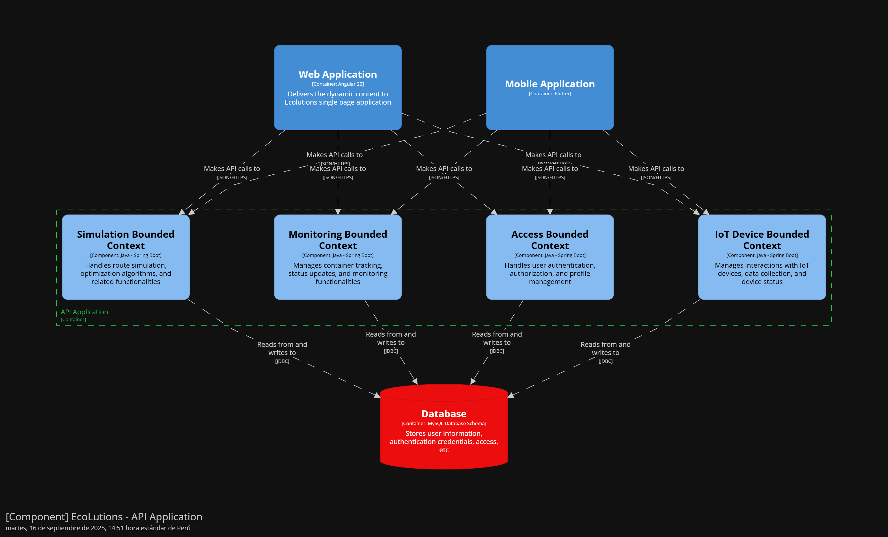

<body>
    

        
Universidad Peruana de Ciencias Aplicadas - Ingeniería de Software - 7 Ciclo

        
        
1ASI0732 - Diseño de Experimentos de Ingeniería de Software

        
Sección - 7491

        
Docente: Ing. Ivan Robles Fernández
   
        
Informe de Trabajo Final

        
Startup: EcoLutions

        
Producto: WasteTrack

    

    

        <h3 style="font-weight: bolder">Integrantes del equipo:</h3>
        <table style="width: fit-content">
            <tr>
                <th style="text-align:start;">Estudiante</th>
                <th style="text-align:center;">Código</th>
            </tr>
            <tr>
                <td style="text-align:start;">Gutiérrez Soto, Jhosepmyr Orlando</td>
                <td>202317638</td>
            </tr>
            <tr>
                <td style="text-align:start;">Hernández Tuiro, Eric Ernesto</td>
                <td>20221C857</td>
            </tr>
            <tr>
                <td style="text-align:start;">Ramirez Mestanza, Salim Ignacio</td>
                <td>20201E843</td>
            </tr>
            <tr>
                <td style="text-align:start;">Riva Rodríguez, Elmer Augusto</td>
                <td>202220829</td>
            <tr>
              <td style="text-align:start;">Sulca Gonzales, Paul Fernando</td>
              <td>20221C486</td>
            </tr>
        </table>
    

    
Septiembre 2025

</body>

# Registro de Versiones del Informe

| Versión | Fecha      | Autor                             | Descripción de modificación |
|---------|------------|-----------------------------------|-----------------------------|

# Project Report Collaboration Insights

En esta sección se documenta la colaboración del equipo en la elaboración del informe, mostrando evidencias gráficas de la actividad en GitHub y su coherencia con el registro de versiones.

* URL del repositorio del Project Report en la organización de GitHub del equipo:
* [https://github.com/EcoLutions/Report-Diseno-de-Experimentos-de-Ingenieria-de-Software](https://github.com/EcoLutions/Report-Diseno-de-Experimentos-de-Ingenieria-de-Software)

# Contenido

<!-- TOC -->
* [Registro de Versiones del Informe](#registro-de-versiones-del-informe)
* [Project Report Collaboration Insights](#project-report-collaboration-insights)
* [Contenido](#contenido)
* [Student Outcome](#student-outcome)
* [Capítulo I: Introducción](#capítulo-i-introducción)
  * [1.1. Startup Profile](#11-startup-profile)
    * [1.1.1. Descripción de la Startup](#111-descripción-de-la-startup)
    * [1.1.2. Perfiles de integrantes del equipo](#112-perfiles-de-integrantes-del-equipo)
  * [1.2. Solution Profile](#12-solution-profile)
    * [1.2.1. Antecedentes y problemática](#121-antecedentes-y-problemática)
    * [1.2.2. Lean UX Process](#122-lean-ux-process)
      * [1.2.2.1. Lean UX Problem Statements](#1221-lean-ux-problem-statements)
      * [1.2.2.2. Lean UX Assumptions](#1222-lean-ux-assumptions)
      * [1.2.2.3. Lean UX Hypothesis Statements](#1223-lean-ux-hypothesis-statements)
      * [1.2.2.4. Lean UX Canvas](#1224-lean-ux-canvas)
  * [1.3. Segmentos objetivos](#13-segmentos-objetivos)
* [Capítulo II: Requirements Elicitation & Analysis](#capítulo-ii-requirements-elicitation--analysis)
  * [2.1. Competidores](#21-competidores)
    * [2.1.1. Análisis competitivo](#211-análisis-competitivo)
    * [2.1.2. Estrategias y tácticas frente a competidores](#212-estrategias-y-tácticas-frente-a-competidores)
  * [2.2. Entrevistas](#22-entrevistas)
    * [2.2.1. Diseño de entrevistas](#221-diseño-de-entrevistas)
    * [2.2.2. Registro de entrevistas](#222-registro-de-entrevistas)
    * [2.2.3. Análisis de entrevistas](#223-análisis-de-entrevistas)
  * [2.3. Need finding](#23-need-finding)
    * [2.3.1. User personas](#231-user-personas)
    * [2.3.2. User Task Matrix](#232-user-task-matrix)
    * [2.3.3. User Journey Mapping](#233-user-journey-mapping)
    * [2.3.4. Empathy Mapping](#234-empathy-mapping)
    * [2.3.5. As-is Scenario Mapping](#235-as-is-scenario-mapping)
  * [2.4. Ubiquitous Language](#24-ubiquitous-language)
* [Capítulo III: Requirements Specification](#capítulo-iii-requirements-specification)
  * [3.1. To-Be Scenario Mapping](#31-to-be-scenario-mapping)
  * [3.2. User Stories](#32-user-stories)
  * [3.3. Product Backlog](#33-product-backlog)
  * [3.4. Impact Mapping](#34-impact-mapping)
* [Capítulo IV: Product Design](#capítulo-iv-product-design)
  * [4.1. Style Guidelines](#41-style-guidelines)
    * [4.1.1. General Style Guidelines](#411-general-style-guidelines)
    * [4.1.2. Web Style Guidelines](#412-web-style-guidelines)
    * [4.1.3. Mobile Style Guidelines](#413-mobile-style-guidelines)
      * [4.1.3.1. iOS Mobile Style Guidelines](#4131-ios-mobile-style-guidelines)
      * [4.1.3.2. Android Mobile Style Guidelines](#4132-android-mobile-style-guidelines)
  * [4.2. Information Architecture](#42-information-architecture)
    * [4.2.1. Organization Systems](#421-organization-systems)
    * [4.2.2. Labeling Systems](#422-labeling-systems)
    * [4.2.3. SEO Tags and Meta Tags](#423-seo-tags-and-meta-tags)
    * [4.2.4. Searching Systems](#424-searching-systems)
    * [4.2.5. Navigation Systems](#425-navigation-systems)
  * [4.3. Landing Page UI Design](#43-landing-page-ui-design)
    * [4.3.1. Landing Page Wireframe](#431-landing-page-wireframe)
    * [4.3.2. Landing Page Mock-up](#432-landing-page-mock-up)
  * [4.4. Mobile Applications UX/UI Design](#44-mobile-applications-uxui-design)
    * [4.4.1. Mobile Applications Wireframes](#441-mobile-applications-wireframes)
    * [4.4.2. Mobile Applications Wire flow Diagrams](#442-mobile-applications-wire-flow-diagrams)
    * [4.4.3. Mobile Applications Mock-ups](#443-mobile-applications-mock-ups)
    * [4.4.4. Mobile Applications User Flow Diagrams](#444-mobile-applications-user-flow-diagrams)
  * [4.5. Mobile Applications Prototyping](#45-mobile-applications-prototyping)
    * [4.5.1. Android Mobile Applications Prototyping](#451-android-mobile-applications-prototyping)
    * [4.5.2. iOS Mobile Applications Prototyping](#452-ios-mobile-applications-prototyping)
  * [4.6. Web Applications UX/UI Design](#46-web-applications-uxui-design)
    * [4.6.1. Web Applications Wireframes](#461-web-applications-wireframes)
    * [4.6.2. Web Applications Wire flow Diagrams](#462-web-applications-wire-flow-diagrams)
    * [4.6.3. Web Applications Mock-ups](#463-web-applications-mock-ups)
    * [4.6.4. Web Applications User Flow Diagrams](#464-web-applications-user-flow-diagrams)
  * [4.7. Web Applications Prototyping](#47-web-applications-prototyping)
  * [4.8. Domain-Driven Software Architecture](#48-domain-driven-software-architecture)
    * [4.8.1. Software Architecture Context Diagram](#481-software-architecture-context-diagram)
    * [4.8.2. Software Architecture Container Diagrams](#482-software-architecture-container-diagrams)
    * [4.8.3. Software Architecture Components Diagrams](#483-software-architecture-components-diagrams)
  * [4.9. Software Object-Oriented Design](#49-software-object-oriented-design)
    * [4.9.1. Class Diagrams](#491-class-diagrams)
    * [4.9.2. Class Dictionary](#492-class-dictionary)
  * [4.10. Database Design](#410-database-design)
    * [4.10.1. Relational/Non-Relational Database Diagram](#4101-relationalnon-relational-database-diagram)
* [Capítulo V: Product Implementation](#capítulo-v-product-implementation)
  * [5.1. Software Configuration Management](#51-software-configuration-management)
    * [5.1.1. Software Development Environment Configuration](#511-software-development-environment-configuration)
    * [5.1.2. Source Code Management](#512-source-code-management)
    * [5.1.3. Source Code Style Guide & Conventions](#513-source-code-style-guide--conventions)
    * [5.1.4. Software Deployment Configuration](#514-software-deployment-configuration)
  * [5.2. Product Implementation & Deployment](#52-product-implementation--deployment)
    * [5.2.1. Sprint Backlogs](#521-sprint-backlogs)
    * [5.2.2. Implemented Landing Page Evidence](#522-implemented-landing-page-evidence)
    * [5.2.3. Implemented Frontend-Web Application Evidence](#523-implemented-frontend-web-application-evidence)
    * [5.2.4. Implemented Native-Mobile Application Evidence](#524-implemented-native-mobile-application-evidence)
    * [5.2.5. Implemented Restful API and/or Serverless Backend Evidence](#525-implemented-restful-api-andor-serverless-backend-evidence)
    * [5.2.6. Restful API documentation](#526-restful-api-documentation)
    * [5.2.7. Team Collaboration Insights](#527-team-collaboration-insights)
  * [5.3. Video About-the-Product](#53-video-about-the-product)
* [Conclusiones](#conclusiones)
* [Bibliografía](#bibliografía)
* [Anexos](#anexos)
<!-- TOC -->

# Student Outcome

El curso contribuye al cumplimiento del Student Outcome ABET:

****ABET - EAC - Student Outcome 4****

**Criterio:** La capacidad de reconocer responsabilidades éticas y profesionales en situaciones de ingeniería y hacer juicios informados, que deben considerar el impacto de las soluciones de ingeniería en contextos globales, económicos, ambientales y sociales.

En el siguiente cuadro se describe las acciones realizadas y enunciados de conclusiones por parte del grupo, que permiten sustentar el haber alcanzado el logro del ABET – EAC - Student Outcome 4.

| **Criterio específico**                                                                                                                                           | **Acciones realizadas** | **Conclusiones** |
|-------------------------------------------------------------------------------------------------------------------------------------------------------------------|-------------------------|------------------|  
| **4.c.1 Reconoce responsabilidad ética y profesional en situaciones de ingeniería de software.**                                                                  |                         |                  |
| **4.c.2 Emite juicios informados considerando el impacto de las soluciones de ingeniería de software en contextos globales, económicos, ambientales y sociales.** |                         |                  |

# Capítulo I: Introducción

## 1.1. Startup Profile

### 1.1.1. Descripción de la Startup

EcoLutions es una startup peruana especializada en el desarrollo de soluciones IoT inteligentes para la optimización de la gestión de residuos sólidos urbanos. Fundada en 2025, nuestro enfoque se centra en revolucionar los sistemas tradicionales de recolección de basura mediante la implementación de tecnología de sensores avanzados, análisis de datos en tiempo real y algoritmos de optimización de rutas.
Nuestra misión es transformar la gestión de residuos sólidos en las ciudades peruanas, comenzando por Lima Metropolitana, a través de soluciones tecnológicas innovadoras que reduzcan costos operativos, mejoren la eficiencia del servicio y contribuyan a ciudades más limpias y sostenibles.

**Propuesta de Valor**

* Optimización inteligente: Algoritmos que combinan nivel de llenado y tiempo de permanencia para priorizar recolecciones
* Arquitectura híbrida: Procesamiento Edge para alertas inmediatas y Cloud para análisis avanzados
* Modelo B2B sostenible: Licencia anual fija que permite presupuestación municipal predecible
* Enfoque local: Soluciones adaptadas específicamente a las necesidades y regulaciones de distritos peruanos

**Visión**

Ser la empresa líder en soluciones IoT para gestión inteligente de residuos en Latinoamérica, contribuyendo al desarrollo de ciudades más eficientes, limpias y sostenibles.
Valores

* Innovación responsable: Tecnología que genera impacto social positivo
* Sostenibilidad: Compromiso con el medio ambiente y la eficiencia de recursos
* Transparencia: Datos abiertos que generen confianza en la gestión pública
* Colaboración: Trabajo conjunto con municipalidades y ciudadanía

### 1.1.2. Perfiles de integrantes del equipo

| Foto del participante                                                                       | Nombres y apellidos              | Código de estudiante | Carrera                | Conocimientos técnicos y habilidades                                                                                                                                                                                                                                                                                                |
|---------------------------------------------------------------------------------------------|----------------------------------|----------------------|------------------------|-------------------------------------------------------------------------------------------------------------------------------------------------------------------------------------------------------------------------------------------------------------------------------------------------------------------------------------|
|          | Eric Ernesto Hernández Tuiro     | 20221C857            | Ingeniería de Software | Especialista en desarrollo backend con Java/Spring Boot y diseño de arquitecturas de sistemas. Enfocado en tecnologías empresariales y soluciones eficientes. Será responsable de los servicios web, procesamiento de datos y desarrollo de APIs para la plataforma WasteTrack.                                                     |
|          | Elmer Augusto Riva Rodríguez     | 202220829            | Ingeniería de Software | Desarrollador con experiencia en Angular/Spring Boot y Vue.js/ASP.NET, enfocado en arquitecturas monolíticas y desarrollo de aplicaciones. Liderará el desarrollo de aplicaciones móviles para conductores y ciudadanos, garantizando interfaces intuitivas y funcionales.                                                          | 
|  | Jhosepmyr Orlando Gutiérrez Soto | 202317638            | Ingeniería de Software | Especialista en desarrollo full-stack con Java/Spring Boot y frameworks frontend como Angular y Vue.js. Experiencia en microservicios y servicios cloud (AWS, Azure, GCP). Aporta habilidades de liderazgo técnico, toma de decisiones y coordinación de equipos de desarrollo para la arquitectura general del sistema WasteTrack. | 

## 1.2. Solution Profile

### 1.2.1. Antecedentes y problemática

Esta sección presenta un análisis de la situación actual de la gestión de residuos sólidos en Lima Metropolitana. Se utiliza la técnica de las 5 W's y 2 H's para desglosar el problema, identificar a los actores involucrados, el contexto y, fundamentalmente, cuantificar su magnitud. El propósito es establecer una base fáctica sólida que justifique la necesidad y el enfoque de WasteTrack, nuestra solución tecnológica diseñada para abordar estas deficiencias.

**Análisis mediante la técnica de las 5 W's y 2 H's:**

* WHO - ¿Quién está afectado?:
  El problema impacta directamente a los habitantes de Lima Metropolitana, quienes generan más de 8,000 toneladas de residuos sólidos diariamente (Actualidad Ambiental, 2018). Involucra también a las 43 municipalidades distritales, responsables de la gestión, y a su personal operativo. De forma secundaria, afecta a recicladores y a las autoridades regulatorias como el Organismo de Evaluación y Fiscalización Ambiental (OEFA) y el Ministerio del Ambiente (MINAM).

* WHAT - ¿Cuál es el problema?:
  El problema central es la gestión ineficiente y reactiva de los residuos sólidos, caracterizada por rutas de recolección no optimizadas, una cobertura deficiente del servicio que deja puntos críticos de acumulación y altos costos operativos para los municipios. Esto deriva en un serio problema de salud pública y contaminación ambiental.

* WHERE - ¿Dónde ocurre?:
  El problema se manifiesta en toda Lima Metropolitana. Las zonas más críticas se concentran en distritos con alta densidad poblacional como Villa El Salvador (368.3 ton/día), San Juan de Lurigancho (1,026.5 ton/día) y Villa María del Triunfo (357.2 ton/día) (Infobae Perú, 2024b).

* WHEN - ¿Cuándo sucede?:
  La generación de residuos es continua (24/7), con picos durante fines de semana y temporadas festivas. La recolección se realiza principalmente en horarios nocturnos para evitar el tráfico, pero la falta de planificación provoca que los problemas de acumulación sean recurrentes y visibles durante el día.

* WHY - ¿Por qué persiste?:
  La persistencia del problema se debe a una combinación de factores:
  _Tecnológicos_: Ausencia de sistemas de monitoreo en tiempo real y planificación de rutas basada en métodos manuales obsoletos.
  _Administrativos_: Presupuestos insuficientes, una deficiente recaudación de arbitrios que afecta la sostenibilidad financiera del servicio (PUCP, 2022) y una limitada coordinación interdistrital.
  _Estructurales_: Crecimiento urbano no planificado y una cultura ciudadana con bajos índices de reciclaje, donde solo el 1% del material disponible se recicla formalmente (Actualidad Ambiental, 2018).

* HOW - ¿Cómo se manifiesta el problema?:
  El problema se evidencia a través de indicadores concretos. Lima Metropolitana genera más de 8,000 toneladas de residuos sólidos cada día (Actualidad Ambiental, 2018), y cerca del 35% de la población considera la acumulación de basura como el segundo problema ambiental que más los afecta (Infobae Perú, 2024b). Operativamente, se manifiesta en rutas de recolección redundantes y la existencia de 35 puntos críticos de acumulación tan solo en el Cercado de Lima (Infobae Perú, 2024a).

* HOW MUCH - ¿Cuál es la magnitud del impacto?:
  El impacto económico es masivo. El costo por tonelada recolectada varía entre S/120 y S/180 (PUCP, 2022). Sin optimización, se pierden recursos significativos; estudios de optimización de rutas sugieren un potencial de ahorro en costos de combustible de entre 20% y 40% (Zeo Route Planner, 2025). Adicionalmente, el 40% de los residuos de la capital terminan en botaderos informales (SNI, 2024), lo que agrava el costo ambiental y de salud pública.

**Diagrama de Ishikawa: Causas Raíz del Problema**

### 1.2.2. Lean UX Process

Esta sección aplica el Proceso Lean UX para estructurar la visión del negocio del proyecto WasteTrack. Se inicia con la formulación del problema, se desglosan las suposiciones fundamentales que sostienen el modelo de negocio y de producto, y finalmente se traducen estas suposiciones en hipótesis comprobables que guiarán el ciclo de desarrollo y validación.

#### 1.2.2.1. Lean UX Problem Statements

El estado actual de la gestión de residuos sólidos en Lima Metropolitana se basa en rutas de recolección fijas y procesos reactivos, los cuales no se adaptan a la dinámica diaria de generación de basura en una urbe de más de 10 millones de habitantes.

Lo que los métodos de gestión existentes no logran abordar es la falta de visibilidad y data en tiempo real sobre el estado de los contenedores. Esta carencia genera rutas ineficientes, desborde de basura en puntos críticos, un uso excesivo de recursos (combustible, personal, tiempo) y una creciente insatisfacción ciudadana.

Nuestro producto, WasteTrack, abordará esta brecha mediante el desarrollo de una plataforma IoT integral que monitorea el nivel de llenado y el tiempo de permanencia de los residuos en los contenedores, permitiendo a las municipalidades optimizar sus rutas de recolección de forma dinámica y proactiva.

El enfoque inicial del equipo serán las municipalidades de Lima Metropolitana, que enfrentan alta presión para mejorar la eficiencia de sus servicios públicos y reducir costos operativos, comenzando con un proyecto piloto en un distrito representativo para validar el modelo.

El equipo sabrá que ha tenido éxito cuando observe una reducción de al menos un 15% en los costos operativos de recolección, un incremento del 20% en la cobertura efectiva del servicio y una disminución del 50% en las quejas ciudadanas relacionadas con contenedores desbordados en las zonas de intervención.

#### 1.2.2.2. Lean UX Assumptions

Esta sección presenta las suposiciones fundamentales del proyecto, estructuradas en resultados de negocio, perfiles de usuario y resultados de usuario. Las suposiciones están ordenadas de manera implícita, priorizando las más críticas y riesgosas.

**Business Outcomes (Resultados de Negocio):**

Los resultados de negocio se establecen utilizando el framework AARRR (Pirate Metrics) para medir el éxito del producto y guiar las decisiones estratégicas. Se asume que se podrán alcanzar las siguientes métricas:
* Acquisition (Adquisición): El 30% de las municipalidades contactadas aceptarán una demostración del producto.
* Activation (Activación): El 50% de las municipalidades que reciban una demo firmarán un contrato para un proyecto piloto de 3 meses.
* Retention (Retención): El 75% de las municipalidades que completen el piloto se convertirán en clientes con un contrato anual.
* Revenue (Ingresos): Se logrará un Ingreso Anual por Contrato (ACV) promedio de S/ 60,000 por distrito.
* Referral (Recomendación): 1 de cada 3 municipalidades satisfechas referirá activamente la solución a otros distritos.

**Users (Usuarios):**

La identificación de usuarios se basa en el análisis del problema. Estas proto-personas representan los segmentos objetivo:

| Usuario               | Perfil                                     | Objetivos                                                                             | Obstáculos                                                                      |
|-----------------------|--------------------------------------------|---------------------------------------------------------------------------------------|---------------------------------------------------------------------------------|
| Jorge (Administrador) | 45 años, Gerente de Servicios a la Ciudad. | Reducir costos, eliminar quejas ciudadanas, modernizar la gestión.                    | Falta de datos, presión política, procesos burocráticos, resistencia al cambio. |
| Carlos (Conductor)    | 38 años, Conductor de camión recolector.   | Completar su ruta de forma eficiente, evitar sobrecargas, terminar su turno a tiempo. | Rutas ineficientes, tráfico impredecible, contenedores desbordados o vacíos.    |
| Maria (Ciudadana)     | 32 años, Vecina y madre de familia.        | Tener calles limpias, saber cuándo sacar la basura, sentirse segura en su comunidad.  | Servicio de recolección impredecible, falta de canales de información.          |

**User Outcomes (Resultados de Usuario)**

Estos son los resultados que los usuarios clave esperan lograr, categorizados en funcional, emocional y aspiracional.
* Administrador: Reducir costos y optimizar recursos (funcional), sentirse en control y proactivo (emocional), ser visto como un gestor público innovador (aspiracional).
* Conductor: Completar la ruta más rápido (funcional), sentirse menos frustrado y más eficiente (emocional), ser reconocido como un servidor público valioso (aspiracional).

#### 1.2.2.3. Lean UX Hypothesis Statements

Las hipótesis transforman las suposiciones más críticas en declaraciones testeables, priorizadas según su impacto y nivel de riesgo.

**Test (Alto valor, alto riesgo)**
* Hipótesis 1 (Riesgo de Valor):
  El equipo cree que implementando sensores en 20 contenedores y un dashboard de optimización para los administradores municipales se logrará una reducción significativa de los costos operativos. Se sabrá que esto es cierto cuando, al finalizar un piloto de 3 meses, se observe una disminución medible del 15% en el tiempo y combustible utilizados para la recolección en esos puntos específicos.

* Hipótesis 2 (Riesgo de Negocio):
  El equipo cree que presentando los resultados positivos del piloto a los decisores municipales se logrará demostrar un ROI claro que justifique la contratación del servicio. Se sabrá que esto es cierto cuando al menos 2 de 5 municipalidades contactadas firmen una carta de intención para un contrato anual post-piloto.

**Ship & Measure (Alto valor, bajo riesgo)**
* Hipótesis 3 (Riesgo de Adopción de Usuario):
  El equipo cree que diseñando una aplicación móvil intuitiva con rutas guiadas para los conductores de recolección se logrará una alta tasa de adopción de la nueva metodología. Se sabrá que esto es cierto cuando en pruebas de usabilidad, el 90% de los conductores completen sus tareas principales sin asistencia y califiquen la herramienta con un 4/5 o superior en facilidad de uso.

* Hipótesis 4 (Riesgo de Valor para el Ciudadano):
  El equipo cree que ofreciendo una aplicación móvil informativa a los ciudadanos se logrará mejorar su percepción sobre el servicio de limpieza. Se sabrá que esto es cierto cuando una encuesta post-lanzamiento muestre un aumento del 25% en el índice de satisfacción ciudadana en las zonas donde opera WasteTrack.

#### 1.2.2.4. Lean UX Canvas

El Lean UX Canvas sintetiza visualmente todos los elementos del proceso Lean UX en una sola página, facilitando la comprensión compartida del equipo y la toma de decisiones ágiles. A continuación se presenta la información condensada para cada sección del canvas:

## 1.3. Segmentos objetivos

Esta sección describe los perfiles de los tres segmentos de usuarios clave identificados en el dominio del problema de la gestión de residuos sólidos en Lima Metropolitana. La caracterización de cada segmento se respalda con datos estadísticos para contextualizar sus necesidades, desafíos y el entorno en el que operan.

**Segmento 1: Administrador de Limpieza Municipal**

**Descripción:**  
Este segmento representa al cliente principal y usuario estratégico de la plataforma WasteTrack. Son funcionarios o gestores públicos de nivel medio a alto, responsables de la planificación, ejecución y supervisión de los servicios de limpieza pública en uno de los 43 distritos de Lima.  
Su principal motivación es cumplir con los objetivos de gestión (eficiencia, cobertura, presupuesto) mientras manejan la presión política y las quejas ciudadanas. Actualmente, su toma de decisiones es mayormente reactiva debido a la falta de datos en tiempo real, lo que les genera frustración y limita su capacidad para innovar.

**Características Demográficas (Perfil Inferido):**

| Aspecto                  | Detalle                                                                |
|--------------------------|------------------------------------------------------------------------|
| Rango de Edad            | 40 - 60 años                                                           |
| Nivel Educativo          | Universitario o superior (Ingeniería, Administración Pública u afines) |
| Entorno Laboral          | Oficinas municipales, ambiente burocrático con procesos establecidos   |
| Familiaridad Tecnológica | Manejo avanzado de ofimática; limitada experiencia con analítica e IoT |

**Datos Estadísticos de Sustento:**
- El 40% de los residuos de la capital terminan en botaderos informales (SNI, 2024).
- Costo por tonelada de basura recolectada: entre S/ 120 y S/ 180 (PUCP, 2022).
- El 35% de los ciudadanos considera la acumulación de basura como el 2º problema ambiental más grave (Infobae Perú, 2024b).

---

**Segmento 2: Conductor de Recolección**

**Descripción:**  
Este segmento corresponde al usuario final operativo, pieza clave en la ejecución del servicio. Son trabajadores de primera línea que operan los vehículos recolectores y siguen las rutas diarias.  
Su principal objetivo es completar la jornada de trabajo de forma eficiente y segura. Se sienten frustrados por rutas ineficientes, tráfico de la ciudad, fallas mecánicas y contenedores desbordados o vacíos.

**Características Demográficas (Perfil Inferido):**

| Aspecto                  | Detalle                                                                                                            |
|--------------------------|--------------------------------------------------------------------------------------------------------------------|
| Rango de Edad            | 25 - 50 años                                                                                                       |
| Nivel Educativo          | Secundaria completa o educación técnica                                                                            |
| Entorno Laboral          | Trabajo de campo, operando vehículos pesados, a menudo en turnos nocturnos                                         |
| Familiaridad Tecnológica | Uso cotidiano de smartphones y apps (WhatsApp, Facebook, Waze). Capacidad de adopción de apps laborales intuitivas |

**Datos Estadísticos de Sustento:**
- Responsables de manejar más de 8,000 toneladas de residuos diarios en Lima (Actualidad Ambiental, 2018).
- Enfrentan puntos críticos de acumulación, como los 35 identificados en el Cercado de Lima (Infobae Perú, 2024a).

---

**Segmento 3: Ciudadano / Vecino Residente**

**Descripción:**  
Este segmento representa al beneficiario final del servicio y la principal fuente de validación social del proyecto.  
Abarca a toda la población residente de Lima Metropolitana, con la necesidad de vivir en un entorno limpio, seguro y saludable.  
Desean un servicio predecible y con canales de información transparentes, pero sienten desconfianza hacia la gestión municipal por la irregularidad del servicio.

**Características Demográficas (Generales de Lima):**

| Aspecto                  | Detalle                                                    |
|--------------------------|------------------------------------------------------------|
| Rango de Edad            | Todos los rangos                                           |
| Nivel Socioeconómico     | Diverso, todos los niveles de la capital                   |
| Entorno                  | Alta densidad poblacional, diversidad de contextos urbanos |
| Familiaridad Tecnológica | Alta penetración de smartphones en todos los segmentos     |

**Datos Estadísticos de Sustento:**
- Generan los miles de toneladas de residuos diarios y son los más afectados por una mala gestión (Actualidad Ambiental, 2018).
- El 35% de los ciudadanos ya considera la basura un problema prioritario en su vida diaria (Infobae Perú, 2024b).

# Capítulo II: Requirements Elicitation & Analysis

## 2.1. Competidores

### 2.1.1. Análisis competitivo

### 2.1.2. Estrategias y tácticas frente a competidores

## 2.2. Entrevistas

### 2.2.1. Diseño de entrevistas

### 2.2.2. Registro de entrevistas

### 2.2.3. Análisis de entrevistas

## 2.3. Need finding

### 2.3.1. User personas

### 2.3.2. User Task Matrix

### 2.3.3. User Journey Mapping

### 2.3.4. Empathy Mapping

### 2.3.5. As-is Scenario Mapping

## 2.4. Ubiquitous Language

# Capítulo III: Requirements Specification

## 3.1. To-Be Scenario Mapping

## 3.2. User Stories

## 3.3. Product Backlog

## 3.4. Impact Mapping

# Capítulo IV: Product Design
En esta sección, presentaremos el diseño del producto como parte integral del sistema. El diseño de producto abarcará los componentes físicos como el software. Además, se va a detallar como los componentes influyen en la interacción humano-computadora

## 4.1. Style Guidelines
Esta sección sentará las bases para contar con un repositorio para el formato visual de nuestros productos. Dicho proceso es necesario para tener una consistencia visual en los productos tanto landing, web como mobile.

### 4.1.1. General Style Guidelines
### Branding
#### Descripción general de la marca
<b>WasteTrack</b> es una startup tecnológica que optimiza la recolección de basura urbana mediante sensores IoT en los contenedores. La plataforma monitorea en tiempo real los niveles de llenado para crear rutas de recolección eficientes, permitiendo a los municipios gestionar cada contenedor y a los ciudadanos seguir el recorrido de los camiones. Su objetivo es reducir costos, evitar desbordes y promover ciudades más sostenibles.
#### Misión:
Facilitar la gestión inteligente de los residuos urbanos mediante tecnología avanzada, optimizando las rutas de recolección y promoviendo la participación activa de los ciudadanos en el proceso de limpieza urbana. Buscamos empoderar a los municipios con herramientas eficaces para tomar decisiones basadas en datos, mientras incentivamos a los ciudadanos a participar activamente en el mantenimiento de una ciudad más limpia. 
#### Visión:
Convertirnos en la plataforma líder de gestión de residuos urbanos, utilizando tecnología de vanguardia para mejorar la sostenibilidad y la eficiencia en las ciudades. Aspiramos a crear una red global de comunidades colaborativas que utilicen WasteTrack para optimizar sus servicios de recolección de basura, contribuyendo a un modelo de ciudad más limpia, eficiente y transparente.
#### Producto
Nuestro primer producto es una plataforma web y móvil que integra sensores IoT en los contenedores de basura para monitorear en tiempo real sus niveles de llenado. La plataforma utiliza estos datos para optimizar las rutas de recolección, permitiendo a los municipios gestionar eficientemente cada contenedor y a los ciudadanos seguir el recorrido de los camiones de basura. Además, ofrece funcionalidades para reportar incidencias y recibir notificaciones, fomentando la participación ciudadana en la gestión de residuos.
#### Nombre del producto
El nombre de nuestro producto es "WasteTrack", que refleja su enfoque en la gestión eficiente de residuos ("Waste") y el seguimiento en tiempo real de los contenedores y rutas de recolección ("Track"). 
#### Logo del producto
  

El logo de WasteTrack representa la fusión de la gestión de residuos y la tecnología inteligente a través de su isotipo: un contenedor de basura estilizado con ondas de señal, enmarcado en un círculo verde. Debajo, el nombre de la marca utiliza una tipografía sans-serif moderna y legible en un tono verde oscuro. La paleta de colores, dominada por verdes, evoca sostenibilidad y ecología, mientras que el diseño general comunica de manera clara los valores de eficiencia, innovación y responsabilidad ambiental de la marca.
#### Color
La gama de colores principal corresponde a tonalidades de blanco, que se relacionan principalmente a limpieza y pulcritud, ambos términos alineados a nuestra visión y misión. La gama abarca también a tonos grises claros, donde la tonalidad más clara se asocia a la sofisticación, mientras que la más oscura va alineada con la formalidad y el profesionalismo. Esta gama nos permite mostrar un diseño limpio, pero procurando siempre formalidad, claridad y transparencia. Los colores seleccionados son: #FCFFF7 (Blanco hueso), #F2F5ED (Gris muy claro), #C9CCC4 (Gris claro), #2C2C2C (Gris oscuro) y #000000 (Negro). 

Por otro lado, los tonos de verde seleccionados para la aplicación se asocian a nuestro objetivo principal tanto como startup como aplicación: Asegurar un futuro mas limpio a través del cuidado del medio ambiente. El color verde siempre esta asociado a la vida y a la naturaleza, por lo que es una elección ideal para combinarlo con el color blanco y realizar un contraste entre ambos, mostrando así un balance entre el cuidado de la naturaleza manteniendo siempre formalidad y profesionalismo. Los colores seleccionados son: #C5FFD8 (Verde claro), #60B577 (Verde medio), #2E854B (Verde oscuro), #6AB04C (Verde vibrante) y #005300 (Verde profundo).

#### Tipografía
Se ha seleccionado un estilo roboto para la tipografía utilizada en la aplicación la cual comprende una serie de tamaños seleccionados cuidadosamente para que el usuario pueda ver la información y apartados de mayor relevancia de la aplicación. En caso el texto este mostrado en secciones con un fondo con tonalidad oscura, el color de texto pasará a ser blanco, siguiendo la misma fuente, tamaño y peso según lo establecido.

#### Tono de comunicación
El tono de comunicación adoptará un enfoque serio, formal, respetuoso y sereno. Este tono refuerza la percepción de profesionalismo, que es esencial en un sistema que gestiona servicios públicos. Al mantener un tono formal, se transmite credibilidad a los usuarios, asegurándoles que están interactuando con una plataforma confiable y bien estructurada. Además, el respeto en la comunicación es fundamental para fomentar una relación positiva con los usuarios, promoviendo la colaboración y el compromiso con la gestión eficiente de residuos. La serenidad en el tono ayuda a crear una experiencia de usuario agradable, lo que es crucial para mantener la atención y satisfacción del usuario en un entorno digital.

### 4.1.2. Web Style Guidelines
#### Componentes
#### Tipografía
El sistema de tipografía define la jerarquía visual de la aplicación. Utiliza la fuente 'Inter' para garantizar legibilidad y una apariencia moderna. Se establecen estilos claros para encabezados (H1 a H4), párrafos, texto secundario y enlaces, asegurando consistencia en toda la interfaz. En una implementación con Vue, estas clases de Tailwind CSS se aplicarían directamente en las plantillas para mantener un estilo coherente y escalable.

#### Botones
Este componente define un conjunto de botones de acción con tres variantes: primario, secundario y de acción en tabla. Será implementado como un único componente reutilizable en Vue que acepta propiedades (props) para modificar su estilo y tamaño. El botón primario se usará para llamadas a la acción principales, el secundario para acciones alternativas, y la variante de tabla para operaciones contextuales dentro de filas de datos.

#### Campos de formulario
Este componente agrupa varios tipos de campos de entrada, como texto, email, contraseña, select, textarea y un estado deshabilitado. Se implementará como un componente base en Vue, personalizable a través de props para cambiar su tipo (type), placeholder, label y estado. Su diseño minimalista y funcional asegura una experiencia de usuario clara al capturar información en formularios.

#### Barra lateral (Administrador)
Este componente es un menú de navegación vertical diseñado para el panel de administración. Incluye un espacio para el logo, enlaces de navegación con íconos, y una sección de perfil y cierre de sesión en la parte inferior. Implementado en Vue, utilizará vue-router para gestionar las rutas de la aplicación, con un estado activo que resalta la sección actual, ofreciendo una navegación intuitiva y organizada.

#### Encabezado de página
El componente de encabezado de página muestra el título de la vista actual y la información del usuario que ha iniciado sesión. Implementado en Vue, este componente recibirá el título de la página como una prop para hacerlo dinámico y mostrará un avatar y el nombre del usuario, sirviendo como un punto de referencia constante en la parte superior de la interfaz.

#### Tabla de datos
Este componente se utilizará para mostrar información de manera estructurada en filas y columnas. Incluye una cabecera (thead) para los títulos y un cuerpo (tbody) para los datos, además de una columna dedicada para botones de acción. Se puede implementar utilizando una librería como PrimeVue con su componente <DataTable> para añadir fácilmente funcionalidades avanzadas como ordenación, paginación y filtros.

#### Ventana modal
Este componente es una ventana emergente (modal) que se superpone al contenido principal para solicitar una confirmación del usuario. Incluye un título, un mensaje descriptivo y botones de acción como "Cancelar" y "Aceptar". En Vue, se puede implementar utilizando el componente <Dialog> de PrimeVue o crearlo desde cero, gestionando su visibilidad con una variable de estado para controlar cuándo debe mostrarse.

#### Notificación toast
El componente de notificación toast se utiliza para mostrar mensajes cortos y no intrusivos sobre el resultado de una acción (por ejemplo, "Éxito al guardar"). Aparece en una esquina de la pantalla y desaparece automáticamente. En Vue, se puede gestionar eficientemente con librerías como vue-toastification para manejar colas de notificaciones y diferentes estados (éxito, error, advertencia).

#### Tarjeta de métrica
Este componente es una tarjeta simple diseñada para mostrar un dato o indicador clave (KPI) de forma destacada en un dashboard. Su diseño minimalista se centra en un valor numérico grande y una etiqueta descriptiva. Como componente de Vue, recibirá el dato y la etiqueta como props para ser reutilizado fácilmente en cualquier panel de control.

#### Tarjeta de gráfico
Es un contenedor diseñado específicamente para albergar visualizaciones de datos, como gráficos de barras o líneas. Define un área con un título claro donde se puede renderizar un gráfico. En una aplicación Vue, este componente actuaría como un wrapper, integrando librerías de gráficos como Chart.js o ApexCharts a través de sus respectivos adaptadores para Vue.

#### Tarjeta de estado vacío
Este componente se muestra cuando no hay datos disponibles en una sección. Proporciona un mensaje claro al usuario explicando la situación e incluye un botón de llamada a la acción para guiarlo sobre cómo proceder (por ejemplo, "Crear nuevo colaborador"). Es fundamental para una buena experiencia de usuario, evitando pantallas en blanco y confusas.

### 4.1.3. Mobile Style Guidelines
Estos componentes son la base visual de la aplicación móvil y se han diseñado para ser consistentes en ambas plataformas (iOS y Android). Su implementación se realizará como un conjunto de componentes reutilizables en un framework multiplataforma como Flutter, garantizando una experiencia de marca unificada.

Define la jerarquía de texto para las pantallas móviles, estableciendo tamaños y pesos para títulos de pantalla, títulos de sección, cuerpo de texto y textos de ayuda. Utiliza la fuente 'Inter' para una legibilidad óptima en pantallas pequeñas.

El sistema de botones incluye una variante primaria para acciones principales, una secundaria para opciones alternativas, y un botón de selección (tipo chip o segmented control) para alternar entre estados activo e inactivo.

Es un componente de entrada de texto con un diseño limpio que incluye un label y un placeholder. Contempla un estado de error, resaltando el borde para notificar al usuario sobre datos incorrectos, garantizando una validación clara en los formularios.

Se definen dos tipos de tarjetas. La Tarjeta de Selección combina un ícono, título y subtítulo, ideal para menús o listas de opciones. La Tarjeta de Información es más simple y se usa para mostrar datos clave de manera concisa, como el estado de un contenedor.

Este grupo incluye la Notificación en Lista, diseñada para mostrar actualizaciones o mensajes dentro de una lista con su título, descripción y marca de tiempo. También define los Indicadores de Página (puntos), utilizados comúnmente en carruseles o flujos de onboarding para mostrar el progreso.

Este componente se utiliza para comunicar estados importantes que ocupan toda la pantalla, como pantallas de carga, error, o estados vacíos (empty states). Incluye un ícono, un título y un mensaje descriptivo para guiar al usuario.

#### 4.1.3.1. iOS Mobile Style Guidelines
Para ofrecer una experiencia nativa y familiar a los usuarios de iOS, los siguientes componentes se deben implementar siguiendo las "Human Interface Guidelines" de Apple. Se recomienda el uso de componentes nativos de SwiftUI.
- Barra de Navegación Superior: Este componente presenta un título centrado y un botón de "Atrás" a la izquierda, que combina un ícono de chevron con texto. Esta estructura es un patrón estándar en iOS y se implementa nativamente con NavigationView en SwiftUI. 
- Barra de Pestañas (Tab Bar): Es la barra de navegación principal en la parte inferior de la pantalla. Se caracteriza por su fondo translúcido con efecto blur. Los íconos de las pestañas inactivas no llevan texto, mientras que la pestaña activa se resalta con un color y muestra su etiqueta correspondiente. Se implementa con el componente TabView.

- 

#### 4.1.3.2. Android Mobile Style Guidelines
Estos componentes se basan en los principios de Material Design para asegurar una integración perfecta con el ecosistema Android. Su implementación se recomienda utilizando los componentes de Jetpack Compose.
- Barra de Aplicación Superior (Top App Bar): A diferencia de iOS, la barra de navegación superior de Android alinea el título a la izquierda, justo después del ícono de navegación (flecha para retroceder o ícono de "hamburguesa"). Este componente se implementa con TopAppBar en Jetpack Compose.
- Barra de Navegación Inferior: Este componente de navegación inferior se caracteriza por tener un fondo sólido y mostrar siempre las etiquetas de texto para todos los íconos, tanto para la pestaña activa como para las inactivas, facilitando el reconocimiento de cada sección. Se implementa con el componente NavigationBar.

## 4.2. Information Architecture

### 4.2.1. Organization Systems
Para asegurar una experiencia de usuario clara, intuitiva y eficiente, la arquitectura de información de la plataforma se ha estructurado utilizando una combinación de sistemas de organización visual y esquemas de categorización de contenido. A continuación, se detalla cómo se aplica cada sistema según el grupo de información y el perfil de usuario.

#### Ciudadanos

#### Administradores municipales

#### Choferes de camión de basura

Los diagramas presentados anteriormente ilustran la arquitectura de la información y la estructura de navegación para cada uno de los tres perfiles de usuario definidos: Ciudadano, Colaborador Municipal (Conductor) y Colaborador Municipal (Administrador).

Estos mapas de sitio jerárquicos sirven como una representación visual de los sistemas de organización aplicados. Muestran las vistas principales disponibles para cada usuario, las acciones que pueden realizar y la relación lógica entre las distintas funcionalidades. Esta estructura visual sienta las bases para la organización jerárquica y secuencial que se detalla a continuación.

#### Organización visual del contenido
La disposición visual de la información se ha diseñado para guiar al usuario de manera lógica a través de la interfaz.

- Organización Jerárquica (Visual Hierarchy): Este es el principal sistema de organización para la estructura general de la aplicación, especialmente en el panel del Administrador. La información se organiza desde lo general a lo específico, creando una jerarquía clara. Como se puede observar en el diagrama de flujo del "Colaborador Municipal - Administrador", esta jerarquía se manifiesta de la siguiente manera:
  - Nivel 1 (Punto de entrada): El Dashboard actúa como la vista principal y el nivel más alto de la jerarquía, ofreciendo un resumen de la información más relevante. 
  - Nivel 2 (Categorías principales): Desde el Dashboard, el usuario puede navegar a las secciones principales de la aplicación, que funcionan como categorías temáticas: Gestión de Rutas, Dispositivos IoT, Colaboradores, Reportes Ciudadanos y Perfil y Cierre. 
  - Nivel 3 (Acciones y vistas de detalle): Dentro de cada categoría, el usuario accede a vistas y acciones más específicas. Por ejemplo, dentro de Colaboradores, se encuentran las opciones Ver Lista de Colaboradores, Invitar Colaborador y Editar Colaborador.
- Organización secuencial (Step-by-step): Este sistema se aplica a todos los flujos de trabajo donde el usuario debe completar una tarea específica. El diseño guía al usuario a través de una serie de pasos lógicos y predefinidos para evitar errores y reducir la carga cognitiva. Ejemplos claros, visibles en los diagramas de flujo, incluyen:
  - Registro de una municipalidad: El flujo Registro de Municipalidad -> Dashboard es una secuencia lineal para incorporar a un nuevo usuario administrativo. 
  - Gestión de un reporte ciudadano: El administrador sigue la secuencia Ver Bandeja de Entrada -> Ver Detalle de Reporte -> Cambiar Estado, culminando en un Feedback de Éxito. Este enfoque paso a paso asegura que las tareas se completen de manera ordenada y eficiente.

#### Esquemas de categorización de contenido
Para agrupar y presentar la información de manera coherente, se utilizan los siguientes esquemas de categorización:
- Según Audiencia (Grupos de usuarios): Este es el esquema de organización más fundamental de toda la plataforma. La funcionalidad total se ha segmentado en tres flujos completamente distintos, cada uno diseñado para una audiencia específica:
  1. Ciudadano (Móvil y Web): Acceso a funciones públicas como visualización de mapas y creación de reportes.
  2. Conductor (Colaborador Móvil): Herramientas enfocadas exclusivamente en la ejecución de rutas de recolección.
  3. Administrador (Colaborador Web): Acceso completo a todas las funciones de gestión, configuración y monitoreo. 
  Esta separación garantiza que la interfaz de cada usuario sea relevante, simple y esté libre de información o herramientas innecesarias para su rol.
- Por Tópicos: Dentro del panel de Administración, la navegación principal se organiza por temas. El menú lateral agrupa toda la información y las herramientas en categorías lógicas (Gestión de Rutas, Dispositivos IoT, Colaboradores, etc.). Esto permite al administrador localizar rápidamente la función que necesita, ya que toda la información relacionada con un tema específico se encuentra en un único lugar.
- Cronológico: Este esquema se aplicará en todas las vistas que muestren listas de eventos o entradas dinámicas, como la bandeja de Reportes Ciudadanos o un futuro panel de notificaciones. Los elementos se ordenarán por fecha, mostrando los más recientes primero para asegurar que el administrador tenga acceso inmediato a la información más actualizada y relevante.
- Alfabético: Para facilitar la búsqueda y el escaneo en listas que pueden volverse extensas, se utilizará un esquema de organización alfabético. Esto se aplicará, por ejemplo, en la Lista de Colaboradores o en la Lista de Dispositivos, permitiendo al administrador encontrar un ítem específico de manera rápida y predecible.

### 4.2.2. Labeling Systems
Para garantizar que los usuarios puedan navegar por la plataforma de manera eficiente y comprender la información presentada sin ambigüedad, se ha desarrollado un sistema de etiquetado consistente. El objetivo principal de este sistema es representar los datos y las acciones con la máxima simplicidad, utilizando un lenguaje claro para evitar la confusión.

Las etiquetas se han diseñado considerando el contexto y las necesidades de cada perfil de usuario.

#### **Etiquetas de navegación principal**
Representan los conjuntos de información más grandes y sirven como puntos de anclaje para la navegación.
* **Aplicación Ciudadano (móvil y web):** Se utilizan etiquetas universalmente reconocibles como **Mapa**, **Reportar** y **Notificaciones**. Estas etiquetas de una sola palabra asocian inmediatamente la sección con su funcionalidad principal: visualizar información geoespacial o iniciar el proceso de creación de un reporte.
* **Aplicación Conductor (colaborador móvil):** Las etiquetas están orientadas a tareas específicas de su rol, como **Hoja de Ruta** y **Perfil**. La etiqueta **Hoja de Ruta** crea una asociación directa con su lista de tareas del día, agrupando todas las paradas y acciones relacionadas con su trabajo de recolección.
* **Aplicación Administrador (colaborador web):** Se emplea un sistema de etiquetado temático y descriptivo. Etiquetas como **Dashboard**, **Gestión de Rutas**, **Dispositivos IoT**, **Colaboradores** y **Reportes Ciudadanos** asocian cada sección con un conjunto completo de herramientas de administración. El uso de la palabra "Gestión" establece en la mente del usuario que dentro de esa sección encontrará funcionalidades para crear, visualizar, editar y monitorear los elementos correspondientes, sin necesidad de aglomerar todas las opciones en el menú principal.

#### **Etiquetas de acciones (Botones y enlaces)**
Las etiquetas para elementos interactivos se han estandarizado para ser claras, predecibles y orientadas a la acción.
* **Consistencia Verbo-Sustantivo:** La mayoría de las acciones principales se etiquetan con un formato de verbo imperativo, como **Enviar Reporte**, **Generar Ruta**, **Invitar Colaborador** o **Guardar Cambios**. Esta consistencia ayuda al usuario a entender inmediatamente el resultado de su interacción.
* **Concisión:** En contextos donde el espacio es limitado, como en las tablas de datos, se utilizan etiquetas cortas y directas. Por ejemplo, la etiqueta **Ver Detalles** en la lista de reportes asocia la acción con la apertura de una vista más completa que contendrá toda la información del reporte (mapa, foto, comentarios), evitando sobrecargar la tabla con datos innecesarios. De igual manera, **Editar** o **Configurar** comunican una acción específica sin ambigüedad.

#### **Etiquetas de contenido y datos**
Para la representación de datos dentro de formularios, tablas y vistas de detalle, se utilizan etiquetas descriptivas breves que definen claramente la información mostrada. Encabezados como **Nivel de Llenado**, **Estado del Dispositivo** o **Rol** son consistentes a través de toda la plataforma, asegurando que el usuario pueda escanear y comprender la información rápidamente, independientemente de la sección en la que se encuentre.
### 4.2.3. SEO Tags and Meta Tags

A continuación se detallan los valores para las etiquetas SEO y Meta Tags recomendadas para las páginas clave del proyecto.

#### 1. Landing Page

El objetivo de esta página es atraer, informar y convertir a nuevos usuarios (municipios y ciudadanos). Por lo tanto, las etiquetas están optimizadas para motores de búsqueda públicos como Google.

* **Title:**
  * **Valor:** `WasteTrack | Gestión Inteligente de Residuos para Ciudades Modernas`
  * **Descripción:** Es conciso, incluye el nombre de la marca al inicio y las palabras clave principales ("Gestión Inteligente de Residuos", "Ciudades Modernas"). Tiene una longitud ideal para una buena visualización en los resultados de búsqueda.

* **Meta Tag Description:**
  * **Valor:** `Transforma la gestión de residuos de tu ciudad con WasteTrack. Usamos sensores IoT y optimización de rutas para una recolección de basura eficiente y sostenible. ¡Descubre más!`
  * **Descripción:** Ofrece un resumen atractivo de la propuesta de valor, utilizando palabras clave secundarias ("sensores IoT", "optimización de rutas", "recolección de basura") y finalizando con una llamada a la acción.

* **Meta Tag Keywords:**
  * **Valor:** `gestión de residuos, contenedores inteligentes, recolección de basura, optimización de rutas, IoT, ciudades inteligentes, sostenibilidad, software municipal, WasteTrack`
  * **Descripción:** Agrupa los términos de búsqueda más relevantes para el servicio. Aunque su peso en el SEO moderno ha disminuido, sigue siendo una buena práctica para contextualizar el contenido de la página.

* **Meta Tag Author:**
  * **Valor:** `WasteTrack`
  * **Descripción:** Identifica al creador o propietario del contenido, en este caso, el nombre del producto o la startup.

#### 2. Aplicación Web

Estas páginas no están destinadas a ser indexadas por motores de búsqueda públicos, ya que requieren autenticación. El objetivo aquí es la experiencia de usuario, especialmente en los títulos que se muestran en las pestañas del navegador.

* **Title (Estructura Dinámica):**
  * **Valor:** `[Nombre de la Vista Actual] - WasteTrack`
  * **Descripción:** Se utiliza una estructura dinámica donde el título de la página específica precede al nombre de la marca. Esto ayuda a los usuarios a identificar rápidamente qué pestaña corresponde a qué tarea.
  * **Ejemplos para Administrador:**
    * `Dashboard - WasteTrack`
    * `Gestión de Contenedores - WasteTrack`
    * `Rutas Activas - WasteTrack`
  * **Ejemplos para Ciudadano:**
    * `Mapa de Recolección - WasteTrack`
    * `Mis Reportes - WasteTrack`

* **Meta Tag Description:**
  * **Valor:** `Plataforma de WasteTrack para la gestión y monitoreo en tiempo real de la recolección de residuos urbanos.`
  * **Descripción:** Se puede usar una descripción general para todas las páginas internas de la aplicación, ya que su propósito no es el SEO público. Describe la función principal de la plataforma.

* **Meta Tag Keywords:**
  * **Valor:** `dashboard, monitoreo IoT, rutas, reportes de ciudadanos, gestión municipal, nivel de llenado, sensores, mapa de recolección`
  * **Descripción:** Incluye términos relacionados con las funcionalidades internas de la aplicación.

* **Meta Tag Author:**
  * **Valor:** `WasteTrack`
  * **Descripción:** Mantiene la consistencia de la marca.

### 4.2.4. Searching Systems
Para evitar que los usuarios se sientan abrumados por el volumen de información, la plataforma integra sistemas de búsqueda contextuales y eficientes en sus aplicaciones web. El objetivo es proporcionar medios de ayuda que permitan a los usuarios localizar datos específicos de manera rápida y precisa.

A continuación, se especifican las opciones de búsqueda y filtrado para cada aplicación.

#### **1. Aplicación Web del Ciudadano**

En esta aplicación, el principal sistema de búsqueda se encuentra en el flujo inicial de selección de la municipalidad.

* **Opción de Búsqueda:** Se ofrece una única barra de búsqueda textual con el placeholder `"Buscar municipalidad..."`.
* **Funcionamiento:** La búsqueda se activa en tiempo real a medida que el usuario escribe. No es necesario presionar "Enter" para ver los resultados.
* **Filtros:** No se aplican filtros adicionales en este caso, ya que es una búsqueda directa por nombre.
* **Visualización de Resultados:** La lista de municipalidades se filtra dinámicamente, mostrando únicamente aquellas cuyo nombre coincide con el texto ingresado. Esto reduce una lista potencialmente larga a unas pocas opciones relevantes, facilitando una selección rápida y sin errores.

#### **2. Aplicación Web de Administración**

La aplicación de administración, al manejar un volumen de datos considerablemente mayor, implementa sistemas de búsqueda y filtrado en todas sus secciones principales que contienen tablas de datos (Colaboradores, Dispositivos IoT y Reportes Ciudadanos).

* **Opción de Búsqueda General:** Cada sección cuenta con una barra de búsqueda textual que permite al administrador buscar por identificadores clave como nombre, email o ID del dispositivo.
* **Filtros Contextuales:** Para refinar las búsquedas, se proporcionan filtros específicos para cada tipo de dato:
  * **En la sección de Colaboradores:** El usuario podrá filtrar la lista por **Rol** (ej. "Conductor", "Administrador") y por **Estado** ("Activo", "Inactivo").
  * **En la sección de Dispositivos IoT:** Se ofrecerán filtros por **Estado del dispositivo** ("Encendido", "Apagado", "Mantenimiento") y, potencialmente, por alertas como **Batería Baja**.
  * **En la sección de Reportes Ciudadanos:** El administrador podrá filtrar los reportes por **Tipo de Incidencia** ("Contenedor Lleno", "Basura Fuera", etc.) y por **Estado** ("Pendiente", "Solucionado").
* **Visualización de Resultados:** Al aplicar una búsqueda o un filtro, la tabla de datos se actualizará instantáneamente para mostrar solo las filas que cumplen con los criterios seleccionados. Los filtros activos se mostrarán como etiquetas visuales encima de la tabla, permitiendo al usuario saber en todo momento qué subconjunto de datos está visualizando.

### 4.2.5. Navigation Systems

El sistema de navegación de la plataforma está diseñado para ser predecible, consistente y contextual, permitiendo a los usuarios moverse a través del contenido con confianza y cumplir sus metas de manera eficiente. Se han implementado diferentes técnicas de navegación adaptadas a cada producto digital (Landing Page, Aplicaciones Web y Móviles) y a las necesidades específicas de cada perfil de usuario.

#### **Sistemas de Navegación Global**

Estos son los mecanismos principales y persistentes que el usuario utiliza para moverse entre las secciones principales de la aplicación.

* **Aplicaciones Web (Ciudadano y Administrador):** La navegación se estructura en torno a una barra de navegación lateral persistente (Sidebar). Este componente siempre está visible en el lado izquierdo de la pantalla, proporcionando acceso constante a las funcionalidades clave como **Mapa** y **Notificaciones** para el ciudadano, y **Dashboard**, **Gestión de Rutas**, **Dispositivos IoT**, **Colaboradores** y **Reportes Ciudadanos** para el administrador. El enlace de la sección activa siempre se resalta visualmente, lo que sirve como un fuerte indicador de ubicación y ayuda al usuario a saber dónde se encuentra dentro de la arquitectura del sitio.

* **Aplicaciones Móviles (Ciudadano y Conductor):** La navegación principal se basa en una barra de pestañas inferior (Bottom Tab Bar). Este patrón es nativo de los sistemas operativos móviles y ofrece un acceso rápido y ergonómico (amigable con el pulgar) a las 2-3 funciones más importantes. Por ejemplo, en la app del ciudadano, permite cambiar instantáneamente entre **Mapa** y **Reportar**.

#### **Sistemas de Navegación Local y Contextual**

Estos sistemas guían al usuario dentro de secciones o tareas específicas.

* **Navegación de Lista a Detalle:** En vistas que presentan múltiples elementos, como la tabla de "Reportes Ciudadanos" o la "Hoja de Ruta" del conductor, los usuarios navegan hacia una vista más profunda haciendo clic en un elemento de la lista o en un botón de acción explícito (**Ver Detalles**). Este patrón permite mantener las vistas de lista limpias y con información resumida, ofreciendo el contenido completo solo cuando el usuario lo solicita.

* **Uso de Modales para Tareas Enfocadas:** Para acciones que requieren la entrada de datos o confirmaciones (**Reportar Incidencia**, **Invitar Colaborador**), se utiliza una navegación modal. La vista modal se superpone al contenido actual, manteniendo al usuario en el contexto de la página original. Esto es ideal para tareas cortas, ya que evita la desorientación que podría causar una navegación a una página completamente nueva.

* **Navegación Secuencial (Paso a Paso):** Los flujos de trabajo que requieren múltiples pasos, como el proceso de registro de una municipalidad o la finalización de una jornada laboral, utilizan una navegación lineal. Botones con etiquetas claras como **Continuar** o **Siguiente** guían al usuario a través de la secuencia, asegurando que completen todos los pasos necesarios en el orden correcto para cumplir su objetivo.

#### **Navegación en el Landing Page**

La navegación del sitio web estático está orientada a guiar a los potenciales clientes a través de la información del producto.

* **Navegación Principal Superior:** El encabezado del sitio contiene una barra de navegación con enlaces a las secciones informativas clave (**Beneficios**, **Características**, **Testimonios**, **Contacto**).

* **Llamadas a la Acción (Call to Action - CTAs):** Se utilizan botones prominentes (**Registrarse**, **Solicita demostración**) en puntos estratégicos para guiar a los visitantes hacia las acciones de conversión.

## 4.3. Landing Page UI Design
En esta sección se presentan los wireframes y mock-ups de alta fidelidad diseñados para la página de aterrizaje (landing page) del producto. El objetivo principal de esta página es captar la atención de potenciales clientes (municipalidades y ciudadanos), comunicar claramente la propuesta de valor del servicio y motivar a los visitantes a registrarse o solicitar una demostración.

### 4.3.1. Landing Page Wireframe
En esta sección, se muestra un esquema básico del diseño de la Landing Page, donde se resaltan las principales áreas de contenido, como el encabezado y las secciones de beneficios para ciudadanos y municipalidades. Este wireframe representa la estructura fundamental de la página sin detalles visuales específicos.

### 4.3.2. Landing Page Mock-up
El mock-up de la Landing Page ofrece una representación visual más avanzada del diseño final, incluyendo los colores, tipografía, imágenes y componentes interactivos. Este diseño está orientado a proporcionar una idea clara de cómo será la interfaz una vez implementada, reflejando la identidad visual de WasteTrack y su enfoque en la usabilidad.

## 4.4. Mobile Applications UX/UI Design

### 4.4.1. Mobile Applications Wireframes
A continuación, se presentan los wireframes de baja fidelidad para la aplicación móvil del ciudadano. Estos wireframes ilustran la estructura básica y la disposición de los elementos en cada pantalla, proporcionando una visión clara de la experiencia del usuario y el flujo de navegación dentro de la aplicación.

### Flujo de usuario: Ciudadano
Este flujo está diseñado para ser simple e intuitivo, permitiendo a cualquier ciudadano interactuar con el sistema de gestión de residuos de su municipalidad.

#### Pantallas de bienvenida e integración (Onboarding)
Representa el primer contacto del usuario con la aplicación. A través de una serie de pantallas, se presenta la propuesta de valor, se le permite al usuario buscar y elegir la municipalidad a la que pertenece para personalizar el contenido de la aplicación.

#### Vista principal (Mapa)
Es el centro de la experiencia del ciudadano. Muestra un mapa en tiempo real con la ubicación de los contenedores de basura cercanos. Desde aquí, el usuario puede visualizar el estado de los contenedores y la ruta estimada del camión recolector. La barra de navegación inferior le da acceso directo a las funciones más importantes: "Mapa" y "Reportar".

#### Menú de municipalidad
Este es un menú contextual que se despliega al presionar el ícono de la municipalidad en la vista principal. Su función principal es permitir al usuario cambiar de municipalidad de manera rápida y heurística, sin tener que navegar a una pantalla de configuración separada.

#### Reporte de incidencia
Muestra un formulario simple y directo para que el ciudadano pueda reportar anónimamente problemas relacionados con la basura. Incluye campos para seleccionar el tipo de incidencia, añadir una descripción opcional y adjuntar una fotografía como evidencia, fomentando la colaboración para mantener la ciudad limpia.

#### Centro de notificaciones
Esta pantalla funciona como una bandeja de entrada donde el usuario recibe actualizaciones importantes. Aquí se le notificará sobre el estado de sus reportes (ej. "reporte recibido", "reporte solucionado") y otros avisos relevantes de su municipalidad. Cada notificación puede ser eliminada individualmente.

### Flujo de usuario: Colaborador municipal (Chofer)
Este flujo es una herramienta de trabajo diseñada para la eficiencia operativa. Es una aplicación robusta que guía al conductor a través de sus tareas diarias.

#### Pantallas de bienvenida e integración (Onboarding)
Representa el primer contacto del usuario con la aplicación. A través de una serie de dos pantallas, primero se diferencia que la aplicación es exclusivamente para choferes recolectores de basura, y se presenta la propuesta de valor.

#### Acceso de colaborador
Representa una pantalla de inicio de sesión segura y simple, diseñada para personal autorizado. El colaborador (conductor) ingresa sus credenciales (Usuario/ID y Contraseña) para acceder a sus funciones operativas. No incluye una opción de registro, ya que las cuentas son creadas por un administrador en la plataforma web.

#### Estado de acceso
Esta vista muestra los posibles mensajes de error o estados informativos durante el login. Incluye el "unhappy path" de credenciales incorrectas, resaltando visualmente los campos erróneos y mostrando un mensaje claro. También cubre el caso en que el login es exitoso pero no hay una ruta de trabajo asignada para el día.

#### Hoja de ruta del día
Es el dashboard principal del conductor después de iniciar sesión. Presenta la ruta optimizada del día de dos maneras: una vista de mapa para el contexto geográfico y una lista secuencial de las paradas a realizar. Desde aquí, el conductor puede iniciar su jornada y seleccionar cada parada para ver más detalles.

#### Detalle de parada
Muestra toda la información necesaria para una única parada de recolección: la ubicación exacta, el ID del contenedor y su nivel de llenado. Funciona como el centro de acciones, permitiendo al conductor confirmar la recolección, navegar a la ubicación vía GPS o reportar una incidencia específica de esa parada.

#### Navegación GPS
Representa la vista de navegación paso a paso. Se activa cuando el conductor presiona "Navegar a la Parada". Le proporciona instrucciones en tiempo real para llegar a su siguiente destino de la manera más eficiente, minimizando el tiempo de viaje.

#### Reporte de incidencia (Conductor)
Un formulario especializado para que el conductor reporte problemas operativos que encuentre en su ruta, como un contenedor dañado, un acceso bloqueado u otra eventualidad. Esto permite comunicar problemas internos al administrador de forma inmediata.

#### Pantalla de confirmación
Esta toast notification aparece como confirmación o feedback inmediato después de que el conductor realiza una acción clave, como confirmar una recolección o enviar un reporte. Es un mensaje breve que asegura al usuario que su acción fue exitosa sin interrumpir su flujo de trabajo. También, se utiliza para notificar errores críticos, como problemas de conexión a internet.

#### Perfil y opciones del Conductor
Representa una pantalla de ajustes donde el conductor puede ver su información básica (nombre, ID, vehículo asignado) y realizar acciones clave de fin de sesión, como "Finalizar Jornada" o "Cerrar Sesión".

#### Resumen de jornada
Esta es la pantalla final del flujo de trabajo diario. Al "Finalizar Jornada", la aplicación presenta un resumen del trabajo realizado (ej. paradas completadas, incidencias reportadas, duración del turno). Sirve para confirmar la finalización exitosa de las tareas del día.

### 4.4.2. Mobile Applications Wire flow Diagrams
Los Wire Flow Diagrams representan de manera visual la navegación y los principales puntos de interacción dentro de las aplicaciones móviles, diferenciados según los perfiles de usuario: Ciudadano y Colaborador Municipal (Conductor). Estos diagramas combinan la estructura de los wireframes con la lógica de los flujos de usuario, mostrando cómo cada pantalla se conecta con la siguiente y qué acciones permiten avanzar en el proceso.

#### Flujo de usuario: Ciudadano

#### 1. Configuración inicial

Pantallas donde el ciudadano puede establecer su ubicación principal (distrito o dirección) para personalizar la información del servicio.

#### 2. Ubicación de contenedores

Muestra en un mapa interactivo los contenedores de basura más cercanos a la ubicación del ciudadano, con detalles básicos.

#### 3. Reportar incidencias

Permite registrar incidencias relacionadas al servicio de limpieza (contenedores llenos, basura acumulada, etc.), adjuntando fotos y comentarios.

#### 4. Notificaciones de servicio

Pantalla donde el usuario recibe notificaciones sobre el estado de sus reportes e información general del servicio de limpieza.

#### 5. Consulta de otra municipalidad

Opción para seleccionar y consultar información de otra municipalidad distinta a la configurada inicialmente.

#### Flujo de usuario: Colaborador municipal (Chofer)

#### 1. Inicio de sesión

Pantalla donde el colaborador accede a la aplicación con sus credenciales de usuario para comenzar la jornada.

#### 2. Ruta asignada

Muestra la ruta diaria asignada al conductor, incluyendo paradas y horarios planificados.

#### 3. Navegación a contenedores

Permite visualizar y seguir el recorrido hacia los contenedores asignados de manera eficiente, con apoyo de mapas o GPS integrado.

#### 4. Reportar incidencias

Pantalla para registrar incidencias detectadas en los contenedores durante la jornada, adjuntando fotos y comentarios.

#### 5. Cierre de jornada

Al finalizar la jornada, el colaborador puede confirmar el fin de su turno y acceder a un resumen con paradas completadas, incidencias reportadas y tiempo total trabajado.

### 4.4.3. Mobile Applications Mock-ups

### 4.4.4. Mobile Applications User Flow Diagrams

## 4.5. Mobile Applications Prototyping

### 4.5.1. Android Mobile Applications Prototyping

### 4.5.2. iOS Mobile Applications Prototyping

## 4.6. Web Applications UX/UI Design

### 4.6.1. Web Applications Wireframes

### 4.6.2. Web Applications Wire flow Diagrams

### 4.6.3. Web Applications Mock-ups

### 4.6.4. Web Applications User Flow Diagrams

## 4.7. Web Applications Prototyping

## 4.8. Domain-Driven Software Architecture

En esta sección se documenta la arquitectura de software basada en el enfoque de Domain-Driven Design (DDD). Se incluyen diagramas que representan el contexto del sistema, los contenedores y los componentes, proporcionando una visión clara de cómo se estructura y organiza la solución de software para abordar los requisitos del negocio y las necesidades del usuario.

### 4.8.1. Software Architecture Context Diagram

Se presenta el diagrama de contexto de la arquitectura de software, que ilustra los límites del sistema, los actores externos y las interacciones principales. Este diagrama ayuda a comprender cómo el sistema se integra con su entorno y cuáles son las responsabilidades clave del mismo.

### 4.8.2. Software Architecture Container Diagrams

Se incluyen los diagramas de contenedores de la arquitectura de software, que muestran los principales contenedores del sistema, como aplicaciones, servicios y bases de datos. Estos diagramas detallan cómo se comunican los contenedores entre sí y con los actores externos, proporcionando una visión más granular de la estructura del sistema.

### 4.8.3. Software Architecture Components Diagrams

Se presentan los diagramas de componentes de la arquitectura de software, que descomponen los contenedores en componentes más pequeños y manejables. Estos diagramas detallan las responsabilidades de cada componente y cómo interactúan entre sí para cumplir con los requisitos del sistema.

## 4.9. Software Object-Oriented Design

### 4.9.1. Class Diagrams

### 4.9.2. Class Dictionary

## 4.10. Database Design

### 4.10.1. Relational/Non-Relational Database Diagram

# Capítulo V: Product Implementation

## 5.1. Software Configuration Management

### 5.1.1. Software Development Environment Configuration

### 5.1.2. Source Code Management

### 5.1.3. Source Code Style Guide & Conventions

### 5.1.4. Software Deployment Configuration

## 5.2. Product Implementation & Deployment

### 5.2.1. Sprint Backlogs

### 5.2.2. Implemented Landing Page Evidence

### 5.2.3. Implemented Frontend-Web Application Evidence

### 5.2.4. Implemented Native-Mobile Application Evidence

### 5.2.5. Implemented Restful API and/or Serverless Backend Evidence

### 5.2.6. Restful API documentation

### 5.2.7. Team Collaboration Insights

## 5.3. Video About-the-Product

# Conclusiones

# Bibliografía

# Anexos
